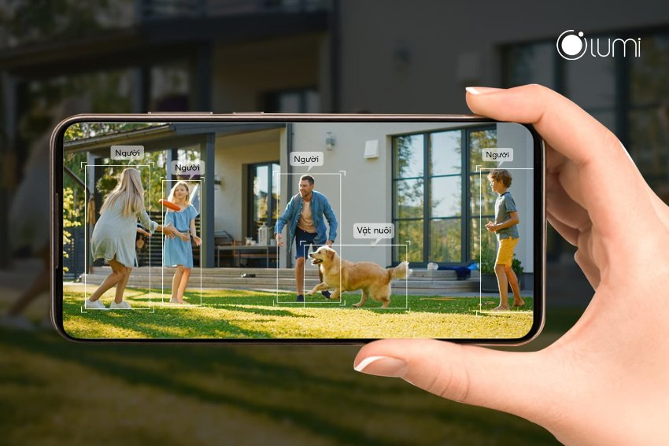
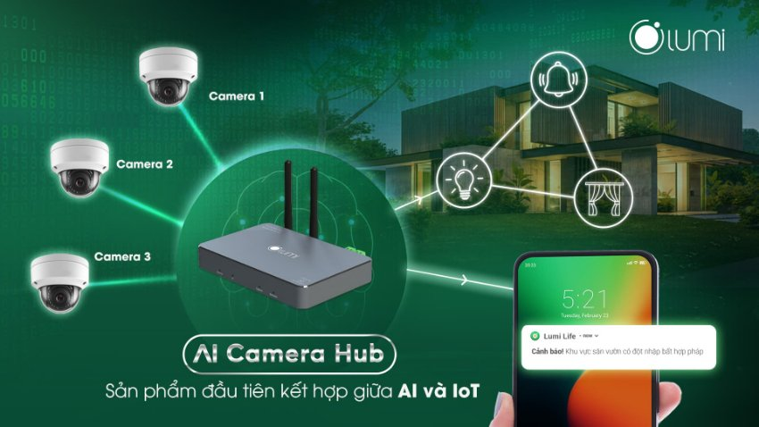

## **Hàng rào an ninh ảo – Cảnh báo tức thì**
AI Camera Hub của Lumi được ra mắt với mục đích cải tiến hệ thống an ninh hiện tại mà các gia đình đang sử dụng. Với hệ thống camera an ninh thông thường, bạn chỉ có thể ghi hình, và nếu có một tên trộm đột nhập vào và lấy đi một thứ đồ gì đó, bạn chỉ có thể ngồi và xem lại, không thể làm gì hơn.

*AI Camera Hub – Hàng rào an ninh ảo – Cảnh báo tức thì*

Với AI Camera Hub, là thiết bị trung tâm kết nối camera (hiện hỗ trợ HikVision và Dahua) với thiết bị đầu ra như đèn nháy, còi hú, vòi nước, …, và điện thoại. Nhờ đó mang tới [***giải pháp an ninh thông minh***](https://lumi.vn/an-ninh-chong-trom.html) tuyệt vời, cho phép bạn đuổi trộm ngay khi hành động trộm cắp còn chưa được thực hiện
### ***Nhận diện chính xác chuyển động của người và vật nuôi nhờ trí thông minh nhân tạo (AI)***
An ninh tốt phải đi kèm với độ chính xác cao. Với những chiếc camera thông thường, hãng sản xuất thường chỉ tích hợp vào đó khả năng phát hiện chuyển động, dường như mọi thay đổi về ánh sáng, chuyển động của vật nuôi, hay chuyển động của lá cây đều được ghi nhận là chuyển động, gây ra thông báo phiền hà và không đáng có.

Những chiếc camera dân dụng thông minh hơn, mới chỉ được tích hợp thêm về khả năng nhận diện người, còn vật nuôi với kích thước lớn thì vẫn có thể được ghi nhận là người.

*Nhận diện người vật nuôi bằng AI*

Xem thêm sản phẩm nổi bật: [***Bộ điều khiển trung tâm động cơ rèm***](https://lumi.vn/san-pham/bo-dieu-khien-trung-tam-tuy-bien-cho-dong-co-rem.html)

AI Camera Hub được các lập trình viên của Lumi tích hợp thêm khả năng nhận diện người và cả vật nuôi, giúp loại trừ tối đa những cảnh báo sai, mang lại sự chính xác tối đa trong việc phát hiện xâm nhập.

Thử nghiệm thực tế cho thấy khả năng nhận diện chính xác người đang chuyển động trong vùng của AI Camera Hub lên tới 97%, và con số này sẽ tăng dần theo thời gian nhờ quá trình tăng cường dữ liệu liên tục

(Camera có độ phân giải càng cao thì khả năng nhận diện sẽ càng chính xác)
### ***Phản ứng ngay khi phát hiện xâm nhập***
Với hệ thống IoT đa dạng của Nhà thông minh Lumi, bạn có thể cài đặt rất nhiều phản ứng tùy thích, giới hạn chỉ nằm trong trí tưởng tượng của bạn

AI Camera Hub của Lumi cho phép bạn đưa ra 2 cấp độ phân vùng cảnh báo:
• Ở vùng ngoài, bạn có thể cài đặt phản ứng nhẹ nhàng như nháy đèn, phát còi nhỏ
• Ở vùng trong, gần với khu vực riêng tư hơn, bạn có thể cài đặt phản ứng mang tính cảnh báo như bật đèn rọi, phát còi lớn, và gửi thông báo tới điện thoại

Hãy thử nhớ lại bộ phim Ở nhà một mình, và tự tưởng tượng ra rất nhiều hoạt cảnh hay ho mà bạn có thể làm với chiếc AI Camera Hub này nhé!
## **Bộ sản phẩm đề xuất**
Bên dưới đây là bộ sản phẩm đề xuất để khách hàng có thể dễ hình dung, có thể thêm/ bớt tùy nhu cầu và ý tưởng của chủ nhà

- 01 AI Camera Hub
- 06 Camera (HikVision hoặc Dahua)
- 01 Module 2 in 2 out
- 01 Còi hú
- 01 Đèn

Dự toán chi phí cho bộ sản phẩm này: 19,400,000đ
## **Mở rộng sang smarthome – Tiện nghi tuyệt vời**
AI Camera Hub tích hợp sẵn Lumi Home Controller, cho phép bạn mở rộng từ giải pháp an ninh sang nhà thông minh, trải nghiệm những tiện nghi tuyệt vời

- Chiếu sáng thông minh: Bật tắt đèn dựa vào vị trí của bạn trong căn nhà
- Điều khiển ngôi nhà bằng giọng nói
- Hẹn giờ bật/ tắt thiết bị
- Chăm sóc các thành viên kể cả khi bạn không ở nhà

Trên đây là những thông tin chi tiết về sản phẩm AI Camera Hub với những tính năng tuyệt vời cho hệ sinh thái smarthome. Để nhận những thông viên tư vấn chi tiết về lắp đặt cũng như chi phí thi công nhà thông minh, hãy liên hệ ngay hotline 0904 665 965 để nhân viên tư vấn có thể hỗ trợ nhanh chóng và chính xác nhất.

\>> Một số sản phẩm cùng hệ sinh thái nổi bật khác:

- [***Bộ điều khiển LED dây Lumi***](https://lumi.vn/san-pham/bo-dieu-khien-led-day.html)
- [***Bộ thu phát hồng ngoại***](https://lumi.vn/bo-dieu-khien-hong-ngoai-thong-minh.html)
