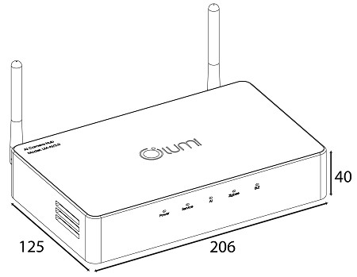
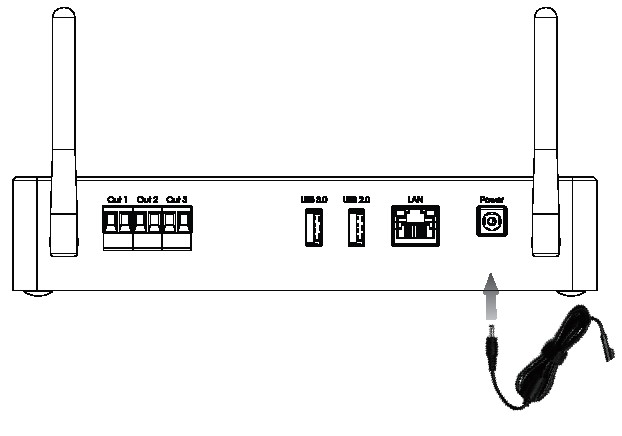
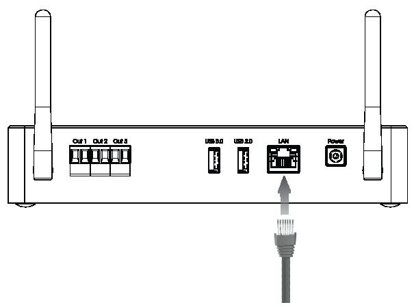
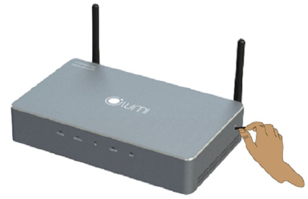
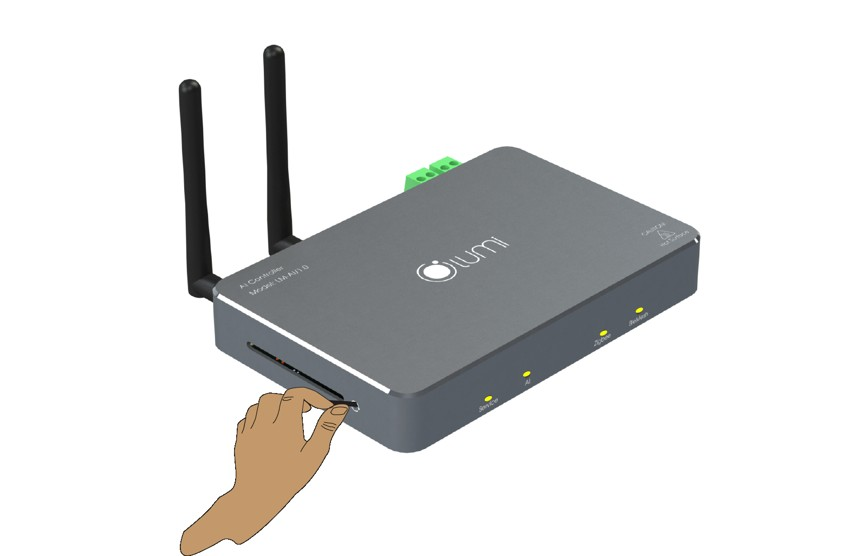
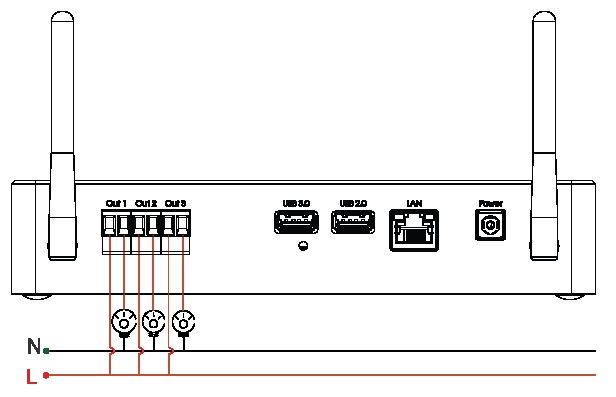

## **1. Thông số kỹ thuật**

|Điện áp hoạt động|12V DC/3A|
| :- | :- |
|Công suất cổng đầu ra tiếp điểm sạch|10A/250V AC|
|Nhiệt độ hoạt động|0℃ – 50℃|
|Truyền thông|Zigbee & Bluetooth Mesh|
|Công suất phát Zigbee & Bluetooth Mesh|10 dbm|
|Giao thức kết nối Internet|Dây LAN|
|Kích thước (D x R x C) (Chưa bao gồm Anten)|160 x 129 x 26 mm|
|Khối lượng|930 gram|
|Số lượng Camera tối đa có thể tích hợp xử lý AI|6 Camera IP|

NOTE: Camera sử dụng trong cùng hệ thống với AI Camera Hub có độ phân giải càng cao thì khả năng nhận diện càng chính xác.

*Kích thước thiết bị AI Camera Hub*
## **2. Lắp đặt thiết bị**
### **2.1. Đèn chỉ thị của thiết bị**
Quy ước:

- Service (Led 1)
- AI (Led 2)
- Zigbee (Led 3)
- BleMesh (Led 4)
### **2.2. Cập nhật firmware**
- Để nâng cấp firmware cho AI Camera Hub kỹ thuật viên cần phải tải phần mềm Desktop App Lumi Life, sau đó tiến hành đăng nhập và lựa chọn nhà có chứa AI Camera Hub cần nâng cấp firmware.
- Lưu ý: Lúc này cần phải cho máy tính kết nối tới cùng dải mạng LAN và AI HUB đang sử dụng.

### **2.3. Cấp nguồn thiết bị**

*Cấp nguồn cho thiết bị AI Camera Hub*
## **3. Cấu hình thiết bị**
### **3.1 Kết nối internet**
![Cắm dây LAN giữa AI Camera Hub V1 với router/modem mạng để kết nối mạng]

*Cắm dây LAN giữa AI Camera Hub V1 với router/modem mạng để kết nối mạng*

*Cắm dây LAN giữa AI Camera Hub V2 với router/modem mạng để kết nối mạng*

- Đối với bộ điều khiển trung tâm AI Camera Hub ta sẽ chỉ dùng một phương thức duy nhất để kết nối internet đó là cắm dây LAN.
- Đối với HC đã được cấu hình vào nhà thì người dùng chỉ cần thay đổi vị trí bộ AI Camera Hub sang một vị trí khác có đường mạng LAN là có thể sử dụng bình thường như cũ,
- Đối với trường hợp AI Camera Hub chưa được cấu hình vào nhà thì sau khi cắm dây LAN người dùng tham khảo bước thêm bộ điều khiển trung tâm vào nhà [tại đây](https://support.lumi.vn/docs/hdsd/ung_dung_lumi_life/cau_hinh_he_thong/them_hc_vao_nha/#hc-k%E1%BA%BFt-n%E1%BB%91i-m%E1%BA%A1ng-d%C3%A2y-lan).
### **3.2. Chế độ hoạt động**
- Bộ điều khiển trung tâm AI Camera Hub có 2 chế độ hoạt động: Home Controller (HC) và Local Controller (LC).

NOTE: Đối với những công trình cần sử dụng cả HC/LC kỹ thuật viên có thể lắp đặt song song giữa AI Camera Hub và [HC bản có Bluetooth Mesh.](https://support.lumi.vn/docs/hdsd/thiet_bi/bo_dieu_khien_trung_tam/hc_ble_sml)

- Mặc định ban đầu AI Camera Hub sẽ ở chế độ Home Controller, tức là bộ điều khiển trung tâm chính trong hệ thống.
- Khi nhu cầu muốn mở rộng số lượng thiết bị trong 1 hệ thống, người dùng cần sử dụng nhiều hơn 1 bộ điều khiển trung tâm. Khi đó trong hệ thống sẽ có 1 bộ điều khiển trung tâm chính (Hay còn gọi là HC) và các bộ điều khiển trung tâm còn lại là bộ điều khiển trung tâm phụ (hay còn gọi là LC).
- Để cài đặt cho AI Camera Hub làm bộ điều khiển trung tâm phụ, người dùng xem hướng dẫn [thêm LC vào nhà](https://support.lumi.vn/docs/hdsd/ung_dung_lumi_life/cau_hinh_he_thong/them_hc_vao_nha/#th%C3%AAm-lc-hc-ph%E1%BB%A5-v%C3%A0o-nh%C3%A0).
## **4. Khuyến cáo lắp đặt và cấu hình**
### **4.1. Khuyến cáo lắp đặt**
- Lắp đặt AI Camera Hub
  - Lắp đặt ở nơi thoáng mát, không đặt trong tủ điện bằng kim loại hay những nơi kín ảnh hưởng tới sóng không dây.
  - AI Camera Hub chỉ hỗ trợ ethernet nên cần lắp đặt ở vị trí gần router hoặc switch.
- Lắp đặt camera
  - Camera nên lắp với độ cao > 2.5m và < 7m.
  - Góc lắp dao động từ 25->60 độ.
  - Lắp đặt camera tại các vị trí không có cửa kính để tránh phát hiện nhầm.
  - Vẽ các vùng định cài đặt trước khi lắp đặt camera cố định.
### **4.2. Khuyến cáo cấu hình**
- Cấu hình AI-Controller
  - AI Camera Hub chỉ hỗ trợ ethernet nên phải cắm dây LAN trước khi thêm AI Camera Hub vào nhà. Mac HC được ghi trên bao bì sản phẩm, sử dụng mac này để điền khi được hỏi.
  - Nên cấu hình AI Camera Hub làm master của nhà. Các HC khác muốn thêm làm slave phải là HCG1.
  - Khi thêm AI Camera Hub làm slave, HC master phải là HCG1 (HC mới hoặc HC cũ nạp fw 2.0.2).
- Cấu hình camera
  - Chỉ hỗ trợ 2 hãng camera HIK và Dahua.
  - Hỗ trợ camera ip và đầu ghi ip.
  - Cấu hình chuẩn mã hóa luồng sub của camera là H264.
  - Cấu hình baud rate luồng sub của camera là 1024.
  - Cấu hình fps luồng sub của camera là cao nhất.
  - Cấu hình I-frame luồng sub của camera là 25.
- Cấu hình vùng
  - Vẽ vùng không quá bé
### **4.3. Khuyến cáo khi sử dụng**
Để đạt kết quả nhận diện được tốt nhất, khách hàng nên:

- Khi ngồi, khuyến cáo không được che mặt.
  Không nên để camera chỉ có thể nhìn thấy phần gáy, sau đầu.
## **5. Khởi động lại thiết bị**

*Nhấn giữ nút Config trong 5 giây để khởi động lại thiết bị.*

Để khởi động lại thiết bị ngoài việc rút nguồn cắm lại ta cũng có thể nhấn giữ nút Config trong 5 giây đến khi Led Service & Led AI sáng lên thì thả tay ra, sau đó thiết bị sẽ tự động vào chế độ khởi động lại.
## **6. Reset thiết bị**

*Nhấn giữ nút Config trong 10 giây để Reset thiết bị.*

Để Reset thiết bị, người dùng nhấn giữ nút Config trong vòng 10 giây cho tới khi tất cả 4 đèn Led đều sáng lên thì nhả tay, lúc này thiết bị sẽ bắt đầu vào quá trình Reset Factory và khởi động lại.
## **7. Sử dụng 2 cổng tín hiệu đầu ra mặc định có trên sản phẩm**

*Cổng tín hiệu đầu ra AI Hub V2*

Sản phẩm AI Camera Hub có sẵn 2 tín hiệu đầu ra mặc định ở trên sản phẩm. Mỗi tín hiệu đầu ra sẽ có 2 cổng, bản chất 2 cổng này là 2 đầu của công tắc khi người dùng bật ở trên thì 2 đầu công tắc sẽ ở trạng thái đóng và ngược lại sẽ là ở trạng thái mở. Người dùng có thể đấu đầu ra này với đèn, còi, chuông báo động… để phục vụ cho những tính năng cảnh báo an ninh. (Tải đầu ra tối đa là 8A).

![Cổng tín hiệu đầu ra AI Hub V1][Cắm dây LAN giữa AI Camera Hub V1 với router/modem mạng để kết nối mạng]

*Cổng tín hiệu đầu ra AI Hub V1*

Sau khi thêm AI Camera Hub vào nhà, người dùng vào phần giao diện thiết bị “Mới” trên App Lumi sẽ mặc định có 2 icon như ở hình trên, người dùng có thể tiến hành bật/tắt tín hiệu đầu ra thông qua 2 icon này.
## **8. Tích hợp bộ xử lý AI vào việc xử lý hình ảnh trên camera.**
- Trước đây hệ sinh thái của Lumi đã từng hỗ trợ việc tích hợp [camera thông minh của HIKvision](https://support.lumi.vn/docs/hdsd/ung_dung_lumi_life/cau_hinh_he_thong/tich_hop_camera_thong_minh_hikvison) tuy nhiên việc cấu hình nhận dạng con người cũng như khả năng phân tích hình ảnh đều là nằm trên phần cứng Camera, vì vậy đôi khi vẫn có những xác suất nhận diện nhầm sự vật nằm ngoài tầm kiểm soát của hệ thống Lumi.
- Chính vì vậy thiết bị AI Camera Hub ngoài việc đóng vai trò như một bộ điều khiển trung tâm thì còn có chức năng là Stream trực tiếp hình ảnh từ những Camera (Cả camera thường lẫn camera thông minh) trong hệ thống mạng LAN, rồi từ đó AI Camera Hub sẽ áp dụng thuật toán AI vào để xử lý hình ảnh nhận được từ Camera.
- Lúc này thì Camera chỉ có vai trò duy nhất đó là thu hình ảnh còn việc xử lý, nhận dạng hình ảnh con người hoàn toàn là nằm ở trong nhân xử lý AI mà Lumi phát triển.
  Để hiểu hơn về cách tích hợp thuật toán AI của thiết bị AI Camera Hub vào Camera IP, kỹ thuật viên có thể xem chi tiết [tại đây](https://support.lumi.vn/docs/hdsd/ung_dung_lumi_life/cau_hinh_he_thong/tich_hop_xu_ly_ai_vao_camera)

[Cắm dây LAN giữa AI Camera Hub V1 với router/modem mạng để kết nối mạng]: Aspose.Words.d37eb4eb-b64d-44c6-8f9d-bf22163b1168.003.jpeg
