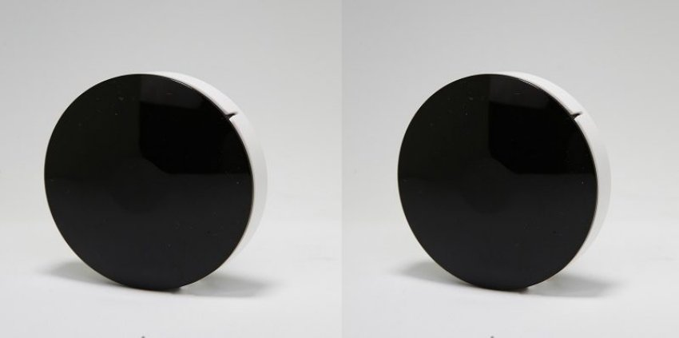

*Trong ngôi nhà của gia đình hiện đại, tivi, điều hòa hay quạt điện,… là những thiết bị mang lại nhiều tiện ích trong cuộc sống và không thể thiếu. Đó không chỉ là những thiết bị “đa chức năng” với nhiều tiện ích mà còn mang giá trị thẩm mỹ, trang trí cho ngôi nhà. Với những ngôi nhà có nhiều phòng ngủ, thì số lượng thiết bị này cũng sẽ tăng lên, để đáp ứng nhu cầu của các thành viên trong gia đình.*

Tuy nhiên, bạn sẽ cảm thấy thật phiền phức nếu mỗi thiết bị kèm theo 1 cái remote riêng. Nó sẽ làm bạn khó chịu và phát điên lên mỗi khi đi tìm remote, hay remote hết pin. Giờ đây, những gì bạn cần là **bộ điều khiển hồng ngoại thông minh Lumi** và một chiếc smartphone nhỏ gọn. Có thể điều khiển tất cả thiết bị điện thông minh như điều hòa, tivi, quạt điện,… bằng điện thoại, giọng nói hay hẹn giờ tự động.

Trình chơi Video

00:00

00:18

*Video thực tế về sản phẩm bộ điều khiển hồng ngoại Lum*i
## **1. Đặc điểm bộ điều khiển hồng ngoại thông minh Lumi**
- **Bộ điều khiển hồng ngoại** **thông minh** của [***Lumi***](https://lumi.vn/) là thiết bị chủ đạo trong giải pháp điều hòa, tivi, quạt điện,….
- Thiết kế tinh tế, đơn giản, nhỏ gọn, mang lại sự sang trọng, hiện đại khi sử dụng.
- Hai màu đen trắng kết hợp tạo nên thiết bị điều khiển hồng ngoại ưa nhìn trên mọi góc độ.
- Thiết bị được các chuyên gia và người dùng đánh giá cao bởi nhựa chống cháy PP.
- Bộ thu phát hồng ngoại có thể học lệnh Remote. Lên tới 1.000 lệnh và cập nhật lệnh cho các thiết bị trong gia đình.

*Bộ điều khiển hồng ngoại thông minh Lumi*

\>> Xem thêm sản phẩm mới ra mắt: [***Bộ điều khiển trung tâm Premium***](https://lumi.vn/san-pham/bo-dieu-khien-trung-tam-premium.html)
## **2. Tính năng bộ điều khiển hồng ngoại thông minh Lumi**
- Thiết bị điều khiển hồng ngoại có khả năng thay thế remote điều hòa, quạt tivi, đầu kỹ thuật số,… tiếp nhận và học được hơn 1000 câu lệnh.
- Bộ thu phát hồng ngoại có chức năng tương tự như một **remote điều khiển từ xa** qua điện thoại, hay thay thế công tắc điều khiển truyền thống.
- Thiết bị chứa thư viện hơn 300 mã lệnh có sẵn cho 4 chủng loại điều khiển: Tivi, quạt, điều hòa, đầu kỹ thuật số.
## **3. Ứng dụng bộ thu/phát hồng ngoại**
- Kết hợp bộ điều khiển trung tâm bạn có thể lên lịch [**bật tắt điều hòa thông minh**](https://lumi.vn/He-thong-dieu-hoa-ti-vi.html) theo giờ. Ví dụ: bật điều hòa lúc 10 giờ tối và tắt lúc 4 giờ sáng hay khi ra ngoài quên tắt điều hòa thì có thể tắt từ xa.
- Thiết bị điều khiển hồng ngoại thông minh còn có tích hợp với các cảm biến, đo thông số môi trường để tăng giảm nhiệt độ theo môi trường bên ngoài.
- Với 1 thiết bị Bộ thu phát hồng ngoại, có thể tạo được nhiều giao diện trên điện thoại để điều khiển nhiều thiết bị cùng 1 lúc. Ví dụ Quạt phòng khách, điều hòa phòng khách, ti vi phòng khách…có thể lựa chọn theo thư viện có sẵn để thiết lập giao diện điều khiển; hoặc nếu thư viện chưa hỗ trợ thì cũng hoàn toàn có thể thiết lập chế độ học lệnh mới cho thiết bị.
- Thiết bị điều khiển hồng ngoại năm 2019 được cải tiến hơn nhiều với chức năng thư viện. Bạn có thể điều khiển thiết bị qua điện thoại hoàn toàn như 1 điều khiển từ xa. Có thể tăng giảm nhiệt độ, chỉnh chế độ điều hòa; bật/tắt tivi, chuyển kênh, tăng giảm âm lượng…
- Lưu ý: Đặt Bộ điều khiển hồng ngoại cách thiết bị cần điều khiển trong bán kính 5m.

Trình chơi Video

00:00

00:26

\>> Xem thêm sản phẩm: [***Bộ điều khiển trung tâm Lumi***](https://lumi.vn/san-pham/bo-dieu-khien-trung-tam.html)
## **4. Phương thức hoạt động của remote học lệnh hồng ngoại**
- Bộ thu phát hồng ngoại sẽ lấy lệnh điều khiển từ thư viện có sẵn hoặc học tất cả câu lệnh trên Remote của các thiết bị trong ngôi nhà. Có thể nói đây là remote học lệnh hồng ngoại cao cấp nhất hiện nay.
- Trên app điện thoại của người dùng sẽ có từng mục như: điều hòa, ti vi, quạt… thay vì dùng nhiều Remote; người dùng sẽ trực tiếp dùng điện thoại của mình để điều khiển các thiết bị khác nhau trong nhà.
- Mỗi thiết bị sẽ có một giao diện khác nhau. Ví dụ: quạt sẽ có thư mục quạt, tivi, điều hòa …

*Bộ thu phát hồng ngoại dùng để điều khiển điều hòa, quạt, TV, Ampli, …*

\>> Xem thêm sản phẩm nổi bật khác: [***HC hỗ trợ Lumi Smart Lighting***](https://lumi.vn/san-pham/bo-dieu-khien-trung-tam-ho-tro-lumi-smart-lighting.html)
## **5. Ưu điểm nổi bật của bộ thu phát hồng ngoại**
- Thay vì 10 cái remote bạn chỉ cần 1 chiếc điện thoại. Có thể hoàn toàn điều khiển được các thiết bị sử dụng remote trong ngôi nhà.
- Người dùng có thể cài đặt theo ngữ cảnh “về nhà”. Một hệ thống các thiết bị điện thông minh: điều hòa, bình nước nóng, đèn chiếu sáng, rèm cửa… sẽ sẵn sàng phục vụ bạn.
- Chỉ cần chọn chế độ “về nhà” trên điện thoại, trước khi rời cơ quan. Khi bạn ra ngoài quên tắt các thiết bị, chỉ cần điều khiển bằng điện thoại để tắt. Đảm bảo an toàn và tiết kiệm điện.

Bộ thu phát hồng ngoại là giải pháp tối ưu cho việc điều khiển từ xa. Đảm bảo sự kết nối mạnh mẽ và đáng tin cậy giữa thiết bị và điều khiển. Thực hiện các thao tác điều khiển dễ dàng và chính xác, mang đến trải nghiệm tuyệt vời cho người dùng. Để nhận tư vấn chi tiết về sản phẩm, hãy liên hệ hotline của Lumi, nhân viên tư vấn sẽ sẵn sàng giải đáp 24/7. Tìm hiểu thêm về giải pháp điều khiển điều hòa, ti vi, quạt điện [tại đây](https://lumi.vn/he-thong-dieu-hoa-ti-vi.html).
