## **1. Tổng quát về bộ điều khiển hồng ngoại IR**
Mã sản phẩm: LM-IR\2.1

*Bộ điều khiển hồng ngoại*

Bộ điều khiển hồng ngoại IR là thiết bị của Lumi giúp khách hàng thay vì sử dụng trực tiếp điều khiển hồng ngoại (của tivi, quạt, điều hòa…) để điều khiển thiết bị thì có thể thực hiện điều khiển các thiết bị trên thông qua ứng dụng trên điện thoại.
## **2. Thông số kỹ thuật**

|Nguồn cấp|5V DC/ 1A|
| :- | :- |
|Nhiệt độ hoạt động|0℃ – 50℃|
|Truyền thông|Zigbee|
|Công suất phát Zigbee|10 dbm|
|Kích thước (Φ x C)|70 x 21 mm|
|Khối lượng|66\.5 gram|

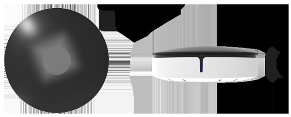

*Kích thước bộ điều khiển hồng ngoại IR*
## **3. Lắp đặt thiết bị**
### **Bước 1: Cấp nguồn thiết bị**
- Sử dụng bộ biến đổi nguồn đi kèm để cấp nguồn cho thiết bị.
- Thiết bị được thiết kế với 2 vị trí có thể cắm nguồn: mặt dưới hoặc mặt cạnh của thiết bị.
- Sau khi được cấp nguồn, đèn chỉ thị trên thiết bị nháy đỏ 3 lần sau đó sáng đỏ.

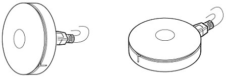

*Cấp nguồn thiết bị*
### **Bước 2: Lắp đặt thiết bị**
Thiết bị LM-IRZ được thiết kế với 2 tùy chọn:

- Để trên bàn, trên mặt phẳng gần mắt thu hồng ngoại và các thiết bị muốn điều khiển.

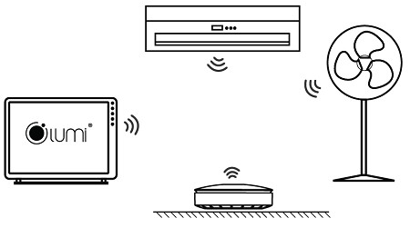

*Lắp đặt IR trên bề mặt phẳng*

- Gắn trên tường bằng cách cố định vít nở cấp kèm theo lên mặt tường sau đó gắn thiết bị LM-IRZ 2.1 lên sao cho hộc vít ở mặt sau thiết bị khớp vào đầu vít nở.

*Lắp đặt IR trên tường*

**Lưu ý:** Khoảng cách lắp từ bộ điều khiển các thiết bị phải gần hơn 5m.
## **4. Cài đặt thiết bị trên ứng dụng Lumi Life**
### **4.1. Cho thiết bị gia nhập mạng**
- Để cài đặt bộ điều khiển hồng ngoại bằng ứng dụng trên điện thoại người dùng cần có bộ điều khiển trung tâm HC và đã tạo nhà trên hệ thống.
- Người dùng đăng nhập vào app Lumi Life => chọn cài đặt => chọn cài đặt thiết bị => chọn HC => Zigbee => cho thiết bị gia nhập mạng.
- Quan sát đèn chỉ thị trên thiết bị, gia nhập mạng thành công led chỉ thị nháy hồng 3 lần chu kỳ 1 lần/1s.
- Trường hợp thiết bị không gia nhập mạng có thể công tắc đã được cấu hình, người dùng thực hiện reset thiết bị để quay về chế độ gia nhập mạng.
- Khi gia nhập mạng thành công, bộ hồng ngoại IR 2.1 sẽ hiển thị có 2 loại điều khiển như hình sau:

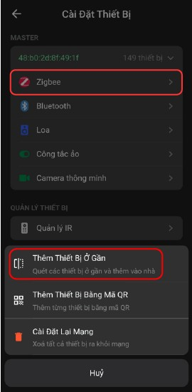

*Thiết bị gia nhập mạng thành công*

- Loại 1: Điều khiển học lệnh từ điều khiển cầm tay để điều khiển thiết bị.
- Loại 2: Điều khiển sử dụng lệnh thư viện có sẵn trên server của Lumi.
### **4.2. Cài đặt loại điều khiển sử dụng thư viện**
*Bước 1: Chọn loại điều khiển*

Người dùng lựa chọn loại điều khiển có sẵn thư viện => Chọn “Thêm remote” để thêm loại điều khiển muốn dùng.

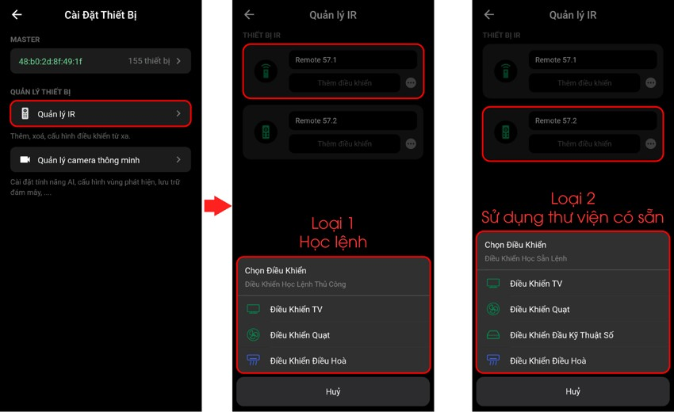

*Chọn loại điều khiển*

*Bước 2: Chọn thương hiệu tương ứng đối với điều khiển lệnh có sẵn*

Người dùng chọn loại điều khiển muốn dùng.
Đối với điều khiển lệnh có sẵn, Lumi hỗ trợ 4 loại là: Tivi (TV), Quạt (Fan), Điều hòa (AC), Đầu kỹ thuật số (Set top box).

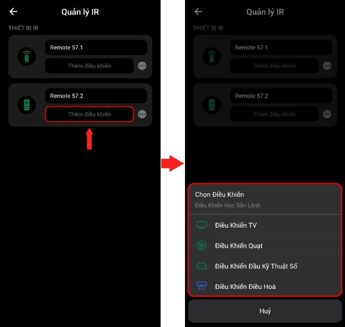

*Chọn loại thiết bị*

*Bước 3: Kiểm tra lệnh của thư viện với thiết bị thực tế*

Chọn thương hiệu loại thiết bị đã chọn ở bước 2.

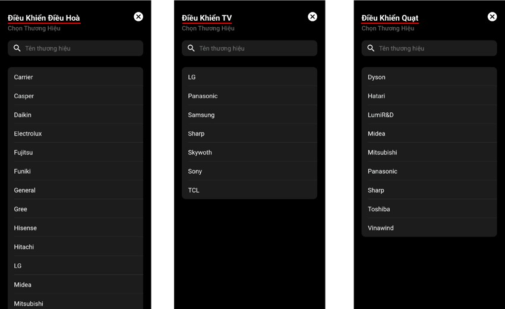

*Chọn thương hiệu của thiết bị*

*Bước 4: Thử điều khiển*

- Thử điều khiển bằng các lệnh hiển thị trên màn hình để kiểm tra có điều khiển được thiết bị không.
- Nếu điều khiển được thiết bị thì người dùng chọn “Có”, tiến hành đặt tên cho điều khiển và cho điều khiển vào phòng lắp đặt IR.
- Nếu không nhận được tín hiệu thì ấn “Không” để tiếp tục thử loại khác.

**Lưu ý:**

- Người dùng vui lòng thử từng mã lệnh để tìm ra loại có thể điều khiển được thiết bị.
- Nếu không có mã lệnh tương thích thì quý khách vui lòng sử dụng loại điều khiển học lệnh hoặc gửi điều khiển về bộ phận bảo hành của Lumi update thư viện.
### **4.3. Cài đặt loại điều khiển học lệnh từ điều khiển cầm tay**
*Bước 1: Tạo Remote học lệnh (Loại 1)*

- Người dùng chọn loại điều khiển học lệnh.
- Đối với loại điều khiển học lệnh hỗ trợ 3 loại thiết bị: Tivi, Điều hòa và Quạt.

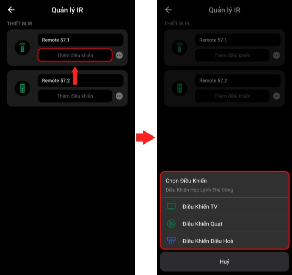

*Tạo remote dạng học lệnh*

*Bước 2: Cho thiết bị vào chế độ học lệnh*

- Điều khiển mới tạo sẽ hiển thị ở tab IR.
- Nhấn vào icon điều khiển vừa tạo, giao diện điều khiển hiện ra người dùng tiến hành học lệnh.

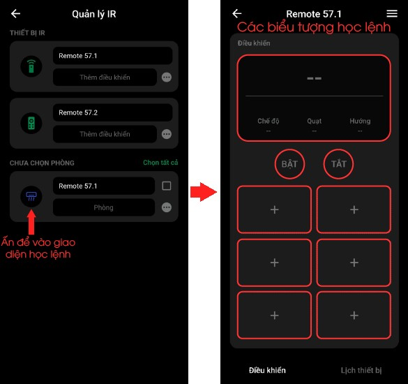

*Remote chưa học lệnh*

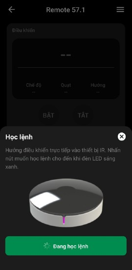

*Remote học lệnh*

*Bước 3: Học lệnh từ các nút của Remote*

- Học lệnh cho điều khiển.
- Mặc định ban đầu các biểu tượng đều ẩn hoặc chưa có thông tin lệnh điều khiển, người dùng ấn vào các biểu tượng lệnh trên điều khiển để tiến hành học lệnh.
- Chọn “Học lệnh” trên màn hình sẽ hiển thị trạng thái đang học lệnh.
- Người dùng cầm điều khiển của thiết bị hướng về phía bộ hồng ngoại IR và nhấn nút lệnh cần học.
- Trong quá trình học lệnh, người dùng có thể nhấn “Hủy” để hủy bỏ trạng thái học lệnh của IR.
- Sau khi học lệnh xong, biểu tượng vừa được học lệnh sẽ sáng lên cho phép quý khách ấn vào để điều khiển thiết bị.

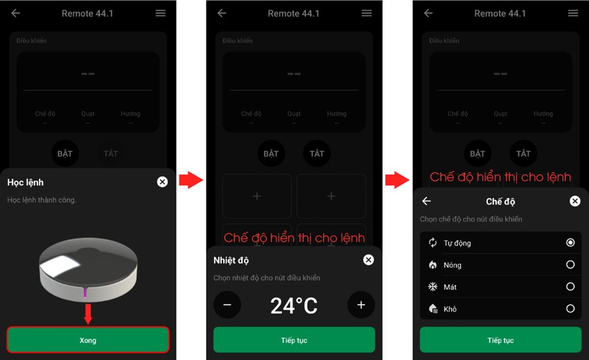

*Remote sau khi học lệnh*

### **Bước 4: Đặt tên điều khiển và cho điều khiển vào phòng lắp đặt IR.**
*Kích hoạt lệnh hồng ngoại từ ứng dụng Lumi Life*

Để điều khiển thiết bị, người dùng nhấn trực tiếp vào biểu tượng lệnh tương ứng trên ứng dụng, lúc này đèn chỉ thị trên bộ điều khiển hồng ngoại sẽ nháy xanh 2 lần báo hiệu đã gửi lệnh điều khiển thành công.

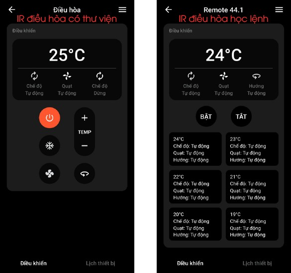

*Sử dụng remote trên ứng dụng*

**Lưu ý:**

- Đối với loại remote cần phải học lệnh thì nút trên App phải được học lệnh rồi thì mới có thể kích hoạt thiết bị.
- Khi điều khiển thiết bị, icon điều khiển sẽ không thay đổi trạng thái trên ứng dụng.
### **Xóa lệnh đã học cho điều khiển**
- Chỉ áp dụng đối với loại điều khiển học lệnh.
- Người dùng nhấn giữ lệnh biểu tượng lệnh cần xóa => chọn “Xóa lệnh” để tiến hành xóa lệnh hoặc chọn “Hủy” để hủy lựa chọn, sau đó quay về màn hình điều khiển.

*Xóa lệnh trên remote*

Ngoài ra người dùng có thể cài đặt thiết bị với các chức năng nâng cao như:

- [Cài đặt rule](https://support.lumi.vn/docs/hdsd/ung_dung_lumi_life/cau_hinh_he_thong/cai_dat_rule)
- [Cài đặt cảnh](https://support.lumi.vn/docs/hdsd/ung_dung_lumi_life/cau_hinh_he_thong/cai_dat_canh)
- [Cài đặt lịch](https://support.lumi.vn/docs/hdsd/ung_dung_lumi_life/cau_hinh_he_thong/hen_gio_thiet_bi).
## **5. Reset thiết bị**
Người dùng ấn giữ nút Config trong 5s (nút nhựa tròn ở mặt dưới) cho đến khi đèn chỉ thị sáng hồng thì thả tay, thiết bị rời mạng và reset. Thiết bị reset thành công quay lại trạng thái ban đầu.

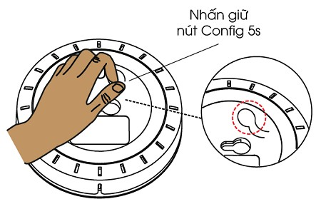

*Reset thiết bị*
## **6. Bộ sản phẩm đóng gói**
Hộp đóng gói sản phẩm bao gồm: 1 bộ điều khiển hồng ngoại, 1 bộ hướng dẫn sử dụng, 1 bộ adapter 5V/1A, 1 bộ ốc vít lắp đặt.

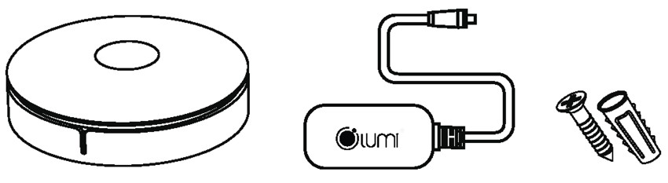

*Bộ sản phẩm đóng gói*
