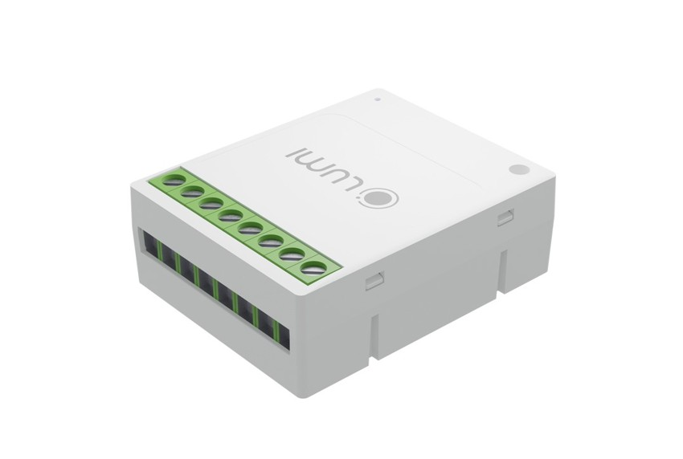
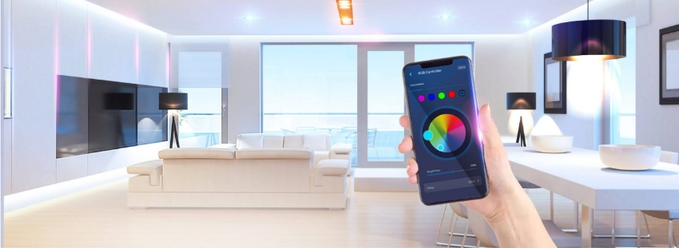

*Bộ điều khiển LED dây RGB + WW hay bộ điều khiển đèn LED dây đổi màu RGB + WW là một giải pháp điều khiển chiếu sáng thông minh và tiện ích cho ngôi [**nhà thông minh**](https://lumi.vn/) của bạn. Nhờ vào tính năng đa dạng và hiệu suất cao, sản phẩm mang đến sự linh hoạt và tùy chỉnh không gì sánh được trong việc tạo nên không gian sống hiện đại và tiện nghi. Hãy cùng tìm hiểu chi tiết về sản phẩm thông minh này và những tính năng nổi bật mà nó mang lại.*
## **1. Đặc điểm cấu tạo bộ điều khiển LED dây RGB + WW**
- Bộ điều khiển LED dây là một thiết bị nhà thông minh được thiết kế nhỏ gọn và hiện đại phù hợp với nhiều không gian khác nhau.
- Sản phẩm bao gồm một hộp điều khiển và các công tắc thông minh có khả năng kết nối không dây qua công nghệ Bluetooth Mesh. Các công tắc này có thể được gắn vào các điểm đèn LED dây trong ngôi nhà.

*Bộ điều khiển dây đèn LED RGB + WW*

\>> Xem thêm sản phẩm bán chạy: [***Bộ điều khiển hồng ngoại thông minh***](https://lumi.vn/bo-dieu-khien-hong-ngoai-thong-minh.html)
## **2. Tính năng nổi bật bộ điều khiển đèn LED dây đổi màu RGB + WW**
### ***2.1. Điều khiển từ xa thông qua Internet***
- Bằng ứng dụng Lumi Life trên điện thoại di động, người dùng có thể dễ dàng kiểm soát và điều khiển đèn LED dây từ bất kỳ đâu, mọi lúc.
- Với tính năng này người dùng dó thể tạo không gian chiếu sáng phù hợp với nhu cầu và tạo sự thoải mái, tiện nghi cho ngôi nhà của mình.
### ***2.2. Điều khiển qua mạng LAN trong nhà***
- Ngoài việc điều khiển từ xa thông qua Internet, bộ điều khiển dây đèn LED đổi màu RGB + WW cũng hỗ trợ điều khiển qua mạng LAN trong nhà.
- Điều này giúp tiết kiệm băng thông Internet và tăng cường tính bảo mật trong việc điều khiển thiết bị.
### ***2.3. Điều chỉnh độ sáng và nhiệt độ màu ánh sáng***
- Sản phẩm cho phép người dùng thay đổi độ sáng từ 0% đến 100%, giúp tạo không gian chiếu sáng phù hợp với nhu cầu sử dụng.
- Người dùng cũng có thể điều chỉnh nhiệt độ màu ánh sáng từ 2700K đến 6500K, từ ánh sáng ấm dịu đến ánh sáng trắng tự nhiên.
### ***2.4. Điều khiển theo nhóm và các chế độ thông minh***
- Bộ điều khiển hỗ trợ nhiều chế độ điều khiển như: Lighting, HCL (Human Centric Lighting), cảnh Lighting, Rule, Cảnh và Lịch.
- Người dùng có thể tùy chỉnh, tự động hóa các hoạt động chiếu sáng theo ý muốn bằng cách tạo các kịch bản thông minh như ăn tôi, đi làm, trở về hay tiếp khách…
### ***2.5. Điều khiển bằng giọng nói***
- Sản phẩm tích hợp khả năng điều khiển bằng giọng nói thông qua việc tích hợp Google Assistant, Siri và Alexa.
- Nhờ đó người dùng có thể dễ dàng điều khiển đèn LED dây một cách thuận tiện và dễ dàng chỉ bằng giọng nói.
### ***2.6. Điều khiển trực tiếp qua Remote cảnh***
- Bộ điều khiển đèn LED dây cho phép người dùng điều khiển trực tiếp qua Remote cảnh thông qua cơ chế mạng Bluetooth Mesh, mà không cần thông qua Hub trung tâm; giúp tăng tính tiện lợi và linh hoạt trong việc điều khiển thiết bị.
## **3. Ứng dụng của bộ điều khiển LED dây thông minh**

*Ứng dụng của bộ điều khiển đèn LED dây thông minh*

Bộ điều khiển thông minh phù hợp cho nhiều không gian trong ngôi nhà như:

- Phòng khách: Bộ điều khiển LED dây là giải pháp hoàn hảo cho việc trang trí và tạo không gian thư giãn trong phòng khách. Người dùng có thể tùy chỉnh độ sáng và nhiệt độ màu ánh sáng để tạo ra không gian ấm cúng và thoải mái cho Người dùng và gia đình.
- Phòng ngủ: Trong phòng ngủ, bộ điều khiển đèn LED dây giúp người dùng tạo ra không gian nghỉ ngơi thư thái và lãng mạn. Người dùng có thể thay đổi độ sáng theo ý muốn và tùy chỉnh ánh sáng theo nhu cầu sử dụng, giúp Người dùng có giấc ngủ ngon và sảng khoái.
- Nhà hàng và quán cà phê: Bộ điều khiển là một lựa chọn lý tưởng để tạo không gian ấm áp và sang trọng trong nhà hàng và quán cà phê. Người dùng có thể tạo các cảnh ánh sáng khác nhau để phục vụ từng bữa ăn hoặc sự kiện đặc biệt.
- Khách sạn: Bộ điều khiển đèn LED dây giúp tạo ra không gian lịch sự và tiện nghi cho khách hàng. Người dùng có thể tự động hóa ánh sáng trong các khu vực chung và tạo cảm giác chào đón cho khách hàng.

Với bộ điều khiển LED dây RGB + WW thông minh, cuộc sống của Người dùng sẽ trở nên hiện đại và tiện ích hơn bao giờ hết. Khả năng tiết kiệm năng lượng và tích hợp giọng nói sẽ làm cho việc sử dụng đèn LED dây trở nên dễ dàng và thú vị hơn bao giờ hết. Hãy gọi ngay hotline Lumi để tham khảo và trải nghiệm ngay bộ điều khiển đèn LED dây đổi màu RGB + WW; để biến ngôi nhà của Người dùng thành một không gian sống thông minh và hiện đại hơn.

**>>Tham khảo thêm thông tin về những sản phẩm bán chạy nhất Lumi:**

- [***HC Premium***](https://lumi.vn/san-pham/bo-dieu-khien-trung-tam-premium.html)
- [***Bộ điều khiển trung tâm (HC)***](https://lumi.vn/san-pham/bo-dieu-khien-trung-tam.html)
