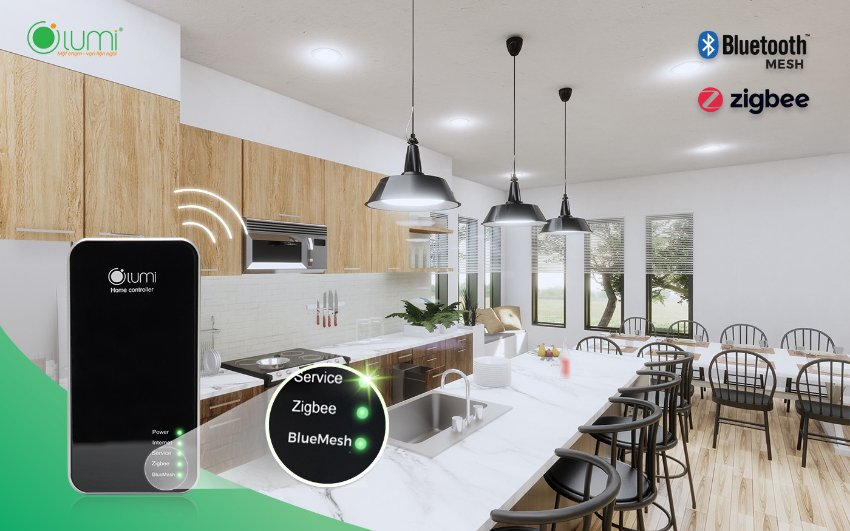

*Được xem là bộ não của ngôi nhà thông minh, bộ điều khiển trung tâm (Home Controller) là thiết bị không thể thiếu trong hệ thống Nhà thông minh Lumi. Sử dụng 2 truyền thông không dây Zigbee và Bluetooth Mesh – công nghệ được đánh giá ổn định và phù hợp nhất cho Nhà thông minh, bộ điều khiển trung tâm của Lumi có khả năng kết nối tới 500 node mạng, khuyến cáo 200 thiết bị trong 1 hệ thống. Lấy 2 màu đen – bạc làm chủ đạo và thiết kế nhỏ gọn, tinh tế, bộ điều khiển trung tâm khi được lắp đặt không chỉ mang lại những tiện ích cho chủ nhà, mà còn đảm bảo tính thẩm mỹ, phù hợp với đa dạng không gian nhà hiện đại.*

## **1. Tính năng bộ điều khiển trung tâm trong nhà thông minh**
Home Controller là trung tâm nhận và xử lý các lệnh điều khiển trong nhà thông minh. Thông qua sóng Zigbee hoặc Bluetooth, bộ điều khiển trung tâm được kết nối với các thiết bị điện thông minh trong nhà như công tắc thông minh, cảm biến chuyển động, động cơ rèm thông minh, các loại đèn thông minh… Nhờ vậy, các lệnh tắt đèn, bật bình nóng lạnh, mở rèm,… được thực hiện theo mong muốn của người dùng. Nói chung, tất cả các lệnh điều khiển thông minh xuất phát từ Smartphone hoặc các trợ lý ảo đều được bộ điều khiển trung tâm xử lý nhanh và mượt. Vì vậy, có thể nói tính năng của bộ điều khiển trung tâm là xử lý tất cả các lệnh điều khiển của người dùng

- Bật/ tắt/ hẹn giờ toàn bộ hệ thống đèn điện trong nhà
- Thay đổi màu sắc, độ sáng của đèn theo ý muốn chủ nhân
- Đóng/ mở/ hẹn giờ rèm bằng Smartphone và giọng nói
- Thiết lập các kịch bản sống thông minh như: tự động bật đèn khi phát hiện chuyển động, nhóm cảnh, lên lịch, tạo rule cho các thiết bị thông minh hoạt động đồng thời…
## **2. Ưu điểm của Bộ điều khiển trung tâm Lumi**
Hỗ trợ cả 2 dạng thức sóng Zigbee và Bluetooth Mesh, có thể nói ưu điểm lớn nhất của bộ điều khiển trung tâm Lumi là hoạt động ổn định và giúp tiết kiệm năng lượng.

Nếu Zigbee là chuẩn không dây chuyên về Smart home được nhiều thương hiệu lớn ưa chuộng, thì Bluetooth Mesh cũng được đánh giá là “đo ni đóng giày” cho Chiếu sáng thông minh. Như vậy, các tín đồ của Smart home không phải lo về vấn đề khó khăn khi mua thêm các thiết bị thông minh về sau này, bởi vì 2 chuẩn không dây được đánh giá ổn định và tốt nhất hiện nay đều được Lumi hỗ trợ.

Ngoài ra, sever Lumi đã tích hợp thành công với Server của Amazon – Mỹ để tạo ra giải pháp nhà thông minh điều khiển bằng giọng nói. Cho phép người dùng hoàn toàn kiểm soát, điều khiển các thiết bị trong ngôi nhà bằng chính “giọng nói quyền năng” của mình. Khi bạn nói câu lệnh “Turn on go home” hoặc “Turn off go out” tất cả các thiết bị trong ngôi nhà sẽ hoàn toàn bật/tắt, tùy theo câu lệnh.
Thêm vào đó, nếu người dùng sử dụng HC (bản có hỗ trợ BLE) trong hệ thống Smart Lighting, người dùng có thể tận hưởng những tiện ích thông minh dành cho đèn như sau:
Bật/ tắt đèn bằng Smartphone

- Thay đổi màu ánh sáng phòng khách
- Tăng/ giảm độ sáng theo ý muốn
- Điều khiển đèn linh hoạt theo từng khu vực, giúp tiết kiệm tối đa điện năng tiêu thụ
## **3. Cách thức hoạt động**
Bộ điều khiển nhà thông minh sẽ tiếp nhận tín hiệu từ cảm biến hoặc từ người dùng, sau đó gửi đến server. Sau khi tiếp nhận thông tin, bộ điều khiển trung tâm – HC truyền tín hiệu đến các công tắc điều khiển thiết bị, hoặc tới các loại đèn thông minh trong bộ Lumi Smart Lighting để thực hiện lệnh của người dùng.

Ví dụ: Khi cảm biến phát hiện chuyển động gửi tín hiệu “có người di chuyển vào vùng cảm biến” đến HC. Tại đây, HC truyền tín hiệu nhận được đến công tắc kết nối với thiết bị như bóng đèn hành lang, đèn tuýp … sẽ tự động bật/tắt.

Ngoài ra, HC còn cho phép người dùng tạo hoạt cảnh. Ví dụ: Bạn có thể tạo cảnh bằng cách sử dụng 1 nút công tắc bật hoặc tắt toàn bộ thiết bị trong nhà, chỉ cần 1 nốt chạm trực tiếp như công tắc cơ hoặc trên điện thoại, bạn đã hoàn toàn điều khiển tất cả các thiết bị điện trong ngôi nhà. Tương tự với những hoạt cảnh: tiếp khách, ăn tối, đi làm về … cho các thiết bị trong gia đình.

**>> Tham khảo thêm một số sản phẩm nổi bật khác của Lumi:**

- [***AI Camera Hub***](https://lumi.vn/san-pham/ai-camera-hub.html)
- [***Bộ điều khiển động cơ rèm***](https://lumi.vn/san-pham/bo-dieu-khien-trung-tam-tuy-bien-cho-dong-co-rem.html)
- [***Bộ điều khiển LED dây RGB/WW***](https://lumi.vn/san-pham/bo-dieu-khien-led-day.html)
