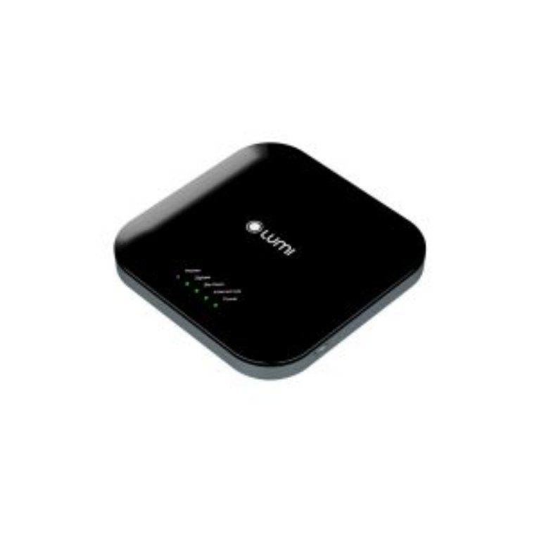

*Bộ điều khiển trung tâm (HC) được biết đến là bộ não liên kết, ghi nhận và điều khiển hệ thống thiết bị nhà thông minh. Bộ điều khiển trung tâm Premium là sản phẩm mới được Lumi phát triển nhằm đáp ứng mong muốn về một thiết bị đầu não ưu việt và đa nhiệm hơn của người dùng smarthome. Với sản phẩm Home Controller mới này, người dùng sẽ có một “đầu não” mạnh mẽ với phần cứng nâng cấp và tính năng ưu việt; để đáp ứng mọi nhu cầu về tốc độ xử lý cho ngôi nhà thông minh Lumi.*
## **1. Đặc điểm phần cứng bộ điều khiển trung tâm Premium**
- Bộ điều khiển trung tâm Premium có thiết kế sang trọng và tinh tế với kiểu dáng vuông bo, mặt nắp đen bóng.
- Chất liệu nhựa ABS cao cấp, bền bỉ và có khả năng chịu lực tốt.
- Đế nhám màu xám bạc tinh tế, giúp tổng thể sản phẩm sang trọng và đẳng cấp.
- Chân gắn tường có khả năng điều chỉnh theo 2 hướng, linh hoạt trong việc tùy chỉnh và lắp đặt.

*Bộ điều khiển trung tâm Premium*

\>> Tham khảo sản phẩm HC thế hệ G1: [***Bộ điều khiển trung tâm***](https://lumi.vn/san-pham/bo-dieu-khien-trung-tam.html)
## **2. Tính năng của bộ điều khiển trung tâm mới**
### ***2.1. Bộ xử lý bốn nhân Quad-core thực hiện đa tác vụ, siêu tốc độ xử lý***
Bộ xử lý Quad-core ARM® Cortex®-A9@1.2GHz giúp thiết bị chạy đa tác vụ nhanh và mượt hơn. Bên cạnh đó là khả năng kết nối hơn 450 thiết bị với thời gian xử lý tối ưu dưới 150ms. Từ đó giúp bạn có thể dễ dàng kết nối và điều khiển toàn bộ thiết bị trong nhà qua smartphone hoặc giọng nói. Bộ xử lý còn cho phép cài đặt hơn 200 rule, cảnh, lịch, giúp người dùng tạo ra các kịch bản sống tiện nghi theo nhu cầu của mình.

Kết hợp với  RAM 512MB và bộ nhớ Flash 4GB giúp lưu trữ dữ liệu, duy trì hoạt động ổn định. Bộ thu WiFi kép 2.4G/5.8G tối ưu trải nghiệm điều khiển nhà thông minh. Chuẩn truyền thông Zigbee và BLE Mesh giúp dễ dàng kết nối với nhiều loại thiết bị điện khác nhau.
### ***2.2. Duy trì điều khiển ổn định ngay cả khi không có internet nhờ tích hợp sẵn tính năng LTE-4G***
Trong trường hợp mất kết nối internet, bộ điều khiển trung tâm Premium tích hợp tính năng LTE-4G để duy trì việc điều khiển thiết bị. Điều này giúp người dùng tiếp tục điều khiển từ xa qua smartphone. HC Premium là sản phẩm duy nhất tại thị trường Việt Nam tích hợp tính năng này.

Tích hợp LTE-4G vào bộ điều khiển trung tâm Premium cũng loại bỏ nguy cơ xâm nhập và tấn công virus thông qua DCOM 4G không rõ nguồn gốc. Hơn nữa, cấu hình của thiết bị vẫn được đồng bộ và giữ nguyên ngay cả khi không có internet thông qua mạng kết nối local của bộ điều khiển trung tâm.
### ***2.3. Điều khiển đa phương thức và tự động hoá ngữ cảnh sống***
Bộ điều khiển trung tâm Premium mang lại trải nghiệm tiện nghi, tiết kiệm điện năng với tính năng điều khiển đa phương thức và tự động hoá ngữ cảnh sống.

Với ứng dụng Lumi Life+ trên smartphone hoặc giọng nói thông qua loa thông minh, HC Premium kết nối hệ thống smarthome với người dùng; mang đến [***giải pháp điều khiển nhà bằng giọng nói***](https://lumi.vn/dieu-khien-nha-bang-giong-noi.html) cho phép dễ dàng điều khiển mọi thiết bị điện trong nhà mọi lúc mọi nơi.

Thêm vào đó, bạn có thể tận hưởng trải nghiệm tiện nghi gia đình với việc tự động hóa các ngữ cảnh sống thông minh. Với hơn 200 rule, cảnh, lịch, bạn có thể tạo ra các kịch bản sống theo ý muốn và kích hoạt chúng chỉ với một chạm trên smartphone.

Bộ điều khiển trung tâm Premium cũng giúp giảm lãng phí điện năng bằng cách cho phép bạn kiểm soát trạng thái thiết bị từ xa và điều chỉnh chúng khi cần thiết, tránh lãng phí không cần thiết.
### ***2.4. Bảo mật tuyệt đối nhờ tích hợp ngoại vi simcom giúp thông báo call/sms; Tăng cường an ninh, bảo mật tuyệt đối với dữ liệu mã hoá***
Khách hàng có nhiều lựa chọn tích hợp các sản phẩm camera, cảm biến thông minh với HC để tạo ngữ cảnh an ninh tuyệt đối, bảo vệ an toàn cho gia đình. Đặc biệt, bộ điều khiển trung tâm Premium tích hợp ngoại vi simcom.

Simcom là một thiết bị kết nối mạng di động 4G thông qua thẻ SIM, cho phép thiết bị HC Premium có thể duy trì kết nối mạng thông qua kết nối LTE-4G ngay khi hệ thống mạng Wifi/LAN gặp sự cố. Điều này giúp tăng cường an ninh cho ngôi nhà bằng cách cài đặt gửi thông báo qua nhiều phương thức như tin nhắn điện thoại SMS và cuộc gọi trực tiếp (bên cạnh thông báo qua ứng dụng Lumi Life+) khi phát hiện xâm nhập trái phép.

Tính năng này rất hữu ích trong các tình huống an ninh, cho phép chủ nhà nhận được thông báo về tình hình an ninh ngôi nhà ngay cả khi không có kết nối internet.

Ngoài ra, Lumi cung cấp HC Premium với mã hóa dữ liệu và lưu trữ an toàn trên Cloud. Máy chủ vận hành và lưu trữ thông tin dữ liệu được đặt tại Việt Nam và nâng cấp định kỳ hàng năm, đảm bảo an toàn tuyệt đối.

Trên đây là thông tin chi tiết về bộ điều khiển trung tâm Premium. Để nhận thêm các thông tin tư vấn chi tiết hơn hãy gọi ngay hotline của Lumi, nhân viên tư vấn luôn sẵn sàng hỗ trợ bạn mọi lúc, mọi nơi.

**>> Xem thêm một số sản phẩm liên quan khác:**

- [***Bộ điều khiển AI Camera Hub***](https://lumi.vn/san-pham/ai-camera-hub.html)
