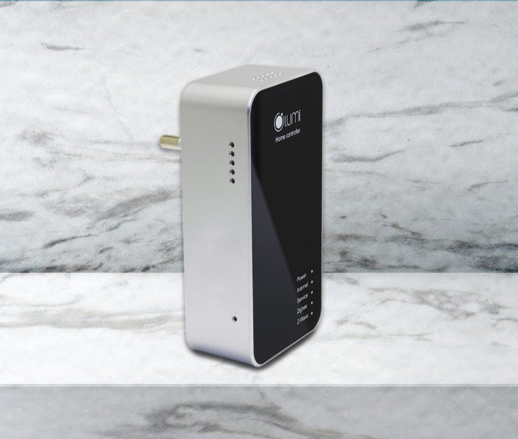

***Bộ điều khiển trung tâm (HC)** là bộ não ghi nhận và điều khiển [**nhà thông minh**](https://lumi.vn/) của Lumi Smart Home. Được ứng dụng công nghệ truyền thông Zigbee, giúp điều khiển toàn bộ ngôi nhà bằng smarthome và giọng nói. Đây là một thiết bị quan trong khi cài đặt nhà thông minh, bởi sản phẩm có khả năng kết nối các thiết bị và xử lý thông tin nhanh chóng.*
## **1. Cơ chế hoạt động bộ điều khiển trung tâm**
- Bộ điều khiển trung tâm là đầu mối tiếp nhận, truyền thông tin “công việc” đến công tắc để yêu cầu thiết bị thực hiện nhiệm vụ.
- Mọi thiết bị trong mạng đều có thể đóng vai trò làm Gateway. Có thể kết nối trực tiếp tới smartphone. Thông qua HC, các trạng thái của thiết bị sẽ được đồng bộ lên máy chủ.
- Người dùng có thể điều khiển từ xa qua điện thoại thông minh. Là nơi lưu trữ các thông tin cấu hình, cài đặt của người dùng. Cập nhật trạng thái thiết bị, tự động ra lệnh hoạt động theo cấu hình mà người dùng cài đặt.
- Thiết bị điều khiển nhà thông minh Lumi có 2 màu cơ bản: đèn – bạc. Thiết kế nhỏ gọn với vỏ nhựa và mặt kính cường lực chống xước. Có thể cắm trực tiếp vào ổ điện 220V.

*Bộ điều khiển trung tâm Lumi*

\>> Xem thêm sản phẩm HC hỗ trợ chiếu sáng thông minh: [***Bộ điều khiển trung tâm (Hỗ trợ Lumi Smart Lighting)***](https://lumi.vn/san-pham/bo-dieu-khien-trung-tam-ho-tro-lumi-smart-lighting.html)
## **2. Ứng dụng của bộ điều khiển nhà thông minh Lumi**
- Đóng vai trò là thiết bị đầu não để điều khiển nhà thông minh. Mang đến nhiều tiện ích, có thể biến mọi ngôi nhà bình thường trở thành nhà thông minh. Với tính năng kết nối công tắc điều khiển các thiết bị điện trong gia đình và điều khiển nhà thông minh, HC có thể lắp đặt cho bất cứ ngôi nhà nào.
- Nếu không sử dụng bộ điều khiển trung tâm thì các thiết bị công tắc thông minh sẽ chỉ có chức năng như công tắc thường. Bạn không thể điều điều khiển từ xa, hẹn giờ, cũng như cài đặt chế độ tự hoạt động cho hệ thống thiết bị điện trong ngôi nhà của mình trên điện thoại, máy tính bảng …
## **3. Phương thức hoạt động của thiết bị điều khiển nhà thông minh**
- **Bộ điều khiển trung tâm nhà thông minh** tiếp nhận tín hiệu từ cảm biến, người dùng gửi đến server. Sau khi tiếp nhận thông tin, thiết bị điều khiển nhà thông minh sẽ truyền tín hiệu đến công tắc được gắn với thiết bị, để thực hiện yêu cầu của người dùng.
  - Ví dụ: Khi cảm biến phát hiện chuyển động gửi tín hiệu “có người di chuyển vào vùng cảm biến” đến HC nhà thông minh. Tại đây, HC truyền tín hiệu nhận được đến công tắc kết nối với thiết bị như bóng đèn hành lang, đèn tuýp … sẽ tự động bật/tắt.
- Ngoài ra, HC còn cho phép người dùng tạo hoạt cảnh.
  - Ví dụ: Bạn có thể tạo cảnh bằng cách sử dụng 1 nút công tắc cảm ứng bật hoặc tắt toàn bộ thiết bị trong nhà, chỉ cần 1 chạm trực tiếp như công tắc cơ hoặc trên điện thoại, bạn đã hoàn toàn điều khiển tất cả các thiết bị điện trong ngôi nhà. Tương tự với những hoạt cảnh: tiếp khách, ăn tối, đi làm về … cho các thiết bị trong gia đình.
## **4. Ưu điểm của bộ điều khiển trung tâm**
- Là công nghệ nổi bật trên thế giới hiện nay ứng dụng trong nhiều công nghệ. Liên kết số lượng lớn các thiết bị, lên tới 90 thiết bị trong cùng một hệ thống.
- Bộ điều khiển trung tâm bảo mật tốt. Có thể hỗ trợ, kết nối các thiết bị trong nhà thành một mạng lưới thông minh. Tiêu hao rất ít năng lượng, tiết kiệm tối đa chi phí so với các công nghệ khác.
- Đặc biệt, sever Lumi đã tích hợp thành công với Sever của Amazon – Mỹ và Google *đ*ể tạo ra giải pháp nhà thông minh điều khiển bằng giọng nói.
- Cho phép người dùng hoàn toàn kiểm soát, điều khiển các thiết bị trong ngôi nhà bằng chính “giọng nói quyền năng” của mình. Khi bạn nói câu lệnh *“Turn on go home”  hoặc “Turn off go out”* tất cả các thiết bị trong ngôi nhà sẽ hoàn toàn bật/tắt, tùy theo câu lệnh.
## **5. Lời kết** 
- Thị trường thiết bị nhà thông minh sẽ tăng trưởng 14,4% mỗi năm vào năm 2023, theo dự báo của hãng nghiên cứu thị trường IDC. Điều đó cho thấy, nhà thông minh đã và đang trở thành tiêu chuẩn, xu hướng nhà ở hiện đại trong tương lai.
- Tại Việt Nam số lượng ngôi nhà có cài đặt nhà thông minh cũng sẽ dần tăng lên và trở thành ngành công nghiệp chủ lực.
- Tìm hiểu thêm các thiết bị khác trong giải pháp nhà thông minh Lumi tại đây.

Xem thêm: Nhà Xuân Bắc chống trộm bằng nhà thông minh Lumi

Hãy liên hệ ngay với chúng tôi theo số hotline 0904.665.965 để trở thành người tiếp theo sở hữu công nghệ thông minh và tận hưởng trọn vẹn cuộc sống tiện nghi, hiện đại của giải pháp nhà thông minh Lumi Việt Nam mang đến. Hoặc bạn có thể gửi liên hệ qua form liên hệ: [**tại đây](https://lumi.vn/Ho-tro.html)** nhân viên tư vấn sẽ chủ động liên hệ để hỗ trợ bạn.

**>> Tham khảo thêm một số sản phẩm nổi bật khác:**

- [***Thiết bị trung tâm AI Camera Hub***](https://lumi.vn/san-pham/ai-camera-hub.html)
- [***Bộ điều khiển trung tâm động cơ rèm Lumi***](https://lumi.vn/san-pham/bo-dieu-khien-trung-tam-tuy-bien-cho-dong-co-rem.html)
