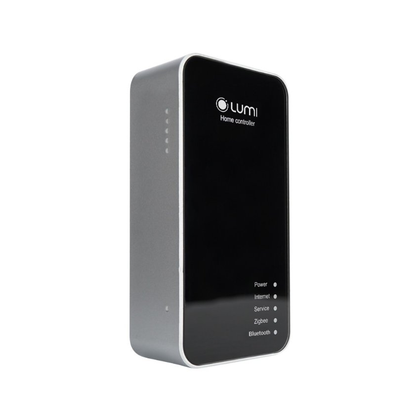

## **1. Tổng quát**
- Mã sản phẩm: LM-HC/3.1

*Bộ điều khiển trung tâm HC*

- Thiết bị LM-HC là bộ điều khiển trung tâm của hệ thống nhà thông minh Lumi.
- Thiết kế: nhỏ gọn với vỏ nhựa và mặt kính cường lực chống xước.
- Chức năng:
  - Cho thiết bị gia nhập mạng zigbee liên kết các thiết bị trong cùng hệ thống với nhau.
  - Điều khiển các thiết bị bằng ứng dụng Lumi Life.
  - Thực hiện xử lý các cài đặt tự động: cảnh, rule, hẹn giờ thiết bị, nhóm thiết bị.
## **2. Thông số kỹ thuật**

|Điện áp hoạt động|100 – 240V AC ~ 50/60Hz|
| :- | :- |
|Nhiệt độ hoạt động|0℃ – 50℃|
|Truyền thông|Zigbee|
|Công suất phát Zigbee|10 dbm|
|Kích thước (D x R x C)|95\.6 x 48.9 x 46 mm|
|Khối lượng|66\.5 gram|

*Kích thước bộ điều khiển trung tâm*
## **3. Lắp đặt thiết bị**
### **3.1. Đèn chỉ thị của thiết bị**
Quy ước: Power (Led 1), Internet (Led 2), Service (Led 3), Zigbee (Led 4), Z-wave (Led 5).

<table><tr><th rowspan="3">Thiết bị được cấp nguồn</th><th>Khi cấp nguồn Led 1 sáng và luôn sáng trong quá trình hoạt động, led 2, 3, 4, 5 nháy 3 lần.</th></tr>
<tr><td>Quá trình khởi động Led 1 sáng</td></tr>
<tr><td>Khởi động thành công 5 led sáng</td></tr>
<tr><td rowspan="2">Thiết bị kết nối internet</td><td>Không kết nối Internet và server: Led 1, 2, 4, 5 sáng, led 3 nháy liên tục.</td></tr>
<tr><td>Kết nối thành công: 5 led đều sáng.</td></tr>
<tr><td>Quá trình hoạt động</td><td>Khi gia nhập mạng Zigbee: Led 4 nháy liên tục. Các led còn lại đều sáng.</td></tr>
</table>
### **3.2. Cấp nguồn thiết bị**
- Bộ điều khiển trung tâm HC của Lumi được thiết kế có chân cắm điện gắn liền. Để cấp nguồn cho thiết bị, người dùng chỉ cần thao tác cắm thiết bị vào ổ điện.
- Sau khi được cấp nguồn, led 1 sáng và luôn sáng trong quá trình hoạt động, led 2, led 3, led 4, led 5 nháy 3 lần liên tiếp. Khi khởi động thành công,5 led đều sáng, người dùng tiến hành cấu hình bộ điều khiển trung tâm.
- Xem chi tiết tại [***Hướng dẫn sử dụng](https://support.lumi.vn/vi/bo-dieu-khien-trung-tam/huongdansudung/Bo-dieu-khien-trung-tamv1.5/normal)***.***
## **4. Cấu hình thiết bị**
### **4.1. Cập nhật firmware**
Trước khi thực hiện cài đặt hệ thống thiết bị thông minh trong nhà, người dùng cần kiểm tra phiên bản firmware của HC và cập nhật firmware cho HC nếu đang ở phiên bản thấp hơn so với hiện tại.

Bước 1:

- Sau khi cấp nguồn mặc định HC sẽ phát ra wifi HCxxxx (xxxx – là 4 số cuối của MAC HC), với mật khẩu là ABC123456. Người dùng kết nối điện thoại hoặc máy tính với wifi của HC để thực hiện cấu hình.
- Trên trình duyệt web, nhập địa chỉ mặc định 10.10.10.254 để vào phần cấu hình cho bộ điều khiển trung tâm. Mật khẩu mặc định của trang web là ABC123.

Bước 2:

Đăng nhập thành công, người dùng chọn tab Administration, tại phần Software information chọn UPGRADE FIRMWARE, sau đó chọn Chose the file để chọn file firmware của Lumi cung cấp đã lưu trong máy. Cuối cùng chọn UPGRADE & RESTART để thực hiện quá trình cập nhật firmware cho HC.

*Cập nhật firmware*

**Lưu ý:** Thời gian quá trình upgrade firmware khoảng 3 phút, trong quá trình này người dùng tuyệt đối không được làm mất nguồn HC và đảm bảo nguồn điện ổn định.
### **4.2. Kết nối internet**
- Thiết bị LM-HC có 2 mode kết nối internet: AP mode (chế độ kết nối dây LAN). Station mode (chế độ kết nối wifi).
- Chế độ AP mode:
  - Mặc định ban đầu HC ở chế độ AP mode, người dùng chỉ cần cấp nguồn và cắm dây LAN kết nối HC với router/modem mạng.
  - Để kiểm tra HC đã nhận mạng hay chưa, người dùng kết nối wifi HC và truy cập địa chỉ 10.10.10.254 trên trình duyệt vào phần cấu hình HC, mật khẩu web cấu hình là ABC123.
  - Người dùng chọn tab Network, tại phần WAN sẽ hiển thị các thông số cấu hình internet của HC nếu HC đã nhận mạng từ router/modem mạng. Trường hợp HC không hiển thị thông số gì người dùng cần kiểm tra lại đường truyền internet, dây LAN.

*HC chưa nhận mạng*

Chế độ Station mode:

- Trường hợp hạ tầng không đáp ứng, không thể kéo dây LAN để cấp mạng cho HC, người dùng có thể cấu hình HC kết nối với wifi của router/modem mạng.
- Đối với HC có phiên bản firmware từ 5.0.28 trở đi người dùng có thể cài đặt HC kết nối wifi bằng app Lumi Life và không cần truy cập vào web cấu hình HC.
  - Trường hợp 1: HC chưa được thêm vào nhà. Chi tiết xem hướng dẫn cài đặt [thêm HC vào nhà](https://support.lumi.vn/docs/hdsd/ung_dung_lumi_life/cau_hinh_he_thong/them_hc_vao_nha#hc-k%E1%BA%BFt-n%E1%BB%91i-m%E1%BA%A1ng-wifi) khi HC kết nối wifi.
  - Trường hợp 2: HC đã được cài đặt thêm vào nhà và thay đổi kết nối wifi. Chi tiết xem hướng dẫn [cài đặt HC kết nối wifi](https://support.lumi.vn/docs/hdsd/ung_dung_lumi_life/cau_hinh_he_thong/them_hc_vao_nha#hc-k%E1%BA%BFt-n%E1%BB%91i-wifi).
- Sau khi cài đặt HC ở chế độ station mode, HC sẽ không phát wifi.
  Để bật lại chế độ HC phát wifi (AP mode) người dùng thao tác nhấn giữ nút config 1s thả tay ra, HC sẽ khởi động lại và phát wifi.

*Bật lại wifi HC*
### **4.3. Chế độ hoạt động**
- Bộ điều khiển trung tâm có 2 chế độ hoạt động: Home Controller (HC) và Local Controller (LC).
- Mặc định ban đầu HC sẽ ở chế độ Home Controller, tức là HC chính trong hệ thống.
- Khi nhu cầu muốn mở rộng số lượng thiết bị trong 1 hệ thống, người dùng cần sử dụng nhiều hơn 1 bộ HC. Khi đó trong hệ thống sẽ có 1 bộ HC chính và các bộ HC còn lại là HC phụ hoạt động ở chế độ LC.
- Để chuyển chế độ hoạt động cho bộ điều khiển trung tâm, người dùng kết nối wifi HC và truy cập địa chỉ 10.10.10.254 trên trình duyệt vào phần cấu hình HC, mật khẩu web cấu hình là ABC123.
- Tab Administration, tại phần Running mode, click vào CONFIGURE và chọn chế độ Home Controller hoặc Local Controller để cấu hình thiết bị thành HC hoặc LC tùy vào nhu cầu sử dụng. Sau đó chọn CONFIGURE & RESTART, HC sẽ khởi động lại và lưu chế độ cài đặt.
## **5. Reset thiết bị**
Người dùng có thể reset bộ điều khiển trung tâm HC về mặc định theo 2 cách.
#### ***Thao tác trên thiết bị:***

*Reset HC trên thiết bị*

- Nhấn giữ nút config nằm cạnh khe thẻ nhớ trên HC trong khoảng 5s, quan sát led chỉ thị sáng đến led 4 thì thả tay ra.
- Sau đó, led 2, 3, 4, 5 nháy 3 lần, HC khởi động lại. Sau khi khởi động lại thành công, HC sáng 5 led và phát wifi.
#### ***Thao tác trên web cấu hình***
Người dùng kết nối wifi HC, truy cập địa chỉ 10.10.10.254 trên trình duyệt vào phần cấu hình HC, mật khẩu web cấu hình là ABC123, chọn tab Administration, tại phần Factory reset chọn RESET.

*Reset HC*
## **6. Bộ sản phẩm đóng gói**
Hộp đóng gói sản phẩm bao gồm: 1 bộ HC, 1 bộ hướng dẫn sử dụng, 1 dây cáp mạng dài 1m.
## **7. Video hướng dẫn cài đặt nhà thông minh với bộ xử lý trung tâm**
