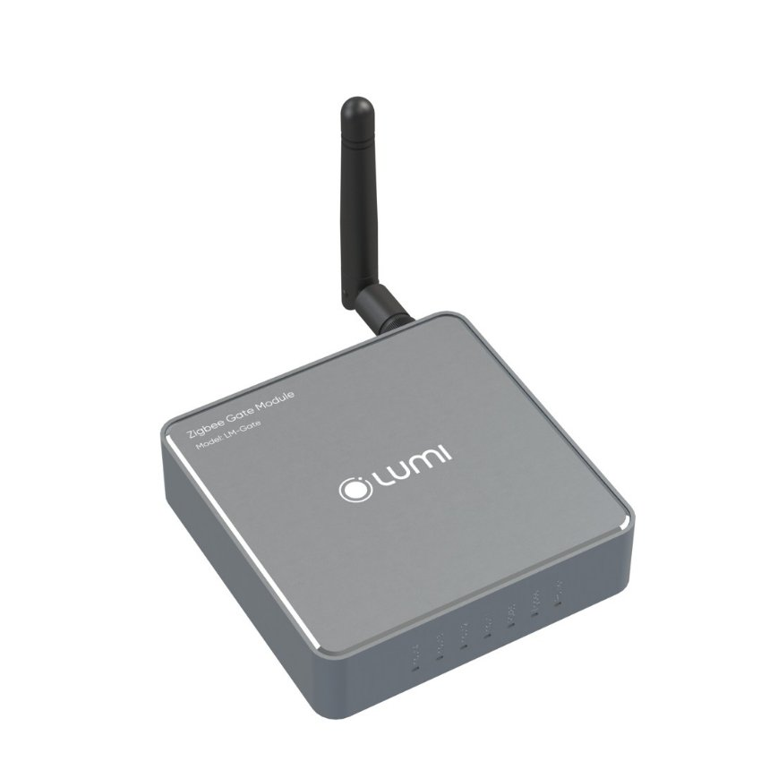

*Động cơ [**cổng tự động**](https://lumi.vn/cong-tu-dong-thong-minh-lumi-dea.html) đã trở thành giải pháp tiện lợi và tiết kiệm sức lực cho người dùng, tuy nhiên, với nhu cầu ngày càng cao về tính an ninh và thông minh, Lumi đã phát triển Smart Gate Module. Với công nghệ IoT, module này giúp biến các bộ điều khiển cổng trở nên thông minh hơn bao giờ hết. Chỉ với việc sử dụng ứng dụng Lumi Life+, người dùng có thể dễ dàng giám sát, điều khiển và quản lý cài đặt từ xa. Hãy khám phá Smart Gate Module của Lumi để tìm hiểu những tính năng đột phá này!*
## **1. Thông số kỹ thuật**
### ***1.1. Thông số Module điều khiển cổng Zigbee***

|**Sản phẩm**|LM-GATE-ZB|
| :- | :- |
|**Điện áp hoạt động**|9-24V một chiều|
|**Nhiệt độ hoạt động**|0℃ – 50℃|
|**Truyền thông không dây**|Zigbee|
|**Kích thước**|(D x R x C) 80 x 80 x 20mm|
|**Khối lượng**|200 gam|
### ***1.2. Thông số Module tín hiệu RS485***

|**Sản phẩm**|Module tín hiệu RS485|
| :- | :- |
|**Điện áp hoạt động**|9-24V một chiều|
|**Nhiệt độ hoạt động**|0℃ – 50℃|
|**Truyền thông không dây**|không hỗ trợ|
|**Kích thước**|(D x R x C) 47,5 x 49 x 20,4 mm|
|**Giới hạn dây tín hiệu (Từ Module RS485 -> LM-GATE)**|Tối đa 100m|
## **2. Đặc điểm cấu tạo của Smart Gate Module**
Bộ sản phẩm gồm 2 phần chính, đó là module LM-GATE và Module RS485.
### ***2.1. Module điều khiển cổng Zigbee***
- Module LM-GATE là thiết bị được sử dụng để kết nối vào mạng Zigbee và được đặt trong nhà gần HC/LC.
- Thiết bị sẽ đóng vai trò trung gian trao đổi thông tin giữa bộ điều khiển cổng DEA, ROGER, V2 và ứng dụng Lumi Life+; giúp tăng cường tính ổn định và hiệu quả cho hệ thống.

*Module điều khiển cổng Zigbee LM-GATE-ZB*
### ***2.2. Module tín hiệu RS485***
- Module RS485 là một thiết bị quan trọng trong hệ thống tự động hóa của bộ điều khiển cổng thông minh. Với chức năng như một bộ khuếch đại tín hiệu, Module RS485 giúp tăng cường và truyền tải tín hiệu từ bảng điều khiển DEA, ROGER, V2 về Module LM-GATE.
- Điểm mạnh của Module RS485 chính là khả năng truyền tải tín hiệu ổn định, đáng tin cậy và hiệu quả. Khi lắp đặt kỹ thuật viên sẽ đặt Module RS485 ở trong hộp điều khiển DEA, ROGER, V2 giúp tiết kiệm không gian và đảm bảo tính thẩm mỹ.

*Module tín hiệu RS485*

\>> Xem thêm sản phẩm nổi bật: [***Cổng tự động tay đòn STING***](https://lumi.vn/san-pham/cong-tu-dong-tay-don-sting.html)
## **3. Tính năng của bộ giải pháp Smart Gate Module**
### ***3.1. Tương thích phần lớn bộ điều khiển cổng trên thị trường***
- Smart Gate Module được thiết kế để tương thích với hầu hết các bộ điều khiển cổng trên thị trường hiện nay như Roger, Dea, V2,…
- Việc mở rộng kết nối cho phép người dùng linh hoạt trong việc lựa chọn sản phẩm động cơ phù hợp với nhu cầu sử dụng của gia đình, đồng thời đảm bảo tận hưởng tối đa các ưu điểm của cổng thông minh thế hệ mới.
### ***3.2. Giám sát, điều khiển, tra cứu lịch sử trạng thái đóng/mở cổng mọi lúc, mọi nơi thông qua app Lumi Life+***
- Smart Gate Module được tích hợp vào bộ điều khiển cổng hiện có của mỗi gia đình, giải quyết nhanh chóng các bất tiện liên quan đến việc đóng/mở của cổng tự động phổ biến trên thị trường chỉ bằng một chạm trên smartphone. Người dùng có thể sử dụng ứng dụng Lumi Life+ để đóng/mở cổng từ bất kỳ đâu bên cạnh các thao tác mở truyền thông bằng tay, remote hay công tắc.
- Ngoài ra, người dùng có thể giám sát trạng thái đóng/mở của cổng với độ chính xác cao trên giao diện ứng dụng Lumi Life+. Ứng dụng cho phép tra cứu chi tiết lịch sử đóng/mở cổng, bao gồm thời gian và thiết bị điều khiển được rõ ràng hiển thị trên ứng dụng, tăng cường an ninh cho các gia đình hiện đại.  
### ***3.3 Quản lý remote dễ dàng, an toàn***
- Việc tích hợp Smart Gate Module vào bộ điều khiển cổng  giúp người dùng có thể loại bỏ remote nhanh chóng bằng vài thao tác đơn giản trên smartphone ngay khi xảy ra tình trạng đánh rơi remote. Việc áp dụng công nghệ thông minh từ Lumi giúp tăng cường tính an toàn và bảo mật cho người dùng, giảm thiểu rủi ro bị các vụ trộm cắp hay xâm nhập.
- Để xoá remote tránh tình trạng kẻ gian xâm nhập trái phép, bạn chỉ cần thực hiện các bước sau: Mở App Lumi Life+ > Chọn thiết bị: “Cổng” > Chọn “Cài đặt” > Chọn “Remote” > Chọn “Tên Remote” > Chọn “Xóa thiết bị này”.
- (Hiện tính năng này có trên Smart Gate Module tích hợp với bộ điều khiển cổng DEA)
### ***3.4. Thao tác cài đặt, cấu hình nhanh chóng trên smartphone***
- Ứng dụng Lumi Life+ cho phép kỹ thuật viên thao tác cài đặt, cấu hình và thay đổi thông số cài đặt cho cổng tự động Roger, Dea một cách nhanh chóng và tiện lợi. Người dùng không cần phải trực tiếp thao tác bằng nút bấm trên bộ điều khiển hay đến tận nhà khách hàng (khi khách hàng có nhu cầu điều chỉnh kỹ thuật).
- Đặc biệt, khi nâng cấp cổng tự động trở nên thông minh với Smart Gate Module, tích hợp vào Nhà thông minh Lumi, người dùng còn được trải nghiệm những kịch bản sống tiện nghi phù hợp với nếp sống sinh hoạt của gia đình.
- Ví dụ, bạn có thể thiết lập ngữ cảnh “Chào mừng trở về nhà” gồm: Cổng tự động mở, vùng an ninh tự động tắt, hệ thống tưới sân vườn tự động kích hoạt, rèm cửa tự động mở, đèn từ động sáng và điều hòa tự động bật sẵn để làm mát căn phòng, chờ đón bạn trở về nhà. Tất cả các hành động này sẽ được điều khiển đơn giản chỉ với một chạm trên app Lumi Life+.

Với Smart Gate Module người dùng có thể dễ dàng kiểm soát và quản lý hoạt động của cổng thông minh từ xa, mang lại sự thuận tiện và linh hoạt cho cuộc sống hàng ngày. Hãy liên hệ hotline hoặc để lại thông tin trên form thông tin để nhận được tư vấn chi tiết nhất từ Lumi.

**>> Tham khảo thêm một số mẫu công tự động cao cấp khác:**

- [***Cổng trượt thông minh LIVI***](https://lumi.vn/san-pham/cong-truot-tu-dong-livi.html)
- [***Cổng thông minh tay đòn LOOK***](https://lumi.vn/san-pham/cong-tu-dong-tay-don-look.html)
