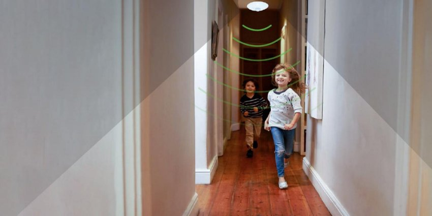

*Cảm biến chuyển động Lumi, sản xuất tại Việt Nam, sử dụng vật liệu nhựa chống cháy PP cho thân và vỏ, đảm bảo an toàn cho người dùng. Sản phẩm tuân thủ tiêu chuẩn xuất khẩu CE Châu Âu và hạn chế chất nguy hiểm RoHS. Đây là mẫu cảm biến thông minh với nhiều tính năng vượt trội và có khả năng tích hợp vào [**smarthome**](https://lumi.vn/). Đây là cảm biến đa năng, tích hợp chức năng cảm biến chuyển động, nhiệt độ, độ ẩm và ánh sáng trong thiết kế trắng trẻo, hiện đại.*
## **1. Cảm biến tự động bật tắt đèn khi có người**
- Tự động bật tắt đèn khi có người là tính năng căn bản nhất của một chiếc cảm biến chuyển động.
- Khi gắn cảm biến hồng ngoại Lumi tại các vị trí như hành lang, cửa ra vào, cổng, bạn có thể cài đặt cho cảm biến truyền lệnh mở, tắt đèn khi phát hiện chuyển động.
- Với tính năng này, ông bà, hay các con trong nhà sẽ an toàn hơn khi leo cầu thang, đi trên hành lang, hay ra vào nhà vệ sinh vào buổi tối

*Tự động bật tắt đèn khi có người*

\>> Tham khảo thêm sản phẩm hot nhất hiện nay:[` `***Cảm biến hiện diện Lumi***](https://lumi.vn/san-pham/cam-bien-hien-dien-lumi.html)
## **2. Tính năng của cảm biến phát hiện chuyển động**
### **2.1. Tích hợp cảm biến đo ánh sáng**
- Cảm biến đo ánh sáng tích hợp bên trong, cho phép gia chủ theo dõi độ sáng trong phòng mọi lúc mọi nơi, theo thời gian thực.
- Với tính năng này, gia chủ có thể cài đặt lệnh tự động đóng rèm khi trời quá sáng, hoặc tự động mở rèm khi trời quá tối vào khoảng thời gian ban ngày.
### **2.2. Tích hợp nhiệt kế điện tử**
Gia chủ có thể biết được nhiệt độ tại một điểm bất kỳ có gắn cảm biến, mọi lúc mọi nơi, qua app Lumi Life. Đây là một vài ví dụ bạn có thể làm với cảm biến tích hợp nhiệt kế bên trong:

- Đưa ra cảnh báo khi nhiệt độ phòng vượt quá 45 độ C
- Tự động đóng rèm, bật điều hòa khi nhiệt độ trong phòng trên 35 độ C
- Tự động bật máy sưởi khi nhiệt độ phòng dưới 18 độ C
### **2.3. Tích hợp cảm biến đo độ ẩm**
- Chúng ta thường cảm thấy khó chịu khi độ ẩm trong không khi quá cao, và cảm thấy khô rát, thiếu nước khi độ ẩm quá thấp.
- Với cảm biến đo độ ẩm tích hợp bên trong, gia chủ có thể đặt lệnh tự động mở quạt, mở thông gió, mở máy điều chỉnh độ ẩm theo mong muốn của mình.
## **3. Ứng dụng của cảm biến phát hiện chuyển động Lumi**
Cảm biến phát hiện chuyển động BLE/Zigbee có các ứng dụng như:

- Đảm bảo an ninh gia đình
- Điều khiển ánh sáng tự động
- Theo dõi hoạt động trong văn phòng
- Quản lý không gian thương mại
- Giám sát khu vực ngoại trời
- Tự động hóa không gian sống
- Kiểm soát an ninh trong ngành công nghiệp

Trên đây là những thông tin chi tiết về cảm biến phát hiện chuyển động thông minh. Để cập nhật nhiều sản phẩm thông minh mới, hãy ghé website của Lumi thường xuyên. Thông tin của các sản phẩm sẽ được update liên tục trên website chính của Lumi.

**>> Tham khảo thêm một số mẫu cảm biến bán chạy tại Lumi:**

- [***Cảm biến cửa thông minh***](https://lumi.vn/san-pham/cam-bien-cua.html)
- [***Cảm biến gắn trần***](https://lumi.vn/san-pham/cam-bien-chuyen-dong-gan-tran.html)
