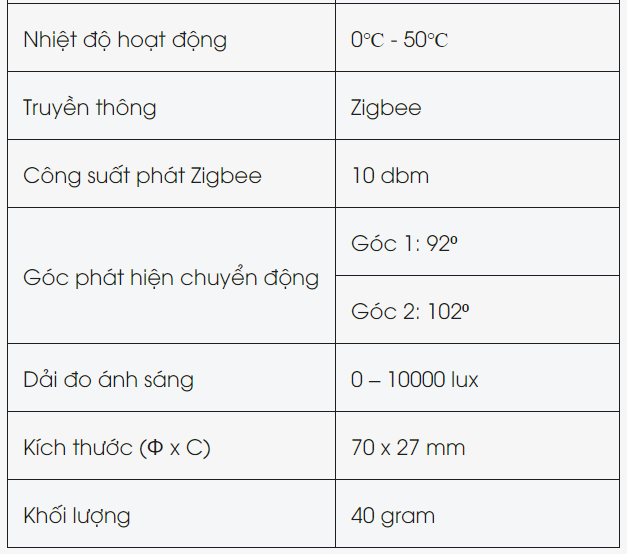
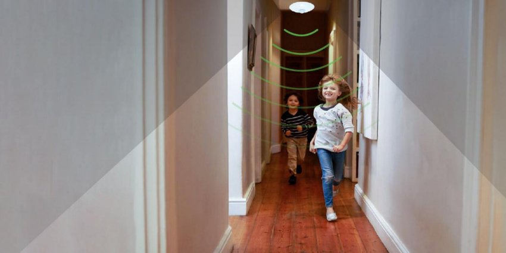

*Cảm biến chuyển động Lumi, được sản xuất tại Việt Nam. Thân và vỏ làm từ nhựa chống cháy PP, an toàn cho người sử dụng. Sản phẩm đạt tiêu chuẩn xuất khẩu Châu Âu CE và tiêu chuẩn về hạn chế các chất nguy hiểm RoHS, hiện đã có mặt trên 8 quốc gia và vùng lãnh thổ trên thế giới. Có thể gọi đây là cảm biến hồng ngoại, hoặc cảm biến nhiệt độ, hoặc cảm biến độ ẩm, hoặc cảm biến ánh sáng đều được. Vì Lumi đã tích hợp tất cả những chiếc cảm biến kia bên trong chiếc vỏ màu trắng nhỏ nhắn, hiện đại này.*
## **1. Thông số kỹ thuật cảm biến phát hiện chuyển động**
**Nguồn cấp:** 220VAC/ 50Hz

*Bảng thông số kỹ thuật cảm biến thông minh Zigbee*
## **2. Cảm biến chuyển động tự động bật tắt đèn khi có người**
- Đây là tính năng căn bản nhất của một chiếc cảm biến phát hiện chuyển động. Khi gắn cảm biến chuyển động Lumi tại các vị trí như hành lang, cửa ra vào, cổng, bạn có thể cài đặt cho cảm biến truyền lệnh mở, tắt đèn khi phát hiện chuyển động.
- Với tính năng này, ông bà, hay các con trong nhà sẽ an toàn hơn khi leo cầu thang, đi trên hành lang, hay ra vào nhà vệ sinh vào buổi tối

*Cảm biến phát hiện chuyển động zigbee*

\>> Xem thêm sản phẩm cảm biến mới của Lumi: [***Cảm biến hiện diện thông minh***](https://lumi.vn/san-pham/cam-bien-hien-dien-lumi.html)
## **3. Cảm biến người ra vào tích hợp cảm biến đo ánh sáng**
- Cảm biến đo ánh sáng tích hợp bên trong, cho phép gia chủ theo dõi độ sáng trong phòng mọi lúc mọi nơi, theo thời gian thực.
- Với tính năng này, gia chủ có thể cài đặt lệnh tự động đóng rèm khi trời quá sáng, hoặc tự động mở rèm khi trời quá tối vào khoảng thời gian ban ngày.
## **4. Cảm biến hồng ngoại tích hợp nhiệt kế điện tử**
Gia chủ có thể biết được nhiệt độ tại một điểm bất kỳ có gắn cảm biến, mọi lúc mọi nơi, qua app Lumi Life. Đây là một vài ví dụ bạn có thể làm với cảm biến tích hợp nhiệt kế bên trong:

- Đưa ra cảnh báo khi nhiệt độ phòng vượt quá 45 độ C
- Tự động đóng rèm, bật điều hòa khi nhiệt độ trong phòng trên 35 độ C
- Tự động bật máy sưởi khi nhiệt độ phòng dưới 18 độ C
## **5.  Cảm biến tích hợp cảm biến đo độ ẩm**
- Chúng ta thường cảm thấy khó chịu khi độ ẩm trong không khi quá cao, và cảm thấy khô rát, thiếu nước khi độ ẩm quá thấp.
- Với cảm biến đo độ ẩm tích hợp bên trong, gia chủ có thể đặt lệnh tự động mở quạt, mở thông gió, mở máy điều chỉnh độ ẩm theo mong muốn của mình

*Kích thước cảm biến*
## **6. Lắp đặt cảm biến người ra vào hồng ngoại**
### ***Bước 1: Cấp nguồn cho cảm biến phát hiện chuyển động***
#### Với [***cảm biến thông minh***](https://lumi.vn/cam-bien/) sử dụng pin
- Xoay mặt trước ngược chiều kim đồng hồ để mở sản phẩm

*Cấu tạo cảm biến phát hiện chuyển động Zigbee*

- Lắp pin được cấp kèm (trong hộp) vào khay đựng pin trên thiết bị (bản dùng pin)
#### Với cảm biến sử dụng nguồn 220V
- Xoay mặt trước ngược chiều kim đồng hồ để mở sản phẩm
- Lắp bộ biến đổi nguồn được cấp kèm sản phẩm
- Sau khi cấp nguồn thành công, thiết bị nháy hồng 3 lần trong thời gian 3s

**Lưu ý:** 

Khi lắp cảm biến trên trần thạch cao với nguồn, người dùng cần khoét lỗ lắp đặt nguồn làm sao cho hợp lý
### ***Bước 2: Lắp đặt cảm biến chuyển động vào vị trí***
**Lưu ý:**

Trước khi tiến hành lắp đặt, người dùng cần phải cho thiết bị hoàn thành việc gia nhập mạng trước
#### Cố định mặt sau lên vị trí lắp đặt:

*Lắp đặt hoàn thiện sản phẩm lên đúng vị trí*

- Thiết bị được thiết kế với 2 tùy chọn lắp đặt: Cố định bằng băng dính 2 mặt và cố định bằng vít
- Đặt mặt trước làm sao cho các ngàm của mặt sau trùng với các rãnh ngàm của mặt trước, sau đó xoay mặt trước theo chiều cùng kim đồng hồ để các ngàm ăn khớp vào rãnh.

**Lưu ý:** 

- Ngàm nhỏ ở mặt sau tương ứng với rãnh nhỏ ở mặt trước. Thiết bị được thiết kế chỉ 1 vị trí có thể xoay ăn khớp giữa mặt trước và mặt sau
- Đây là thiết bị lắp trong nhà, không sử dụng ngoài trời

*Lưu ý khi sử dụng cảm biến phát hiện chuyển động Lumi*
## **8. Ứng dụng của cảm biến phát hiện chuyển động Zigbee**
Cảm biến phát hiện chuyển động có nhiều ứng dụng khác nhau trong cuộc sống và công nghệ, bao gồm:

- Làm cảm biến đèn nhà tắm
- Làm cảm biến đèn cầu thang
- Làm cảm biến tự bật đèn
- …

Cảm biến chuyển động Zigbee mang tính năng thông minh, dễ dàng tích hợp vào hệ thống; giúp tăng cường an ninh, tiết kiệm năng lượng và kiểm soát hiệu quả trong nhiều môi trường sử dụng.Để nhận thông tin tư vấn chi tiết về sản phẩm cảm biến Lumi này, hãy liên hệ ngay với hotline 0904 665 965, nhân viên tư vấn sẽ hỗ trợ nhanh chóng 24/7.

**Tham khảo thêm một số mẫu cảm biến nổi bật khác:**

- [***Cảm biến phát hiện chuyển động Zigbee/BLE***](https://lumi.vn/san-pham/cam-bien-phat-hien-chuyen-dong.html)
- [***Cảm biến cửa Lumi***](https://lumi.vn/san-pham/cam-bien-cua.html)
