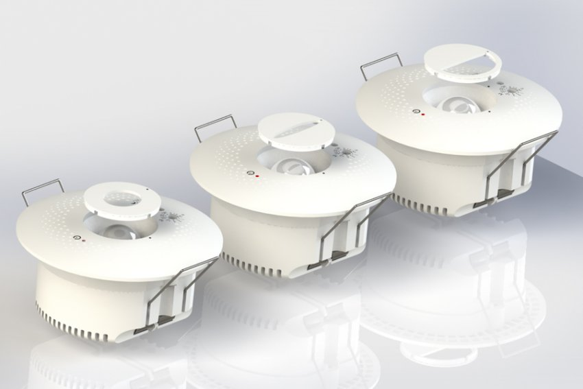
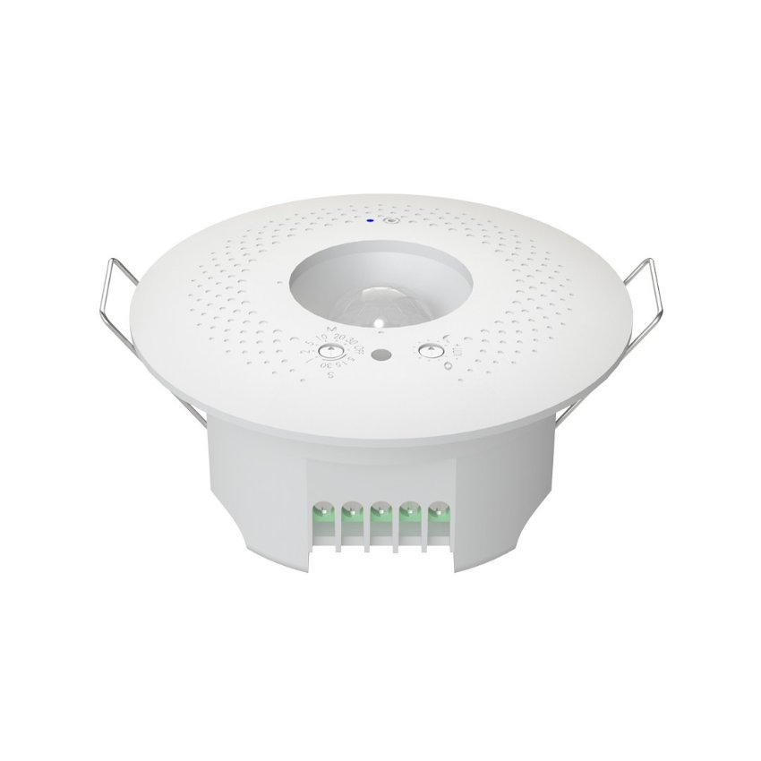

*Cảm biến chuyển động gắn trần Lumi là một thiết bị không thể thiếu để thiết lập những tính năng tự động hoá trong ngôi hệ sinh thái nhà thông minh. Thiết bị hoạt động bằng công nghệ cảm biến hồng ngoại, sử dụng nguồn điện tiêu chuẩn 220V và cho phép gắn trực tiếp lên các loại trần nhà phổ thông.*

*Cảm biến chuyển động gắn trần Lumi*
## **1. Tính năng cảm biến chuyển động gắn trần Lumi**
Cảm biến chuyển động được ứng dụng đa dạng tại nhiều nơi như phòng tắm, hành lang nhà ở, trường học, văn phòng… tránh tình trạng người dùng quên tắt đèn khi sử dụng xong. Cảm biến chuyển động gắn trần không chỉ có các tính năng cơ bản như

- Bật đèn khi phát hiện chuyển động trong vùng cảm biến
- Tắt đèn sau 1 thời gian cài đặt khi không phát hiện chuyển động

Cảm biến còn được tích hợp cảm biến ánh sáng, giúp người dùng tận hưởng những tính năng thông minh hơn. Cụ thể:

- Cảm biến ánh sáng sẽ ghi nhận độ sáng tại khu vực được lắp đặt thiết bị, đồng thời so sánh với độ sáng được cài đặt ở đèn và chỉ bật đèn sáng khi ánh sáng được ghi nhận nhỏ hơn ánh sáng được cài đặt.
- Tại một số khu vực đặc thù hoặc thường xuyên có ánh sáng tự nhiên cường độ cao, cảm biến sẽ có thể nhận biết để điều khiển đèn bật phù hợp, tránh lãng phí điện năng.
- Ngoài ra, thiết bị còn được trang bị thêm mắt che để người dùng dễ dàng điều chỉnh góc quét theo nhu cầu chiếu sáng tự động. 

*Cảm biến hiện diện Lumi thiết kế nhỏ gọn*

**Góc mắt che tối ưu:**

- Góc nhận diện 72°-92°
- Góc nhận diện 30°-102°hoặc 30°- 92°
- Góc nhận diện 46°-102°hoặc 51°- 92°
## **2. Ưu điểm cảm biến chuyển động âm trần Lumi**
- Thiết kế tinh gọn với màu sắc trắng, mắt cảm biến không lộ hẳn ra ngoài đảm bảo tính thẩm mỹ, cảm biến chuyển động gắn trần Lumi sẽ là một sự lựa chọn hoàn hảo cho những người theo đuổi phong cách đơn giản và tinh tế.
- Bên cạnh đó, cảm biến chuyển động gắn trần Lumi được làm từ nhựa PP chống cháy, mang tới độ bền cao, hầu như không bị ảnh hưởng bởi điều kiện thời tiết nhiệt đới nóng ẩm như ở Việt Nam.
## **3. Cách thức hoạt động cảm biến chuyển động gắn trần**
- Khi cảm biến phát hiện sự di chuyển, ngay lập truyền tín hiệu tới bộ xử lý bên trong cảm biến để thực hiện công việc bật/tắt đối với bóng đèn.
- Với những vị trí phòng cạnh nhau được lắp đặt cảm biến chuyển động, mắt cảm biến sẽ giúp bạn che đi góc không cần cảm biến quét tới.
- Ví dụ: khi lắp cảm biến trong phòng vệ sinh thì bạn nên điều chỉnh mắt cảm biến che đi hướng của khu vực hành lang; do vậy những ai đi qua hành lang sẽ không thể làm cho cảm biến trong phòng vệ sinh hoạt động.

Ngoài ra, thời gian bật/ tắt sẽ được bạn cài đặt một cách linh hoạt. Ví dụ: thời gian sáng khi người đi qua hoặc đứng trong vùng cảm biến sẽ kéo dài đến 30 phút, và sẽ tắt sau khi người di chuyển qua từ 5 giây – 30 phút.
## **4. Ứng dụng cảm biến chuyển động gắn trần thông minh**
Cảm biến chuyển động âm trần thường được lắp đặt tại các không gian như:

- Phòng khách hoặc phòng chính: Lắp đặt cảm biến chuyển động ở phòng khách hoặc phòng chính có thể giúp kiểm soát ánh sáng tự động hoặc kích hoạt các thiết bị điện tử khi có người đi vào phòng.
- Phòng ngủ: Trong các phòng ngủ, cảm biến chuyển động có thể sử dụng để kiểm soát ánh sáng hoặc kích hoạt hệ thống thông báo khi có người thức dậy.
- Nhà vệ sinh: Lắp đặt cảm biến chuyển động ở nhà vệ sinh có thể tự động kích hoạt đèn hoặc quạt thông gió khi có người sử dụng.
- Nhà kho hoặc garage: Cảm biến chuyển động có thể được lắp đặt ở những nơi như nhà kho, garage hoặc những khu vực lưu trữ khác để phát hiện sự chuyển động và bảo vệ an ninh.
- Văn phòng hoặc không gian làm việc: Trong môi trường văn phòng, cảm biến chuyển động có thể sử dụng để kiểm soát ánh sáng và nhiệt độ, đảm bảo tiết kiệm năng lượng và thoải mái cho nhân viên.
- Cửa ra vào: Lắp đặt cảm biến chuyển động ở cửa ra vào có thể giúp theo dõi việc vào ra của người, đặc biệt trong các cơ sở thương mại hoặc doanh nghiệp.
- Khu vực quan trọng cần bảo vệ: Trong các hệ thống an ninh, cảm biến chuyển động có thể lắp đặt ở các vị trí quan trọng như cửa ra vào, cửa sổ hoặc khu vực có giá trị cao để phát hiện sự xâm nhập.

Trên đây là những thông tin chi tiết về cảm biến chuyển động gắn trần Lumi. Để nhận thông tin chi tiết hơn về sản phẩm cảm biến thông minh nay, hãy liên hệ ngay hotline để nhân viên tư vấn có thể hỗ trợ nhanh chóng nhất.

\>> Tham khảo thêm một số mẫu cảm biến chuyển động phổ biến tại Lumi:

- [***Cảm biến phát hiện chuyển động Zigbee***](https://lumi.vn/san-pham/cam-bien-phat-hien-chuyen-dong-zigbee.html)
- [***Cảm biến chuyển động Zigbee/BLE***](https://lumi.vn/san-pham/cam-bien-phat-hien-chuyen-dong.html)
- [***Cảm biến hiện diện***](https://lumi.vn/san-pham/cam-bien-hien-dien-lumi.html)
