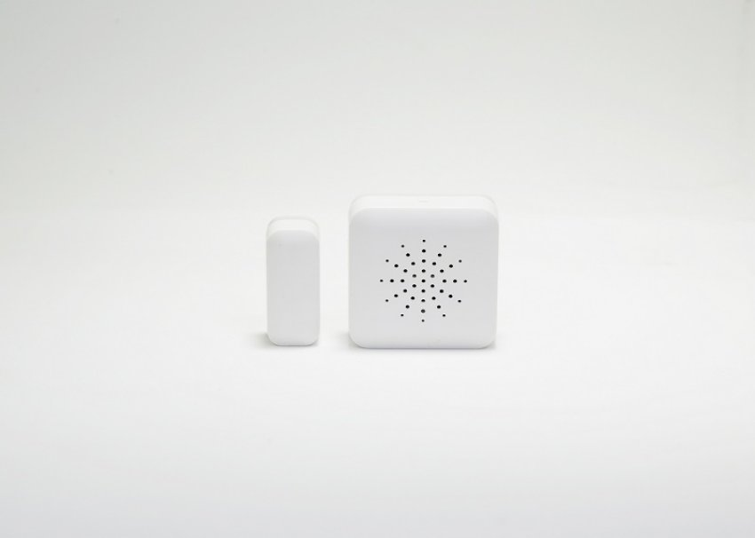
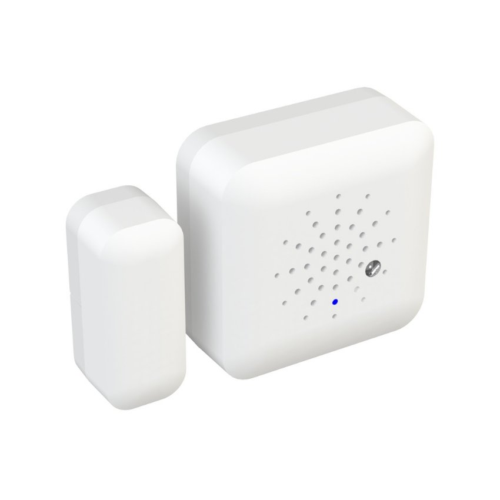

***Cảm biến cửa thông minh** Lumi là một thiết bị tích hợp công nghệ tiên tiến, mang lại sự thuận tiện và tạo ra một lớp bảo vệ an toàn về điện cho căn nhà của bạn. Không chỉ đơn thuần là một cảm biến đóng mở cửa, Lumi được trang bị công nghệ cao. Người dùng có thể dễ dàng kiểm soát và điều chỉnh trạng thái cửa từ xa thông qua ứng dụng di động hoặc một thiết bị kết nối internet khác; khi tích hợp cảm biến với hệ sinh thái [**nhà thông minh**](https://lumi.vn/).*
## **1. Đặc điểm cảm biến cửa thông minh**
- Cảm biến cửa thông minh Lumi được thiết kế thành 2 phần riêng biệt, được gắn tại cửa ra vào của ngôi nhà hay của từng phòng, được lắp với tối đa cách nhau là 2cm.
- Sản phẩm làm từ chất liệu nhựa chống cháy PP, thiết kế tinh tế, tỉ mỉ với các đầu vát tròn. Cảm biến phát hiện đột nhập chỉ duy nhất có màu trắng, thể hiện sự hiện đại, sang trọng. Đây là thiết bị không thể thiếu trong hệ thống giải pháp smarthome.
- Kích thước (DxRxC) của cảm biến là 36x36x15mm với khối lượng 29g rất nhỏ gọn và dễ dàng lắp đặt.
- Thiết bị phát hiện có sự kiện đóng/ mở cửa. Nếu truyền về bộ điều khiển trung tâm: Đèn chỉ thị nháy xanh, nháy nhanh 2 lần. Nếu không truyền về bộ điều khiển trung tâm: Đèn chỉ thị nháy đỏ, nháy nhanh 2 lần.

*Cảm ứng của phát hiện đột nhập của Lumi sử dụng công nghệ không dây Zigbee*

\>> Xem thêm sản phẩm cảm biến cao cấp: [***Cảm biến chuyển động gắn trần***](https://lumi.vn/san-pham/cam-bien-chuyen-dong-gan-tran.html)
### **2. Ứng dụng của cảm biến cửa thông minh**
- Cảm biến cửa thông minh Lumi là 1 trong những thiết bị trong giải pháp chuẩn an ninh của Lumi. Nó được ứng dụng vào giải pháp chống trộm thông minh cho nhà ở, căn hộ chung cư, xe ô tô …
- Ví dụ: Khi lắp cảm biến phát hiện chuyển động như cửa ra vào, bạn cài đặt theo khung thời gian từ 23h – 5h sáng, 8h – 11h và 13h – 17h. Trong khoảng thời gian này, khi cánh cửa bị mở, cảm biến phát hiện chuyển động ngay lập tức truyền tín hiệu đến bộ điều khiển trung tâm HC. Tại đây, HC có chức năng kích hoạt các công tắc để bật đèn, mở rèm, còi báo động …
- Việc gửi cảnh báo đến điện thoại và huy động các thiết bị tham gia quá trình “chống trộm” đã góp phần vào việc bảo vệ ngôi nhà bạn trước những tác nhân xấu.
## **3. Cách thức hoạt động của cảm biến cửa Lumi**
- Khi cửa mở, cảm biến sẽ gửi tín hiệu tới bộ điều khiển trung tâm (HC) khi phát hiện cửa mở và báo cho bạn biết. Tại đây, HC thực hiện chức năng gửi cảnh báo đến điện thoại di động của bạn, đồng thời gửi thông báo đến công tắc kích hoạt 1 hệ thống các thiết bị cùng tham gia “chống trộm” như: còi hú, rèm mở, đèn bật sáng … tùy theo ngữ cảnh mà bạn cài đặt.
- Lưu ý: Đây là [***cảm biến Lumi***](https://lumi.vn/cam-bien/) dành riêng cho cửa, vì vậy để cảm biến cửa thông minh hoạt động hiệu quả, bạn nên cài đặt thời gian hoạt động cho cảm biến theo khung giờ. Ví dụ: từ 23h – 5h sáng, 8h – 11h và 13h – 17h.

*Cảm biến cửa thông minh*

\>> Xem thêm thêm sản phẩm cảm biến dùng pin: [***Cảm biến chuyển động Zigbee***](https://lumi.vn/san-pham/cam-bien-phat-hien-chuyen-dong-zigbee.html)
## **4. Cảm biến cửa đảm bảo an toàn tuyệt đối cho ngôi nhà bạn**
- Việc gửi cảnh báo đến điện thoại và huy động các thiết bị tham gia quá trình “chống trộm” đã góp phần vào việc bảo vệ ngôi nhà bạn trước những tác nhân xấu.
- Ngoài ra, cảm biến cửa còn có chức năng như cảm biến môi trường, có thể đo được các thông số như: độ ẩm, nhiệt độ, ánh sáng môi trường và báo đến điện thoại, giúp gia đình bạn luôn có môi trường đảm bảo sức khỏe.
- Sử dụng công nghệ không dây Zigbee, tiêu chuẩn 802.15.4 – sử dụng tín hiệu radio có tần sóng ngắn, có 2 tầng và vận hành trong vùng bảo mật của hệ thống. Nên trộm không thể xâm nhập vào hệ thống mạng không dây zigbee nhà bạn để mở cửa một cách dễ dàng.

Trên đây là những thông tin chi tiết về sản phẩm **cảm biến cửa thông minh** Lumi. Lumi là đơn vị đầu tiên tại Việt Nam đạt chứng chỉ CE – tiêu chuẩn xuất khẩu sang Châu Âu và chứng chỉ UL – được phép xuất khẩu đến 104 quốc gia trên thế giới. Chính vì vậy, bạn hoàn toàn có thể tin tưởng vào chất lượng sản phẩm của Lumi.

\>> Xem thêm sản phẩm cảm biến khác: [***Cảm biến chuyển động thông minh Zigbee/BLE***](https://lumi.vn/san-pham/cam-bien-chuyen-dong-gan-tran.html)
