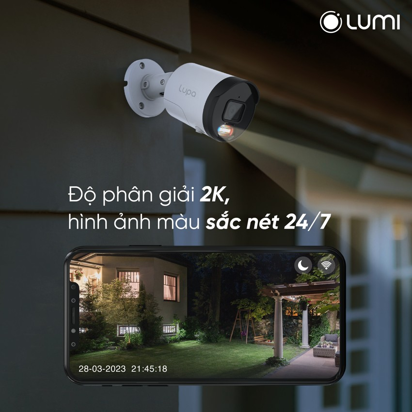
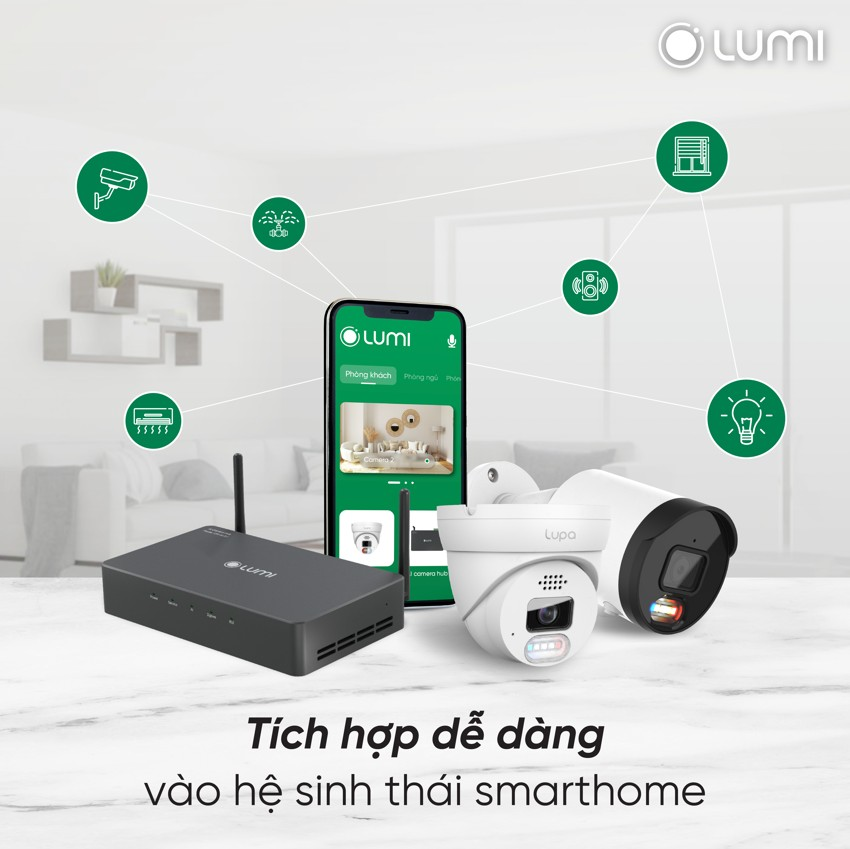

***Camera cảm báo Lupa Bullet** thuộc bộ giải pháp an ninh AI Camera Lupa mới nhất của Lumi. Đây là mẫu camera cảnh báo hiện đại với nhiều tính năng nổi bật giúp mang đến một “người bảo vệ” 24/24 cho ngôi nhà của bạn. Đặc biệt với việc tích hợp AI – trí tuệ nhân tạo giúp xử lý hình ảnh nhanh chóng và cảnh báo tức thời tới người dùng. Tìm hiểu chi tiết hơn về sản phẩm thông qua các thông tin dưới đây .*
## **1. Tính năng camera cảnh báo Lupa Bullet**
### ***1.1. Tính năng live stream trực tuyến theo thời gian thực***
- Người dùng có thể thông qua các nền tảng  trình duyệt web, VLC, RXCamView hoặc Lumilife nhờ vào khả năng kết nối mạng của camera.
- Những hình ảnh được ghi lại đều theo chuẩn thời gian thực giúp người dùng kiểm soát an ninh 24/7.
- Lưu ý: Với trình duyệt web người dùng chỉ có thể xem live stream trên trình duyệt Internet Explorer. Với ứng dụng LumiLife khách hàng cần thêm vào AI Camera Hub mới có thể xem được Live Stream.
### ***1.2. Hình ảnh ghi lại rõ ràng, sắc nét cả trong điều kiện thiếu sáng***
- Camera Bullet có thiết kế hệ thống đèn LED chiếu sáng vào ban đêm kèm độ phân giải 2K giúp ghi lại hình ảnh có màu sắc sống động, chi tiết.
- Sản phẩm có khả năng tự động bật đèn LED khi đã xác định được môi trường xung quanh không có ánh sáng như thời tiết âm u hoặc vào ban đêm.

*Hình ảnh ghi lại rõ ràng, sắc nét cả trong điều kiện thiếu sáng*
### ***1.3. Hỗ trợ khả năng lưu trữ thông qua thẻ nhớ micro SD và lưu trữ đám mây***
- Camera cảnh báo Bullet hỗ trợ lưu trữ hình ảnh, video thông qua thẻ nhớ theo chế độ toàn thời gian hoặc khi có chuyển động.
- Ngoài ra, người dùng có thể sử dụng lưu trữ đám mây các sự kiện phát hiện người trong vùng tiếp cận của camera khi tích hợp với AI Camera Hub.
### ***1.4. Giám sát an toàn tuyệt đối nhờ tính năng còi hú và đèn chớp cảnh báo***
- Nhờ tích hợp với bộ xử lý trung tâm AI Camera Hub tích hợp AI mà sản phẩm camera Lupa Bullet có thể hú còi và chớp đèn liên tục khi phát hiện kẻ xâm nhập.
- Đặc biệt tính năng này còn có thể cài đặt lên lịch, điều khiển theo ý muốn của người dùng nhờ vào cài điều kiện thêm camera vào AI Camera Hub.
### ***1.5. Dễ dàng tích hợp với AI Camera Hub, thêm vào nhà thông minh***
- Ngoài các tính năng được thiết kế riêng, sản phẩm camera cảnh báo Lupa Bullet còn có thể tích hợp với bộ xử lý AI Camera Hub để hỗ trợ thêm nhiều các tính năng ưu việt khách.
- Đặc biêt, AI Camera Hub còn cung cấp thêm một số tính năng riêng chỉ áp dụng với Camera Lupa giúp tăng cường trải nghiệm của người dùng.
## **2. Ưu điểm của sản phẩm camera Lupa Bullet trong gói giải pháp an ninh Ai Camera Lupa**
### ***2.1. Khoanh vùng an ninh, cảnh báo tức thời nhờ trí tuệ nhân tạo AI***
- Bộ giải pháp an ninh AI Camera Lupa được tích hợp trí tuệ nhân tạo giúp phát hiện chuyển động của người chính xác tới 97%.
- Sau khi phát hiện người lạ, bộ giải pháp an ninh sẽ ngay tức thì phát âm thanh, chớp đèn xua đuổi kẻ trộm và gửi tin nhắn cảnh báo tới điện thoại người dùng.
- Từ đó gia chủ hoàn toàn có thể an tâm nhờ “người bảo vệ” thông minh biết tự đuổi trộm và ngăn chặn hành vi xâm nhập trái phép dù ở bất kỳ đâu.
### ***2.2. Hình ảnh màu sắc nét, sống động vào ban đêm nhờ độ phân giải 2K***
- Các chuyên gia công nghệ của Lumi và Pavana đã nghiên cứu, tích hợp đèn LED hồng ngoại và LED ánh sáng trắng cho camera Lupa.
- Nhờ đó cải thiện ánh sáng của khu vực theo dõi, tăng độ chính xác nhận diện người chuyển động, giúp người dùng xem được hình ảnh có màu vào ban đêm.
- Đặc biệt mắt thần ghi hình của bộ giải pháp với ống kính 90.4° @3.6mm rộng, cùng độ phân giải 2K giúp cho hình ảnh ghi được sắc nét, sống động vào cả ban ngày lẫn ban đêm
### ***2.3. Quản lý chủ động, an toàn nhờ khả năng lưu trữ lớn trên Cloud và thẻ nhớ***
- Bộ giải pháp an ninh AI Camera Lupa hỗ trợ lưu trữ theo 2 hình thức: Lưu trữ trong thẻ nhớ và Lưu trữ đám mây (Cloud).
- Với công nghệ P2P, bên cạnh app Lumi Life, giải pháp an ninh Ai camera Lumi cho phép xem hình ảnh camera trực tuyến nội mạng và ngoại mạng thông qua nhiều nền tảng như trình duyệt web, ứng dụng VLC.
- Bên cạnh tính năng quản lý chủ động, bộ giải pháp an ninh còn giúp gia chủ dễ dàng cài đặt thông số luồng hình ảnh, cấu hình mạng và cảnh báo còi đèn ở khắp mọi nơi thông qua ứng dụng LumiLife
### ***2.4. Đa dạng lựa chọn gói giải pháp an ninh nhờ bộ sản phẩm Camera trong nhà, ngoài trời***
- Camera AI Lupa đều phải trải qua bài kiểm tra khắc nghiệt nhằm đảm bảo chất lượng bền bỉ và khả năng chống chịu với môi trường khắc nghiệt để giúp xua đuổi kẻ xâm nhập từ vòng ngoài ngôi nhà.
- Camera Lupa ngoài trời có chỉ số chống nước ở mức độ cao IP66. Người dùng có đa dạng lựa chọn gói giải pháp an ninh trong nhà hoặc ngoài trời theo nhu cầu sử dụng.
### ***2.5. Dễ dàng tích hợp vào nhà thông minh Lumi, gia tăng trải nghiệm sống tiện nghi***
- Là một phần quan trọng giúp hoàn thiện hệ thống Nhà thông minh toàn diện của Lumi bộ giải pháp Ai Camera Lupa dễ dàng kết nối với các giải pháp smarthome, smart lighting.
- Từ đó giúp người dùng thiết lập ngữ cảnh dựa vào nhu cầu sinh hoạt của gia đình, nâng cấp mức độ tự động hóa cho ngôi nhà và gia tăng trải nghiệm sống tiện nghi.

*Dễ dàng tích hợp với AI Camera Hub của nhà thông minh Lumi*
## **3. Ứng dụng của camera cảnh báo Bullet**
Với những ưu điểm nổi bật và tính năng vượt trội, camera Bullet có thể ứng dụng cho rất nhiều khu vực khác nhau để bảo vệ và giám sát an ninh. Cụ thể:

- Biệt thự, nhà vườn
- Các căn hộ chung cư
- Các văn phòng công sở
- Các tòa nhà lớn, trung tâm thương mại
- Bệnh viện, phòng nghiên cứu
- Trường học
- …

Trên đây là những thông tin chi tiết về sản phẩm ***Camera cảnh báo Bullet*** của Lumi. Sử dụng sản phẩm camera Bullet cảnh bảo sẽ mang đến trải nghiệm an ninh hiện đại và tốt nhất cho người dùng. Để nhận được những thông tin tư vấn chi tiết về sản phẩm, hãy truy cập website Lumi.vn hoặc gọi ngay hotline để được hỗ trợ nhanh nhất.

**Xem thêm một số sản phẩm khác của Lumi:**

- [***Camera cảnh báo Lupa Turret***](https://lumi.vn/san-pham/camera-canh-bao-lupa-turret.html)
- [***Ổ cắm mặt kính cường lực Lumi***](https://lumi.vn/san-pham/o-cam-mat-kinh-cuong-luc-chong-xuoc.html)
- [***Ổ cắm đơn Lumi 2 chấu + 1 hạt mạng***](https://lumi.vn/san-pham/o-cam-don-2-chau-1-hat-mang.html)
