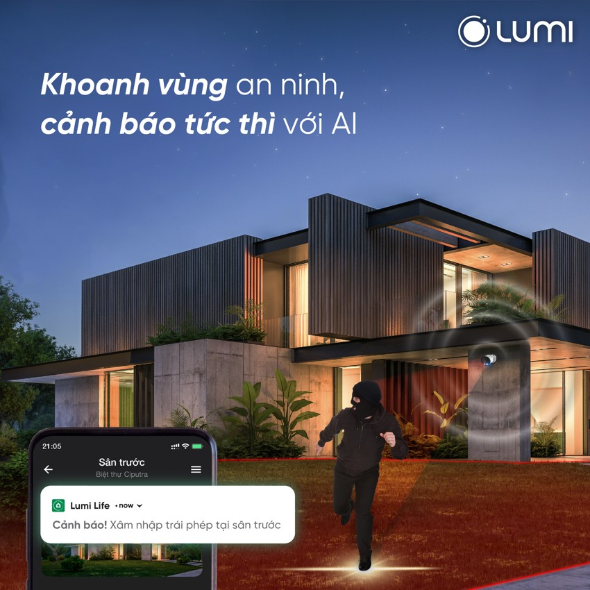
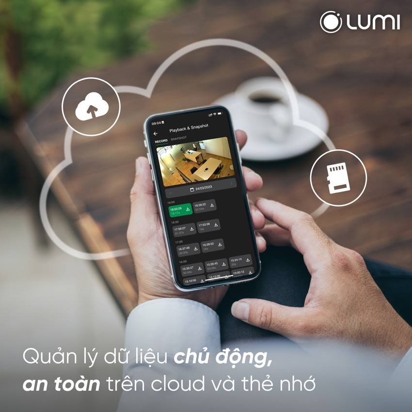

***Camera cảnh báo Lupa Turret** là dòng sản phẩm mới của Lumi kết hợp cùng Pavana, được các chuyên viên kỹ thuật nghiên cứu trong thời gian dài; nhằm mang đến cho người dùng một giải pháp an ninh tốt nhất hiện nay. Sản phẩm có tính năng giám sát, khoanh vùng an ninh và cảnh báo tức thời khi phát hiện xâm nhập trái phép khi kết hợp cùng trí tuệ nhân tạo AI trong Ai Camera Hub của Lumi. Camera cảnh báo Lupa Turret được coi là mảnh ghép quan trọng trong giải pháp an ninh Ai Camera Lupa mới ra mắt lần này . Để tìm hiểu kỹ hơn về sản phẩm này, hãy tham khảo ngay những thông tin dưới đây.*
## **1. Tính năng camera cảnh báo Lupa Turret**
### ***1.1. Camera live stream trực tuyến theo thời gian thực***
- Là mẫu [***camera thông minh***](https://lumi.vn/san-pham/camera-thong-minh) có thể kết nối với hệ thống mạng giúp người dùng có thể xem hình ảnh camera trực tuyến nội mạng và ngoại mạng.
- Để xem hình ảnh người cùng có thể thông qua những nền tảng trình duyệt web, VLC, RXCamView hoặc app Lumi Life.
- Lưu ý: Với trình duyệt web người dùng chỉ có thể xem live stream trên trình duyệt Internet Explorer. Với ứng dụng LumiLife khách hàng cần thêm vào AI Camera Hub mới có thể xem được Live Stream.
### ***1.2. Khả năng lưu trữ dung lượng lớn trên cloud hoặc thông qua thẻ nhớ micro SD*** 
- Camera cảnh báo Lupa Turret hỗ trợ lưu trữ hình ảnh, video thông qua thẻ nhớ theo chế độ toàn thời gian hoặc khi có chuyển động.
- Ngoài ra khi thêm sản phẩm vào AI Camera Hub người dùng có thể sử dụng lưu trữ đám mây các sự kiện phát hiện người trong vùng tiếp cận của camera.
### ***1.3. Màu sắc sinh động, sắc nét ngay cả trong điều kiện ban đêm***
- Camera Turret có thiết kế hệ thống đèn LED chiếu sáng vào ban đêm, có ống kính 90.4° @3.6mm rộng, cùng độ phân giải 2K giúp xem được hình ảnh có màu sắc nét.
- Khi xác nhận được không gian xung quanh đã tối, sản phẩm này sẽ tự động bật đèn LED để cải thiện ánh sáng và tăng độ nhận diện chính xác cho khu vực cần giám sát.
### ***1.4. Cảnh bảo còi và đèn hỗ trợ an ninh an toàn tuyệt đối***
- Với tính năng còi hú và đèn chớp cảnh báo khi có đột nhập sẽ giúp người dùng dễ dàng nhận biết có kẻ đột nhập đồng thời giúp dọa kẻ đột nhập bỏ chạy.
- Còi và đèn chớp có thể điều khiển theo ý muốn hoặc bật tắt tự động theo rule khi kết hợp Ai Camera Hub.

*Camera Lupa Turret cảnh bảo còi và đèn hỗ trợ an ninh an toàn tuyệt đối*
### ***1.5. Tích hợp với AI Camera Hub, tạo nên giải pháp an ninh toàn diện Ai Camera Lupa***
- Ngoài các tính năng được thiết kế riêng, sản phẩm camera cảnh báo Lupa Turret còn có thể tích hợp với bộ xử lý AI Camera Hub để hỗ trợ thêm nhiều các tính năng ưu việt khác.
- Đặc biêt, AI Camera Hub còn cung cấp thêm một số tính năng riêng chỉ áp dụng với Camera Lupa giúp tăng cường trải nghiệm của người dùng.
## **2. Ưu điểm của giải pháp an ninh Ai Camera Lupa**
### ***2.1. Khoanh vùng an ninh, cảnh báo tức thời nhờ trí tuệ nhân tạo AI***
- Bộ giải pháp an ninh AI Camera Lupa được tích hợp trí tuệ nhân tạo giúp phát hiện chuyển động của người chính xác tới 97%.
- Sau khi phát hiện người lạ, bộ giải pháp an ninh sẽ ngay tức thì phát âm thanh, chớp đèn xua đuổi kẻ trộm và gửi tin nhắn cảnh báo tới điện thoại người dùng.
- Từ đó gia chủ hoàn toàn có thể an tâm nhờ “người bảo vệ” thông minh biết tự đuổi trộm và ngăn chặn hành vi xâm nhập trái phép dù ở bất kỳ đâu.
### ***2.2. Hình ảnh màu sắc nét, sống động vào ban đêm***
- Các chuyên gia công nghệ của Lumi và Pavana đã nghiên cứu, tích hợp đèn LED hồng ngoại và LED ánh sáng trắng cho camera cảnh báo Lupa Turret.
- Nhờ đó cải thiện ánh sáng của khu vực theo dõi, tăng độ chính xác nhận diện người chuyển động, giúp người dùng xem được hình ảnh có màu vào ban đêm.
- Đặc biệt mắt thần ghi hình của bộ giải pháp v ống kính 90.4° @3.6mm rộng, cùng độ phân giải 2K giúp cho hình ảnh ghi được sắc nét, sống động vào cả ban ngày lẫn ban đêm
### ***2.3. Quản lý chủ động, an toàn nhờ khả năng lưu trữ lớn trên Cloud và thẻ nhớ***
- Bộ giải pháp an ninh AI Camera Lupa hỗ trợ lưu trữ theo 2 hình thức: Lưu trữ trong thẻ nhớ và Lưu trữ đám mây (Cloud).
- Với công nghệ P2P, bên cạnh app Lumi Life, giải pháp an ninh Ai camera Lumi cho phép xem hình ảnh camera trực tuyến nội mạng và ngoại mạng thông qua nhiều nền tảng như trình duyệt web, ứng dụng VLC.
- Bên cạnh tính năng quản lý chủ động, bộ giải pháp an ninh còn giúp gia chủ dễ dàng cài đặt thông số luồng hình ảnh, cấu hình mạng và cảnh báo còi đèn ở khắp mọi nơi thông qua ứng dụng LumiLife

*Camera cảnh báo Lupa Turret giúp quản lý chủ động, an toàn nhờ khả năng lưu trữ lớn trên Cloud và thẻ nhớ*
### ***2.4. Đa dạng lựa chọn gói giải pháp an ninh nhờ bộ sản phẩm Camera trong nhà, ngoài trời***
- Camera Lupa đều phải trải qua bài kiểm tra khắc nghiệt nhằm đảm bảo chất lượng bền bỉ và khả năng chống chịu với môi trường khắc nghiệt để giúp xua đuổi kẻ xâm nhập từ vòng ngoài ngôi nhà.
- Camera Lupa ngoài trời có chỉ số chống nước ở mức độ cao IP66. Người dùng có đa dạng lựa chọn gói giải pháp an ninh trong nhà hoặc ngoài trời theo nhu cầu sử dụng.
### ***2.5. Tích hợp dễ dàng vào nhà thông minh Lumi, gia tăng trải nghiệm sống tiện nghi***
- Bộ giải pháp Ai Camera Lupa là một phần quan trọng giúp hoàn thiện hệ thống Nhà thông minh toàn diện của Lumi.
- Bộ Ai Camera Lupa dễ dàng kết nối với các giải pháp smarthome, smart lighting giúp người dùng thiết lập ngữ cảnh dựa vào nhu cầu sinh hoạt của gia đình.
- Từ đó nâng cấp mức độ tự động hóa cho ngôi nhà và gia tăng trải nghiệm sống tiện nghi.
## **3. Ứng dụng của camera  Lupa Turret**
Với những ưu điểm nổi bật và tính năng vượt trội, camera Turret có thể ứng dụng cho rất nhiều khu vực khác nhau để bảo vệ và giám sát an ninh. Cụ thể:

- Các căn hộ chung cư
- Biệt thự, nhà vườn
- Các văn phòng công sở
- Các tòa nhà lớn
- Bệnh viện
- Trường học
- …

Có thể nói sự ra đời của ***Camera cảnh báo Lupa Turret*** sẽ tạo ra một xu hướng mới trong việc ứng dụng giải pháp an ninh thông minh và hiện đại. Để nhận được những thông tin tư vấn chi tiết về sản phẩm, hãy truy cập website Lumi.vn hoặc gọi ngay hotline để được hỗ trợ nhanh nhất.

**>> Xem thêm các sản phẩm trong hệ sinh thái Lumi khác:**

- [***Ổ cắm mặt kính cường lực chống xước***](https://lumi.vn/san-pham/o-cam-mat-kinh-cuong-luc-chong-xuoc.html)
- [***Ổ cắm 2 chấu + 1 hạt mạng***](https://lumi.vn/san-pham/o-cam-don-2-chau-1-hat-mang.html)
- [***Motor rèm cửa thông minh***](https://lumi.vn/san-pham/dong-co-rem-thong-minh.html)
