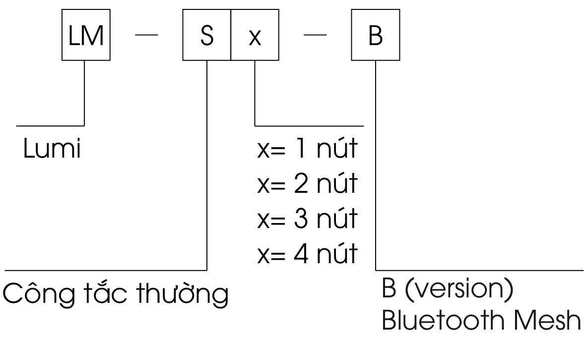

Công Tắc Bluetooth (2 chế độ)  có mã sản phẩm: LM-Sx-B. Trong đó:

Tham khảo thêm một số công tắc thông minh phổ biến khác của Lumi:

- [Công Tắc Cảnh BLE Mesh](https://lumi.vn/san-pham/cong-tac-canh-ble-mesh.html)
- [Công tắc cảm ứng viền cong Lumi](https://lumi.vn/?post_type=product&p=9026&preview=truee)
- [Công tắc cửa cuốn thông minh LM-Sx1-Rx2](https://lumi.vn/san-pham/cong-tac-thong-minh-cua-cuon/)
