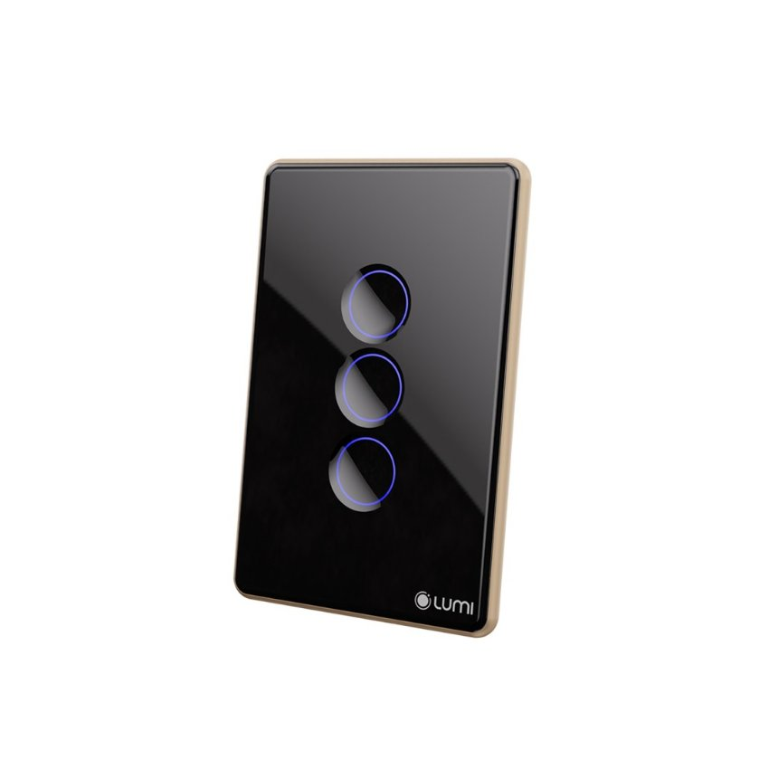
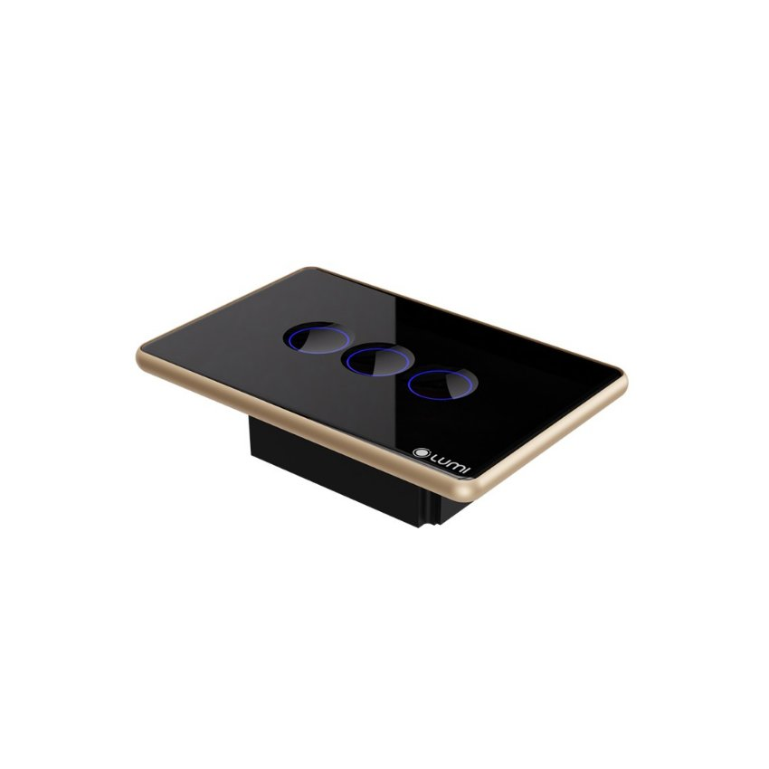

*Công tắc điều khiển rèm đơn thông minh có thiết kế hiện đại và sang trọng với mặt kính cường lực chống xước; giúp đảm bảo tính thẩm mỹ và tạo sự bền bỉ cho sản phẩm. Qua ứng dụng Lumi Life+ trên điện thoại; người dùng có thể mở hoặc đóng rèm mọi lúc, mọi nơi thông qua kết nối internet hoặc mạng LAN trong nhà. Trong bài viết này, chúng ta sẽ cùng nhau tìm hiểu về công nghệ và tính năng độc đáo của mẫu công tắc điều khiển rèm đơn thông minh này.*

Trình chơi Video

00:00

00:32

***Video sử dụng công tắc rèm đơn***
## **1. Phân loại công tắc thông minh rèm đơn**
Công tắc điều khiển rèm đơn Lumi gồm các loại:

- Màu sắc: Đen và trắng
- Hình dáng: Hình chữ nhật và hình vuông
- Số nút cảm ứng: 3 nút (mở, dừng, đóng)
- Theo hình dáng:
  - Vuông (DxRxC): 95 x 95 x 31.5mm
  - Chữ nhật (DxRxC): 121.5 x 80 x 31.5mm

*Công tắc điều khiển rèm đơn dọc*
## **2. Đặc điểm công tắc điều khiển rèm đơn**
- Công tắc điều khiển rèm đơn nằm trong bộ công tắc cảm ứng thông minh của Lumi nên thiết kế vẫn được giữ nguyên như các công tắc thông minh khác.
- Sử dụng công nghệ cảm ứng điện dung. Mặt kính cường lực chống xước, chống va đập tốt.
- Kết hợp với vòng tròn tỏa sáng LED bao quanh, kèm theo logo Lumi ở góc phải tạo nên điểm nhấn cho thương hiệu và sự lôi cuốn cho sản phẩm.
- Đèn LED luôn được tỏa sáng dù bật hay tắt; giúp người dùng sẽ thấy ngay chiếc công tắc dù là trong đêm tối, làm cho căn nhà trở nên tinh tế, sang trọng và hiện đại.
## **3. Chức năng công tắc thông minh cho rèm đơn**
- Công tắc điều khiển rèm đơn là công tắc cảm ứng thông minh. Chỉ cần chạm nhẹ vào biểu tượng hình tròn trên bề mặt kính là có thể điều khiển đóng/mở thiết bị rèm đơn (rèm cửa 1 lớp) – rèm kéo ngang.
- Bên cạnh đó, với công nghệ kết nối không dây Zigbee, công tắc thông minh của Lumi có thể được điều khiển từ bất cứ đâu. Ngay cả khi bạn không ở nhà thông qua các thiết bị di động có kết nối Wi-Fi, 3G.
- Khi được tích hợp trong hệ thống nhà thông minh Lumi, thiết bị công tắc rèm đơn LM-S3C có thể kết nối với các thiết bị khác như cảm biến chuyển động, cảm biến cửa thông qua bộ điều khiển trung tâm.
- Thiết bị điều khiển rèm đơn thông minh có thể nhận lệnh điều khiển từ ứng dụng Lumi Life+ trên các thiết bị như điện thoại, máy tính bảng hoặc máy tính khi có kết nối tới Wi-Fi hoặc 3G.
- Nhờ đó người dùng có thể hoạt động hoàn toàn tự động theo kịch bản, lịch được cài đặt từ phần mềm hay hoạt động theo hệ thống phòng thông minh.

*Công tắc cho rèm đơn ngang, đen, lõm*
## **4. Trạng thái hoạt động của công tắc điều khiển rèm đơn**
Trên mặt công tắc rèm đơn có 3 nút, tương ứng với nút: mở, dừng, đóng.

- Khi rèm đơn mở, đèn chỉ thị nút Mở sẽ sáng đỏ lên.
- Sau khi rèm đơn mở hoàn toàn nút Mở sẽ sáng xanh.
- Khi đóng rèm đơn, đèn chỉ thị nút Đóng sẽ sáng đỏ lên.
- Sau khi rèm đơn đóng hoàn toàn nút Đóng sẽ sáng xanh.
- Rèm đơn khi nhấn dừng, nút Dừng sẽ tương tự như trên.

Người dùng có thể lắp vào các hệ thống rèm để điều khiển thông qua smartphone và hiển trị trạng thái trên app. Có thể điều khiển rèm cửa từ xa mà không cần kéo tay, đơn giản, tiện lợi.
## **5. Ứng dụng công tắc rèm đơn**
- Đặt lịch, bật tắt hẹn giờ: Chế độ đặt thời gian đối với từng thiết bị, bật tắt theo giờ, theo ngày, theo tuần. Có thể setup các ngữ cảnh.
  - Ví dụ: 5h30 sáng rèm cửa tự động mở ra chào đón một ngày mới, 10h tối rèm cửa tự động đóng vào kết thúc một ngày. Căn phòng của bạn trở nên thoái mái và tiện nghi hơn rất nhiều.
- Với giải pháp nhận dạng giọng nói của Lumi, bạn điều khiển được hệ thống rèm cửa bằng chính “giọng nói quyền năng” của mình.
  - Ví dụ: khi bạn nói câu lệnh*“OK GOOGLE, OPEN CURTAIN; Hey SIRI, OPEN CURTAIN”* tất cả rèm cửa trong ngôi nhà sẽ hoàn toàn mở hoặc đóng, tùy theo câu lệnh.

Sử dụng công tắc rèm đơn hạn chế tiếp xúc điện, dễ sử dụng đối với người cao tuổi. Nhà thông minh điều khiển bằng giọng nói đang là sự lựa chọn lý tưởng cho mọi gia đình Việt. Tìm hiểu thêm về động cơ rèm thông minh Lumi [**tại đây**](https://lumi.vn/dieu-khien-rem-tu-dong.html). Bên cạnh đó người dùng có thể tham khảo thêm một số mẫu công tắc nổi bật khác của Lumi như:

- [***Công tắc điều khiển rèm đôi***](https://lumi.vn/san-pham/cong-tac-dieu-khien-rem-doi.html)
- [***Công tắc cảnh Lumi***](https://lumi.vn/san-pham/cong-tac-canh-ble-mesh.html)
- [***Công tắc cửa cuốn Lumi***](https://lumi.vn/san-pham/cong-tac-cua-cuon-thong-minh.html)
