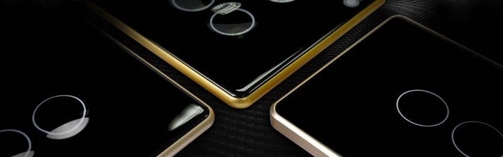
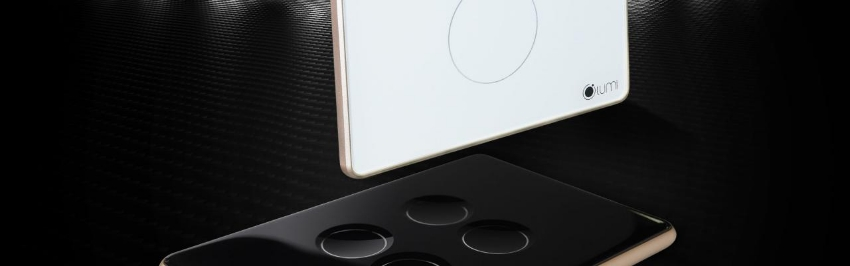
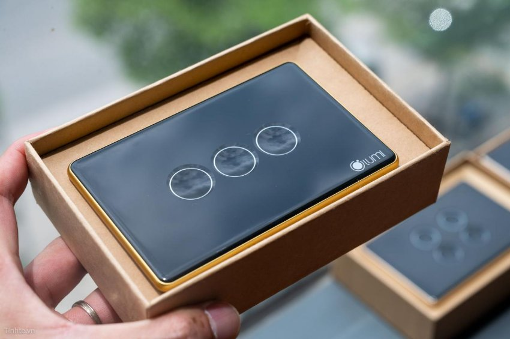
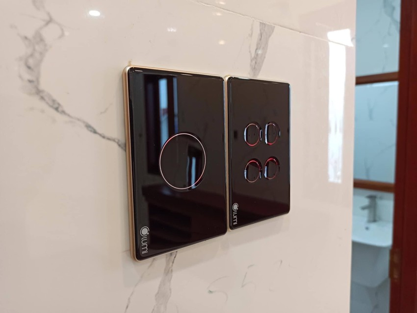

*Công tắc cảm ứng thông minh kính lõm đặc biệt với việc tích hợp công nghệ tiên tiến, cho phép bạn điều khiển ánh sáng chỉ bằng một chạm nhẹ. Không còn cần nhấn nút hoặc xoay cần, công tắc tự động nhận biết sự tiếp xúc của tay và kích hoạt ánh sáng một cách tức thời. Tìm hiểu chi tiết hơn về sản phẩm thông qua những thông tin dưới đây.*
## **1. Công tắc cảm ứng thông minh kính lõm Lumi**
- Công tắc cảm ứng thông minh kính lõm là dòng sản phẩm được Lumi cho ra mắt vào tháng 1/2020. Phiên bản màu đen, kích thước hình vuông hoặc chữ nhật, có từ 1 đến 4 nút cảm ứng.
- Công tắc diện cảm ứng thông minh kính lõm là công tắc được sử dụng trong [hệ sinh thái nhà thông minh Lumi](https://lumi.vn/Work-with-lumi.html). Dùng để điều khiển các thiết bị đèn điện, điều hòa,…
- Với công nghệ truyền thông Zigbee được tích hợp vào sản phẩm, công tắc cảm ứng kính lõm phiên bản 2020 cho phép người dùng có thể điều khiển từ xa bằng Smartphone, Tablet ở bất kỳ đâu chỉ cần có kết nối Internet.

*Công tắc cảm ứng thông minh kính lõm Lumi*
## **2. Tính năng của công tắc thông minh kính lõm**
Là mẫu [***công tắc thông minh***](https://lumi.vn/cong-tac-thong-minh/) hiện đại kế thừa những điểm mạnh vượt trội của các loại công tắc thông minh cũ. Chứa đựng những cải tiến tinh xảo bắt kịp xu hướng thiết kế của thời đại và tối ưu hóa trải nghiệm người dùng. Lắp đặt và sử dụng công tắc nhà thông minh thay cho công tắc thường. Bạn có thể điều khiển các thiết bị điện, cụ thể:

- Bật/ tắt thiết bị bằng cách chạm nhẹ thông thường trên nút công tắc.
- Điều khiển từ xa, sử dụng Smartphone để bật/ tắt, điều chỉnh đèn điện, điều hòa, tivi,… hoặc đóng/ mở rèm cửa, cửa cuốn, cửa cổng…
- Ra lệnh điều khiển các thiết bị điện bằng giọng nói.
- Có thể kết nối trực tiếp với cảm biến thông minh để trở thành công tắc cảm biến thông minh. Khi tích hợp xong công tắc sẽ tự động bật tắt dựa vào chuyển động của người dùng.

Xem thêm sản phẩm bán chạy của Lumi: [***Công tắc chiết áp thông minh***](https://lumi.vn/san-pham/cong-tac-chiet-ap.html)
## **3. Ưu điểm của công tắc cảm ứng thông minh kính lõm**
### **3.1. Thiết kế sang trọng, tinh xảo, đẳng cấp**
- Nằm trong bộ sản phẩm giải pháp Lumi nhà thông minh, thiết kế của dòng sản phẩm công tắc cảm ứng thông minh kính lõm vẫn giữ được vẻ ngoài sang trọng, tinh tế.
- Mặt kính được chú trọng gia công tỉ mỉ, đảm bảo sự tinh xảo trên từng đường nét thiết kế vượt trội hơn hẳn so với các loại công tắc thông minh khác.
- Bên cạnh mặt kính sang chảnh tôn lên sự đẳng cấp của ngôi nhà, viền nhôm Anode cũng là một yếu tố ghi điểm của dòng sản phẩm công tắc điện cảm ứng thông minh kính lõm không chỉ về mặt thẩm mỹ mà còn về sự bền bỉ.

*Công tắc cảm ứng thông minh Lumi có thiết kế đẳng cấp, sang trọng*

- Viền công tắc cảm ứng thông minh kính lõm được xử lý bằng công nghệ Anode hóa; tạo ra một lớp vỏ chống oxi hóa tuy mỏng nhưng có độ bền cực cao, chỉ đứng sau kim cương.
- Công nghệ Anode cũng đã được sử dụng trong việc chế tạo linh kiện cao cấp, vỏ xe ô tô của các hãng lớn thế giới, vỏ của các vệ tinh nhân tạo…
- Trải qua quá trình xử lý hóa học, viền nhôm của dòng công tắc mới đã đạt được độ sáng, bóng nhưng vẫn giữ được độ nhám tạo cảm giác sang trọng khi được lắp đặt trong nhà.
### **3.2. An toàn sử dụng và tối ưu hóa trải nghiệm người dùng**
- Khi sử dụng bật/ tắt thiết bị, người dùng sẽ tiếp xúc bề mặt kính cảm ứng của công tắc. Với cấu tạo bên trong chắc chắn, nhiều lớp bảo vệ. Sử dụng công nghệ cảm ứng điện dung. Người dùng nếu thao tác bật/ tắt trên công tắc chỉ tiếp xúc với bề mặt kính không dẫn điện. Đảm bảo an toàn cho cả nhà, kể cả trẻ nhỏ hay người già.
- Bên cạnh đó, giữ nguyên đặc điểm thiết kế dải đèn LED chạy xung quanh viền nút bấm màu xanh dương (khi thiết bị đang tắt) và đỏ (khi thiết bị đang được bật) giúp cho việc tìm kiếm công tắc trong bóng tối trở nên dễ dàng và bảo vệ thị lực của người dùng.
- Ngoài việc bật/ tắt trực tiếp, người dùng hoàn toàn có thể sử dụng Smartphone/ Tablet có kết nối Internet để điều khiển các thiết bị thông minh trong nhà, hoặc sử dụng giọng nói quyền năng để các thiết bị tự động thực hiện yêu cầu của mình.
### **3.3. Dễ dàng lắp đặt và bảo hành linh hoạt**

*Công tắc điện cảm ứng thông minh dễ dàng lắp đặt và bảo hành*

Đồng bộ về chính sách và thời gian lắp đặt với các thiết bị khác trong nhà thông minh Lumi. Dòng công tắc mới của Lumi cũng sở hữu những bộ tiện ích thống nhất:

- Dễ dàng lắp đặt, thi công chỉ trong 1 ngày.
- Dễ dàng tích hợp với cảm biến để trở thành công tắc cảm biến thông minh.
- Điều khiển được bằng Smartphone với app Lumi Life.
- Tương thích với kích thước đế âm và hạ tầng điện Việt Nam.
- Chính sách bảo hành 24 tháng.
## **4. Cách thức hoạt động công tắc điện cảm ứng thông minh**
Công tắc thông minh kính lõm hoạt động theo sự điều khiển của bộ điều khiển trung tâm (HC). Cách thức hoạt động của thiết bị sẽ được thể hiện qua ví dụ sau:

- Khi người dùng phát lệnh “tắt đèn” bằng cách chạm vào nút đèn trên app điện thoại.
- Lệnh này sẽ được gửi tới bộ điều khiển trung tâm thông qua sóng Zigbee.
- HC sẽ điều khiển công tắc thông minh bật/ tắt thiết bị đèn đúng như yêu cầu của chủ nhà.
## **5. Ứng dụng của công tắc cảm ứng chạm tay kính lõm**
Công tắc cảm ứng là một thiết bị hiện đại và tiện lợi trong cuộc sống hàng ngày, có nhiều ứng dụng đa dạng. Dưới đây, chúng ta sẽ tìm hiểu về ba ứng dụng quan trọng của công tắc cảm ứng chạm tay:
### ***5.1. Làm công tắc cảm ứng đèn LED***
- Công tắc cảm ứng chạm tay thường được sử dụng để điều khiển đèn LED trong ngôi nhà hoặc văn phòng.
- Với tính năng chạm nhẹ, bạn có thể bật hoặc tắt đèn một cách dễ dàng mà không cần sử dụng nút bấm truyền thống; tạo nên sự tiện lợi và hiện đại trong việc điều khiển ánh sáng.

*Ứng dụng của công tắc cảm ứng chạm tay kính lõm*
### ***5.2. Kết nối với công tắc cảm biến bật tắt đèn***
- Công tắc cảm ứng chạm tay cũng có khả năng kết nối với các công tắc cảm biến bật tắt đèn.
- Khi bạn tiến vào một phòng hoặc khu vực, công tắc cảm biến sẽ phát hiện sự hiện diện của bạn và tự động bật đèn và sẽ đồng bộ với trạng thái của công tắc cảm ứng.
### ***5.3. Làm công tắc bật tắt các thiết bị khác***
- Công tắc cảm ứng chạm tay còn có thể được sử dụng để bật tắt các thiết bị khác trong nhà hoặc văn phòng, như quạt, máy lạnh, hoặc thiết bị âm thanh.
- Sự linh hoạt của công tắc này cho phép bạn tùy chỉnh và điều khiển nhiều thiết bị từ một điểm duy nhất, làm tăng sự tiện lợi và quản lý hiệu quả trong không gian sống của bạn.
## **5. Mua công tắc cảm biến thông minh Lumi ở đâu?**
- Để mua công tắc thông minh kính lõm của Lumi, khách hàng có thể mua Lumi tại hệ thống 135 đại lý của Lumi trên toàn quốc.
- Xem bài viết review chân thực [“Trên tay công tắc kính lõm của Lumi”](https://tinhte.vn/thread/tren-tay-cong-tac-kinh-lom-cua-lumi.3177168/) để hiểu rõ hơn về sản phẩm công tắc Lumi.

Không chỉ dừng lại ở tính năng cảm ứng, công tắc thông minh kính lõm còn có khả năng kết nối với hệ thống nhà thông minh của bạn. Bạn có thể điều chỉnh độ sáng, lịch trình hoạt động và thậm chí tạo các hiệu ứng ánh sáng độc đáo, tùy thuộc vào sở thích và nhu cầu của mình. Để trải nghiệm ngay sản phẩm này, hãy gọi hotline để nhân viên tư vấn hỗ trợ nhanh nhất.

Xem thêm các mẫu công tắc điều khiển rèm thông minh của Lumi:

- [***Công tắc cảm ứng điều khiển rèm đơn***](https://lumi.vn/san-pham/cong-tac-dieu-khien-rem-don.html)
- [***Công tắc cảm ứng điều khiển rèm đôi***](https://lumi.vn/san-pham/cong-tac-dieu-khien-rem-doi.html)
