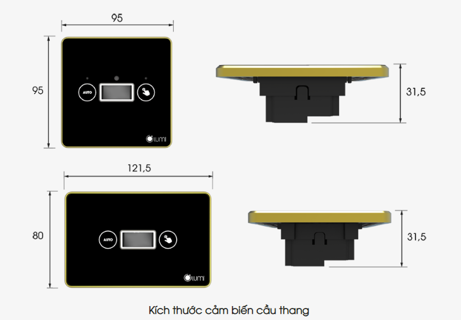
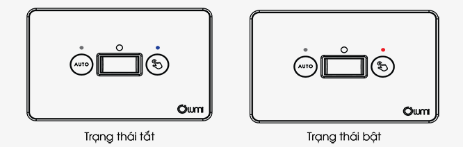
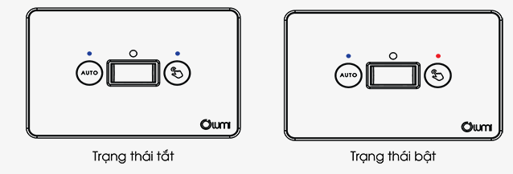
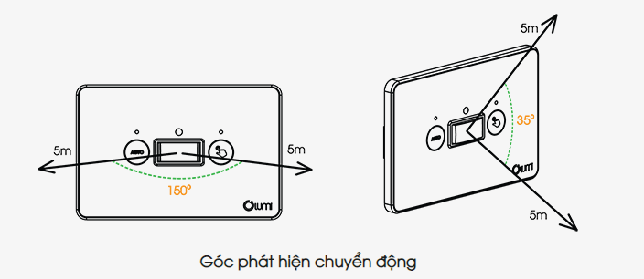

*g tắc cầu thang thông minh tích hợp cảm biến là một sản phẩm 2 trong 1, tích hợp thiết bị cảm biến vào chính chiếc công tắc thông minh dành cho cầu thang. Mẫu công tắc thông minh 2 chiều này hỗ trợ tự động hẹn giờ, bật/tắt đèn cầu thang. Với công nghệ cảm ứng điện dung và giao thức truyền thông không dây Zigbee giúp cho sản phẩm đồng bộ cùng các giải pháp [nhà thông minh Lumi](https://lumi.vn/).*
## **1. Tính năng của công tắc cầu thang tích hợp cảm biến**
**Công tắc đèn cầu thang** tích hợp hợp cảm biến 2N1 có 3 cách điều khiển: Điều bằng tay, tự động và điều khiển qua app Lumi Life.

**1.1. Chế độ điều khiển bằng tay**

Khi tắt chế độ Auto trên mặt công tắc thì công tắc đèn cầu thang sẽ điều khiển bằng cách chạm vào nút có hình bàn tay để bật/tắt đèn và điều khiển qua app Lumi life

**1.2. Chế độ điều khiển tự động**

- Nút Auto trên công tắc hiện màu xanh mắt cảm biến chuyển động hoạt động.
- Khi mắt cảm biến phát hiện chuyển động đèn cầu thang tự động bật sáng. Khi không còn chuyển động trong vùng phát hiện đèn cầu thang tự động tắt.

- Cảm biến chuyển động cầu thang có 2 góc quét phát hiện chuyển động: góc 1 theo chiều ngang: 150° và góc 2 theo chiều dọc: 35°
- Với mong muốn tăng thêm sự tiện lợi, bộ sản phẩm còn có một mắt che cảm biến đi kèm giúp thu hẹp phạm vi góc phát hiện chuyển động 1 còn một nửa là 75°.

\>> Tham khảo thêm sản phẩm công tắc bán chạy nhất: [***Công tắc cảm ứng kính phẳng viền nhôm***](https://lumi.vn/san-pham/cong-tac-cam-ung-kinh-phang.html)
## **2. Ưu điểm của công tắc cầu thang không dây tích hợp cảm biến**
### **2.1. Công tắc cầu thang không dây thiết kế sang trọng, tinh tế**
- Công tắc thông minh đảo chiều thiết kế mặt kính cường lực chống xước, kết hợp viền nhôm nguyên khối giống với bộ công tắc cảm ứng Lumi. Sản phẩm tích hợp cảm biến sẽ làm cho ngôi nhà hoàn hảo hơn về mặt thẩm mỹ.
- Sản phẩm có 2 loại công tắc vuông, chữ nhật để cho khách hàng dễ dàng chọn lựa sản phẩm phù hợp.
### **2.2. Dễ dàng lắp đặt và bảo hành linh hoạt**
Đồng bộ về chính sách và thời gian lắp đặt với các thiết bị khác trong nhà thông minh Lumi, dòng công tắc cầu thang không dây mới của Lumi cũng sở hữu những bộ tiện ích thống nhất.

- Dễ dàng lắp đặt, thi công chỉ trong 1 ngày
- Điều khiển được bằng Smartphone với app Lumi Life
- Tương thích với kích thước đế âm và hạ tầng điện Việt Nam
- Chính sách bảo hành 24 tháng
## **3. Ứng dụng công tắc cầu thang thông minh**
Với những tính năng vượt trội công tắc tích hợp cảm biến cầu thang được ứng dụng như sau:

- Điều khiển từ xa: Bật/tắt đèn cầu thang dễ dàng và an toàn.
- Lịch trình linh hoạt: Tự động tắt/mở đèn theo thời gian mong muốn.
- Tiết kiệm năng lượng: Tắt đèn khi không cần thiết, giúp giảm hóa đơn điện và bảo vệ môi trường.
- Điều khiển bằng giọng nói: Sử dụng Google Assistant, Alexa hoặc Siri để điều khiển đèn cầu thang một cách dễ dàng.
- Tiện ích và an toàn: Tránh rủi ro trong việc tắt đèn tại cầu thang và tạo sự thuận tiện cho cuộc sống hàng ngày.

Hãy liên hệ ngay với chúng tôi theo số hotline 0904.665.965 để được tư vấn thêm về sản phẩm công tắc cầu thang không dây tích hợp cảm biến. Đội ngũ tư vấn sẵn sàng phục vụ 24/7.

***Một số mẫu công tắc nổi bật có thể bạn sẽ thích:***

- [***Công tắc thông minh kính lõm***](https://lumi.vn/san-pham/cong-tac-cam-ung-kinh-lom.html)
- [***Công tắc chiết áp thông minh Lumi***](https://lumi.vn/san-pham/cong-tac-chiet-ap.html)
