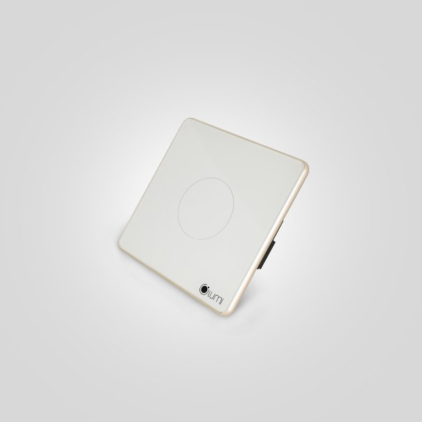

*Công tắc chiết áp thông minh Lumi không chỉ là một sản phẩm thông minh, mà còn là thành phần tuyệt vời cho hệ sinh thái [**nhà thông minh**](https://lumi.vn/) hiện đại mới. Với mặt kính cường lực chống xước kết hợp viền nhôm nguyên khối, thiết bị này không chỉ đẹp mắt mà còn rất bền bỉ. Thiết kế tinh tế và hiện đại của công tắc cảm ứng thông minh này chắc chắn sẽ làm cho không gian của bạn trở nên sang trọng hơn. Tìm hiểu chi tiết hơn về sản phẩm trong bài viết dưới đây.*
## **1. Đặc điểm công tắc chiết áp thông minh**
- Công tắc chiết áp nằm trong bộ công tắc thông minh Lumi nên thiết kế vẫn được giữ nguyên như các công tắc thông minh khác. Sử dụng công nghệ cảm ứng điện dung.
- Mặt kính cường lực chống xước, chống va đập tốt. Kết hợp với vòng tròn tỏa sáng LED bao quanh, kèm theo logo Lumi ở góc phải tạo nên điểm nhấn cho thương hiệu và sự lôi cuốn cho sản phẩm.
- Đồng thời, đèn LED luôn được tỏa sáng dù bật hay tắt. Vì vậy, bạn sẽ thấy ngay chiếc công tắc dù là trong đêm tối. Làm cho căn nhà trở nên tinh tế, sang trọng và hiện đại.

\>> Xem thêm sản phẩm công tắc cao cấp: [***Công tắc cảnh thông minh***](https://lumi.vn/san-pham/cong-tac-canh-ble-mesh.html)
## **2. Phân loại sản phẩm**
Công tắc chiết áp Lumi gồm các loại:

- Màu sắc: Đen và trắng
- Hình dáng: Hình chữ nhật và hình vuông
- Số nút cảm ứng: 1 nút
- Theo hình dáng:
  - Vuông (DxRxC): 95 x 95 x 31.5mm
  - Chữ nhật (DxRxC): 121.5 x 80 x 31.5mm
## **3. Công tắc chiết áp (Dimmer) là gì?**
- **Công tắc chiết áp Lumi** hay **công tắc** **Dimmer** là thiết bị điện được sử dụng với mục đích bật/ tắt đèn và giúp điều khiển thay đổi độ sáng của đèn.
- Để thay đổi độ sáng của đèn chiết áp bằng cách chạm nhẹ trên bề mặt kính. Tăng độ sáng bằng cách xoay theo chiều kim đồng hồ và xoay ngược chiều kim đồng hồ để giảm độ sáng của đèn.
- Dimmer hoạt động dựa trên sự điều chỉnh của điện trở từ đó có thể thay đổi được cường độ dòng điện giúp điều chỉnh độ sáng của các thiết bị chiếu sáng.
- Công tắc chiết áp được sử dụng trong các thiết bị dùng để điều chỉnh độ sáng đèn với đa dạng các loại đèn (đèn chùm, đèn LED,…).

\>> Xem thêm sản phẩm: [***Công tắc điều khiển rèm đơn***](https://lumi.vn/san-pham/cong-tac-dieu-khien-rem-don.html)
## **4. Tính năng của công tắc Dimmer**
- Với công nghệ kết nối không dây Zigbee, công tắc chiết áp của Lumi có thể được điều khiển từ bất cứ đâu. Ngay cả khi bạn không ở nhà thông qua các thiết bị di động có kết nối Wi-Fi, 3G.
- Khi được tích hợp trong hệ thống nhà thông minh, thiết bị Dimmer LM-S1D có thể kết nối với các thiết bị khác như cảm biến chuyển động, cảm biến cửa thông qua bộ điều khiển trung tâm.
- Thiết bị LM-S1D có thể nhận lệnh điều khiển từ ứng dụng Lumi Life trên các thiết bị như điện thoại, máy tính bảng hoặc máy tính khi có kết nối tới Wi-Fi hoặc 3G.
- Ngoài ra, Dimmer có thể hoạt động hoàn toàn tự động theo kịch bản. Lịch được cài đặt từ phần mềm hay hoạt động theo hệ thống phòng thông minh.
- Lắp đặt đèn LED âm trần, đèn chùm đèn dimmer để điều chỉnh lượng ánh sáng tốt nhất. Có thể thay đổi được cường độ chiếu sáng của đèn để dùng vào các mục đích của mọi người.

\>> Xem thêm sản phẩm: [***Công tắc thông minh điều khiển rèm đôi***](https://lumi.vn/san-pham/cong-tac-dieu-khien-rem-doi.html)
## **5. Ứng dụng của công tắc chiết áp thông minh**
Ứng dụng của công tắc Dimmer là thay đổi độ sáng của đèn. Chính vì vậy mẫu công tắc này thường được ứng dụng tại các không gian như:

- Thay đổi ánh sáng đèn chùm trong phòng, hoặc đèn ngủ tạo cảm giác dễ chịu cho mắt.
- Thay đổi màu sắc đèn trong rạp hát, sân khấu.
- Sử dụng cho đèn tại các không gian như quán cafe, nhà hàng, khách sạn
- ….

Bên cạnh đó người dùng có thể đặt lịch, bật tắt hẹn giờ để đặt thời gian đối với từng thiết bị, bật tắt theo giờ, theo ngày, theo tuần. Ngoài ra người dùng cũng có thể thay đổi trực tiếp cường độ ánh sáng trên điện thoại.

Để đèn LED hoạt động tốt, không ảnh hưởng tới tuổi thọ cũng như chất lượng ánh sáng thì nguồn điện cung cấp cho đèn vô cùng quan trọng. Các nhà sản xuất luôn cân nhắc và đã cho ra đời các loại chip LED; để tăng giảm độ sáng của đèn tiện lợi và hiệu quả hơn. Dimmer được dùng để đảm bảo điện áp đúng yêu cầu của đèn LED, đồng thời giúp ổn định được nguồn điện và tuổi thọ của bóng đèn LED.

Trong bài viết này, chúng ta đã cùng nhau khám phá công tắc chiết áp thông minh LM – S1D của Lumi. Từ thiết kế độc đáo và sang trọng, công nghệ cảm ứng điện dung và giao thức truyền thông Zigbee, đến khả năng điều khiển tiện lợi và trải nghiệm tối ưu hàng ngày. Để nhận thông tin tư vấn chi tiết về sản phẩm này, hãy liên hệ ngay hotline của Lumi để nhân viên tư vấn hỗ trợ nhanh chóng và chính xác nhất.
