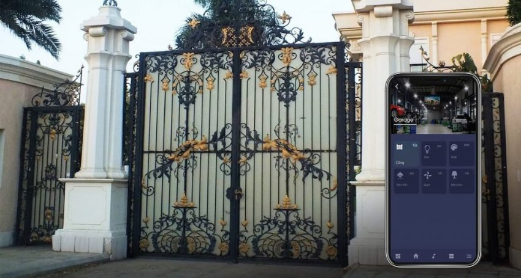
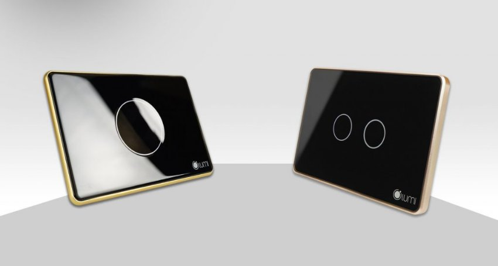

*Công tắc cổng thông minh là một trong những mẫu [**công tắc thông minh Lumi**](https://lumi.vn/cong-tac-thong-minh/) cao cấp, cho phép đóng/mở công tự động thông qua smartphone. Khi đi làm về đến cổng nhà, bạn không cần phải xuống xe mở cửa mà chỉ cần một chiếc Smartphone mở app lumi life ra lệnh mở cổng là cổng nhà đã được mở nhanh chóng giúp cho người dùng tận hưởng cuộc sống tiện nghi và hiện đại.*
## **1. Đặc điểm của công tắc cổng thông minh**
- Công tắc cổng thông minh là một trong những sản phẩm công tắc cảm ứng thông minh của Lumi.
- Công tắc cổng thông minh giúp người dùng điều khiển thiết bị cổng trong hệ thống nhà thông minh bằng Smartphone.
- Người dùng có thể theo dõi được trạng thái hiện tại của cổng giúp cuộc sống tiện nghi và thoải mái hơn.
## **2. Tính năng của công tắc cổng thông minh**
- Chỉ cần một chiếc Smartphone bạn có thể điều khiển hầu hết các thiết bị điện trong nhà và thiết bị cổng là một trong những giải pháp người dùng rất quan tâm đang sử dụng.
- Giải pháp này giúp người dùng điều khiển thiết bị cửa cổng mọi lúc, mọi nơi và có thể biết được trạng thái của thiết bị cửa cổng đáng đóng hay mở.
- Giải pháp này giúp người dùng cảm thấy an toàn, tiện lợi

*Sử dụng app lumi life để mở/ đóng cổng*

Là mẫu công tắc điện thông minh sử dụng truyền thông không dây Zigbee làm giao thức giao tiếp. Xử lý và gửi lệnh, công tắc thông minh kết nối với điện thoại của bạn thông qua bộ điều khiển trung tâm để thực hiện lệnh điều khiển.

- Điều khiển cửa cổng từ xa khi bạn không có ở nhà
- Cài đặt lịch hẹn giờ mở và đóng cổng theo lịch sinh hoạt của gia đình
- Theo dõi được trạng thái đóng cổng hay mở cổng để kiểm soát trạng thái cổng
## **3. Ưu điểm của công tắc cảm ứng cửa cổng**

*Ưu điểm của công tắc cảm ứng cửa cổng*
### **3.1. Thiết kế kiểu dáng theo phong cách hiện tại, tính tế và sang trọng**
- Công tắc cổng thông minh Lumi là công tắc cảm ứng thông minh, sử dụng mặt kính cường lực, chống xước, chống va đập tốt.
- Công tắc cảm ứng này kết hợp với vòng tròn tỏa sáng LED bao quanh, kèm theo logo Lumi ở góc phải tạo nên điểm nhấn cho thương hiệu và sự lôi cuốn cho sản phẩm.
- Đặc biệt đèn LED luôn được tỏa sáng dù bật hay tắt, nên bạn sẽ thấy ngay chiếc công tắc dù là trong đêm tối.
- Công tắc cảm ứng cổng có 2 loại: loại công tắc cảm ứng 1 nút và loại công tắc cảm ứng 2 nút với chức năng mở/dừng/đóng. Tùy thuộc vào nhu cầu sử dụng của người dùng và có nhiều phiên bản khác nhau để người dùng có thể lựa chọn phù với không gian của ngôi nhà.
### **3.2. Hệ thống cầu nối an toàn, hiệu quả**
- Bên trong công tắc Lumi là hệ thống ReLay có chức năng đóng/cắt nguồn điện.
- Vỏ ngoài làm bằng chất liệu nhựa PP, có khả năng chống cháy.
- Sản phẩm được kiểm tra và test kỹ càng trước khi xuất xưởng nên tuyệt đối không xảy ra trường hợp chập cháy.
- Đặc biệt, công tắc cảm ứng của Lumi được sử dụng công nghệ điện dung nên rất an toàn kể cả khi tay ướt chạm vào công tắc điện.
### **3.3. Dễ dàng lắp đặt và bảo hành linh hoạt**
- Đồng bộ về chính sách và thời gian lắp đặt với các thiết bị khác trong nhà thông minh Lumi, công tắc cảm ứng cửa cổng cũng hưởng những chính sách như các công tắc khác của Lumi
- Dễ dàng lắp đặt, thi công chỉ trong 1 ngày
- Điều khiển được bằng Smartphone với app điều khiển công tắc thông minh Lumi Life
- Tương thích với kích thước đế âm và hạ tầng điện Việt Nam
- Hệ thống đại lý phủ rộng toàn quốc giúp bảo hành nhanh chóng
- Chính sách bảo hành 24 tháng
## **4. Cách thức hoạt động**
- Công tắc cổng thông minh sẽ hoạt động theo sự điều khiển của bộ điều khiển trung tâm (Home Controller).
- Khi người dùng về gần đến nhà, phát lệnh” mở cổng” bằng cách mở app Lumi life. Lệnh sẽ được gửi tới bộ điều khiển trung tâm thông qua sóng Zigbee.
- Từ đó, bộ điều khiển trung tâm điều khiển công tắc cảm ứng cửa cổng mở cửa như đúng yêu cầu của người dùng.
- Trên thị trường có rất nhiều loại cổng dạng kéo ngang, 1 cánh hay 2 cánh. Tùy nhu cầu của người dùng muốn điều khiển đồng thời 2 cánh hay muốn mở 1 cánh thì sẽ sử dụng công tắc cảm ứng 1 nút hay 2 nút.

Trên đây là những thông tin chi tiết về mẫu công tắc cổng thông minh Lumi hiện đai. Ngoài sản phẩm công tắc cảm ứng thông minh này, mọi người cũng có thể xem thêm một số mẫu sản phẩm nổi bật khác như:

- [***Công tắc cầu thang thông minh tích hợp cảm biến***](https://lumi.vn/san-pham/cong-tac-cau-thang-tich-hop-cam-bien-2-trong-1.html)
- [***Công tắc thông minh kính phẳng viền nhôm***](https://lumi.vn/san-pham/cong-tac-cam-ung-kinh-phang.html)
- [***Công tắc cảm ứng kính lõm***](https://lumi.vn/san-pham/cong-tac-cam-ung-kinh-lom.html)
