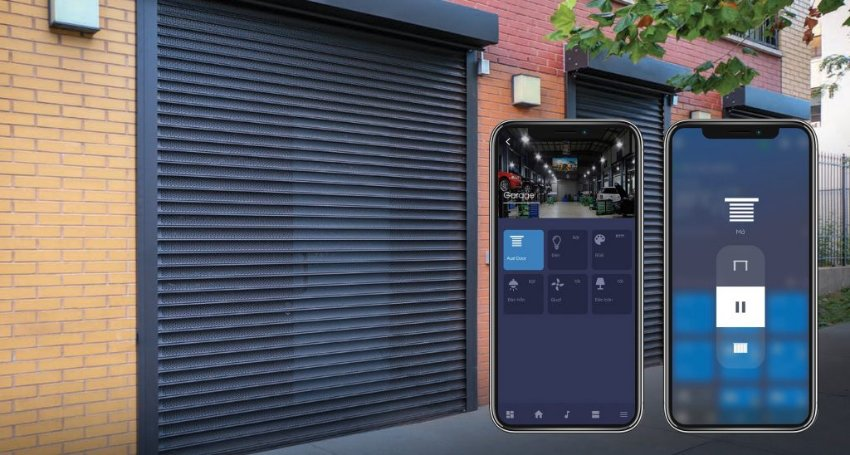
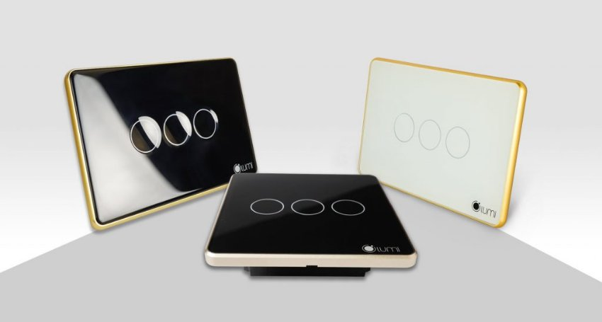
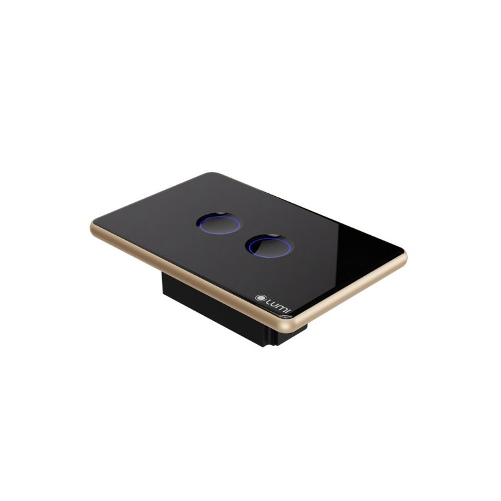

*Công tắc cửa cuốn thông minh Lumi giúp người dùng kiểm soát và điều khiển thiết bị cửa cuốn 1 cách tiện lợi và an toàn. Video dưới đây là cách hoạt động của cửa cuốn khi điều khiển bằng app Lumi Life.*

Trình chơi Video

00:00

00:26
## **1. Đặc điểm của công tắc cửa cuốn thông minh**
- Công tắc cảm ứng cửa cuốn là 1 trong những sản phẩm công tắc cảm ứng thông minh của Lumi.
- Công tắc thông minh cửa cuốn giúp người dùng để điều khiển thiết bị cửa cuốn trong nhà bằng Smartphone và theo dõi được trạng thái hiện tại của cửa cuốn.
## **2. Tính năng của công tắc thông minh cửa cuốn**
- Chỉ cần một chiếc Smartphone bạn có thể điều khiển hầu hết các thiết bị điện trong nhà và thiết bị cửa cuốn là một trong những giải pháp nhiều người dùng đang sử dụng.
- Giải pháp này giúp người dùng điều khiển thiết bị cửa cuốn mọi lúc; mọi nơi và có thể biết được trạng thái của thiết bị cửa cuốn đáng đóng hay mở. Giải pháp này giúp người dùng cảm thấy an toàn, tiện lợi.

*App Lumi life điều khiến công tắc thông minh cửa cuốn*

Sử dụng truyền thông không dây Zigbee làm giao thức giao tiếp, xử lý và gửi lệnh, công tắc thông minh kết nối với điện thoại của bạn thông qua bộ điều khiển trung tâm để thực hiện lệnh điều khiển

- Công tắc điều khiển cửa cuốn khi bạn không có ở nhà
- Cài đặt lịch hẹn giờ mở và đóng cửa cuốn theo lịch sinh hoạt của gia đình
- Theo dõi được trạng thái đóng cửa hay mở cửa để kiểm soát trạng thái cửa cuốn

Xem thêm sản phẩm: [***Công tắc cổng thông minh***](https://lumi.vn/cong-tac-cong-thong-minh.html)
## **3. Ưu điểm của công tắc thông minh cho cửa cuốn**

*công tắc cảm ứng cửa cuốn*
### **3.1. Thiết kế kiểu dán theo phong cách hiện tại, tính tế và sang trọng**
- Công tắc cảm ứng cửa cuốn Lumi là công tắc cảm ứng thông minh; sử dụng mặt mặt kính cường lực, chống xước, chống va đập tốt, kết hợp với vòng tròn tỏa sáng LED bao quanh; kèm theo logo Lumi ở góc phải tạo nên điểm nhấn cho thương hiệu và sự lôi cuốn cho sản phẩm. Đồng thời, đèn LED luôn được tỏa sáng dù bật hay tắt, nên bạn sẽ thấy ngay chiếc công tắc dù là trong đêm tối.
- Công tắc thông minh cho cửa cuốn có 3 nút với chức năng mở/dừng/đóng.Và có nhiều phiên bản khác nhau để người dùng có thể lựa chọn phù với không gian của ngôi nhà.
### **3.2. Hệ thống cầu nối an toàn, hiệu quả**
- Bên trong công tắc thông minh điều khiển cửa cuốn Lumi là hệ thống ReLay có chức năng đóng/cắt nguồn điện. Vỏ ngoài làm bằng chất liệu nhựa PP, có khả năng chống cháy.
- Sản phẩm được kiểm tra, và test kỹ càng trước khi xuất xưởng nên tuyệt đối không xảy ra trường hợp chập cháy.
- Công tắc điều khiển cửa cuốn của Lumi được sử dụng công nghệ điện dung. Rất an toàn kể cả khi tay ướt chạm vào công tắc điện.
- Đặc biệt có 2 phiên bản điện áp 220V và 24V để người dùng lựa chọn phù hợp với động cơ cửa cuốn của ngôi nhà.

*Công tắc cảm ứng cửa cổng*

Xem thêm sản phẩm bán chạy nhất tại Lumi: [***Công tắc cầu thang tích hợp cảm biến***](https://lumi.vn/san-pham/cong-tac-cau-thang-tich-hop-cam-bien-2-trong-1.html)
### **3.3. Dễ dàng lắp đặt và bảo hành linh hoạt**
Đồng bộ về chính sách và thời gian lắp đặt với các thiết bị khác trong nhà thông minh Lumi. Công tắc cửa cuốn Lumi cũng hưởng những chính sách như các công tắc khác của Lumi

- Dễ dàng lắp đặt, thi công chỉ trong 1 ngày
- Điều khiển được bằng Smartphone với app Lumi Life
- Tương thích với kích thước đế âm và hạ tầng điện Việt Nam
- Hệ thống đại lý phủ rộng toàn quốc giúp bảo hành nhanh chóng
- Chính sách bảo hành sản phẩm 24 tháng
### **3.4. Cách thức hoạt động**
- Hoạt động theo sự điều khiển của bộ điều khiển trung tâm (Home Controller).
- Khi người dùng về gần đến nhà, phát lệnh” mở cửa cuốn” bằng cách mở app Lumi life.
- Lệnh sẽ được gửi tới bộ điều khiển trung tâm thông qua sóng Zigbee. Từ đó, bộ điều khiển trung tâm điều khiển công tắc cảm ứng cửa cuốn mở cửa như đúng yêu cầu của người dùng.
- Lưu ý: Để công tắc hoạt động tốt và hiệu quả cần đấu nối công tắc cửa cuốn thông minh chuẩn kỹ thuật theo hướng dẫn của Lumi.

Trên đây là thông tin chi tiết về công tắc cửa cuốn thông minh. Hãy liên hệ ngay hotline để nhận tư vấn chi tiết nhất cho ngôi nhà của. Ngoài ra Lumi có cung cấp thêm các mẫu công tắc khác như: [***Công tắc cảm ứng kính phẳng viền nhôm***](https://lumi.vn/san-pham/cong-tac-cam-ung-kinh-phang.html), công tắc cảm ứng kính lõm, công tắc chiết áp thông minh… Để nhận những thông tin tư vấn chi tiết, hãy liên hệ ngay hotline của Lumi, nhân viên hỗ trợ sẽ sẵn sàng hỗ trợ bạn 24/7.
