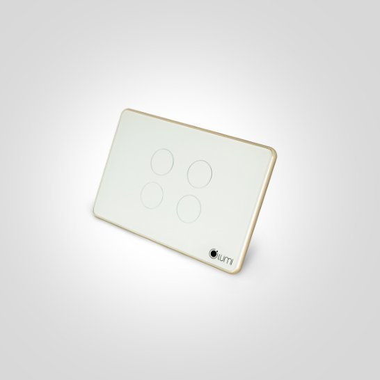
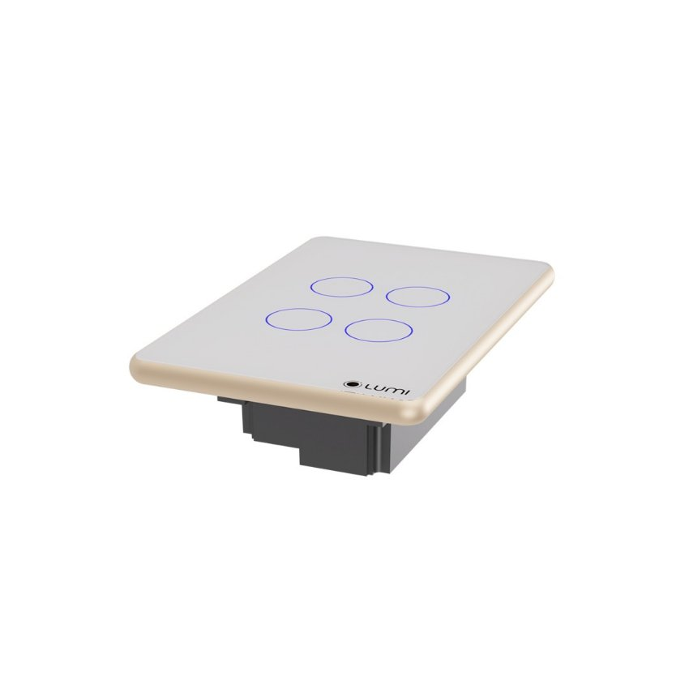

*Công tắc điều khiển rèm đôi mang đến sự thuận tiện tối đa trong việc điều khiển rèm cửa. Thay vì phải đứng dậy và điều chỉnh rèm bằng tay, bạn có thể dễ dàng mở hoặc đóng rèm từ xa thông qua ứng dụng trên điện thoại hoặc thiết bị thông minh. Đặc biệt mẫu [**công tắc Lumi**](https://lumi.vn/cong-tac-thong-minh/) này được tích hợp với các trợ lý ảo như Google Assistant, Alexa và Siri để bạn dễ dàng điều khiển rèm bằng giọng nói. Tìm hiểu chi tiết về sản phẩm thông qua những bài viết dưới đây.*

Trình chơi Video

00:00

00:27
## **1. Đặc điểm công tắc thông minh rèm đôi**
- Công tắc điều khiển rèm đôi nằm trong bộ công tắc cảm ứng thông minh của Lumi nên thiết kế vẫn được giữ nguyên như các công tắc thông minh khác. Sử dụng công nghệ cảm ứng điện dung.
- Mặt kính cường lực chống xước, chống va đập tốt. Kết hợp với vòng tròn tỏa sáng LED bao quanh, kèm theo logo Lumi ở góc phải tạo nên điểm nhấn cho thương hiệu và sự lôi cuốn cho sản phẩm.
- Đồng thời, đèn LED luôn được tỏa sáng dù bật hay tắt. Vì vậy, bạn sẽ thấy ngay chiếc công tắc dù là trong đêm tối, làm cho căn nhà trở nên tinh tế, sang trọng và hiện đại.

\>> Xem thêm sản phẩm: [***Công Tắc Cảnh BLE Mesh***](https://lumi.vn/san-pham/cong-tac-canh-ble-mesh.html)

## **2. Phân loại công tắc điều khiển rèm đôi**
Công tắc điều khiển rèm đôi Lumi gồm các loại:

- Màu sắc: Đen và trắng
- Hình dáng: Hình chữ nhật và hình vuông
- Số nút cảm ứng: 4 nút (mở/dừng rèm 1, đóng/dừng rèm 1, mở/dừng rèm 2 và đóng/dừng rèm 2)
- Theo hình dáng:
  - Vuông (DxRxC): 95 x 95 x 31.5mm
  - Chữ nhật (DxRxC): 121.5 x 80 x 31.5mm
## **3. Chức năng công tắc rèm đôi**
- Công tắc điều khiển rèm đôi là công tắc cảm ứng thông minh. Chỉ cần chạm nhẹ vào biểu tượng hình tròn trên bề mặt kính. Có thể điều khiển đóng/mở thiết bị rèm đôi (rèm cửa 2 lớp) – rèm kéo ngang.
- Bên cạnh đó, với công nghệ kết nối không dây Zigbee, công tắc rèm đôi của Lumi có thể được điều khiển từ bất cứ đâu. Ngay cả khi bạn không ở nhà thông qua các thiết bị di động có kết nối Wi-Fi, 3G.
- Khi được tích hợp trong hệ thống phòng thông minh, thiết bị công tắc rèm đôi LM-S4C có thể kết nối với các thiết bị khác như cảm biến chuyển động, cảm biến cửa thông qua bộ điều khiển trung tâm.
- Thiết bị LM-S4C có thể nhận lệnh điều khiển từ ứng dụng Lumi Life. Điều khiển trên các thiết bị như điện thoại, máy tính bảng, máy tính khi có kết nối Wi-Fi, 3G.
- Ngoài ra, thiết bị LM-S4C có thể hoạt động hoàn toàn tự động theo kịch bản. Lịch được cài đặt từ phần mềm hay hoạt động theo hệ thống phòng thông minh.

\>> Xem thêm sản phẩm: [***Công tắc thông minh cửa cuốn***](https://lumi.vn/san-pham/cong-tac-cua-cuon-thong-minh.html)
## **4. Cơ chế hoạt động công tắc rèm đôi thông minh**
Trên mặt công tắc rèm đơn có 4 nút, tương ứng với nút: mở/dừng rèm 1, đóng/dừng rèm 1, mở/dừng rèm 2 và đóng/dừng rèm 2.

- Khi rèm đôi mở, đèn chỉ thị nút Mở sẽ sáng đỏ.
- Sau khi rèm đôi mở hoàn toàn nút Mở sẽ sáng xanh. Khi đóng rèm đôi, đèn chỉ thị nút Đóng sẽ sáng đỏ.
- Sau khi rèm đôi đóng hoàn toàn nút Đóng sẽ sáng xanh.
- Rèm đôi khi nhấn dừng nút Dừng sẽ tương tự như trên.

Người dùng có thể lắp vào các hệ thống rèm để điều khiển qua smartphone và hiển trị trạng thái trên app. Có thể điều khiển rèm cửa từ xa mà không cần kéo tay, đơn giản, tiện lợi.

*Công tắc rèm đôi thông minh*

\>> Xem thêm sản phẩm: [***Công tắc cổng thông minh cảm ứng***](https://lumi.vn/cong-tac-cong-thong-minh.html)
## **5. Ứng dụng công tắc điều khiển rèm đôi**
- Đặt lịch, bật tắt hẹn giờ: Chế độ đặt thời gian đối với từng thiết bị, bật tắt theo giờ, theo ngày, theo tuần. Có thể setup các ngữ cảnh.
  - Ví dụ: 5h30 sáng rèm cửa tự động mở ra chào đón một ngày mới, 10h tối rèm cửa tự động đóng vào kết thúc một ngày. Căn phòng của bạn trở nên thoái mái và tiện nghi hơn rất nhiều.
- Với giải pháp nhận dạng giọng nói của Lumi, bạn điều khiển được hệ thống rèm cửa bằng chính “giọng nói quyền năng” của mình.
  - Ví dụ: khi bạn nói câu lệnh *“OK GOOGLE, OPEN CURTAIN”; “Hey SIRI, OPEN CURTAIN”* tất cả rèm cửa trong ngôi nhà sẽ hoàn toàn mở hoặc đóng, tùy theo câu lệnh.

Sử dụng công tắc điều khiển rèm đôi hạn chế tiếp xúc điện, dễ sử dụng đối với người cao tuổi. Nhà thông minh điều khiển bằng giọng nói đang là sự lựa chọn lý tưởng cho mọi gia đình Việt. Tìm hiểu thêm về Động cơ rèm thông minh Lumi [tại đây](https://lumi.vn/dieu-khien-rem-tu-dong.html).
