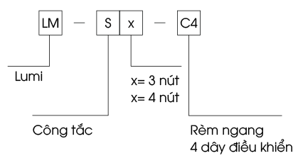
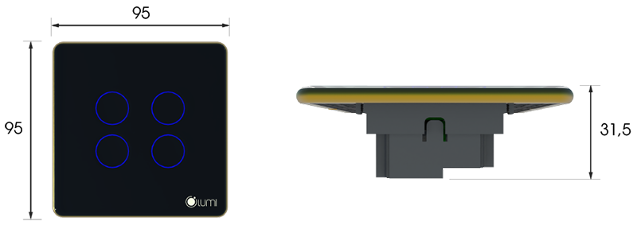
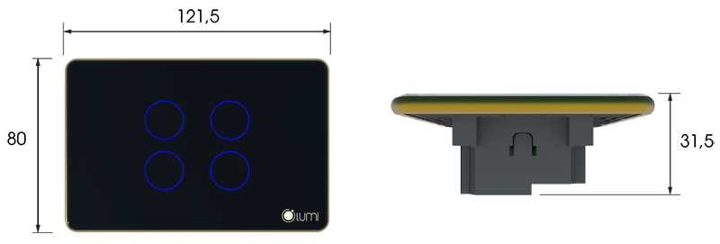

## **1. Tổng quát**
Mã sản phẩm: LM-S4C

- LM – S4C là thiết bị công tắc rèm đôi của Lumi điều khiển động cơ rèm có 4 dây điều khiển.
- Thiết kế: mặt kính cường lực chống xước kết hợp viền nhôm nguyên khối.
- Công nghệ: cảm ứng điện dung, giao thức truyền thông không dây Zigbee.
- Phương thức điều khiển: bằng tay, điều khiển từ xa trên ứng dụng Lumi Life thông qua bộ điều khiển trung tâm.
## **2. Thông số kỹ thuật**

<table><tr><th>` `Điện áp hoạt động</th><th>` `100 – 240V AC ~ 50/60 Hz</th></tr>
<tr><td>` `Nhiệt độ hoạt động</td><td>` `0℃ – 50℃</td></tr>
<tr><td>` `Truyền thông</td><td>` `Zigbee</td></tr>
<tr><td>` `Công suất phát Zigbee</td><td>` `10dbm</td></tr>
<tr><td>` `Công suất tiêu thụ không tải</td><td>` `<0.5W</td></tr>
<tr><td rowspan="2">` `Kích thước (D x R x C)</td><td>` `Hình chữ nhật: 121.5 x 80 x 31.5 mm</td></tr>
<tr><td>` `Hình vuông: 95 x 95 x 31.5 mm</td></tr>
</table>

*Kích thước công tắc*
## **3. Lắp đặt thiết bị**
**Bước 1:** Đấu nối dây cho thiết bị.

Sơ đồ đấu nối dây:

*Sơ đồ đấu nối rèm đôi*

- **Chân L:** đấu dây lửa của nguồn điện.
- **Chân N:** đấu dây trung tính của nguồn điện.
- Các chân điều khiển mở, dừng, đóng dấu vào chân kí hiệu tương ứng.
- Rèm đôi có 2 dây COM của 2 động cơ rèm đều đấu chung vào chân C.

**Bước 2:** 

Lắp công tắc vào đế âm.

Tháo kính công tắc: sử dụng tuốc nơ vít đặt vào rãnh nhỏ trên viền công tắc và đẩy nhẹ tháo rời mặt kính.

*Tháo mặt kính công tắc*

Lắp công tắc vào đế âm và lắp lại mặt kính:

*Lắp công tắc vào đế âm*

**Lưu ý:**

- Xếp gọn dây điện trong đế âm để lắp vừa công tắc và tránh bị vít ốc vào dây điện.
- Không vít quá chặt sẽ làm công tắc bị cong, vênh mạch cảm ứng của công tắc không tiếp xúc được với mặt kính dẫn đến không bật/tắt được công tắc bằng tay.
## **4. Sử dụng thiết bị**
### ***4.1. Điều khiển mở/dừng/đóng rèm***
Người dùng chạm tay vào vòng tròn cảm ứng trên công tắc để mở/dừng/đóng rèm.

*Sử dụng công tắc rèm*
### ***4.2. Học hành trình đóng/mở rèm đôi***

*Học hành trình công tắc rèm đôi*

Các bước cài đặt hành trình đóng/mở cho từng rèm:

- **Bước 1:** Nhấn giữ nút số 1 trong 3s đến khi led chỉ thị nút 1 sáng hồng thì thả tay ra và rèm sẽ tự động mở. Đợi khi rèm mở hoàn toàn chuyển sang bước 2.
- **Bước 2:** Nhấn nút số 2, led chỉ thị nút số 2 và số 1 sẽ sáng hồng để báo hiệu đang học hành trình đóng. Khi rèm đóng hoàn toàn thì chuyển sang bước 3.
- **Bước 3:** Nhấn nút số 1, led chỉ thị nút số 1 sẽ sáng hồng để báo hiệu đang học hành trình mở. Khi rèm mở hoàn toàn thì led chỉ thị trở về màu xanh và thoát khỏi chế độ học hành trình.

Làm tương tự các bước cài đặt hành trình đóng mở cho rèm thứ 2 (nút số 3 và số 4).

**Khóa cảm ứng:**

**Từ 24/02/2020** thiết bị công tắc rèm có chức năng khóa cảm ứng, người dùng sẽ không thể bật/tắt bằng tay được và chỉ có thể điều khiển bằng app Lumi Life.

![khoa-cam-ung-rem-doi]

*Khóa cảm ứng công tắc rèm đôi*

**Nhấn nhanh nút config 10 lần liên tiếp** để khóa và mở khóa cảm ứng.

- Khóa cảm ứng – Tất cả led nháy đỏ 5 lần.
- Mở khóa cảm ứng – Tất cả led nháy xanh 5 lần.

**Thay đổi độ sáng led chỉ thị**

- Led chỉ thị trên công tắc có 2 mức là sáng mạnh hoặc sáng yếu. Với công tắc trước 24/2/2020, người dùng nhấn giữ nút config 8s và quan sát led chỉ thị thay đổi độ sáng thả tay ra.
- Công tắc từ 24/2/2020 trở đi, người dùng nhấn giữ nút config 5s và quan sát led chỉ thị thay đổi độ sáng thả tay ra.
## **5. Cài đặt điều khiển thiết bị**
### ***5.1. Cho thiết bị gia nhập mạng***
- Để cài đặt điều khiển công tắc bằng ứng dụng trên điện thoại người dùng cần có bộ điều khiển trung tâm HC (home controller) và đã tạo nhà trên hệ thống.
- Người dùng đăng nhập vào **app Lumi Life+ => chọn cài đặt => chọn cài đặt thiết bị => chọn HC => Zigbee => cho thiết bị gia nhập mạng.**

(Chi tiết xem [cài đặt thiết bị](https://support.lumi.vn/docs/hdsd/ung_dung_lumi_life/cau_hinh_he_thong/cai_dat_thiet_bi/))

- Quan sát đèn chỉ thị trên công tắc nháy hồng 4 lần liên tiếp chu kì 1s/1 lần khi gia mạng thành công.
- Trường hợp công tắc không gia nhập mạng có thể công tắc đã được cấu hình, người dùng thực hiện reset thiết bị để quay về chế độ gia nhập mạng.
### ***5.2. Điều khiển thiết bị ứng dụng Lumi Life+***
Sau khi công tắc gia nhập mạng người dùng đặt tên thiết bị và cho vào phòng trong nhà để điều khiển bằng ứng dụng Lumi Life trên điện thoại.

*Điều khiển công tắc rèm đôi*

- **Icon sáng:** rèm đang mở.
- **Icon tối:** rèm đóng hoàn toàn.

Người dùng chạm vào icon thiết bị rèm để điều khiển mở/dừng/đóng.

Ngoài ra người dùng có thể cài đặt thiết bị với các chức năng nâng cao như [cài đặt rule](https://support.lumi.vn/docs/hdsd/ung_dung_lumi_life/cau_hinh_he_thong/cai_dat_rule/), [cài đặt cảnh](https://support.lumi.vn/docs/hdsd/ung_dung_lumi_life/cau_hinh_he_thong/cai_dat_canh/), [cài đặt lịch](https://support.lumi.vn/docs/hdsd/ung_dung_lumi_life/cau_hinh_he_thong/hen_gio_thiet_bi/).
## **6. Reset thiết bị**
### ***6.1. Reset công tắc zigbee 3.0***
![khoa-cam-ung-rem-doi]

*Reset công tắc zigbee 3.0*

**Từ 24/02/2020,** reset và cho thiết bị ra khỏi mạng người dùng **ấn nút config 5 lần liên tiếp**.

Nếu thiết bị đang trong mạng thì sau khi reset led chỉ thị của thiết bị sẽ nháy hồng 2 lần liên tiếp báo xóa mạng thành công, sau đó nháy hồng thêm 2 lần liên tiếp nữa báo khỏi động lại và nháy đỏ 3 lần liên tiếp để trờ về chế độ tự động tìm mạng.
### ***6.3. Reset công tắc zigbee 1.2***

*Reset công tắc zigbee 1.2*

- Công tắc **trước 24/02/2020**, reset và cho thiết bị ra khỏi mạng người dùng ấn giữ nút cảm ứng trong 5s, khi led chỉ thị nháy hồng thì thả tay.
- Reset thành công, led chỉ thị nháy hồng 3 lần liên tiếp quay lại quá trình tự động tìm mạng.
- **Lưu ý:** Nhấn giữ nút bất kỳ và quan sát led chỉ thị cả 4 nút sáng hồng thì thả tay.
## **7. Bộ sản phẩm đóng gói**
Bộ thiết bị công tắc rèm cửa được đóng hộp bao gồm:

- 1 bộ công tắc rèm đôi 4 nút,
- 2 vít inox
- 1 bộ hướng dẫn sử dụng.

[khoa-cam-ung-rem-doi]: Aspose.Words.f9db21bb-814b-4166-9a74-c0517c0222ba.009.png
