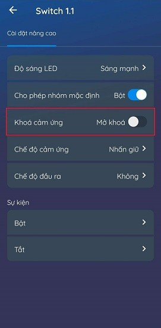
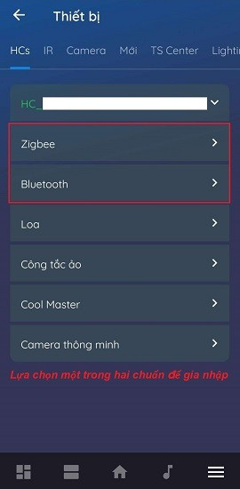
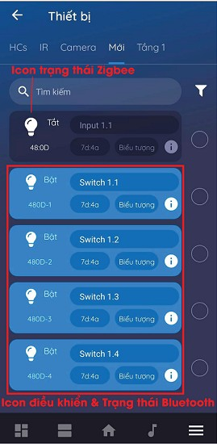

## **1. Tổng quát**
- Mã sản phẩm: LM-Sx-N
- LM-Sx-N là thiết bị công tắc cảm ứng của Lumi hỗ trợ bật/tắt từ 1 đến 4 kênh đầu tải ra.
- Thiết kế: mặt kính cường lực chống xước kết hợp viền nhôm nguyên khối.
- Công nghệ: cảm ứng điện dung, giao thức truyền thông không dây Zigbee.
- Phương thức điều khiển: bằng tay, điều khiển từ xa trên ứng dụng Lumi Life thông qua bộ điều khiển trung tâm.
## **2. Thông số kỹ thuật**

<table><tr><th>Điện áp hoạt động</th><th>100 – 240V AC ~ 50/60Hz</th></tr>
<tr><td>Nhiệt độ hoạt động</td><td>0℃ – 50℃</td></tr>
<tr><td>Truyền thông</td><td>Zigbee</td></tr>
<tr><td>Công suất phát Zigbee</td><td>10 dbm</td></tr>
<tr><td>Công suất tiêu thụ không tải</td><td>< 0.5W</td></tr>
<tr><td rowspan="2">Công suất tải</td><td>Tải trở thuần: ≤ 700W</td></tr>
<tr><td>Tải LED: ≤ 150W</td></tr>
<tr><td rowspan="2">Kích thước (D x R x C)</td><td>Hình chữ nhật: 121.5 x 80 x 31.5 mm</td></tr>
<tr><td>Hình vuông: 95 x 95 x 31.5 mm</td></tr>
</table>
## **3. Lắp đặt thiết bị**
- Bước 1: Đấu nối dây cho thiết bị. Sơ đồ đấu nối dây:
  - Chân L: đấu dây lửa của nguồn điện.
  - Chân N: đấu dây trung tính của nguồn điện và dây trung tính thiết bị.
  - Chân 1,2,3,4: đấu với dây lửa của tải.
  - Lưu ý: Công tắc có tối đa 4 nút, tương ứng có 4 chân tải đầu ra lần lượt 1,2,3,4.

*Sơ đồ đấu nối công tắc cảm ứng*

- Bước 2: Lắp công tắc vào đế âm.
  - Tháo kính công tắc: sử dụng tuốc nơ vít đặt vào rãnh nhỏ trên viền công tắc và đẩy nhẹ tháo rời mặt kính.
  - Lắp công tắc vào đế âm và lắp lại mặt kính.

**Lưu ý:**

- Xếp gọn dây điện trong đế âm để lắp vừa công tắc và tránh bị vít ốc vào dây điện.
- Không vít quá chặt sẽ làm công tắc bị cong, vênh mạch cảm ứng của công tắc không tiếp xúc được với mặt kính dẫn đến không bật/tắt được công tắc bằng tay.
## **4. Sử dụng thiết bị**
### **4.1. Bật/tắt công tắc**
Người dùng chạm tay vào vòng tròn cảm ứng trên công tắc để bật/tắt. Trong đó:

- Vòng tròn màu đỏ: trạng thái bật.
- Vòng tròn màu xanh: trạng thái tắt.
### **4.2. Chuyển đổi chế độ nhấn giữ – nhấn nhả**
- Chế độ nhấn giữ: Người dùng chỉ cần chạm tay 1 lần vào vòng tròn cảm ứng trên công tắc hoặc điều khiển trên app để chuyển trạng thái bật/tắt và công tắc sẽ giữ nguyên trạng thái đó.
- Chế độ nhấn nhả: Công tắc sẽ luôn trả về trạng thái tắt, khi người dùng bật công tắc công tắc sẽ bật và lập tức trở về trạng thái tắt trong khoảng 500ms.
- Để chuyển chế độ nhấn giữ sang nhấn nhả hoặc ngược lại: Giữ nút config 3s tới khi LED của nút số 1 nháy hồng 2 lần thì thả tay.
- Quan sát LED trạng thái các nút: Ở chế độ nhấn nhả – LED tắt, ở chế độ nhấn giữ – LED sáng hồng.
- Chạm 1 lần vào nút muốn đổi chế độ để cài đặt, sau đó ấn nút config 1 lần hoặc đợi 10s để thoát cài đặt và lưu chế độ.
### **4.3 Khóa cảm ứng**
Từ tháng 6/2019 thiết bị công tắc cảm ứng có chức năng khóa cảm ứng, người dùng sẽ không thể bật/tắt bằng tay được và chỉ có thể điều khiển bằng app Lumi Life. Chi tiết như sau:

*Khóa cảm ứng*

- Nhấn nhanh nút config 10 lần liên tiếp để khóa và mở khóa cảm ứng.
- Khóa cảm ứng – Tất cả LED nháy đỏ 5 lần.
- Mở khóa cảm ứng – Tất cả LED nháy xanh 5 lần.
### **4.4. Thay đổi độ sáng LED chỉ thị**
- LED chỉ thị trên công tắc có 2 mức là sáng mạnh hoặc sáng yếu.
- Công tắc trước tháng 6/2019, người dùng nhấn giữ nút config 8s và quan sát LED chỉ thị thay đổi độ sáng thả tay ra.
- Công tắc từ tháng 6/2019 trở đi, người dùng nhấn giữ nút config 5s và quan sát LED chỉ thị thay đổi độ sáng thả tay ra.
### **4.5. Nhóm thiết bị**
Công tắc từ 24/02/2020 có thêm tính năng nhóm thiết bị không cần cấu hình trên phần mềm.
#### ***Tạo nhóm***
- Chọn 1 nút làm khởi tạo làm nút chính, thực hiện trên nút này đầu tiên.
- Nhấn giữ nút cảm ứng trong 10s đến khi LED nháy hồng 2 lần thì nhả tay. Rồi nhấn tiếp 1 lần vào nút đó để xác nhận, lúc này LED sáng hồng.
- Làm tương tự với những nút mà ta muốn đưa vào nhóm.
#### ***Xóa nhóm***
- Giữ nút cần xóa trong 10s đến khi nháy hồng 2 lần. Sau đó ấn vào nút đó 1 lần nữa rồi thoát chế độ cài đặt.
- Xóa cả nhóm thực hiện xóa trên nút chính.
#### ***Thoát chế độ***
Khi cấu hình xong ta nhấn 2 lần nút config để thoát hoặc đợi sau 1 phút thì công tắc cũng sẽ tự động thoát khỏi chế độ.

**Lưu ý**

- Để sử dụng được chức năng này các công tắc đã được gia nhập mạng, và trong cùng 1 mạng (thuộc cùng HC hoặc cùng LC).
- Tối đa trong 1 nhóm có 5 nút công tắc và không được nhóm 2 nút thuộc cùng 1 công tắc.
## **5. Cài đặt điều khiển thiết bị**
### **5.1. Cho thiết bị gia nhập mạng**
- Để cài đặt điều khiển công tắc bằng ứng dụng trên điện thoại người dùng cần có bộ điều khiển trung tâm HC (home controller) và đã tạo nhà trên hệ thống.
- Người dùng đăng nhập vào app Lumi Life => chọn cài đặt => chọn cài đặt thiết bị => chọn HC => Zigbee => cho thiết bị gia nhập mạng. (Chi tiết xem [cài đặt thiết bị](https://support.lumi.vn/docs/hdsd/ung_dung_lumi_life/cau_hinh_he_thong/cai_dat_thiet_bi))
- Quan sát đèn chỉ thị trên công tắc nháy hồng 3 lần liên tiếp chu kỳ 1s/1 lần khi gia mạng thành công.
- Trường hợp công tắc không gia nhập mạng có thể công tắc đã được cấu hình, người dùng thực hiện reset thiết bị để quay về chế độ gia nhập mạng.

*Cho thiết bị gia nhập mạng*

*Cho thiết bị gia nhập mạng 2*
### **5.2. Điều khiển thiết bị trên ứng dụng Lumi Life**
- Sau khi công tắc gia nhập mạng người dùng đặt tên thiết bị và cho vào phòng trong nhà để điều khiển bằng app Lumi Life trên điện thoại. (Chi tiết xem [cài đặt thiết bị](https://support.lumi.vn/docs/hdsd/ung_dung_lumi_life/cau_hinh_he_thong/cai_dat_thiet_bi))
- Tương tự như bật/tắt bằng tay, người dùng chạm vào icon thiết bị để điều khiển bật/tắt.
  - Icon sáng: công tắc đang bật.
  - Icon tối: công tắc đang tắt.
- Ngoài ra người dùng có thể cài đặt thiết bị với các chức năng nâng cao như [cài đặt rule](https://support.lumi.vn/docs/hdsd/ung_dung_lumi_life/cau_hinh_he_thong/cai_dat_rule), [cài đặt cảnh](https://support.lumi.vn/docs/hdsd/ung_dung_lumi_life/cau_hinh_he_thong/cai_dat_canh), [cài đặt lịch](https://support.lumi.vn/docs/hdsd/ung_dung_lumi_life/cau_hinh_he_thong/hen_gio_thiet_bi).
## **6. Reset thiết bị**
### **6.1. Reset công tắc zigbee 3.0**
- Từ 24/02/2020, reset và cho thiết bị ra khỏi mạng người dùng ấn nút config 5 lần liên tiếp.
- Nếu thiết bị đang trong mạng thì sau khi reset LED chỉ thị của thiết bị sẽ nháy hồng 2 lần liên tiếp báo xóa mạng thành công, sau đó nháy hồng thêm 2 lần liên tiếp lần nữa báo khởi động lại và nháy đỏ 3 lần liên tiếp để trở về chế độ tự động tìm mạng.
### **6.2. Reset công tắc zigbee 1.2**
- Công tắc trước 24/02/2020, reset và cho thiết bị ra khỏi mạng người dùng ấn giữ nút cảm ứng trong 5s, khi LED chỉ thị nháy hồng thì thả tay.
- Reset thành công, LED chỉ thị nháy hồng 3 lần liên tiếp với chu kì 1s/1 lần. Khi đó, thiết bị rời khỏi mạng thành công và nháy đỏ 3 lần liên tiếp quay lại quá trình tự động tìm mạng.
## **7. Bộ sản phẩm đóng gói**
Bộ thiết bị công tắc cảm ứng được đóng hộp bao gồm: 1 bộ công tắc cảm ứng, 2 vít, 1 bộ hướng dẫn sử dụng.
