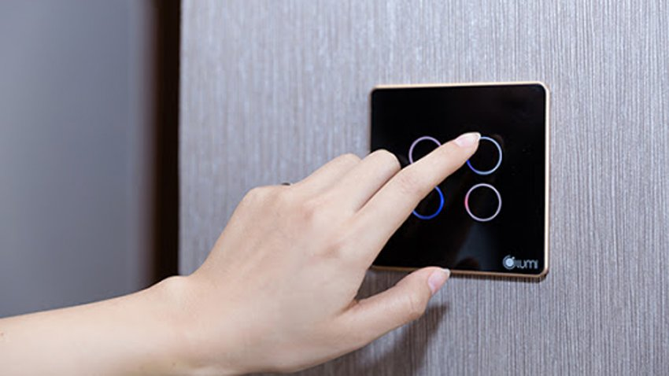
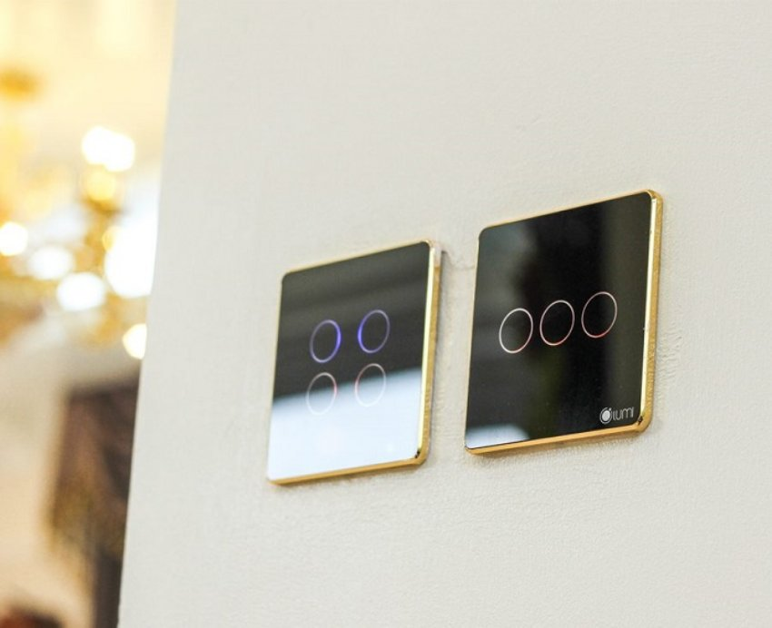
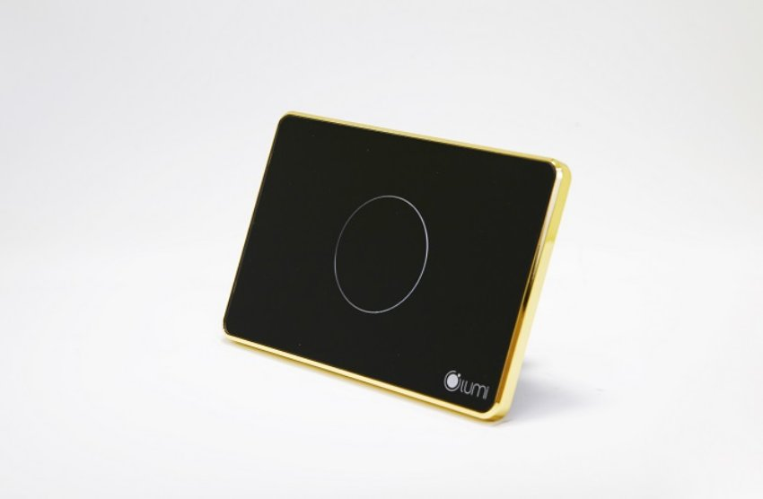

*Công tắc cảm ứng thông minh Lumi là sản phẩm chủ đạo trong hệ sinh thái Nhà thông minh Lumi. Đóng vai trò như một thiết bị trung gian, công tắc cảm ứng kính phẳng thông minh giúp người dùng điều khiển các thiết bị điện trong nhà bằng Smartphone và Giọng nói. Không chỉ ghi điểm về các tính năng thông minh, công tắc cảm ứng kính phẳng còn cuốn hút với mặt kính phẳng cường lực 2 màu đen hoặc trắng cổ điển, cùng viền nhôm sắc nét từng đường vát kim cương, mang đến sự tinh tế, sang chảnh và sang trọng khi lắp đặt trên tường.*

*Video thực tế về công tắc cảm ứng kính phẳng viền nhôm*
## **1. Tính năng công tắc cảm ứng thông minh kính phẳng Lumi**
- Sử dụng công tắc thông minh thay thế cho các công tắc cơ truyền thống, người dùng có thể tận hưởng một cuộc sống thông minh với hầu hết các lệnh điều khiển thiết bị điện trong nhà được thực hiện trên một chiếc Smartphone hoặc giọng nói.
- Sử dụng truyền thông không dây Zigbee làm giao thức giao tiếp, xử lý và gửi lệnh, công tắc thông minh kết nối với điện thoại của bạn thông qua bộ điều khiển trung tâm để thực hiện
  - Điều khiển toàn bộ hệ thống đèn điện trong nhà bằng Smartphone và Giọng nói
  - Lên lịch, hẹn giờ bật bình nóng lạnh, rèm cửa… theo lịch sinh hoạt của gia đình
  - Đóng/ mở rèm cửa bằng cách chạm nhẹ trên Smartphone…
  - Thiết lập Rule, cảnh, lịch cho các thiết bị thông minh trong nhà hoạt động đồng thời, hoặc làm tín hiệu đầu vào, đầu ra thiết lập các kịch bản sống thông minh như ăn tối, về nhà,…

*Công tắc thông minh Lumi kính phẳng thay thế cho các công tắc cơ truyền thống*

- Nói chung, chỉ cần thiết bị được điều khiển bằng công tắc cơ thì hoàn toàn có thể trở thành thiết bị thông minh cho phép điều khiển qua Smartphone và giọng nói nhờ công tắc cảm ứng thông minh.
- Đặc biệt, Lumi đã kết nối thành công với các trợ lý ảo như Google Assistant, Alexa. Nhờ vậy, bạn có thể trải nghiệm sự quyền năng của giọng nói. Ví dụ: khi bạn nói câu lệnh*“OK GOOGLE, I’M HOME; Hey SIRI, I’M HOME”* tất cả các thiết bị trong ngôi nhà sẽ hoàn toàn bật/tắt, tùy theo câu lệnh.

\>>Tham khảo thêm: [***Công tắc cảm ứng thông minh kính lõm***](https://lumi.vn/san-pham/cong-tac-cam-ung-kinh-lom.html) sang trọng và hiện đại của Lumi.
## **2. Ưu điểm của công tắc điện thông minh cảm ứng kính phẳng**
### **2.1. Thiết kế hiện đại, tinh tế, sang trọng**
- Công tắc điện Lumi là công tắc cảm ứng thông minh, sử dụng mặt mặt kính cường lực, chống xước, chống va đập tốt, kết hợp với vòng tròn tỏa sáng LED bao quanh, kèm theo logo Lumi ở góc phải tạo nên điểm nhấn cho thương hiệu và sự lôi cuốn cho sản phẩm.
- Đèn LED luôn được tỏa sáng dù bật hay tắt, nên bạn sẽ thấy ngay chiếc công tắc thông minh cảm ứng dù là trong đêm tối.

*Công tắc Lumi kính phẳng có thiết kế hiện đại, tinh tế, sang trọng*
### **2.2. Hệ thống cầu nối an toàn, hiệu quả**
- Bên trong công tắc Lumi là hệ thống ReLay có chức năng đóng/cắt nguồn điện. Vỏ ngoài làm bằng chất liệu nhựa PP, có khả năng chống cháy.
- Sản phẩm được kiểm tra, và test kỹ càng trước khi xuất xưởng nên tuyệt đối không xảy ra trường hợp chập cháy.
- Đặc biệt, công tắc cảm ứng của Lumi được sử dụng công nghệ điện dung nên rất an toàn kể cả khi tay ướt chạm vào công tắc điện.
### **2.3. Dễ dàng lắp đặt và bảo hành linh hoạt**

*Công tắc thông minh kính phẳng Lumi dễ dàng lắp đặt và bảo hành linh hoạt*

Đồng bộ về chính sách và thời gian lắp đặt với các thiết bị khác trong nhà thông minh Lumi, dòng công tắc điện thông minh mới của Lumi cũng sở hữu những bộ tiện ích thống nhất

- Dễ dàng lắp đặt, thi công chỉ trong 1 ngày
- Điều khiển được bằng Smartphone với app Lumi Life
- Tương thích với kích thước đế âm và hạ tầng điện Việt Nam
- Chính sách bảo hành 24 tháng

\>> Tham khảo thêm: [***Công tắc chiết áp Lumi***](https://lumi.vn/san-pham/cong-tac-chiet-ap.html) cho chiết áp hoặc quạt trong hệ sinh thái nhà thông minh.
## **3. Cách thức hoạt động của công tắc thông minh cảm ứng kính phẳng viền nhôm**
Công tắc điện cảm ứng thông minh kính phẳng sẽ hoạt động theo sự điều khiển của bộ điều khiển trung tâm (Home Controller). Cách thức hoạt động của thiết bị sẽ được thể hiện qua ví dụ sau:

- Khi người dùng phát lệnh “tắt đèn” bằng cách chạm vào nút đèn trên app điện thoại, lệnh này sẽ được gửi tới bộ điều khiển trung tâm thông qua sóng Zigbee. Từ đó, bộ điều khiển trung tâm điều khiển công tắc cảm ứng thông minh kính lõm bật/ tắt thiết bị đèn đúng như yêu cầu của chủ nhà.
- Đến nay, với gần 25.000 ngôi nhà đã hoàn thiện, hàng trăm dự án đang triển khai và ký kết hợp đồng, Lumi tự hào trở thành thương hiệu Việt được khách hàng lựa chọn nhiều nhất trong thị trường smarthome tại Việt Nam.
- Chỉ từ 25 – 70 triệu/căn hộ hoặc 40 – 150 triệu/biệt thự liền kề là bạn đã sở hữu ngay ngôi nhà tiện nghi, hiện đại, sang trọng, đẳng cấp Châu Âu, giá chỉ bằng 1/2 giải pháp nhập khẩu trên thị trường.
## **4. Video giới thiệu giải pháp nhà thông minh Lumi**
Dưới đây là video mô tả giải pháp nhà thông minh Lumi với đầy đủ các tiện nghi thông minh nhất hiện nay.

Công tắc cảm ứng kính phẳng viền nhôm không chỉ đơn thuần là một thiết bị điều khiển bật tắt các thiết bị, mà còn là một tác phẩm nghệ thuật thể hiện sự tinh tế và sang trọng. Với khả năng tích hợp công nghệ thông minh; bạn có thể kết nối công tắc thông minh cảm ứng với hệ thống nhà thông minh; điều khiển từ xa thông qua ứng dụng trên điện thoại thông minh của bạn. Hãy liên hệ ngay với Lumi để có thể trang trí ngôi nhà của bạn với sự tinh tế và hiện đại đến từ các mẫu công tắc như công tắc kính phẳng, [***công tắc* thông minh điều khiển rèm đơn**](https://lumi.vn/san-pham/cong-tac-dieu-khien-rem-don.html), rèm đôi,…
