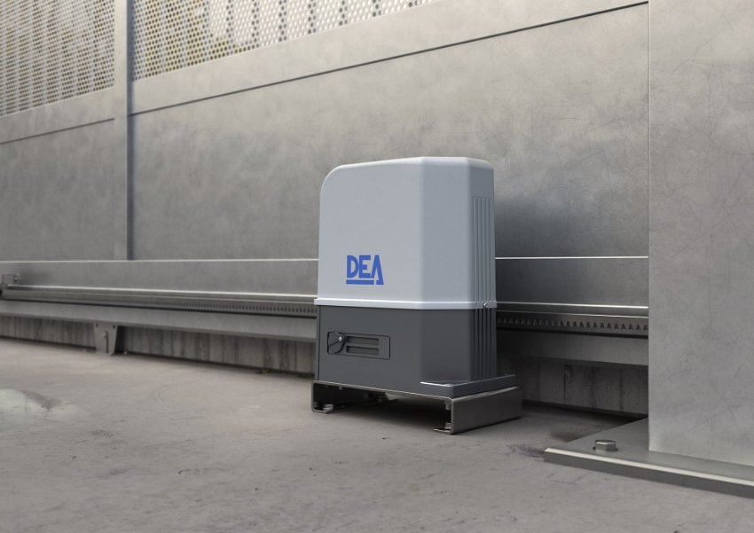
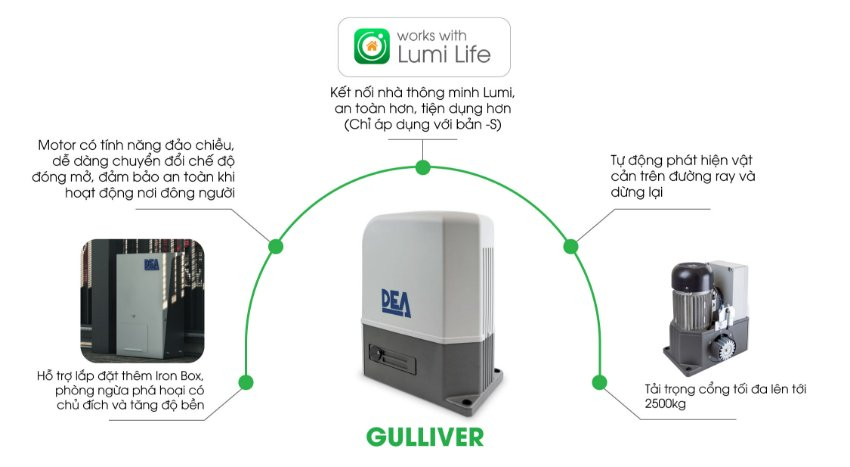
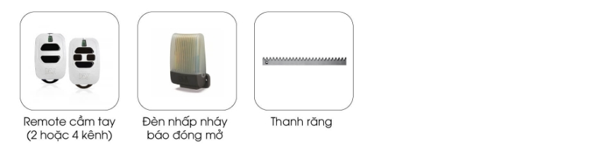

*Cổng trượt tự động GULLIVER/18NET là một sản phẩm công nghệ cao trong lĩnh vực tự động hóa cổng trượt. Sự kết hợp giữa thiết kế hiện đại, tính năng thông minh và hiệu suất vượt trội đã giúp cổng thông minh GULLIVER/18NET trở thành một lựa chọn hàng đầu cho việc nâng cao tính an ninh và tiện ích cho công trình. Tìm hiểu chi tiết hơn về sản phẩm qua những thông tin dưới đây.*
## **1. Thông số kỹ thuật cổng trượt tự động GULLIVER/18NET**

|**Thông số kỹ thuật**|**Chỉ số**|
| :- | :- |
|Công tắc giới hạn từ tính|Có|
|Nguồn vào motor (V)|230V ~ ± 10 % (50/60 Hz)|
|Năng lượng tiêu thụ tối đa (W)|560|
|Lực đẩy tối đa (N)|1300|
|Số lần đóng mở cửa tối đa trong 1 giờ|15 – đối với chiều dài là 12m|
|Số lần đóng mở cửa tối đa trong 24 giờ|240|
|Tụ bù|30 uF|
|Nhiệt độ hoạt động lý tưởng (°C)|20 ÷ 50|
|Tốc độ mở (m/phút)|10|
|Bánh răng tiêu chuẩn|Z18|
|Trọng lượng sản phẩm khi đóng gói (kg)|30|
|Độ lớn âm thanh khi hoạt động (dBA)|< 70|
|Khả năng chống chịu nước và bụi|IP44|
## **2. Ưu điểm của cổng tự động GULLIVER/18NET**
Cổng trượt tự động GULLIVER/18NET được thiết kế để mở những cánh cổng rất nặng có trọng lượng lên đến 2500kg và thường được sử dụng trong chung cư hoặc các khu công nghiệp.
### ***2.1. Hệ thống điều khiển thông minh***
- Cổng trượt tự động GULLIVER/18NET được tích hợp với hệ thống điều khiển thông minh trong app Lumi Life, cho phép người dùng dễ dàng tùy chỉnh và kiểm soát quá trình hoạt động của cổng.
- Hệ thống này sử dụng các cảm biến và bộ vi xử lý mạnh mẽ để đảm bảo hoạt động mượt mà và an toàn. Đặc biệt, giao diện dễ dàng sử dụng, dễ dàng thao tác phù hợp với nhiều lứa tuổi.
### ***2.2. Độ bền và đáng tin cậy***
- Với việc sử dụng các vật liệu chất lượng cao và quy trình sản xuất nghiêm ngặt, cổng trượt tự động GULLIVER/18NET đạt được độ bền và đáng tin cậy cao.
- Sản phẩm có khả năng chịu được áp lực và khí hậu khắc nghiệt, đảm bảo hoạt động ổn định và đáng tin cậy trong thời gian dài.

*Hình ảnh thược tế cổng tự động GULLIVER/18NET*
### ***2.3. Tính năng an ninh và bảo mật***
- Cổng trượt tự động GULLIVER/18NET được thiết kế với các tính năng an ninh và bảo mật cao.
- Hệ thống an ninh bao gồm cảm biến chuyển động, hệ thống khóa thông minh và khả năng tích hợp với hệ thống giám sát; giúp ngăn chặn và phát hiện các hành vi không mong muốn và đảm bảo an toàn.
### ***2.4. Tiết kiệm không gian và tăng tính thẩm mỹ***
- Cổng tự động GULLIVER/18NET được thiết kế tinh tế, gọn gàng giúp tiết kiệm không gian lắp đặt. Cơ chế hoạt động mượt mà và thiết kế thông minh, sản phẩm này phù hợp cho các không gian hạn chế và đòi hỏi tính tiện ích cao.
- Kiểu dáng thiết kế của động cơ cũng được tỉ mỷ trong từng chi tiết để đảm bảo tính thẩm mỹ cho từng không gian lắp đặt.

*Tính năng nổi bật cổng tự động thông minh Gulliver*
## **3. Trong hộp sản phẩm GULLIVER/18NET có gì?**
- 01 cơ cấu vận hành, 230 VAC 
- 02 chìa khoá cơ khí
- 01 Hộp điều khiển NET230N/C
- 02 Điều khiển xa cầm tay 2 nút
- 01 Bộ cảm biến an toàn
## **4. Phụ kiện cho động cơ cổng trượt tự động GULLIVER/18NET**
Phụ kiện cho động cơ cổng trượt tự động GULLIVER/18NET bao gồm:

*Phụ kiện cho động cơ cổng trượt thông minh GULLIVER/18NET*

- Remote cầm tay: Điều khiển cổng một cách dễ dàng từ xa thông qua remote cầm tay tiện lợi.
- Thanh răng: Thanh răng chất lượng cao giúp đảm bảo hoạt động mượt mà và ổn định của cổng trượt tự động.
- Đèn nhấp nháy báo đóng mở: Đèn báo trạng thái mở hoặc đóng cổng, giúp bạn dễ dàng theo dõi hoạt động của cổng.

Cổng trượt tự động GULLIVER/18NET mang đến nhiều tính năng thông minh và độ bền cao, sản phẩm này là sự lựa chọn hoàn hảo cho việc nâng cao tính an ninh và tiện ích của công trình. Hãy trải nghiệm sự hiện đại và ưu việt của cổng trượt thông minh GULLIVER/18NET ngay hôm nay với Lumi bằng cách gọi tới Hotline 0904 665 965.

**>> Xem thêm một số sản phẩm công tự động nổi bật Lumi:**

- [***Bộ sản phẩm Smart Gate Module (tích hợp cổng tự động Dea, Roger, V2)***](https://lumi.vn/san-pham/bo-san-pham-smart-gate-module.html)
- [***Cổng tự động STING***](https://lumi.vn/san-pham/cong-tu-dong-tay-don-sting.html)
- [***Cổng trượt LIVI tự động***](https://lumi.vn/san-pham/cong-truot-tu-dong-livi.html)
