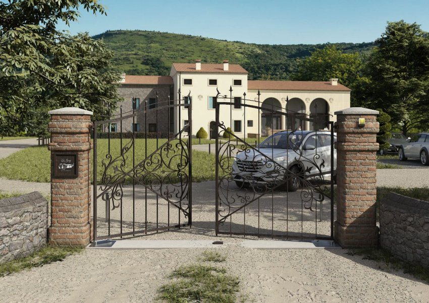
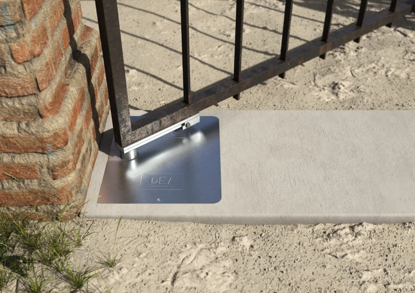
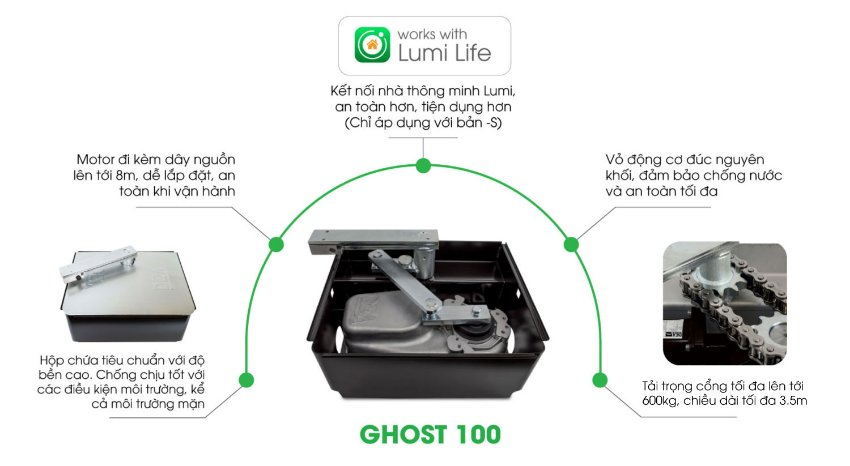
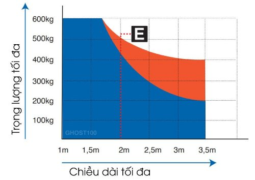
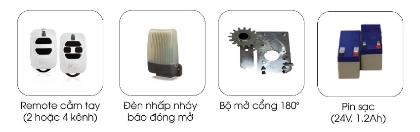

*Cổng tự động âm sàn GHOST 100 là một sản phẩm công nghệ tiên tiến  với độ chính xác cao và tính năng bảo mật vượt trội. Cổng tự động này đang ngày càng trở thành một giải pháp được ưa chuộng trong các khu vực đông dân cư, như: nhà ở, biệt thự hay khuôn viên sân bay, khách sạn… Trong bài viết này, chúng ta sẽ tìm hiểu chi tiết hơn về tính năng và ứng dụng của cổng tự động GHOST 100.*
## **1. Thông số kỹ thuật cổng tự động âm sàn GHOST 100**

|**Thông số kỹ thuật**|**Bản 230V**|**Bản 24V**|
| :- | :- | :- |
|Tích hợp bộ dừng cơ học|Không|Có|
|Hỗ trợ lắp pin dự phòng|Không|Có|
|Nguồn vào motor (V)|230V ~ ± 10 % (50/60 Hz)|24V ​⎓|
|Năng lượng tiêu thụ tối đa (W)|250|50|
|Momen xoắn cực đại (Nm)|250|200|
|Số lần đóng mở cửa tối đa trong 1 giờ|18 – 25|40|
|Số lần đóng mở cửa tối đa trong 24 giờ|100|100|
|Số lượng tụ điện|10|/|
|Nhiệt độ hoạt động lý tưởng (°C)|-20 đến 50|-20 đến 50|
|Khả năng chịu nhiệt của motor (°C)|150|/|
|Thời gian mở góc 90° (giây)|16|14|
|Trọng lượng sản phẩm khi đóng gói (kg)|11|11|
|Độ lớn âm thanh khi hoạt động (dBA)|< 70|< 70|
|Khả năng chống chịu nước và bụi|IP67|IP67|

\>> Xem thêm sản phẩm: [***Cổng trượt tự động GULLIVER/18NET Lumi***](https://lumi.vn/san-pham/cong-truot-tu-dong-gulliver-18net.html)
## **2. Đặc điểm cổng tự động âm sàn GHOST 100**
- Cổng tự động GHOST 100 là một giải pháp vô cùng tối ưu cho những người muốn tìm kiếm sự tiện lợi và an toàn khi sử dụng cổng của gia đình mình. Với khả năng chịu được **trọng lượng lên tới 400kg** và **chiều dài tối đa lên đến 3.5m**, GHOST 100 có thể hoàn toàn đáp ứng nhu cầu của bạn.
- Thiết kế âm sàn của động cơ cổng mang đến một không gian rộng rãi và thoáng đãng, đồng thời bảo đảm sự an toàn tuyệt đối cho các thành viên trong gia đình, đặc biệt là trẻ em. Bạn sẽ không còn phải lo lắng về việc va chạm hay mất an toàn khi di chuyển qua lại qua cổng.

*Cổng tự động âm sàn GHOST 100*

- Ngoài ra, GHOST 100 còn được trang bị vỏ động cơ đúc từ nhôm nguyên khối, đảm bảo tính chống nước cao theo tiêu chuẩn IP67. Nhờ đó giúp sản phẩm tăng cường độ bền và độ ổn định trong quá trình sử dụng, giúp bạn yên tâm sử dụng trong thời gian dài.
- Cổng tự động âm sànGHOST 100 và [***cổng tự động âm sàn GHOST 200***](https://lumi.vn/san-pham/cong-tu-dong-am-san-ghost200-cl.html) hiện là hai sản phẩm có khả năng thiết kế âm sàn duy nhất trên thị trường với các tính năng tiên tiến này. Vì vậy, bạn hoàn toàn có thể tự tin lựa chọn GHOST 100 để mang đến sự tiện ích và đẳng cấp cho cổng nhà bạn.

*Cổng thông minh âm sàn Ghost 100*
## **3. Tính năng nổi bật của cổng thông minh âm sàn Ghost 100**
Cổng tự động GHOST 100 là sản phẩm được thiết kế để đáp ứng nhu cầu của khách hàng với các tính năng tân tiến và hiện đại. Cụ thể:

*Tính năng nổi bật của cổng thông minh âm sàn Ghost 100*

- Với motor mạnh mẽ đi kèm dây nguồn lên tới 8m giúp việc lắp đặt và vận hành cổng trở nên dễ dàng hơn bao giờ hết; tiết kiệm thời gian và công sức cho người sử dụng.
- Thiết kế hộp chứa tiêu chuẩn với độ bền cao giúp cổng chịu tốt với các điều kiện môi trường khắc nghiệt, bảo vệ motor và các linh kiện khác bên trong.
- Cổng tự động GHOST 100 có khả năng chịu tải lên tới 600 kg và chiều dài tối đa 3.5m, phù hợp với nhiều loại cổng khác nhau, từ cổng nhà dân dụng cho đến cổng công nghiệp.
- Cổng thông minh GHOST 100 có thể tích hợp vào hệ thống nhà thông minh Lumi giúp tăng cường tính an toàn và tiện lợi cho người sử dụng. Tính năng này cho phép người sử dụng điều khiển cổng từ xa bằng điện thoại hoặc máy tính bảng, giúp tiết kiệm thời gian và nâng cao trải nghiệm sử dụng của khách hàng.

*Tải trọng tối đa của sản phẩm (biểu đồ màu cam):*

*Tải trọng tối đa của sản phẩm (biểu đồ màu cam)*
## **4. Trong hộp sản phẩm GHOST 100 có gì?**
Hộp đóng gói sản phẩm cổng tự động thông minh GHOST 100 được đóng gói full bộ bao gồm:

- 02 cơ cấu vận hành
- 02 đế Inox
- 01 Hộp điều khiển
- 02 Remote cầm tay
- 01 Bộ cảm biến an toàn
## **5. Phụ kiện cho động cơ cổng âm sàn GHOST 100**
### ***5.1. Phụ kiện cho bản 24V***
Phụ kiện cho cổng tự động Lumi – Dea cho công âm sàn GHOST 100  bao gồm:

*Phụ kiện cho động cơ cổng âm sàn GHOST 100 – 24V*

Phụ kiện hoàn hảo cho cổng tự động Lumi – Dea công nghệ âm sàn GHOST 100 bao gồm:

- Remote cầm tay: Điều khiển cổng một cách dễ dàng từ xa, tạo sự thuận tiện và linh hoạt cho trải nghiệm sử dụng.
- Đèn nhấp nháy báo đóng mở: Thông qua đèn nhấp nháy, bạn dễ dàng nhận biết trạng thái hoạt động của cổng, tạo sự an toàn và thông tin rõ ràng.
- Bộ mở cổng 180 độ: Với khả năng mở cổng đạt 180 độ, giúp tối ưu hóa không gian di chuyển và sử dụng cổng một cách hiệu quả.
- Pin sạc 24V, 1.2Ah: Pin sạc cung cấp nguồn năng lượng liên tục cho hệ thống cổng, đảm bảo hoạt động ổn định ngay cả khi mất nguồn chính.

Với những phụ kiện này, cổng tự động Lumi – Dea GHOST 100 sẽ hoàn thiện trải nghiệm sử dụng của bạn với tính năng đa dạng và tiện ích đáng giá.
### ***5.2. Phụ kiện cho động cơ cổng âm sàn GHOST 100 – 230V***
Phụ kiện cho động cơ cổng âm sàn GHOST 100 – 230V bao gồm:

- Remote cầm tay: Điều khiển cổng một cách dễ dàng từ xa thông qua remote cầm tay tiện lợi.
- Đèn nhấp nháy báo đóng mở: Đèn báo trạng thái mở hoặc đóng cổng, giúp bạn dễ dàng theo dõi trạng thái hoạt động của cổng.
- Bộ mở cổng 180 độ: Cho phép cổng mở 180 độ, tạo sự thuận tiện và an toàn trong việc di chuyển qua lại.

*Phụ kiện cho động cơ cổng âm sàn GHOST 100 – 230V*

Trên đây là những thông tin chi tiết về công tự động âm sàn của Lumi. Để có thể cập nhật những thông tin nhanh nhất, hãy truy cập Lumi Việt Nam với thông tin được cập nhật liên tục hàng tuần.
