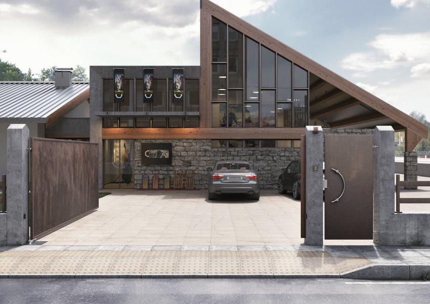
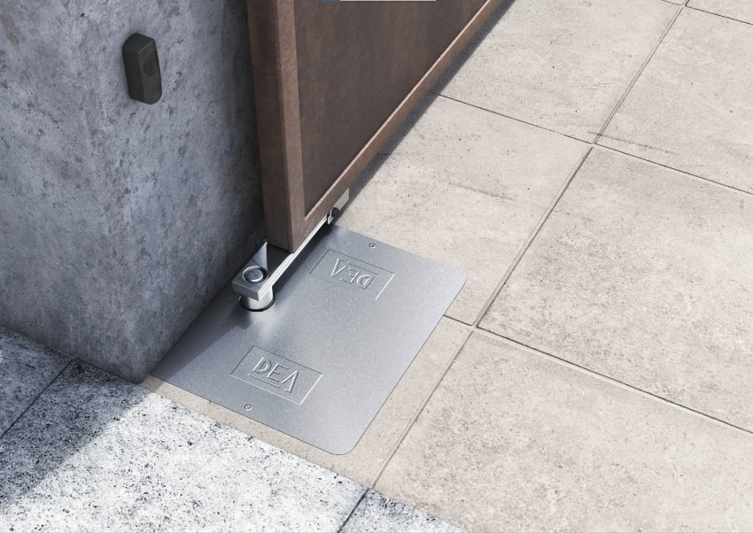
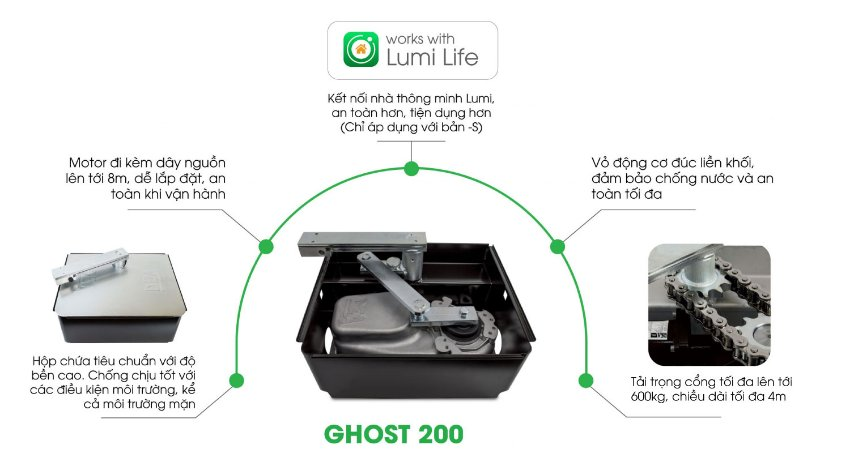
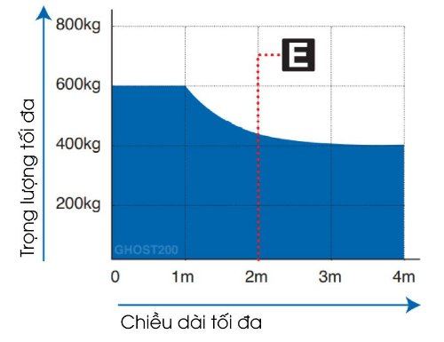
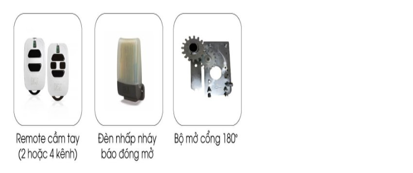

*Cổng tự động âm sàn GHOST 200 mang đến trải nghiệm mở cửa vượt trội với công nghệ tiên tiến và hiệu suất cao. Với hệ thống động cơ mạnh mẽ và cơ chế hoạt động chính xác, cổng thông minh âm sàn GHOST 200 mở và đóng một cách nhanh chóng, mượt mà, êm ái. Tìm hiểu chi tiết về sản phẩm trong bài viết dưới đây.*
## **1. Thông số kỹ thuật**

|**Thông số kỹ thuật**|**Chỉ số**|
| :- | :- |
|Nguồn vào motor (V)|230V ~ ± 10 % (50/60 Hz)|
|Năng lượng tiêu thụ tối đa (W)|400|
|Momen xoắn cực đại (Nm)|320|
|Số lần đóng mở cửa tối đa trong 1 giờ|20 – 28|
|Số lần đóng mở cửa tối đa trong 24 giờ|200|
|Số lượng tụ điện|12uF|
|Nhiệt độ hoạt động lý tưởng (°C)|-20 – 50|
|Khả năng chịu nhiệt của motor (°C)|150|
|Thời gian mở góc 90° (giây)|17s|
|Trọng lượng sản phẩm khi đóng gói (kg)|14\.5kg|
|Độ lớn âm thanh khi hoạt động (dBA)|< 70|
|Khả năng chống chịu nước và bụi|IP67|
## **2. Đặc điểm cổng tự động âm sàn GHOST 200**
- Cổng tự động âm sàn GHOST 200 có thể mở cổng với **chiều dài lên đến 4m** và **cân nặng lên tới 400kg**. Cái tên đã nói lên tất cả “GHOST”: Động cơ này hoàn toàn được ẩn dưới nền cổng và hoạt động với độ chính xác và an toàn tối đa cho các thành viên trong gia đình và phương tiện ra vào cổng
- GHOST 100 và GHOST 200 là 2 mẫu [***cổng thông minh***](https://lumi.vn/cong-tu-dong-thong-minh-lumi-dea.html) duy nhất trên thị trường có vỏ động cơ được **đúc từ nhôm nguyên khối**, đạt tiêu chuẩn chống nước **IP67.**

*Hình ảnh thực tế cổng tự động âm sàn GHOST 200*

*Hình ảnh thực tế cổng tự động âm sàn GHOST 200 2*
## **3. Tính năng nổi bật cổng âm sàn GHOST 200**
Sản phẩm cổng âm sàn GHOST 200 có nhiều tính năng nổi bật như:

*Tính năng nổi bật cổng âm sàn GHOST 200*

- Có khả năng chống nước và an toàn tối đa nhờ vỏ động cơ làm từ nhôm nguyên khối, có khả năng chịu tác động thời tiết tốt.
- Motor đi kèm dây nguồn lên tới 8m dễ dàng lắp đặt và an toàn tuyệt đối khi vật hành.
- Hộp chứa tiêu chuẩn với độ bền cao và có khả năng chịu thời tiết khắc nghiệt, kể cả môi trường mặn.
- tải trọng cổng tối đa lên tới 600Kg, chiều dài tối đa 4m.
- Kết nối nhà thông minh Lumi, điều khiển tự động thông qua điện thoại giúp an toàn hơn và tiên dụng hơn. (Đây là chức năng dành riêng cho bản S)

*Trọng tải tối đa của sản phẩm:*

*Trọng tải tối đa của sản phẩm*
## **4. Trong hộp của sản phẩm GHOST 200 có gì?**
Hộp sản phẩm GHOST 200 được đóng gói với các thành phần:

- 02 cơ cấu vận hành, 230VAC
- 02 đế Inox
- 01 Hộp điều khiển NET230N/C
- 02 Điều khiển cầm tay
- 01 Bộ cảm biến an toàn
## **5. Phụ kiện cho động cơ cổng âm sàn GHOST 200**

*Phụ kiện cho động cơ cổng âm sàn GHOST 200*

Cổng tự động âm sàn GHOST 200 sẽ đáp ứng mọi yêu cầu của bạn về một hệ thống cửa tự động hoạt động mượt mà và đáng tin cậy. Bạn có thể tận hưởng sự dễ dàng và nhanh chóng khi mở và đóng cổng, đồng thời tiết kiệm năng lượng và tối ưu hóa hiệu suất sử dụng. Hãy liên hệ ngay hotline để nhận được tư vấn chi tiết nhất cho cửa cổng nhà bạn.

Xem thêm một số sản phẩm về giải pháp cổng tự động của Lumi:

- [***Phụ kiện cho cổng tự động Lumi – Dea***](https://lumi.vn/san-pham/phu-kien-them-cho-cong-tu-dong.html)
- [***Cổng trượt thông minh GULLIVER/18NET***](https://lumi.vn/san-pham/cong-truot-tu-dong-gulliver-18net.html)
- [***Bộ sản phẩm Smart Gate Module Lumi***](https://lumi.vn/san-pham/bo-san-pham-smart-gate-module.html)
