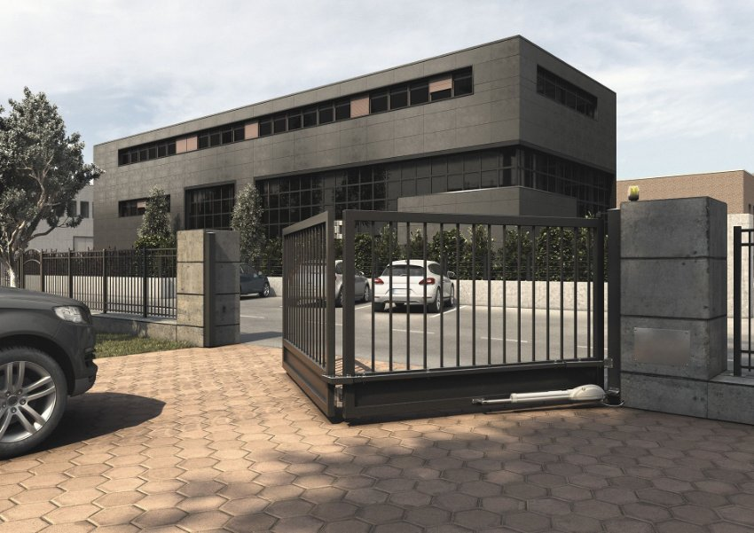
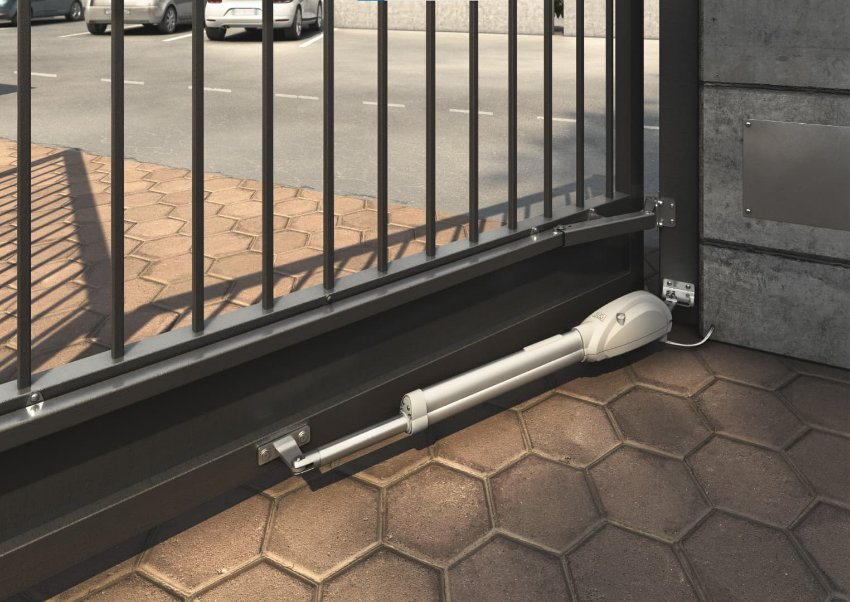
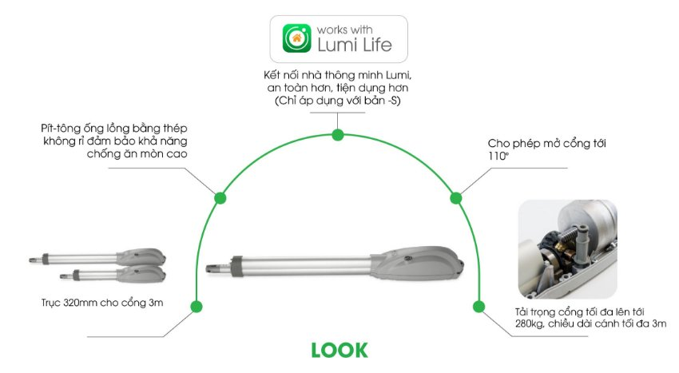
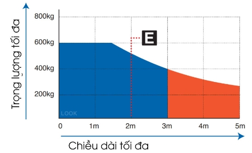
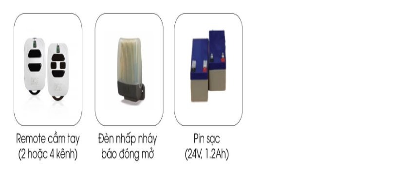

*Cổng tự động tay đòn LOOK được lắp đặt và tùy chỉnh cho nhiều kiểu dáng và kích thước cổng khác nhau. Bạn có thể dễ dàng điều chỉnh tốc độ mở cổng, đảm bảo nhanh chóng và an toàn cho xe cộ và người dùng. Đặc biệt, tính năng tự động dừng khi phát hiện vật cản giúp tránh các va chạm không mong muốn và bảo vệ an toàn cho mọi người. Tìm hiểu chi tiết hơn về sản phẩm thông qua các thông tin dưới đây.*
## **1. Thông số kỹ thuật cổng tự động cánh tay đòn LOOK**

|**Thông số kỹ thuật**|**Chỉ số**|
| :- | :- |
|Tích hợp bộ dừng cơ học|Có|
|Hỗ trợ lắp pin dự phòng|Có|
|Nguồn vào motor (V)|24VDC|
|Năng lượng tiêu thụ tối đa (W)|600|
|Momen xoắn cực đại (Nm)|1000|
|Số lần đóng mở cửa tối đa trong 1 giờ|40|
|Số lần đóng mở cửa tối đa trong 24 giờ|110|
|Số lượng tụ điện|/|
|Nhiệt độ hoạt động lý tưởng (°C)|-20 đến 50|
|Khả năng chịu nhiệt của motor (°C)|/|
|Thời gian mở góc 90° (giây)|15|
|Trọng lượng sản phẩm khi đóng gói (kg)|9|
|Độ lớn âm thanh khi hoạt động (dBA)|< 70|
|Khả năng chống chịu nước và bụi|IP24|
## **2. Đặc điểm cổng tự động tay đòn LOOK**
- Với những cổng rộng và dài sử dụng trong biệt thự hoặc trong khu cơ quan, cổng tự động tay đòn LOOK là một lựa chọn phù hợp.
- Với phiên bản mới cổng tự động cánh tay đòn có trục dài 320mm, cổng tự động LOOK có thể mở được cổng có chiều dài lên đến 3 mét, và tải trọng tối đa 280kg

*Cổng thông minh tay đòn Look*

*Hình ảnh thực tế cổng thông minh tay đòn Look*
## **3. Tính năng nổi bật của cửa tự động LOOK**

*Các tính năng nổi bật của cửa tự động LOOK*

Tính năng nổi bật của cửa tự động LOOK bao gồm:

- Thiết kế hiện đại: Cửa tự động LOOK tạo điểm nhấn độc đáo cho không gian sống với thiết kế đẹp mắt và hiện đại; dễ dàng lắp đặt.
- Tiện ích và an toàn: Với khả năng tự động mở/đóng linh hoạt, cửa LOOK mang đến sự tiện nghi và an toàn cho ngôi nhà hoặc doanh nghiệp của bạn.
- Tùy chỉnh linh hoạt: Có thể điều chỉnh tốc độ mở/đóng và chế độ hoạt động phù hợp với nhu cầu riêng của bạn.
- Liên kết thông minh: Kết nối với hệ thống [***smart home***](https://lumi.vn/) (chỉ đối với bản S), người dùng có thể điều khiển và giám sát cửa từ xa qua ứng dụng di động, tạo môi trường sống hiện đại và tiện nghi.
- Vật liệu chất lượng: Sản phẩm sử dụng vật liệu cao cấp, đảm bảo độ bền và đẳng cấp vượt trội.

***Tải trọng tối đa của sản phẩm (biểu đồ màu xanh)***

*Tải trọng tối đa của sản phẩm (biểu đồ màu xanh)*
## **4. Trong hộp sản phẩm LOOK có gì?**
Hộp đóng gói sản phẩm cổng tự động cánh tay đòn bao gồm:

- 02 cơ cấu vận hành, 24 VDC
- 01 Hộp điều khiển NET24N/C
- 02 Điều khiển xa cầm tay
- 01 Bộ cảm biến an toàn
## **5. Các phụ kiến đi kèm cho động cơ cổng âm sàn LOOK**
Các [***phụ kiện cho cổng thông minh Lumi – Dea***](https://lumi.vn/san-pham/phu-kien-them-cho-cong-tu-dong.html) đi kèm cho động cơ cổng âm sàn là sự bổ sung quan trọng để nâng cao hiệu suất và tiện ích của hệ thống cổng. Dưới đây là danh sách chi tiết các phụ kiện:

*Phụ kiện cho động cơ cổng âm sàn LOOK*
### ***5.1. Remote cầm tay (2 hoặc 4 kênh)***
- Được cung cấp với 2 hoặc 4 kênh điều khiển, remote cầm tay cho phép bạn dễ dàng điều khiển cổng từ xa mà không cần phải tiếp cận trực tiếp.
- Với remote cầm tay này tạo sự thuận tiện và linh hoạt trong việc mở và đóng cổng theo ý muốn.
### ***5.2. Đèn nhấp nháy báo đóng mở***
- Đèn nhấp nháy được thiết kế để thông báo trạng thái mở hoặc đóng của cổng.
- Với đèn báo chuẩn trạng thái giúp người dùng dễ dàng nhận biết trạng thái hoạt động của cổng mà không cần phải kiểm tra từ xa hoặc gần.
### ***5.3. Pin sạc 24V, 1.2Ah***
- Pin sạc cung cấp năng lượng cho hệ thống động cơ cổng âm sàn, đảm bảo hoạt động liên tục và ổn định ngay cả khi không có nguồn điện chính.
- Với dung lượng 1.2Ah và điện áp 24V, pin sạc đảm bảo khả năng cung cấp đủ năng lượng cho hoạt động của cổng trong thời gian dài.

Với các tùy chọn thiết kế đa dạng và phong cách đẹp mắt, cổng tự động tay đòn LOOK là sự kết hợp hoàn hảo giữa tính năng và thẩm mỹ. Không chỉ mang lại sự an toàn và tiện lợi, cổng tự động tay đòn LOOK còn là một điểm nhấn thú vị cho kiến trúc tổng thể và tạo nên một không gian sống đẳng cấp. Liên hệ ngay để được tư vấn chu đáo nhất.

**Tham khảo thêm một số sản phẩm cổng tự động thông minh nổi bật của Lumi:**

- [***Cổng tự động âm sàn GHOST 100***](https://lumi.vn/san-pham/cong-tu-dong-am-san-ghost100-cl.html)
- [***Cổng tự động GHOST 200***](https://lumi.vn/san-pham/cong-tu-dong-am-san-ghost200-cl.html)
