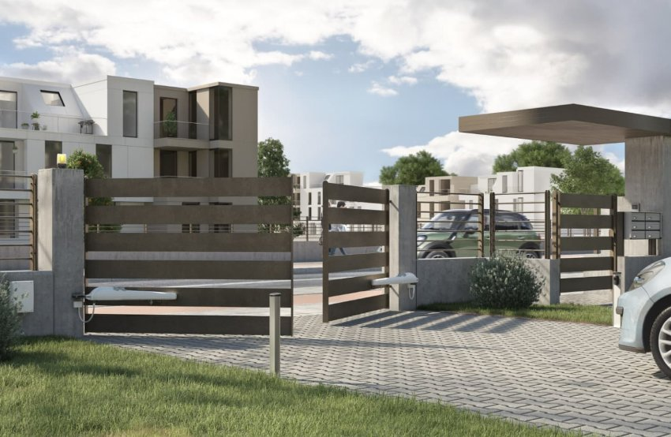
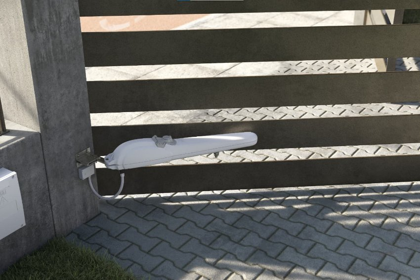
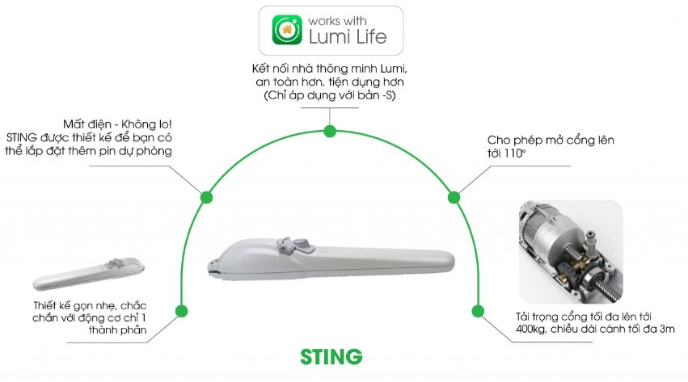
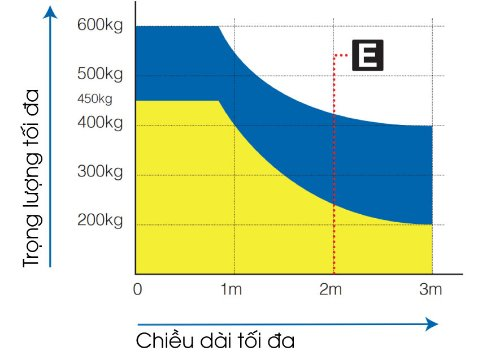
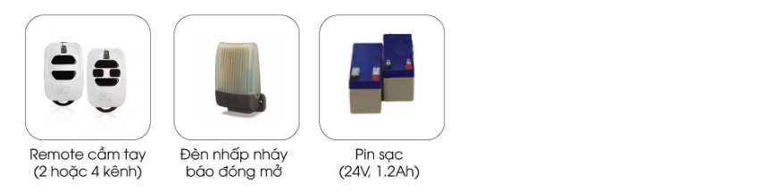
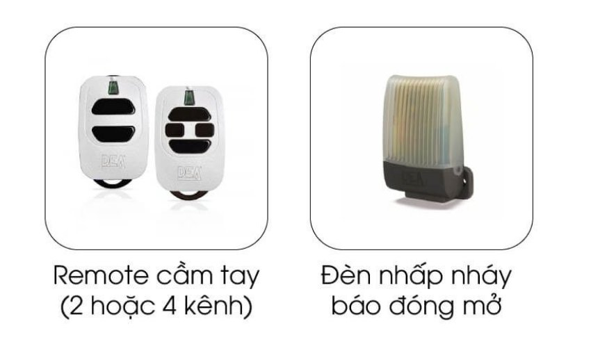

*Cổng tự động tay đòn STING là sản phẩm công nghệ cao, được thiết kế để đáp ứng nhu cầu kiểm soát ra vào tại nhà, biệt thự, toà nhà…. Với tính năng tự động hóa hoàn toàn, cổng thông minh tay đòn STING mang lại sự tiện ích và hiệu quả trong việc quản lý và bảo vệ khu vực. Để hiểu rõ hơn về sản phẩm động cơ cổng thông minh này, hãy xem ngay những thông tin dưới đây của chúng tôi.*
## **1. Thông số kỹ thuật**

|**Thông số kỹ thuật**|**Bản 230V**|**Bản 24V**|
| :- | :- | :- |
|Tích hợp bộ dừng cơ học|Không|Có|
|Hỗ trợ lắp pin dự phòng|Không|Có|
|Nguồn vào motor (V)|230V ~ ± 10 % (50/60 Hz)|24V ​|
|Năng lượng tiêu thụ tối đa (W)|300|50|
|Momen xoắn cực đại (Nm)|1650|1000|
|Số lần đóng mở cửa tối đa trong 1 giờ|18|40|
|Số lần đóng mở cửa tối đa trong 24 giờ|90|90|
|Số lượng tụ điện|8uF|/|
|Nhiệt độ hoạt động lý tưởng (°C)|-20 đến 50|-20 đến 50|
|Khả năng chịu nhiệt của motor (°C)|150|/|
|Thời gian mở góc 90° (giây)|16|16|
|Trọng lượng sản phẩm khi đóng gói (kg)|8\.8|8\.8|
|Độ lớn âm thanh khi hoạt động (dBA)|< 70|< 70|
|Khả năng chống chịu nước và bụi|IPX4|IPX4|

\>> Xem thêm sản phẩm:[` `***Cổng trượt tự động LIVI***](https://lumi.vn/san-pham/cong-truot-tu-dong-livi.html)
## **2. Ưu điểm cổng tự động tay đòn STING**
- Cổng tự động STING có thể sử dụng cho cổng xoay của biệt thự hoặc khu cơ quan. Động cơ này có thể tải được cổng nặng tới 400kg với chiều dài tối đa 3m, phù hợp với phần lớn nhu cầu sử dụng trong thành phố.
- Sản phẩm được thiết kế nguyên khối, liền mạch, mang lại cảm giác chắc chắn và sự gọn gàng về không gian. Đặc biệt, sản phẩm có thể dễ dàng tích hợp vào hệ thống [nhà thông minh](https://lumi.vn/) của Lumi.

*Cổng tự động tay đòn thông minh STING 2-100 s*
### ***2.1. Tự động hoá mở cổng***
- Với tính năng tự động hoạt động, cổng tự động tay đòn STING tự động mở và đóng thông qua app điều khiển nhà thông minh.
- Sản phẩm giúp tiết kiệm thời gian mà còn đảm bảo sự thuận tiện và an toàn cho người sử dụng.
### ***2.2. Thiết kế độc đáo***
- Cổng tự động tay đòn STING có thiết kế độc đáo với hệ thống cánh cổng tay đòn, tạo nên một diện mạo hiện đại và thẩm mỹ cho công trình.
- Kích thước nhỏ gọn với màu sắc đen và trắng; cho người dùng dễ dàng lựa chọn phù hợp với không gian công và phong cách kiến trúc.
### ***2.3. An toàn và bảo mật***
- Cổng tự động tay đòn STING được trang bị các tính năng an toàn và bảo mật cao. Hệ thống cảm biến thông minh giúp phát hiện và tránh va chạm, đảm bảo an toàn cho người và phương tiện.
- Ngoài ra, tính năng kiểm soát truy cập và tích hợp với hệ thống giám sát cũng đảm bảo sự an ninh và bảo mật cho khu vực được bảo vệ.

*Cổng tự động tay đòn thông minh STING ảnh thực tế*

Xem thêm sản phẩm: [***Cổng tự động tay đòn LOOK***](https://lumi.vn/san-pham/cong-tu-dong-tay-don-look/)
## **3. Tính năng nổi bật của công thông minh tay đòn STING**
Cổng tự động tay đòn STING được trang bị một loạt các tính năng nổi bật, giúp nó trở thành một giải pháp đáng tin cậy trong việc kiểm soát ra vào. Dưới đây là những tính năng quan trọng của cổng tự động tay đòn STING:

*Tính năng nổi bật của công thông minh tay đòn STING*

- Lắp pin dự phòng: Cổng tự động tay đòn STING có thể lắp pin dự phòng, giúp duy trì hoạt động của cổng khi mất điện. Đảm bảo rằng người dùng không cần lo lắng về việc mất điện và mất khả năng kiểm soát ra vào.
- Góc mở cổng linh hoạt: Cổng thông minh tay đòn STING cho phép mở cổng đến góc lên đến 110 độ; tạo ra sự linh hoạt trong việc kiểm soát và điều chỉnh lưu thông, đáp ứng nhu cầu của các khu vực có dòng xe qua lại lớn.
- Thiết kế chắc chắn: Cổng tự động STING được thiết kế với động cơ chỉ 1 thành phần, tạo nên một hệ thống chắc chắn và ổn định.Từ đó mang đến hiệu suất hoạt động cao và độ bền lâu dài của cổng.
- Tải trọng lớn: Cổng có khả năng chịu tải trọng tối đa lên đến 400kg và chiều dài cách tối đa 3m; cho phép cổng hoạt động một cách ổn định và linh hoạt trong việc điều khiển ra vào cho các phương tiện có kích thước và trọng lượng lớn.

*Tải trọng tối đa của sản phẩm (biểu đồ màu xanh)*

*Tải trọng tối đa của sản phẩm (biểu đồ màu xanh)*
## **4. Trong hộp sản phẩm STING có gì?**
- 02 cơ cấu vận hành, 230 VAC
- 01 Hộp điều khiển NET230N/C (đối với bản 230V) hoặc 01 Hộp điều khiển NET24N/C (đối với bản 24V)
- 02 Điều khiển xa cầm tay 2 nút
- 01 Bộ cảm biến an toàn
## **5. Phụ kiện cho động cơ cổng tay đòn STING**
### ***5.1. Phụ kiện cho động cơ cổng tay đòn STING – 24V***

*Phụ kiện cho động cơ cổng tay đòn STING – 24V*
### ***5.2. Phụ kiện cho động cơ cổng tay đòn STING – 230V***

*Phụ kiện cho động cơ cổng tay đòn STING – 230V*

Có thể nói, cổng tự động tay đòn STING là một lựa chọn lý tưởng cho việc kiểm soát ra vào trong các công trình, đảm bảo tính an toàn, linh hoạt và tiện lợi. Liên hệ ngay hotline để nhận được sự tư vấn chi tiết từ đội ngũ chuyên môn của Lumi.

Xem thêm sản phẩm: [***Cổng thông minh Lumi GHOST 100***](https://lumi.vn/san-pham/cong-tu-dong-am-san-ghost100-cl/)
