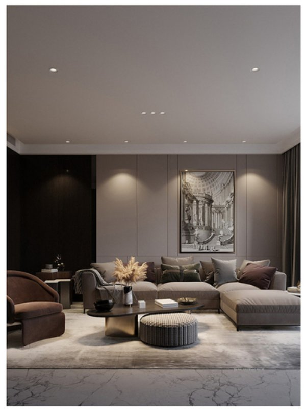
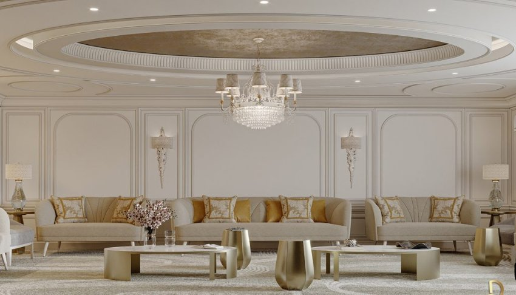

*Đèn downlight 10W âm trần của Lumi có kiểu dáng thiết kế đơn giản, độ bền vượt trội cùng công nghệ chiếu sáng tiên tiến, giúp mang tới nguồn ánh sáng chất lượng và những trải nghiệm thú vị cho không gian sống. Đặc biệt, tuổi thọ của đèn lên tới hơn 25.000h và được bảo hành 3 năm 1 đổi 1 bởi Lumi. Cùng Lumi tìm hiểu chi tiết hơn về dòng đèn downlight đang được ưa chuộng trên thị trường hiện nay.*

*Đèn downlight 10W chiếu sáng phòng khách*
## **1. Cấu tạo đèn downlight 10W**
Đèn LED downlight 10W có cấu gồm 3 phần: vỏ đèn, chip LED, tăng phô (chấn lưu)

- Vỏ đèn: Vỏ đèn được làm từ chất liệu cao cấp, trọng lượng nhẹ, tản nhiệt tốt và có khả năng chống oxy hóa, han rỉ tốt. Do đó giúp đèn có thể chống chọi lại với thời tiết khí hậu nóng ẩm của Việt Nam.
- Chip LED: Đèn sử dụng dòng chip LED cao cấp của Mỹ – chip Bridgelux với công suất, hiệu suất phát quang cao, ổn định. Vì vậy quang thông của đèn downlight 10W rất cao và cho ra nguồn sáng chất lượng.
- Tăng phô (chấn lưu): Tăng phô thiết kế rời khỏi đèn giúp giảm trọng lượng, lượng nhiệt cho đèn trong quá trình sử dụng, và tăng độ bền cho đèn.

\>> Xem thêm mẫu sản phẩm: [***Đèn downlight 12W***](https://lumi.vn/san-pham/den-downlight-12w.html)
## **2. Đặc điểm nội bật của đèn downlight âm trần 10W**
- Ánh sáng chân thực: Đèn có chỉ số hoàn màu CRI>90 giúp tăng nhận diện màu sắc của vật thể và tăng chiều sâu cho không gian.
- Chất lượng bền bỉ, vượt trội: Vỏ đèn được làm từ nhôm đúc kết hợp xử lý bề mặt sơn kỹ lưỡng nên đèn downlight 10W có khả năng chống lại mọi tác nhân ăn mòn từ môi trường
- Phù hợp mọi phong cách nội thất: Sản phẩm được thiết kế đơn giản, nhỏ gọn, kết hợp lắp âm trên trần nên đèn gần như lắp đặt được ở mọi phong cách nội thất từ hiện đại tới cổ điển, tạo nên nhiều không gian sống nổi bật và phục vụ nhiều mục đích chiếu sáng khác nhau
- Tuổi thọ đèn cao: Đèn downlight âm trần 10W có tuổi thọ hơn 25.000h, giúp người dùng hạn chế việc thay mới liên tục, từ đó tiết kiệm chi phí hiệu quả
- Chip LED cao cấp: Đèn dùng chip Bridgelux của Mỹ cho nguồn ánh sáng chất lượng, đều màu
- An toàn cho người dùng và môi trường: Đèn mang tới nguồn ánh sáng êm dịu, không chứa các chất độc hại như thủy ngân, tia UV nên không gây hại cho mắt cũng như thân thiện với môi trường tự nhiên.
- Tham gia vào hệ sinh thái [nhà thông minh Lumi](https://lumi.vn/): Chỉ cần nâng cấp chấn lưu bằng cách tích hợp driver của Lumi, đèn led downlight 10W âm trần sẽ trở nên thông minh. Giờ đây người dùng có thể điều chỉnh cường độ sáng hay điều khiển bật/tắt dễ dàng qua smartphone. Không những thế người dùng còn có thể sáng tạo những kịch bản chiếu sáng độc đáo, thay đổi nhiệt độ màu hoặc kịch bản sống khác nhau nhằm gia tăng tính tiện nghi cho ngôi nhà khi dùng dòng downlight 10W Tunable white.
## **3. Ứng dụng đèn downlight 10W trong cuộc sống**
Với thiết kế góc chiếu sáng 80º, đèn downlight 10W được lắp đặt trong không gian nhằm mục đích chiếu sáng tổng thể và chiếu sáng chức năng. Điều này có nghĩa là cung cấp nguồn sáng cần thiết, đảm bảo khả năng nhìn thấy của con người trong không gian. Xét trong chiếu sáng nghệ thuật đèn LED downlight âm trần 10W sẽ được dùng làm nền cho các dòng đèn spotlight.

*Ánh sáng đèn âm trần 10w nâng đỡ hiệu quả cho các chi tiết nội thất*

Mặc dù là dòng chiếu sáng cơ bản nhưng vì đặc tính của đèn mà nó là dòng sản phẩm không thể thiếu trong mỗi không gian, nhằm hỗ trợ và phục vụ cho các hoạt động sinh hoạt hàng ngày của con người. Cũng chính vì thế mà LED downlight 10W được ứng dụng rất rộng rãi ở hầu hết các không gian chức năng của nhà ở, khách sạn, trung tâm thương mại,…

Nếu bạn đang cần một chiếc đèn chiếu sáng tổng thể, chiếu sáng chức năng có ánh sáng chất lượng cao, độ bền vượt trội và giá thành hấp dẫn thì đèn downlight 10W là một lựa chọn bạn không nên bỏ qua. Để được tư vấn chi tiết về đèn downlight 10W cũng như thiết kế chiếu sáng cho ngôi nhà, bạn đừng ngại hãy liên hệ tới Lumi qua số hotline 0904.665.965 để được hỗ trợ nhanh nhất.

**Xem thêm một số mẫu đèn phổ biến khác:**

- [***Đèn LED Downlight âm trần***](https://lumi.vn/san-pham/den-led-downlight-thong-minh-am-tran.html)
- [***Đèn LED panel 600x600mm thông minh***](https://lumi.vn/san-pham/den-led-panel-thong-minh-600x600mm.html)
