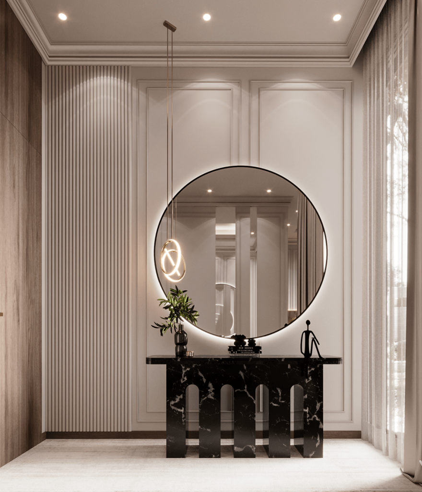
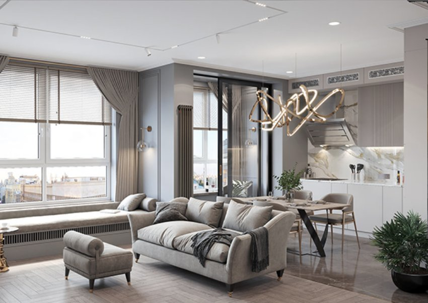
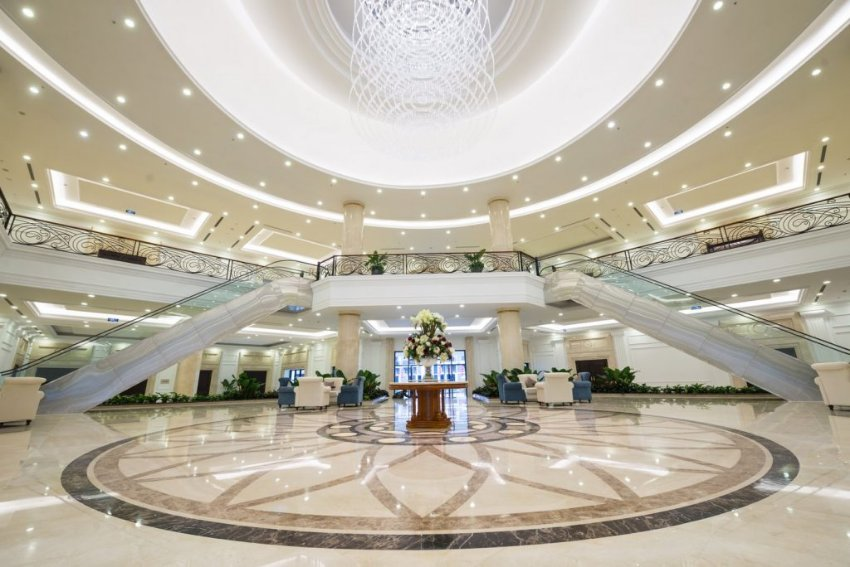
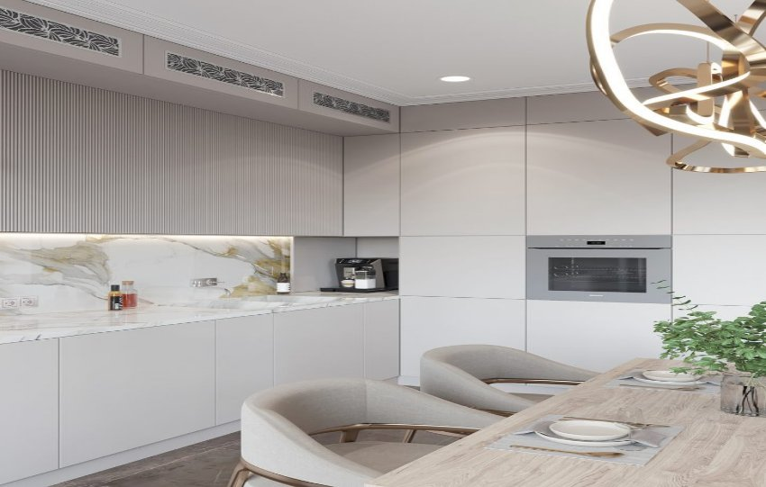

*Đèn downlight 12W của Lumi được làm từ vật liệu cao cấp, kết hợp cùng công nghệ chiếu sáng hiện đại cho độ bền vượt trội và mang tới nguồn sáng nâng đỡ hiệu quả cho các không gian nội thất. Bên cạnh đó, với tuổi thọ đèn lên tới hơn 25.000h cùng bảo hành 3 năm 1 đổi 1 mà đèn downlight âm trần 12W được rất nhiều người yêu thích lựa chọn. Cùng Lumi tìm hiểu chi tiết dòng đèn LED downlight âm trần 12W trong bài viết dưới đây.*
## **1. Cấu tạo đèn downlight 12W**
Tương tự các mẫu [***đèn LED thông minh***](https://lumi.vn/den-led-thong-minh) khác, đèn LED downlight 12W âm trần cũng có cấu tạo gồm 3 phần chính:

- Vỏ đèn: Không giống các dòng đèn downlight khác, đèn LED downlight âm trần 12W có trọng lượng rất nhẹ do vỏ được làm từ chất liệu cao cấp. Vỏ đèn có tác dụng cố định đèn vào trần trong quá trình lắp đặt.
- Chip LED: Chip LED là bộ phận phát ra nguồn sáng, chính vì vậy đòi hỏi chip LED phải thật sự tốt để tạo ra ánh sáng chất lượng. Với sản phẩm đèn downlight 12W, Lumi sử dụng dòng chip Bridgelux cao cấp của Mỹ có hiệu suất tốt và quang thông cao.
- Chấn lưu: Chấn lưu là bộ phận kiểm soát và cung cấp nguồn điện ổn định để đèn phát sáng. Trong thiết kế đèn downlight âm trần 12w, chấn lưu được thiết kế rời nhằm giảm trọng lượng và thuận tiện cho việc lắp đặt cũng như thay thế nếu đèn gặp lỗi khi chiếu sáng.

*Đèn downlight 12W chiếu sáng khu vực tiền sảnh biệt thự*

\>> Tham khảo thêm mẫu đèn cao cấp: [***Đèn LED Downlight thông minh âm trần***](https://lumi.vn/san-pham/den-led-downlight-thong-minh-am-tran.html)
## **2. Ưu điểm của đèn LED downlight âm trần 12W**
- Phản ánh chân thực màu sắc vật thể: Đèn có chỉ số hoàn màu CRI>90 giúp hỗ trợ các chi tiết nội thất trong không gian hiệu quả
- Chất lượng đèn vượt trội: Vỏ đèn được làm từ hợp kim nhôm cao cấp nên khó bóp méo, chống được sự oxy hóa từ tác động của môi trường.
- Đèn có tuổi thọ cao: Tuổi thọ đèn cao lên tới hơn 25.000h
- Chip LED chất lượng cao: Đèn sử dụng chip Bridgelux của Mỹ, một dòng chip LED cao cấp với công suất và hiệu suất phát quang tốt.
- Phù hợp với nhiều phong cách nội thất: Sở hữu kiểu dáng đơn giản không cầu kỳ cùng gam màu trắng nên đèn downlight 12W phù hợp với mọi phong cách nội thất ngày nay. Trong đó phải kể tới phong cách tân cổ điển, Á Đông, Taiwan, Indochine,…
- An toàn sử dụng, thân thiện môi trường: Đèn không chứa thủy ngân gây hại cho môi trường và không chứa tia hồng ngoại, tia cực tím gây hại cho mắt và da người dùng.
- Nâng cấp trở thành đèn thông minh: Sau khi được thêm driver của Lumi vào chấn lưu điện tử, đèn downlight âm trần 12W sẽ được điều khiển bật/tắt dễ dàng qua app Lumi Life dù ở nhất kỳ đâu. Đồng thời đèn còn được kết hợp cùng các giải pháp khác của [nhà thông minh](https://lumi.vn/) tạo thành những kịch bản sống tiện ích cho gia chủ. Thêm vào đó, dòng downlight 12w tunable white cho phép người dùng thay đổi nhiệt độ màu phù hợp nhu cầu.

*Đèn downlight 12W lắp đặt âm trên trần thạch cao*
## **3. Ứng dụng của đèn downlight âm trần 12W**
Đèn downlight 12W có góc chiếu lên tới 105º nên được ứng dụng trong các không gian nhằm mục đích chiếu sáng tổng thể, cung cấp nguồn sáng cần thiết cho người dùng. Trong chiếu sáng nghệ thuật, đèn LED downlight âm trần 12W thường được sử dụng làm lớp ánh sáng nền để tôn lên các loại chiếu sáng khác.

*LED downlight 12W chiếu sáng đại sảnh trung tâm thương mại*

- Vì được sản xuất nhằm đáp ứng nhu cầu nhìn thấy của người sử dụng nên đèn LED downlight âm trần 12W không thể thiếu trong mỗi không gian sống. Ở các công trình dân dụng như nhà ở dòng đèn này được lắp đặt ở tất cả các phòng chức năng, kể cả phòng tắm, logia.
- Tại các công trình lớn hơn như khách sạn, trung tâm thương mại,… đèn cũng được ứng dụng lắp đặt tại hầu hết các khu vực chức năng nhằm mang tới nguồn sáng cần thiết cho quá trình hoạt động của con người.

*Ứng dụng của đèn downlight âm trần 12W tại phòng bếp*

Với giá thành hợp lý, ưu điểm vượt trội cùng tính ứng dụng rộng rãi trong các công trình, đèn downlight 12W sẽ là một lựa chọn hoàn hảo để nâng đỡ vật liệu và tạo cảm xúc cho không gian sống của bạn. Liên hệ ngay tới [Lumi](https://lumilighting.vn/) qua số hotline 0904.665.965 để được tư vấn chi tiết và hỗ trợ thiết kế chiếu sáng miễn phí.

**Xem thêm các dòng đèn khác để có thêm sự lựa chọn:**

- [***Đèn panel thông minh 600x600mm***](https://lumi.vn/san-pham/den-led-panel-thong-minh-600x600mm.html)
- [***Đèn LED dây RGB 16 triệu màu thông minh***](https://lumi.vn/san-pham/den-led-day-thong-minh-rgb-16-trieu-mau.html)
