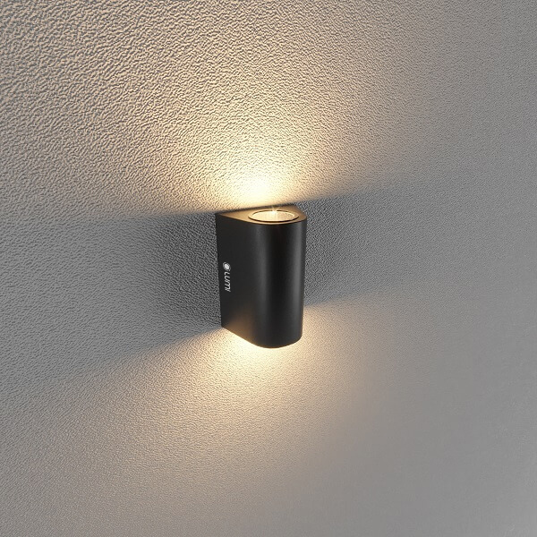
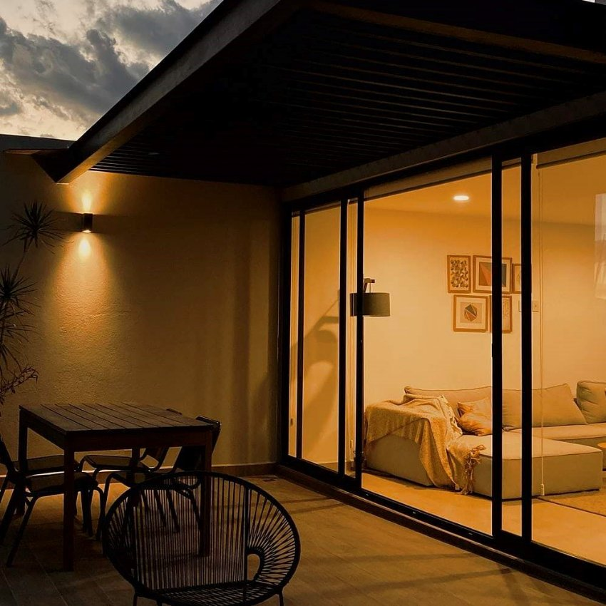

*Đèn gắn tường ngoài trời bán nguyệt 2\*5W thiết kế dựa trên xu hướng hình học đang được ưa chuộng trong thiết kế nội thất, chiếu sáng bởi tính thẩm mỹ và ứng dụng cao, phù hợp với nhiều không gian ngoại thất với thiết kế khác nhau. Trong đó, đèn gắn tường ngoài trời bán nguyệt thường được sử dụng cho những không gian mở như cửa ra vào, cổng lớn, lan can, ngoài mái hiên, khách sạn ngoài trời…Tìm hiểu chi tiết hơn về sản phẩm qua những thông tin dưới đây.*
## **1. Đặc điểm đèn gắn tường ngoài trời bán nguyệt 2\*5W**
- Đèn gắn tường ngoài trời bán nguyệt 2\*5W thiết kế mềm mại hình bán nguyệt ôm về phía tường cùng khả năng chiếu sáng 2 đầu, đèn cho ra một khung cảnh chiếu sáng với vẻ đẹp độc đáo.
- Thân đèn có màu đen cơ bản, nhờ đó phù hợp với nhiều loại không gian, kể cả trong nhà hay ngoài trời.
- Đặc biệt, đèn được ưu tiên sử dụng cho không gian ngoài trời, không có mái che nhờ độ kháng nước IP65, cho phép đèn hoạt động tốt trong môi trường ẩm ướt, chống nước, chống bụi hoàn hảo.

*Đèn gắn tường ngoài trời bán nguyệt*

\>> Xem thêm sản phẩm khác: [***Đèn rọi cây 5W chống nước***](https://lumi.vn/san-pham/den-roi-cay-5w-chong-nuoc.html)
## **2. Ứng dụng của đèn gắn tường ngoài trời bán nguyệt 2\*5W**
Đèn gắn tường ngoài trời hình bán nguyệt phù hợp để chiếu sáng các không gian trong nhà như phòng khách, hành lang để tạo điểm nhấn, hay các không gian ngoại thất như ban công, cổng, sân vườn nhằm trang trí cho khu vực bên ngoài. Nhờ công nghệ chiếu sáng tiên tiến và chỉ số hoàn màu cao, sản phẩm đem đến cho không gian trang trí ánh sáng nhẹ nhàng, êm dịu nhưng không hề kém phần sắc nét và đều màu. Đặc biệt hơn, đèn gắn tường của Lumi có ánh sáng gần với ánh sáng tự nhiên, hoàn toàn không gây hại cho mắt.

*Đèn gắn tường ngoài trời bán nguyệt được lắp cho không gian ngoại thất*

\>> Xem thêm sản phẩm cao cấp: [***Đèn LED downlight 10W***](https://lumi.vn/san-pham/den-downlight-10w.html)

Ngoài không gian nhà ở, đèn gắn tường ngoài trời còn được ưa chuộng ở các công trình công cộng cần tính thẩm mỹ cao như công viên, bảo tàng, hay các khu resort, khách sạn để làm nổi bật, tăng tính thẩm mỹ cho thiết kế công trình và khơi gợi bầu không khí cần thiết cho không gian. Được thiết kế với 2 đầu sáng cho 2 luồng ánh sáng khác nhau, đèn giúp làm nổi bật lên khung cảnh chiếu sáng và cho ra một vẻ đẹp độc đáo cho không gian.

*Ứng dụng của đèn gắn tường ngoài trời bán nguyệt*

\>> Xem thêm mẫu sản phẩm đèn nổi bật: [***LED downlight 12W***](https://lumi.vn/san-pham/den-downlight-12w.html)

Đèn gắn tường ngoài trời giúp tạo hiệu ứng thị giác tốt, tăng tính thẩm mỹ cho không gian nhờ vào chỉ số hoàn màu cao CRI >90, kết hợp với nhiệt độ màu 4000K giúp ánh sáng trở nên trung thực, sắc nét, hoàn toàn bảo vệ cho mắt. Bên cạnh đó, thân đèn được sản xuất tỉ mỉ từ nhôm đúc giúp kháng nước, đảm bảo cho đèn hoạt động tốt ngoài trời và duy trì tối đa tuổi thọ của đèn.
## **3. Ưu điểm của đèn gắn tường ngoài trời bán nguyệt 2\*5W**
- **Tính thẩm mỹ cao:** Ghi điểm mạnh mẽ bởi sự tinh tế, hài hòa và cân đối trong thiết kế, dễ dàng phù hợp với mọi không gian ngoại thất và khiến không gian lắp đặt thêm hiện đại, tươi mới
- **Độ bền cao, kháng nước, kháng bụi tốt:** Đèn có độ bền cao và an toàn cho người sử dụng nhờ chỉ số IP67, giúp đèn hoạt động tốt trong các khu vực tiếp xúc nhiều với môi trường bên ngoài, chịu tác động bởi thời tiết
- **Bảo vệ mắt:** Ứng dụng công nghệ chiếu sáng hiện đại LED cao cấp, hoàn toàn an toàn cho mắt, đem đến cho đôi mắt của bạn một trải nghiệm êm dịu với ánh sáng khuếch tán tối ưu
- **Chất lượng sáng cao:** Chip LED Bridgelux hiện đại với chỉ số hoàn màu cao CRI>90 cùng nhiệt độ màu 4000K giúp ánh sáng trở nên trung thực, sắc nét
- **Tính ứng dụng cao, dễ dàng lắp đặt:** Dễ dàng phù hợp lắp đặt cho nhiều khu vực, lắp đặt nhanh chóng

Trên đây là những thông tin chi tiết về **đèn gắn tường ngoài trời bán nguyệt 2\*5W**. Nếu bạn đang muốn sở hữu không gian sống với những điểm nhấn ánh sáng, độc đáo hãy liên hệ ngay tới số hotline 090.466.5965 để được hỗ trợ và tư vấn chi tiết.
