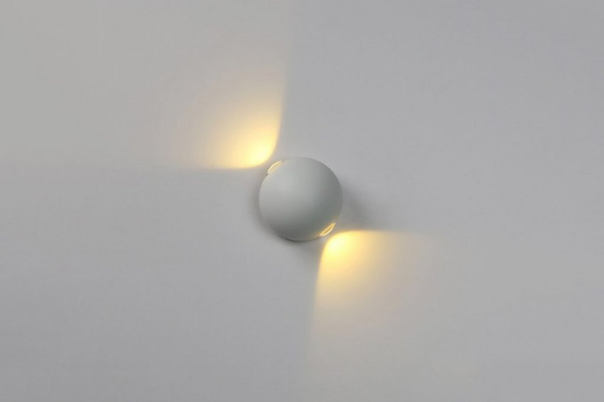
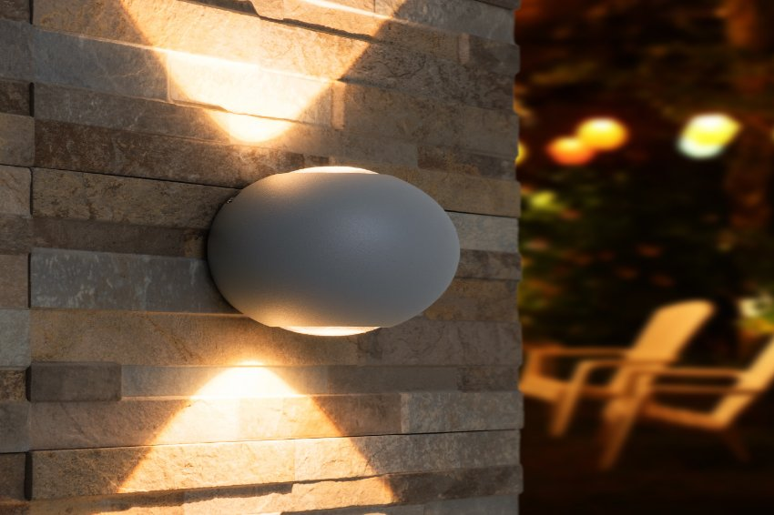
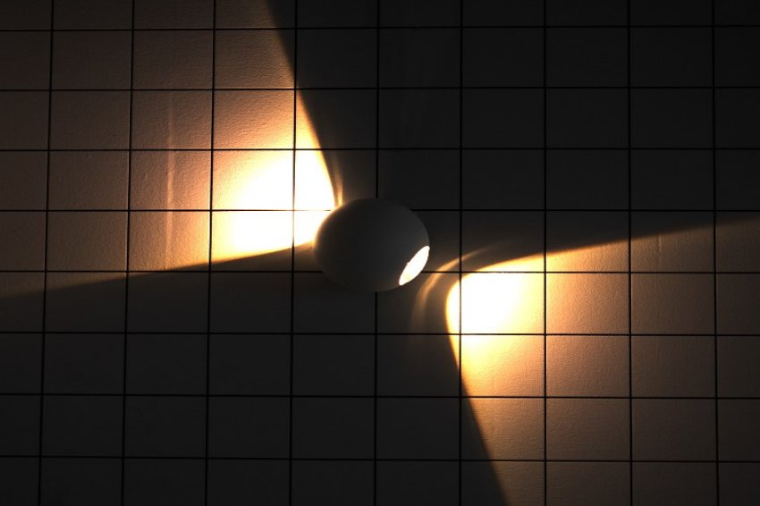
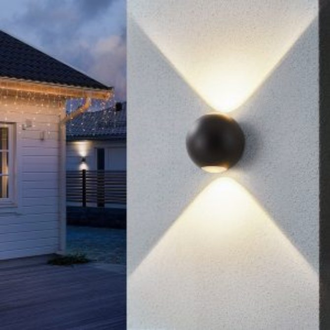

*Đèn gắn tường hình cầu 2\*3W là sản phẩm kết hợp giữa thiết kế tinh tế và khả năng chiếu sáng hiệu quả sẽ mang đến cho không gian của bạn một vẻ đẹp mới và sự nổi bật đáng chú ý. Với thiết kế hình cầu độc đáo, đèn gắn tường không chỉ là nguồn ánh sáng mà còn trở thành một điểm nhấn thú vị cho các không gian ngoài trời. Tham khảo các thông tin chi tiết về mẫu [**đèn LED thông minh**](https://lumi.vn/den-led-thong-minh) này trong bài viết dưới đây.*
## **1. Đặc điểm đèn gắn tường ngoài trời hình cầu 2\*3w**
- Đèn gắn tường ngoài trời hình cầu đang được ưa chuộng trong thiết kế nội thất, chiếu sáng nhờ thiết kế tinh tế, mềm mại, đem lại hiệu quả chiếu sáng cao và giúp tăng tính thẩm mỹ cho không gian.
- Đèn được ưu tiên dùng cho không gian ngoại thất nhờ khả năng kháng nước, kháng bụi cao IP65, cho phép đèn hoạt động tốt trong môi trường thường xuyên phải tiếp xúc với mưa gió, bụi bẩn.
- Với khả năng chiếu sáng 2 đầu, đèn mang lại hiệu ứng thị giác độc đáo cho khu vực chiếu sáng, thu hút sự chú ý của người xem.
- Thân đèn được thiết kế màu trắng tinh tế, nhờ đó phù hợp với nhiều loại không gian, kể cả trong nhà hay ngoài trời.

*Đèn gắn tường ngoài trời hình cầu 2\*3w*

\>> Xem thêm mẫu đèn chống nước rọi cây cao cấp: [***Đèn rọi cây 5W***](https://lumi.vn/san-pham/den-roi-cay-5w-chong-nuoc.html)
## **2. Ứng dụng của đèn gắn tường ngoài trời hình cầu 2\*3w**
Đối với công trình nhà ở, đèn gắn tường ngoài trời hình cầu thường được thấy ở các khu vực ngoại thất như ban công, cổng, sân vườn. Không chỉ có tác dụng chiếu sáng khu vực cần thiết vào ban đêm, đèn còn là vật trang trí cần thiết để tạo điểm nhấn cho không gian ngoại thất, đem lại ấn tượng cho khách đến chơi ngay từ phía ngoài nhà. Bên cạnh đó, đèn còn được lựa chọn cho cả các không gian nội thất như phòng khách, hành lang, tùy vào nhu cầu chiếu sáng thẩm mỹ của gia chủ.

*Đèn gắn tường ngoài trời hình cầu 2\*3w*

Nhờ vào thiết kế tinh tế, nhỏ gọn cùng khả năng chiếu sáng mang tính nghệ thuật cao, ngoài không gian nhà ở, đèn gắn tường ngoài trời còn được ưa chuộng ở các công trình công cộng cần tính thẩm mỹ cao như công viên, bảo tàng, hay các khu resort, khách sạn. Khả năng chiếu sáng thẩm mỹ của đèn làm nổi bật lên các chi tiết nghệ thuật, khu vực trang trí trong không gian, từ đó tạo cảm xúc nhất định cho quan khách.

*Ứng dụng của đèn gắn tường ngoài trời hình cầu*

Đèn gắn tường ngoài trời giúp tạo hiệu ứng thị giác tốt, tăng tính thẩm mỹ cho không gian nhờ vào chỉ số hoàn màu cao CRI >90, kết hợp với nhiệt độ màu 4000K giúp ánh sáng trở nên trung thực, sắc nét, hoàn toàn bảo vệ cho mắt. Bên cạnh đó, thân đèn được sản xuất tỉ mỉ từ nhôm đúc giúp kháng nước, đảm bảo cho đèn hoạt động tốt ngoài trời và duy trì tối đa tuổi thọ của đèn.

*Đèn gắn tường ngoài trời hình cầu lắp tại tại công trình thực tế*
## **3. Ưu điểm của đèn gắn tường ngoài trời hình cầu 2\*3w**
- **Tính thẩm mỹ cao:** Nhỏ gọn, thiết kế đơn giản, hiện đại nhưng tinh tế và độc đáo, phù hợp với mọi không gian ngoại thất
- **Bền bỉ, tuổi thọ cao:** Vỏ đèn được làm từ hợp kim nhôm cao cấp có khả năng chống ăn mòn, oxy hóa và tản nhiệt tốt, giúp sản phẩm có thể chống chọi với thời tiết khắc nghiệt. Đặc biệt, đèn có tuổi thọ cao hơn 25.000h cùng với số lần bật/tắt trên 60,000 lần.
- **Phù hợp mọi phong cách nội thất:** Do có thiết kế kiểu dáng nhỏ nhắn, đơn giản, đèn có thể phù hợp với hầu hết các phong cách nội thất từ hiện đại, đương đại, tới tân cổ điển và cổ điển
- **Kháng nước, kháng bụi tốt:** Chỉ số kháng nước, kháng bụi IP65, có độ bền cao sử dụng được trong môi trường ẩm ướt, chống bụi bẩn, ánh sáng dịu nhẹ, nhờ đó đảm bảo an toàn cho người sử dụng và nâng cao tuổi thọ của đèn
- **Bảo vệ mắt:** Ứng dụng công nghệ chiếu sáng hiện đại LED cao cấp đem đến cho đôi mắt của bạn một trải nghiệm êm dịu với ánh sáng khuếch tán tối ưu.
- **Chất lượng sáng cao:** Chip LED Bridgelux hiện đại với chỉ số hoàn màu cao CRI>90 cùng nhiệt độ màu 4000K giúp ánh sáng trở nên trung thực, sắc nét
- **Dễ dàng lắp đặt** ứng dụng trang trí không gian ngoài trời

Nếu bạn đang tìm kiếm những thiết kế chiếu sáng mới nhất, ấn tượng nhất cho không gian sống của bạn, hãy để lại thông tin hoặc liên hệ hotline Lumi Lighting: 0904 665 965 để nhận được thông tin tư vấn từ các chuyên gia chiếu sáng hàng đầu.

**>> Tham khảo thêm các mẫu đèn gắn tường mới:**

- [***Đèn gắn tường ngoài trời hình vuông 2*6W***](https://lumi.vn/san-pham/den-gan-tuong-ngoai-troi-hinh-vuong-2x6w.html)
- [***Đèn gắn tường bán nguyệt 2*5W ngoài trời***](https://lumi.vn/san-pham/den-gan-tuong-ngoai-troi-ban-nguyet-2x5w.html)
