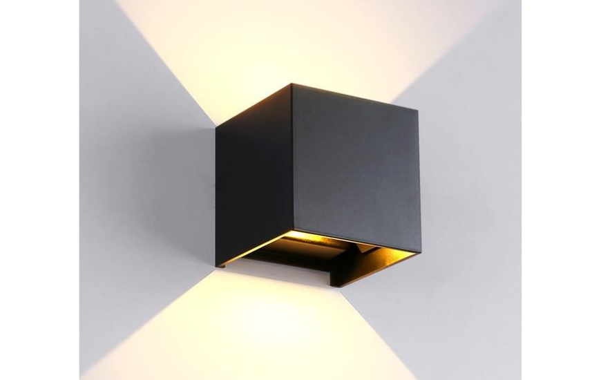
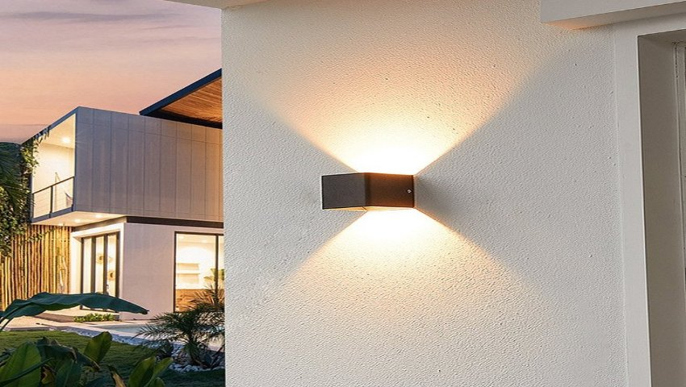
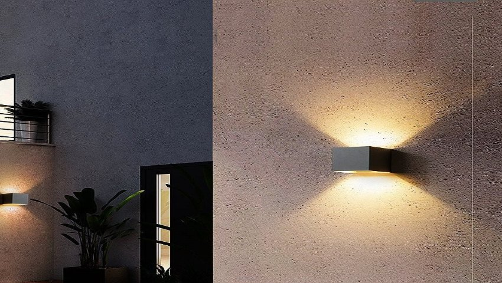

*Đèn gắn tường hình vuông 2\*6W có ánh sáng tinh tế cùng thiết kế độc đáo sẽ không chỉ làm nổi bật không gian mà còn tạo nên một khung cảnh đẹp mắt và ấn tượng. Đây là sản phẩm được [**công ty cổ phần Lumi Việt Nam**](https://lumi.vn/) nghiên cứu và thiết kế tỉ mỉ để có thể  tạo ra các hiệu ứng ánh sáng độc đáo cho sân vườn, hành lang hay lối vào… Khám phá những ưu điểm của đèn trong bài viết dưới đây.*
## **1. Đặc điểm cấu tạo đèn gắn tường ngoài trời hình vuông 2\*6w**
- Với thiết kế tinh tế, sắc nét hình vuông, kiểu dáng nhỏ gọn, cùng khả năng chiếu sáng 2 đầu, đèn gắn tường ngoài trời hình vuông cho ra một khung cảnh chiếu sáng với vẻ đẹp độc đáo. Thân đèn có màu đen cơ bản và khỏe khoắn, phù hợp với nhiều loại không gian, kể cả trong nhà hay ngoài trời.
- Đèn gắn tường ngoài trời đang được ưa chuộng trong thiết kế nội thất, chiếu sáng bởi tính thẩm mỹ và ứng dụng cao, phù hợp với nhiều không gian ngoại thất với thiết kế khác nhau.

*Đèn gắn tường ngoài trời hình vuông 2\*6w*

- Đặc biệt, đèn được ưu tiên sử dụng cho không gian ngoài trời, không có mái che nhờ độ kháng nước IP65, cho phép đèn hoạt động tốt trong môi trường ẩm ướt, chống nước, chống bụi hoàn hảo.
## **2. Ứng dụng của đèn gắn tường ngoài trời hình vuông 2\*6w**
Đèn gắn tường ngoài trời hình vuông phù hợp để chiếu sáng các không gian trong nhà như phòng khách, hành lang để tạo điểm nhấn, hay các không gian ngoại thất như ban công, cổng, sân vườn nhằm trang trí cho khu vực bên ngoài. Thiết kế hình vuông của đèn sẽ giúp cho khu vực cần trang trí mang nét khỏe khoắn, cứng cáp nhưng cũng không kém phần tinh tế.

*Đèn gắn tường ngoài trời hình vuông được lắp cho không gian ngoại thất*

Ngoài không gian nhà ở, đèn gắn tường ngoài trời còn được ưa chuộng ở các công trình công cộng cần tính thẩm mỹ cao như công viên, bảo tàng, hay các khu resort, khách sạn. Đèn gắn tường ngoài trời là lựa chọn phù hợp để giúp tạo điểm nhấn vào các chi tiết nghệ thuật, thu hút sự chú ý của quan khách bởi đây là những công trình có diện tích rộng, nhiều chi tiết và nhiều người qua lại.

*Ứng dụng của đèn gắn tường ngoài trời hình vuông*

Đèn gắn tường ngoài trời giúp tạo hiệu ứng thị giác tốt, tăng tính thẩm mỹ cho không gian nhờ vào chỉ số hoàn màu cao CRI >90, kết hợp với nhiệt độ màu 4000K giúp ánh sáng trở nên trung thực, sắc nét, hoàn toàn bảo vệ cho mắt. Bên cạnh đó, thân đèn được sản xuất tỉ mỉ từ chất liệu cao cấp giúp kháng nước, đảm bảo cho đèn hoạt động tốt ngoài trời và duy trì tối đa tuổi thọ của đèn.
## **3. Ưu điểm của đèn gắn tường ngoài trời hình vuông 2\*6w**
- **Thiết kế đẹp, tinh xảo:** Đèn được thiết kế nhỏ gọn, vừa phải, tinh tế, có thể phù hợp với nhiều khu vực khác nhau và nhiều phong cách thiết kế khác nhau
- **Chất lượng bền bỉ:** Vỏ đèn được làm từ hợp kim nhôm cao cấp có khả năng chống ăn mòn, oxy hóa và tản nhiệt tốt. Từ đó giúp sản phẩm tương thích với cả khu vực nội thất và ngoại thất, có thể chống chọi với thời tiết khắc nghiệt và nâng cao tuổi thọ
- **Kháng nước, kháng bụi tốt:** Chỉ số kháng nước IP67, có độ bền cao sử dụng được trong môi trường ẩm ướt, chống bụi bẩn
- **Ánh sáng khơi gợi cảm xúc:** Với chỉ số hoàn màu cao CRI>90 cùng nhiệt độ màu 4000K, đèn gắn tường ngoài trời của Lumi giúp phản ánh chân thực màu sắc các vật thẻ, là chất xúc tác quan trọng để tạo nên những bầu không khí cần thiết cho mỗi không gian
- **Bảo vệ mắt:** Ứng dụng công nghệ chiếu sáng hiện đại cùng chip LED cao cấp Bridgelux, giúp đem đến cho đôi mắt của bạn một trải nghiệm êm dịu với ánh sáng khuếch tán tối ưu.
- **Tuổi thọ cao:** Đèn có chu kỳ bật tắt trên 60,000 lần và tuổi thọ hơn 25,000h
- **Dễ dàng lắp đặt** ứng dụng trang trí không gian ngoài trời

Trên đây là những thông tin chi tiết về **đèn gắn tường ngoài trời hình vuông 2\*6w**. Nếu bạn đang muốn sở hữu không gian sống với những điểm nhấn ánh sáng, độc đáo hãy liên hệ ngay tới số hotline 090.466.5965 để được hỗ trợ và tư vấn chi tiết.

**Tham khảo thêm các mẫu đèn khác cùng nằm trong bộ sưu tập:**

- [***Đèn gắn tường ngoài trời bán nguyệt 2*5W***](https://lumi.vn/san-pham/den-gan-tuong-ngoai-troi-ban-nguyet-2x5w.html)
- [***Đèn LED rọi cây 5W***](https://lumi.vn/san-pham/den-roi-cay-5w-chong-nuoc.html)
- [***Đèn downlight tròn 10W***](https://lumi.vn/san-pham/den-downlight-10w.html)
