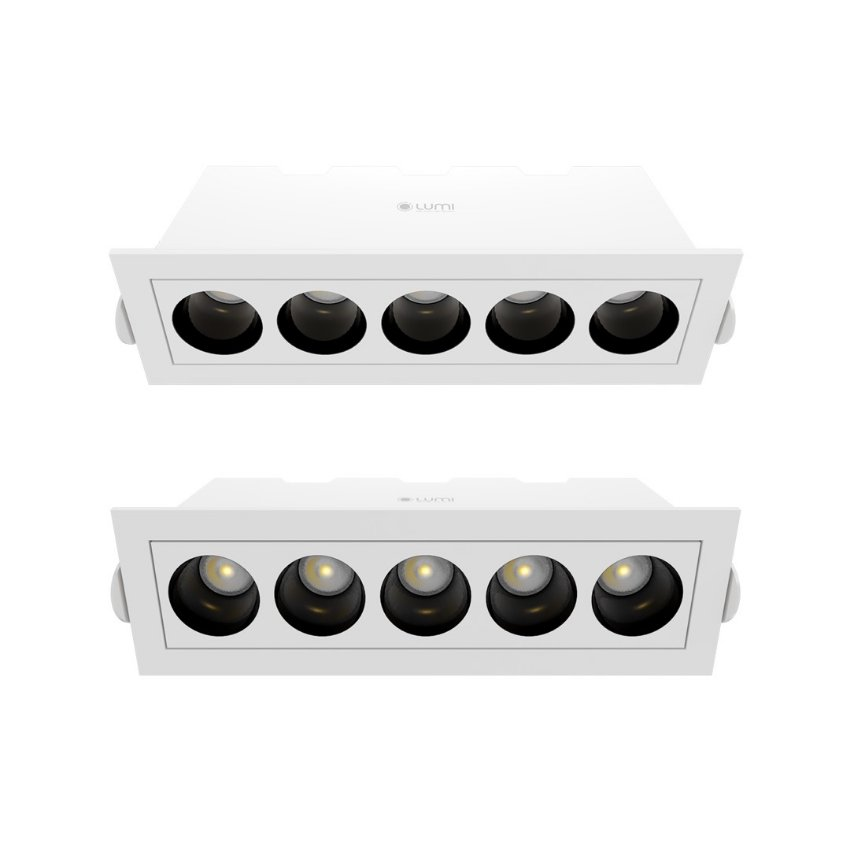

*Bổ sung lớp ánh sáng chiếu điểm đầy nghệ thuật cho không gian sống, bạn đã thử nghiệm chưa? Đừng quên tạo nên sự khác biệt cho ngôi nhà của bạn với hệ thống đèn linear spotlight âm trần 10W. Những ưu điểm nổi bật từ chất liệu, thiết kế đến chất lượng ánh sáng của dòng đèn này sẽ khiến bạn ngạc nhiên!*
## **1. Đặc điểm của đèn linear spotlight âm trần 10w**
- Thay vì lắp đặt các đèn spotlight đơn lẻ, việc lắp đặt linear spotlight mang đến trải nghiệm ánh sáng mới lạ.
- Ánh sáng chiếu điểm từ các đèn linear spotlight giúp nhấn mạnh vùng không gian đặc biệt và tạo diện mạo mới cho không gian sống.
- Đèn linear spotlight hiện nay đang là sự ưu tiên hàng đầu trong các loại đèn chiếu sáng cho những không gian cần thêm tính nghệ thuật.
- Hiện nay, Lumi có sản phẩm [***đèn linear spotlight gắn nổi 10W***](https://lumi.vn/san-pham/den-linear-spotlight-gan-noi-10w.html) có hình dáng khá giống với đèn linear âm trần 10W, mọi người nên để ý kỹ về các đặc điểm trên để tránh nhầm lẫn giữa 2 mẫu đèn.

*Đèn linear spotlight âm trần 10W*
## **2. Ưu điểm nổi bật của đèn linear spotlight âm trần**
- **Thân thiện với môi trường:** đèn LED không chứa thủy ngân và tỏa ra ít nhiệt hơn các dòng đèn huỳnh quang, sợi đốt, vì thế hạn chế được nhiều tác động tiêu cực đối với môi trường xung quanh
- **Độ bền, tuổi thọ cao:** chất liệu hợp kim nhôm bền bỉ, tuổi thọ trên 25000 giờ
- **Tính thẩm mỹ cao:** đèn âm trần tinh tế cung cấp ánh sáng mà không lộ phần thân đèn, đem lại ấn tượng về sự tối giản, hiện đại
- **Ánh sáng chiếu tập trung:** góc chiếu 24° giúp cho dòng đèn này không chỉ cung cấp ánh sáng cho không gian sinh hoạt mà còn giúp làm nổi bật các vật thể được chiếu sáng như tranh treo tường, tượng điêu khắc, tủ trưng bày,…
- **An toàn cho thị giác:** đèn LED không phát ra tia cực tím hay tia hồng ngoại nên không gây hại cho mắt
- **Tái hiện màu sắc trung thực:** với chỉ số hoàn màu (CRI) 97, đèn cung cấp ánh sáng chất lượng và tái hiện màu sắc của vật thể một cách chân thực nhất.
- **Dễ dàng nâng cấp** thành đèn spotlight thông minh khi lắp đặt cùng driver, kết nối đèn với hệ thống [***Lumi smarthome***](https://lumi.vn/), cho phép bật/tắt, điều chỉnh cụm đèn trên smartphone và theo ngữ cảnh.
## **3. Ứng dụng của đèn linear spotlight âm trần**
Bạn đang tìm kiếm một giải pháp đèn chiếu điểm thực sự mới lạ, đèn linear spotlight âm trần 10w sẽ là giải pháp thỏa mãn được nhu cầu của bạn. Khám phá ngay sản phẩm đèn mang hơi hướng hiện đại để “cập nhật” cho thẩm mỹ không gian sống nhé!

*Đèn linear spotlight âm trần 10w*

Đèn linear spotlight âm trần là lựa chọn tối ưu cho không gian nhà ở với dụng ý “làm mới” cho các góc nội thất hiện đại. Phòng khách, phòng bếp hay phòng ngủ đều có thể được lắp đặt loại đèn này.

Không cần để lộ phần thân đèn, những chiếc đèn linear spotlight âm trần vẫn có thể khiến cho khu vực được chiếu sáng trở thành tâm điểm của sự chú ý. Vì vậy, người dùng có thể tận dụng những chiếc đèn này để tăng ấn tượng cho những khu vực quan trọng như bàn trà, TV, đàn piano, bàn bếp,…

Đồng thời, không gian nhà hàng, khách sạn, trung tâm thương mại cũng là những địa điểm phù hợp để chiếu sáng với linear spotlight âm trần. Đây sẽ là điểm nhấn ánh sáng thu hút mọi sự chú ý của khách hàng và tạo chiều sâu cho những không gian đề cao sự sang trọng, đẳng cấp này.

Lựa chọn loại spotlight linear nào để phù hợp với không gian của mình? Làm sao để xác định vị trí lắp đèn để tối ưu công năng chiếu sáng? Nếu bạn còn đang băn khoăn với những câu hỏi này, đội ngũ thiết kế chiếu sáng chuyên nghiệp của Lumi sẽ giúp bạn đưa ra câu trả lời, đồng thời giúp bạn kết hợp các loại đèn và các lớp ánh sáng để tạo nên tổng hòa một không gian được chiếu sáng hoàn hảo.

**>> Xem thêm một số sản phẩm tương tự:**

- [***Đèn LED spotlight trụ 10W ốp nổi 36 độ***](https://lumi.vn/san-pham/den-spotlight-tru-10w-op-noi-36-do.html)
- [***Đèn spotlight vuông 10w ốp nổi***](https://lumi.vn/san-pham/den-spotlight-vuong-10w-op-noi-36-do.html)
