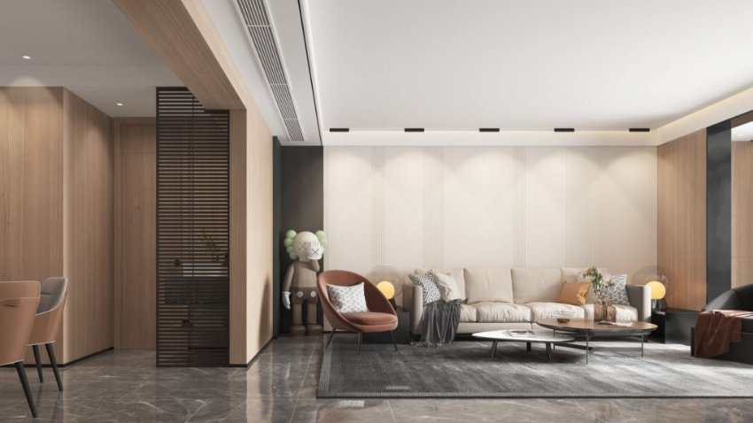

*“Khoe” được cả ánh sáng chiếu rọi và thiết kế đèn, đèn linear spotlight gắn nổi là cú hích cho bạn tạo ấn tượng gấp đôi cho thị giác khi được ngắm nghía ngôi nhà thân thuộc của mình. Bạn đang tìm kiếm một giải pháp đèn chiếu điểm thực sự mới lạ, đèn linear spotlight gắn nổi 10W sẽ là giải pháp thỏa mãn được nhu cầu của bạn. Khám phá ngay sản phẩm đèn mang hơi hướng hiện đại để “cập nhật” cho thẩm mỹ không gian sống nhé!*
## **1. Đặc điểm của đèn linear spotlight gắn nổi 10W**
Đèn linear spotlight bao gồm các bóng đèn nhỏ trong cùng một hộp đèn hình hộp chữ nhật. Khi lắp đặt gắn nổi trên trần nhà, dòng đèn này có thể “phô diễn” được cả thiết kế đèn mà vẫn nhấn mạnh được ánh sáng chiếu điểm sắc nét, làm nổi bật không gian. Đây là đặc trưng ghi điểm cho dòng đèn này khi được các gia chủ lựa chọn để mang đến một diện mạo mới cho không gian sống.

*Đèn linear spotlight giúp làm nổi bật các chi tiết đắt giá trong nội thất*
## **2. Ưu điểm nổi bật của đèn linear spotlight gắn nổi**
- **Thân thiện với môi trường:** đèn LED không chứa thủy ngân và tỏa ra ít nhiệt hơn các dòng đèn huỳnh quang, sợi đốt, vì thế hạn chế được nhiều tác động tiêu cực đối với môi trường xung quanh
- **Độ bền, tuổi thọ cao:** chất liệu hợp kim nhôm bền bỉ, tuổi thọ trên 25000 giờ
- **Tính thẩm mỹ cao:** đèn âm trần tinh tế cung cấp ánh sáng và tạo dấu ấn bằng thiết kế thân đèn bằng hình hộp chữ nhật nổi trên trần nhà
- **Ánh sáng chiếu tập trung:** góc chiếu 24° giúp cho dòng đèn này không chỉ cung cấp ánh sáng cho không gian sinh hoạt mà còn giúp làm nổi bật các vật thể được chiếu sáng như tranh treo tường, tượng điêu khắc, tủ trưng bày,…
- **An toàn cho thị giác:** đèn LED không phát ra tia cực tím hay tia hồng ngoại nên không gây hại cho mắt
- **Tái hiện màu sắc trung thực:** với chỉ số hoàn màu (CRI) cao 97, đèn cung cấp ánh sáng chất lượng và tái hiện màu sắc của vật thể một cách chân thực nhất.
## **3. Ứng dụng của đèn linear spotlight ốp nổi 10W**

*Đèn linear spotlight giúp làm nổi bật các chi tiết đắt giá trong nội thất*

Đèn linear spotlight là lựa chọn tối ưu cho không gian nhà ở với dụng ý “làm mới” cho các góc nội thất hiện đại. Phòng khách, phòng bếp hay phòng ngủ đều có thể được lắp đặt loại đèn này. Đèn linear spotlight gắn nổi thực hiện tốt được cả 2 công năng: cung cấp ánh sáng và trang trí. Vì vậy, người dùng có thể lắp đặt các đèn này tại các vị trí cần ánh sáng tác vụ, hay những khu vực trần trong không gian rộng đang còn trống trải để tạo thêm điểm nhấn. Bên cạnh đó, đèn linear spotlight gắn nổi cũng có thể được tận dụng để tăng ấn tượng cho những khu vực quan trọng như bàn trà, TV, đàn piano, bàn bếp,…

Không gian nhà hàng, khách sạn, trung tâm thương mại cũng là những địa điểm phù hợp để chiếu sáng với linear spotlight. Đây sẽ là điểm nhấn ánh sáng thu hút mọi sự chú ý của khách hàng và tạo chiều sâu cho những không gian đề cao sự sang trọng, đẳng cấp này.

Lắp đèn linear spotlight ốp nổi ở những vị trí nào để mang lại hiệu quả tối đa? Lắp đặt loại đèn này có đơn giản không? Sẽ có rất nhiều câu hỏi được đặt ra khi bạn bắt đầu lên kế hoạch nâng cấp không gian sống hay cửa hàng, khu nghỉ dưỡng của mình. Các chuyên gia chiếu sáng từ Lumi sẽ giải đáp những thắc mắc này và giúp bạn có được một không gian thăng hoa cảm xúc với ánh sáng và bài trí đèn một cách tối ưu. Liên hệ ngay để được tư vấn miễn phí và sở hữu “vương quốc ánh sáng” của riêng mình nhé!

**Tham khảo thêm:**

- [***Đèn spotlight trụ 10W ốp nổi 36 độ***](https://lumi.vn/san-pham/den-spotlight-tru-10w-op-noi-36-do.html)
- [***Đèn LED spotlight vuông 10w ốp nổi 36 độ***](https://lumi.vn/san-pham/den-spotlight-vuong-10w-op-noi-36-do.html)
- [***Đèn LED spotlight âm trần 10W 36 độ***](https://lumi.vn/san-pham/den-spotlight-am-tran-10w-36-do-chinh-huong.html)
