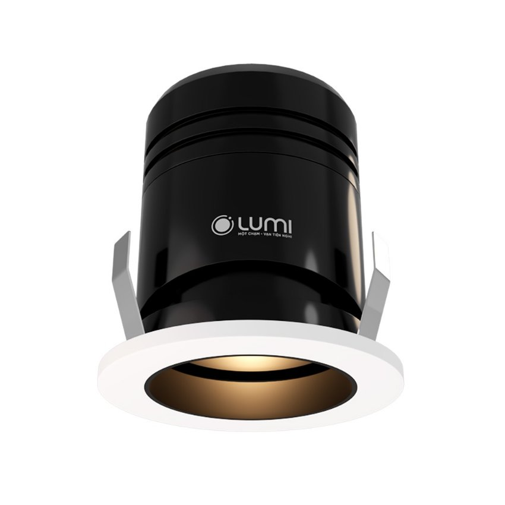
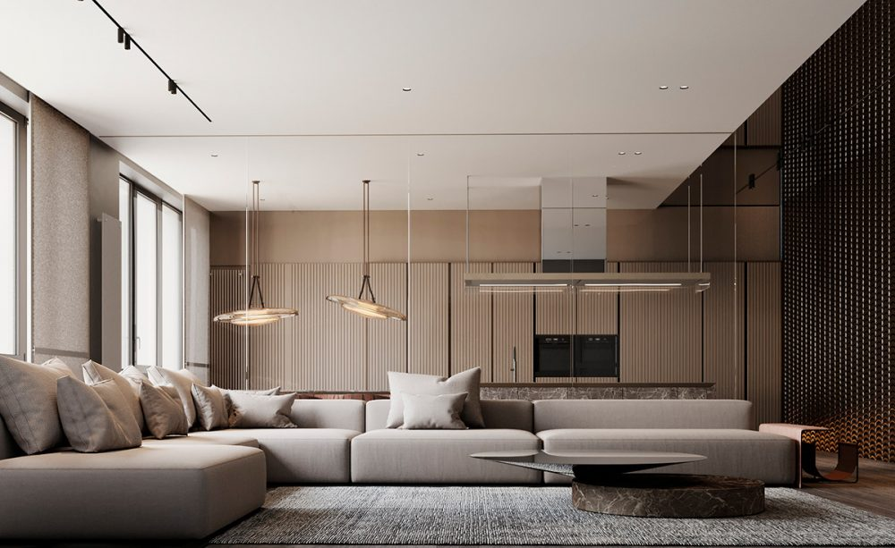
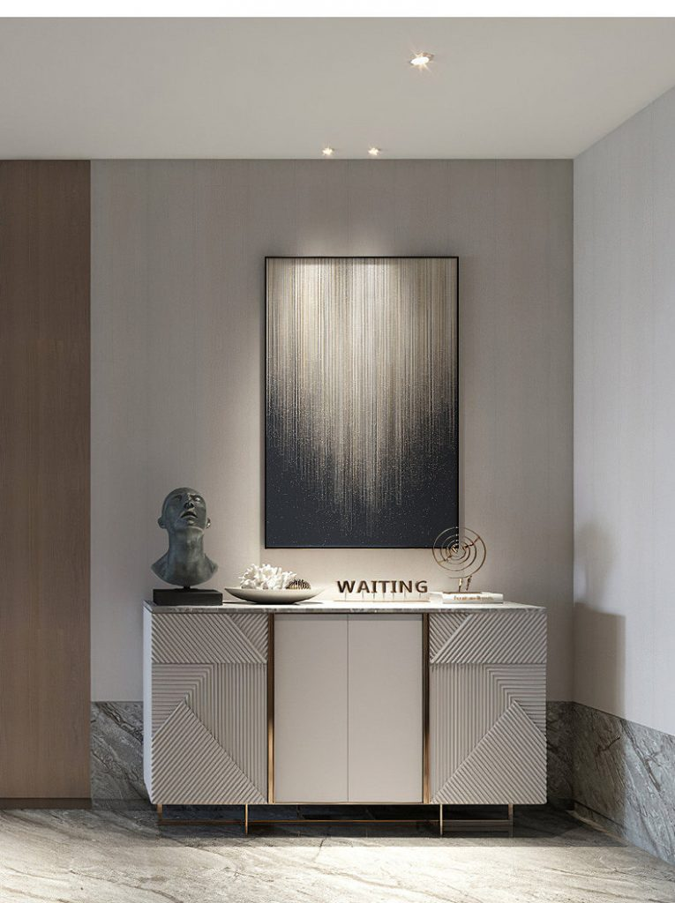

*Đèn mini spotlight âm trần 7W 15 độ chỉnh hướng sở hữu thiết kế dáng tròn, nhỏ gọn. Đèn chiếu ánh sáng với góc 15 độ nên được sử dụng trong chiếu sáng trang trí nội thất, đặc biệt các khu vực nhỏ, sang trọng hoặc dùng để chiếu các vật thể nhằm thu hút sự chú ý của mọi người. Vậy đèn mini spotlight 7W 15 độ âm trần có cấu tạo như thế nào? Ưu điểm gì vượt trội? Cùng Lumi tìm hiểu ngay trong bài chia sẻ dưới đây.*
## **1. Cấu tạo của đèn mini spotlight âm trần 7W 15 độ**
Tương tự các dòng đèn spotlight khác, đèn mini spotlight âm trần 7W 15 độ có cấu tạo gồm 3 thành phần chính.

- Thân đèn: Thân đèn được đúc từ hợp kim nhôm kết hợp xử lý bề mặt tỉ mỉ giúp đèn mini spotlight 7W 15 độ âm trần mang nét thẩm mỹ cao, và có khả năng tản nhiệt cũng như chống chọi với thời tiết khắc nghiệt rất tốt.
- Chip LED: Đèn sử dụng chip Luminus cao cấp có khả năng chiếu sáng tốt, ít tỏa nhiệt và tản nhiệt nhanh chóng. Vì vậy mini spotlight âm trần 7W 15 độ tiết kiệm điện năng rất tốt và góp phần nâng cao tuổi thọ của đèn lên tới 25.000h
- Tăng phô (hay chấn lưu): Bộ phận quan trọng không thể thiếu của đèn với khả năng giới hạn dòng điện chạy trong mạch điện, từ đó bảo vệ đèn tốt hơn.

*Đèn LED spotlight âm trần 7W 15 độ, chỉnh hướng*

\>> Tham khảo thêm mẫu đèn thông minh nổi bật: [***Đèn spotlight âm trần 7W 24 độ, chỉnh hướng***](https://lumi.vn/san-pham/den-spotlight-am-tran-7w-24-do-chinh-huong.html)
## **2. Ưu điểm nổi bật của đèn mini spotlight 7W 15 độ âm trần**
Là một chiếc đèn dùng để chiếu rọi, chiếu điểm trang trí trong nội thất đèn mini spotlight âm trần 7W 15 độ chỉnh hướng sở hữu những ưu điểm vượt trội mà các đèn cùng dòng không có được:

*Đèn mini spotlight âm trần 7w 15 độ kết hợp cùng các dòng đèn khác để tạo ánh sáng hiệu ứng cho không gian*

- Phản chiếu chân thực màu sắc vật thể: Với chỉ số CRI 97 đèn mini spotlight 7W 15 độ âm trần được xem là chất xúc tác hoàn hảo, phản ánh sắc nét màu sắc của vật thế và bổ trợ hiệu quả cho chất cảm của vật liệu.
- An toàn cho người sử dụng và không gây hại môi trường: Đèn chiếu sáng không chứa tia UV, mang tới nguồn sáng lành mạnh cho đôi mắt và làn da. Đồng thời, đèn cũng không chứa thủy ngân độc hại, giúp bảo vệ môi trường hiệu quả.
- Chất liệu cao cấp, độ bền vượt trội: Thân đèn được làm từ vật liệu cao cấp có khả năng chống chọi với môi trường khắc nghiệt, đồng thời tản nhiệt nhanh giúp nâng cao độ bền cho sản phẩm.
- Phù hợp mọi phong cách nội thất: Sở hữu kiểu dáng đơn giản, tinh tế, đèn mini spotlight 7W 15 độ âm trần được ưu tiên sử dụng bởi luôn nổi bật dù là phong cách hiện đại, đương đại, farmhouse, industrial,…
- Điều chỉnh hướng chiếu sáng linh hoạt: Sự linh hoạt trong điều chỉnh hướng chiếu sáng của đèn luôn là điểm cộng khi lựa chọn chiếu nội thất trong nhà. Kết hợp cùng góc chiếu 15 độ (chiếu điểm, chiếu vật thể), đèn spotlight âm trần 7W 15 độ sẽ mang tới nguồn sáng hài hòa, sắc nét với những hướng chiếu đa dạng, đáp ứng mọi nhu cầu của gia chủ.
- Tuổi thọ cao: Đèn có chu kỳ bật tắt trên 60.000 lần và tuổi thọ lên tới 25.000h
- Trở thành đèn thông minh dễ dàng: Chỉ cần tích hợp driver của Lumi đèn LED spotlight âm trần 7W 15 độ sẽ được điều khiển bật/tắt thuận tiện qua smartphone dù ở bất kỳ đâu. Đặc biệt nó còn được kết hợp cùng các lộ đèn khác và thiết bị điện khác để tạo nên những ngữ cách sống tiện nghi và giàu cảm xúc trong ngôi nhà thông minh.
## **3. Ứng dụng của đèn mini spotlight âm trần 7W 15 độ trong chiếu sáng nội thất**
Đèn mini spotlight âm trần 7W 15 độ chỉnh hướng với kiểu dáng tròn, nhỏ gọn cùng những ưu điểm nổi bật nên phù hợp lắp đặt ở các khu vực trang trí, trưng bày sản phẩm cần chiếu rọi, chiếu điểm. Vì vậy nó thường được ưu tiên sử dụng trong các công trình nhà ở, khách sạn, cửa hàng thời trang, cửa hàng đá quý,…

*Đèn spotlight âm trần 7W 15 độ chỉnh hướng sửa dụng tại khu vực điểm nhấn của ngôi nhà*

Ngày nay, chiếu sáng không dừng lại ở việc đáp ứng nhu cầu cơ bản là nhìn thấy cho con người, mà còn đóng vai trò quan trọng trong việc nâng cao thẩm mỹ và mang tới cảm xúc cho không gian. Chính vì vậy, nếu bạn đang tìm dòng đèn spotlight để chiếu rọi, chiếu điểm trong không gian thậm chí kết hợp chiếu sáng cục bộ thì đèn mini spotlight âm trần 7W 15 độ là một lựa chọn hoàn hảo không nên bỏ qua. Liên hệ ngay tới số hotline 0904.665.965 để được Lumi hỗ trợ nhanh chóng và tư vấn chi tiết về đèn mini spotlight 7W 15 độ âm trần cùng các dòng đèn chiếu sáng khác.

**>> Tham khảo thêm các mẫu đèn cùng bộ sưu tập Lumi Lighting:**

[***Đèn LED mini spotlight âm trần 7W 40 độ***](https://lumi.vn/san-pham/den-mini-spotlight-am-tran-7w-40-do-chinh-huong.html)

[***Đèn spotlight âm trần 7W chỉnh hướng mặt elip***](https://lumi.vn/san-pham/den-spotlight-am-tran-7w-mat-elip-chinh-huong.html)
