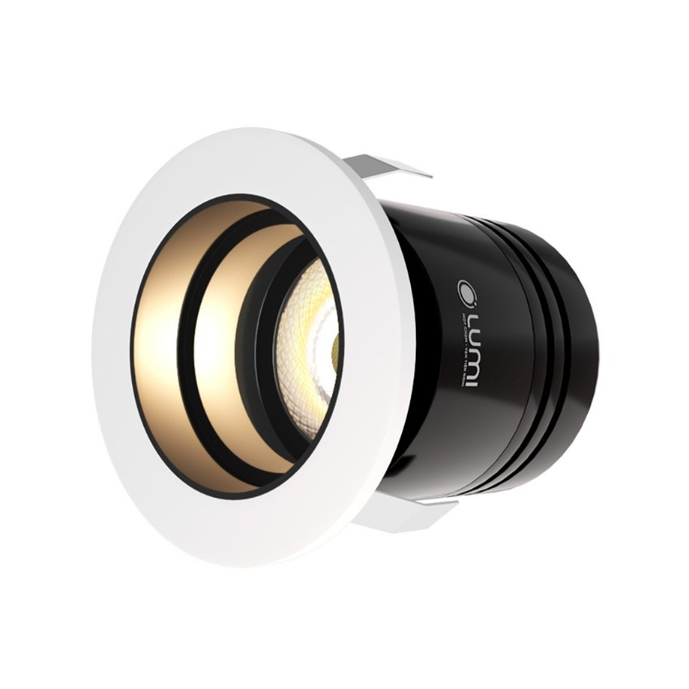
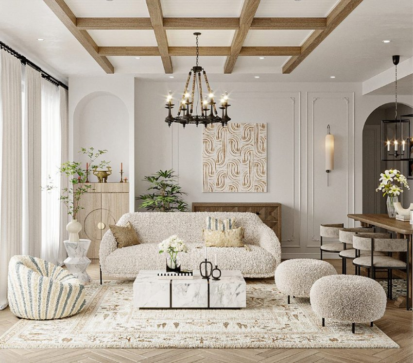
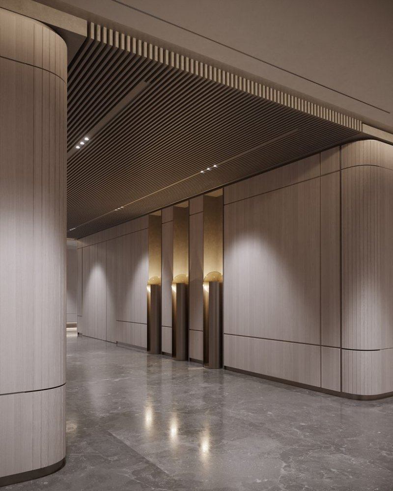

***Đèn mini spotlight âm trần 7W 24 độ** cao cấp với thiết kế kiểu dáng đơn giản nhưng mang tới nguồn sáng ấn tượng, giúp không gian trở nên sang trọng. Đèn chiếu ánh sáng với góc 24° nên được sử dụng trong chiếu chức năng ở nhiều khu vực nhằm cung cấp nguồn ánh sáng cần thiết và làm nổi bật phối cảnh trong không gian. Vậy đèn mini spotlight 7W 24° âm trần có cấu tạo như thế nào? Ưu điểm gì vượt trội? Cùng Lumi tìm hiểu ngay trong bài chia sẻ dưới đây.*
## **1. Cấu tạo của đèn mini spotlight âm trần 7W 24 độ chỉnh hướng**
Mặc dù kiểu dáng không lớn như các dòng đèn spotlight khác nhưng đèn mini spotlight âm trần 7W 24 độ vẫn có đầy đủ các thành phần, trong đó gồm 3 thành phần chính sau:

- Thân đèn: Đèn mini spotlight 7W 24 độ âm trần có khả năng tản nhiệt, chống chọi với tiết khắc nghiệt tố nhờ thân đèn được làm từ hợp kim nhôm cao cấp và xử lý bề mặt kỹ lưỡng.
- Chip LED Luminus: Thành phần quan trọng không thể thiếu của mỗi chiếc đèn. Đây là bộ phận phát ra ánh sáng của đèn. Vì vậy việc sử dụng chip LED như thế nào rất quan trọng và quyết định tới chất lượng ánh sáng.
- Tăng phô (hay chấn lưu): Chân lưu có tác dụng cung cấp nguồn điện và giới hạn dòng điện chảy trong mạch ổn định, từ đó bảo vệ và nâng cao độ bền cho đèn.

*Đèn LED spotlight âm trần 7W 24 độ, chỉnh hướng*

Tham khảo thêm mẫu đèn spotlight cao cấp: [***Đèn spotlight thông minh âm trần***](https://lumi.vn/san-pham/den-led-spotlight-thong-minh-am-tran.html)
## **2. Ưu điểm nổi bật của đèn mini spotlight 7W 24 độ âm trần**
- Nguồn sáng khơi gợi cảm xúc: Với chỉ số hoàn màu CRI 97 phản ánh chân thực màu sắc các vật thể, đèn mini spotlight 7W 24 độ âm trần là chất xúc tác cần thiết để tạo nên những bầu không khí cần thiết cho mỗi không gian
- An toàn sử dụng, thân thiện môi trường: hạn chế nhược điểm của các dòng đèn đời đầu, đèn mini spotlight 7W 24 độ âm trần không chứa tia hồng ngoại, cũng như thủy ngân độc hại cho con người và môi trường tự nhiên.
- Chất lượng bền bỉ: Vỏ đèn được làm từ hợp kim nhôm có khả năng chống ăn mòn, oxy hóa và tản nhiệt tốt. Từ đó giúp sản phẩm có thể chống chọi với thời tiết khắc nghiệt và nâng cao tuổi thọ.
- Phù hợp mọi phong cách nội thất: Do có thiết kế kiểu dáng nhỏ nhắn, đơn giản, kết hợp lắp âm trên trần nhà nên đèn mini spotlight 7W 24 độ phù hợp với hầu hết các phong cách nội thất từ hiện đại, đương đại, indochine, tới tân cổ điển và cổ điển…
- Hướng chiếu sáng linh hoạt: Không chỉ chiếu sáng theo phương thẳng đứng mà đèn mini spotlight âm trần 7W 24 độ còn có thể chiếu sáng ở các hướng khác nhau, tùy thuộc vào nhu cầu chiếu sáng của người dùng.
- Tuổi thọ cao: Tương tự như [***đèn spotlight âm trần 7W mặt elip chỉnh hướng***](https://lumi.vn/san-pham/den-spotlight-am-tran-7w-mat-elip-chinh-huong.html), đèn 7W 24 độ có chu kỳ bật tắt trên 60.000 lần và tuổi thọ lên tới 25.000h
- Dễ dàng nâng cấp thành đèn thông minh: Chấn lưu điện tử sau khi được tích hợp driver của Lumi sẽ giúp đèn được điều khiển linh hoạt mà không bị phụ thuộc vào lộ đèn cố định. Thông qua app Lumi Life người dùng có thể thiết lập các kịch bản chiếu khác nhau và điều khiển bật/tắt 1 chiếc hoặc 1 nhóm đèn dù ở bất kỳ đâu, thậm chí dim (điều khiển mức độ sáng tối) theo sở thích.

*Đèn spotlight âm trần 7W 24 độ được lắp đặt tại không gian phòng khách*
## **3. Ứng dụng của đèn mini spotlight 7W 24 độ âm trần trong chiếu sáng nội thất**
- Đèn spotlight mini âm trần 7W 24 độ với kiểu dáng tròn, nhỏ gọn cùng góc chiếu rộng 24° nên được sử dụng chiếu sáng với mục đích chiếu chức năng tại các khu vực bếp, bàn ăn, kệ trang trí, tủ sách, tivi…
- Tuy nhiên cũng có trường hợp nó được dùng để chiếu sáng tổng thể tại các không gian khác nhau trong nhà ở, khách sạn, phòng triển lãm, trung tâm thương mại,… cho mục đích cung cấp nguồn sáng cần thiết.
- Bên cạnh đó, nếu không gian yêu cầu một mẫu đèn có chút cổ điển, sang trọng hơn, người dùng có thể chuyển sang mẫu [***đèn LED spotlight thông minh âm trần xoay góc***](https://lumi.vn/san-pham/den-led-spotlight-am-tran-xoay-goc.html) với ánh sáng tương đương.

*Đèn spotlight âm trần mini 7W 24 độ chiếu ánh sáng hành lang khách sạn cao cấp*

Ánh sáng là yếu tố không thể thiếu trong mỗi không gian. Bởi không chỉ đáp ứng nhu cầu về công năng sử dụng, nó còn là chất xúc tác tăng hiệu ứng thị giác và thẩm mỹ cho mỗi không gian. Chính vì vậy, nếu bạn đang tìm dòng đèn spotlight để làm nổi bật các khu vực trong trong không gian thì đèn mini spotlight âm trần 7W 24 độ là một lựa chọn hoàn hảo không nên bỏ qua. Liên hệ ngay tới số hotline 0904.665.965 để được [***Lumi***](https://lumi.vn/) hỗ trợ nhanh chóng và tư vấn chi tiết về đèn mini spotlight 7W 24° âm trần cùng các dòng đèn chiếu sáng khác.
