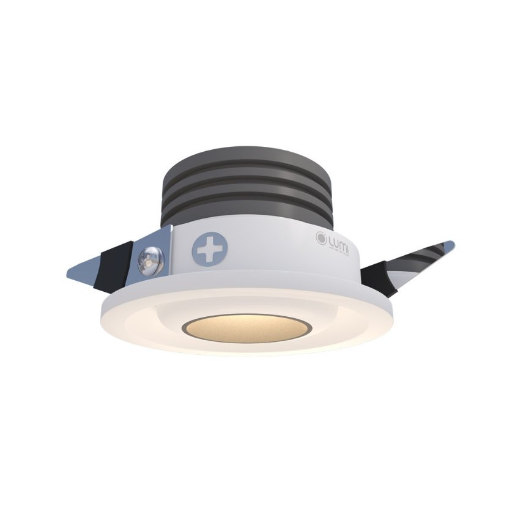
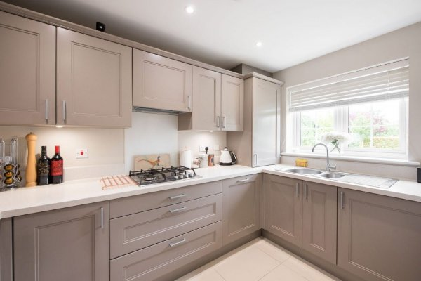
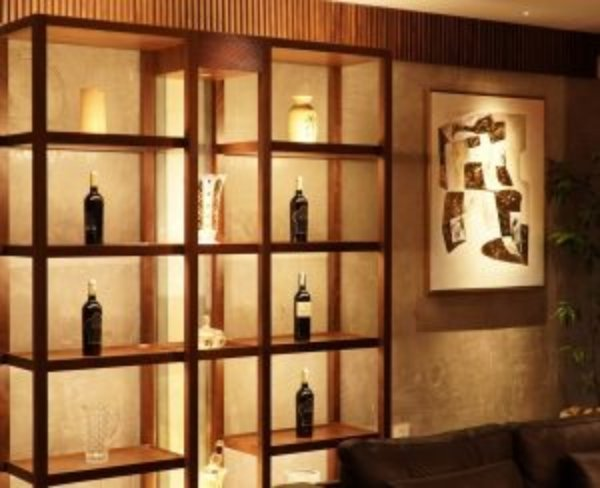

*Đèn spotlight âm tủ mini 3W chỉnh hướng là mẫu đèn có thiết kế nhỏ gọn, tinh tế. Đèn được ứng dụng ở đa dạng những góc trang trí như tủ rượu, tủ trưng bày đồ cổ,… Đồ lưu niệm sẽ không thể nổi bật nếu không có những chiếc spotlight âm tủ mini 3w, chỉnh hướng. Để hiểu rõ hơn chi tiết về sản phẩm này, hãy tham khảo ngay những thông tin dưới đây của chúng tôi.*
## **1. Đặc điểm của đèn spotlight âm tủ mini 3W**
- Về hình thức, dễ thấy đèn spotlight âm tủ khác với các dòng đèn thông thường ở vị trí lắp đặt. Phần thân đèn của spotlight âm tủ được gắn vào bên trong tủ. Từ bên ngoài nhìn vào, bạn sẽ không thấy đèn spotlight mà chỉ thấy ánh sáng được hắt trọn vào vật thể bên trong tủ.
- Đây cũng là lí do đèn spotlight âm tủ phát huy được tối đa chức năng làm nổi bật các đồ trang trí hay tạo không gian chiếu sáng cường độ cao. Hơn nữa, dòng đèn này có thể chỉnh hướng theo ý gia chủ.

*Đèn spotlight âm tủ mini 3W chỉnh hướng*

\>> Xem thêm sản phẩm nổi bật khác: [***Mini Spotlight 6W-10W***](https://lumi.vn/san-pham/mini-spotlight-6w-10w.html)
## **2. Ứng dụng của đèn spotlight âm tủ mini 3W chỉnh hướng**
- Đèn spotlight mini âm tủ phù hợp với nhiều tủ trang trí, tủ bếp, tủ rượu, tủ quần áo,…. Vì thế, đèn có thể được lắp ở nhiều công trình nhà ở đa dạng, từ chung cư đến nhà phố, biệt thự.

*Spotlight âm tủ tại khu vực bếp giúp chiếu sáng cho các tác vụ nhà bếp*

- Bên cạnh đó, bạn cũng dễ dàng bắt gặp đèn spotlight âm tủ tại các trung tâm thương mại, cửa hàng thời trang,… tại những vùng chiếu sáng nhỏ, điểm nhấn.
- Đặc điểm thiết kế đèn nhỏ gọn và chùm sáng sắc nét gia tăng hiệu quả thẩm mỹ cho không gian sống
- Khi tích hợp đèn spotlight âm tủ vào hệ thống smarthome, bạn có thể cài đặt bật/tắt hoàn toàn tự động.

*Đèn spotlight âm tủ mini 3W chỉnh hướng tạo điểm nhấn cho khu vực tủ áo- gương*

Mỗi khu vực trong nhà đều có những chức năng riêng và cần được bố trí chiếu sáng đúng cách. Tủ rượu, tủ quần áo tuy không chiếm quá nhiều không gian nhưng lại thể hiện gu thẩm mỹ của gia chủ. Lựa chọn spotlight âm tủ 3w chỉnh hướng sẽ là giải pháp tối ưu để không lãng phí những chiếc tủ trưng bày được đầu tư kĩ lưỡng.

**Lưu ý**: Đèn chỉ lắp đặt âm tủ, để lắp đặt tại những vị trí khác cần chỉnh hướng ánh sáng; người dùng có thể lựa chọn [***Mini Spotlight xoay góc cao cấp***](https://lumi.vn/san-pham/mini-spotlight-xoay-goc.html) hoặc [***đ](https://lumi.vn/san-pham/den-mini-spotlight-am-tran-7w-15-do-chinh-huong.html)[èn LED mini spotlight âm trần 7W 15 độ***](https://lumi.vn/san-pham/den-mini-spotlight-am-tran-7w-15-do-chinh-huong.html) để tối ưu hiệu quả chiếu sáng hơn.
## **3. Ưu điểm nổi bật của đèn spotlight mini 3W âm tủ**
- **Thân thiện với môi trường:** đèn LED không chứa thủy ngân và tỏa ra ít nhiệt hơn các dòng đèn huỳnh quang, sợi đốt, vì thế hạn chế được nhiều tác động tiêu cực đối với môi trường xung quanh
- **Độ bền, tuổi thọ cao:** chất liệu hợp kim nhôm bền bỉ, tuổi thọ trên 25000 giờ
- **Tính thẩm mỹ cao:** đèn có kích thước nhỏ gọn, được lắp âm tủ, không chiếm nhiều diện tích và tạo góc chiếu trực diện làm nổi bật các “nhân vật chính” có giá trị cao trong tủ

*Đèn spotlight âm tủ cho tủ rượu*

- **An toàn cho thị giác:** đèn LED không phát ra tia cực tím hay tia hồng ngoại nên không gây hại cho mắt
- **Tái hiện màu sắc trung thực:** với chỉ số hoàn màu (CRI) cao ở mức 97, đèn cung cấp ánh sáng chất lượng và tái hiện màu sắc của vật thể một cách chân thực nhất
- **Chỉnh hướng linh hoạt:** tùy thuộc vào ý đồ chiếu sáng, bạn có thể điều chỉnh góc chiếu cho phù hợp với vật thể bên trong tủ.

Mặc dù là sản phẩm dễ sử dụng và lắp đặt, việc bố trí các đèn spotlight âm tủ sao cho phù hợp với nội thất và đạt hiệu quả tối đa có thể là khó khăn đối với nhiều gia đình. Đó là lúc bạn nên tìm đến sự hỗ trợ từ đội ngũ thiết kế chiếu sáng. Bản thiết kế 3D không gian nhà bạn cùng các giải pháp chiếu sáng được thể hiện trực quan sẽ giúp bạn đưa ra quyết định sáng suốt. Liên hệ ngay hotline 0904 665 965 để gặp gỡ các chuyên gia thiết kế chiếu sáng từ Lumi và nhận tư vấn miễn phí!
