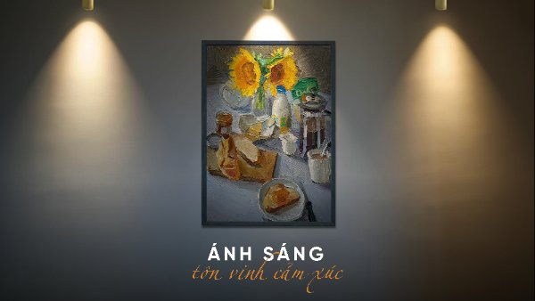
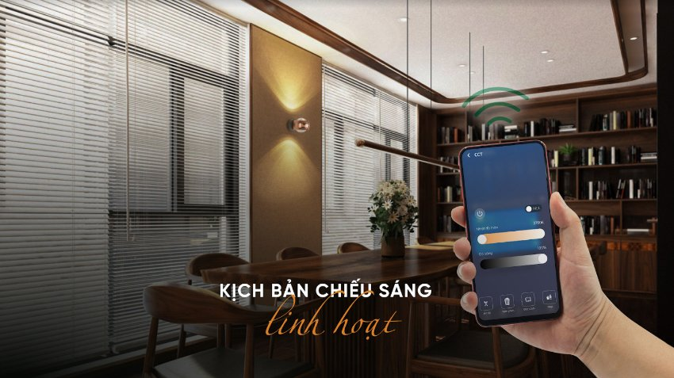

*Sau Lễ kỷ niệm 10 năm, Lumi bắt tay vào thực hiện lộ trình sản phẩm theo định hướng “lấy người dùng làm trung tâm”. Khởi động với giải pháp chiếu sáng cao cấp/bộ sưu tập Lumi Lighting- Ánh sáng đánh thức giác quan, Lumi mong muốn mang đến cho khách hàng những sản phẩm đa dạng về kiểu dáng, chất liệu và công năng chiếu sáng. Trong số đó không thể không nhắc tới Lumi Mini Spotlight 10W xoay góc với khả năng chiếu sáng chuyên dụng, đèn được dùng trong nhiều không gian để chiếu sáng tạo điểm nhấn, giúp nổi bật vật thể theo ý đồ của người thiết kế ánh sáng.*
### **1. Đèn Mini Spotlight 6W xoay góc thiết kế tinh tế, hiện đại, bền bỉ vượt thời gian**
- Mỗi thiết kế đèn Spotlight đều được thực hiện với sự tỉ mỉ và tinh tế đến từng chi tiết. Sự kết hợp của các vật liệu cao cấp cùng với sử dụng công nghệ anode và mạ cao cấp tạo nên sự hoàn hảo cho từng sản phẩm.
- Nhờ đó, đèn Spotlight phù hợp với mọi không gian, từ sang trọng đến tối giản, mang đến một cái nhìn thẩm mỹ và hiện đại. Người dùng có thể tùy chọn màu sắc là gold hoặc champagne dựa trên phong cách nội thất của ngôi nhà.

*Đèn Mini Spotlight xoay góc*
### **2. Ánh sáng tạo cảm xúc, gia vị tạo điểm nhấn**
- Bộ sưu tập đèn Mini Spotlight này mang đến sự kết hợp hoàn hảo giữa chất lượng ánh sáng và thẩm mỹ cao. Với chỉ số hoàn màu CRI >90 (Color Rendering Index), các thiết kế đèn đảm bảo tái tạo màu sắc một cách trung thực, giúp các đối tượng và không gian trở nên sống động và tự nhiên hơn bao giờ hết.
- Khả năng thay đổi nhiệt độ màu linh hoạt của các Mini Spotlight tạo nên một loạt trải nghiệm ánh sáng khác nhau. Từ ánh sáng ấm dịu và cozy cho những khoảnh khắc thư giãn, cho đến ánh sáng trắng tự nhiên và sáng rực rỡ cho những hoạt động năng động. Sự biến đổi này tạo ra không gian sống đa dạng, đồng thời thể hiện tinh thần và tâm hồn của gia chủ.
- Mỗi chi tiết đèn Mini Spotlight trong bộ sưu tập được thiết kế một cách tỉ mỉ, từng đường nét, từng khớp nối đều thể hiện sự tinh tế và sang trọng; tạo điểm nhấn thẩm mỹ, mỗi chiếc đèn sẽ trở thành một tác phẩm nghệ thuật độc đáo trong không gian sống của bạn.
- Mini Spotlight xoay góc có khả năng điều chỉnh góc chiếu tùy theo mục đích sử dụng; tạo ra ánh sáng tập trung đúng nơi cần thiết mà còn thể hiện sự linh hoạt và sáng tạo trong thiết kế nội thất.

**3. Công năng đa dạng, kịch bản chiếu sáng linh hoạt**

- Người dùng có đầy đủ lựa chọn cho toàn bộ nhu cầu chiếu sáng trong không gian sống với Lumi Spotlight. Đèn cho phép thay đổi góc chiếu và linh hoạt điều chỉnh nhiệt độ màu, cường độ sáng bằng Smartphone.
- Với Lumi Spotlight, sự linh hoạt được thể hiện không chỉ qua việc thay đổi góc chiếu một cách dễ dàng, mà còn đến việc điều chỉnh nhiệt độ màu và cường độ sáng theo ý thích. Người dùng có thể tùy chỉnh từng khối ánh sáng để tạo ra một bầu không gian thích hợp cho từng hoàn cảnh: ánh sáng ấm và dịu dàng cho một buổi tối thư giãn, hay ánh sáng tươi sáng và tập trung để làm việc hoặc đọc sách.
- Spotlight mini xoay góc mang đến khả năng tạo ra những kịch bản chiếu sáng độc đáo, phù hợp với mọi tình huống. Từ việc tạo ra không gian ấm áp cho buổi họp gia đình, đến việc tạo điểm nhấn sáng tạo cho bữa tiệc cuối tuần, tất cả đều có thể được dễ dàng tùy chỉnh thông qua công tắc cảnh hoặc trực tiếp trên smartphone.

*Ứng dụng đèn Mini Spotlight xoay góc*
### **4. Một mảnh ghép trong hệ sinh thái Smarthome**
Khách hàng có thể sử dụng đèn Lumi Mini Spotlight như là đèn chiếu sáng đơn lẻ hoặc một phần trong hệ thống các nhóm đèn để tạo ra những kịch bản chiếu sáng khác nhau trên Smartphone. Đặc biệt, kết hợp với các thiết bị thông minh khác trong [***nhà thông minh***](https://lumi.vn/); các sản phẩm đèn Spotlight của Lumi giúp bạn trải nghiệm một ngôi nhà thông minh với trọn vẹn cảm xúc sống.

*Lumi Mini Spotlight là mảnh ghép trong hệ sinh thái smarthome*

Với khả năng linh hoạt và thiết kế tinh tế, đèn Mini Spotlight xoay góc không chỉ cung cấp ánh sáng chất lượng mà còn tạo điểm nhấn thẩm mỹ cho không gian. Để nhận thông tin tư vấn chi tiết về giải pháp chiếu sáng thông minh, hãy liên hệ ngay với hotline 0904 665 965, nhân viên tư vấn sẽ hỗ trợ nhanh chóng 24/7.

***Xem thêm một số sản phẩm đèn nổ bật trong bộ sưu tập Lumi Lighting:***

- [***Đèn mini spotlight âm trần 7W 15 độ, chỉnh hướng***](https://lumi.vn/san-pham/den-mini-spotlight-am-tran-7w-15-do-chinh-huong.html)
- [***Đèn spotlight âm trần 7W 24 độ***](https://lumi.vn/san-pham/den-spotlight-am-tran-7w-24-do-chinh-huong.html)
- [***Đèn LED spotlight âm trần 7W 40 độ, chỉnh hướng***](https://lumi.vn/san-pham/den-mini-spotlight-am-tran-7w-40-do-chinh-huong.html)
