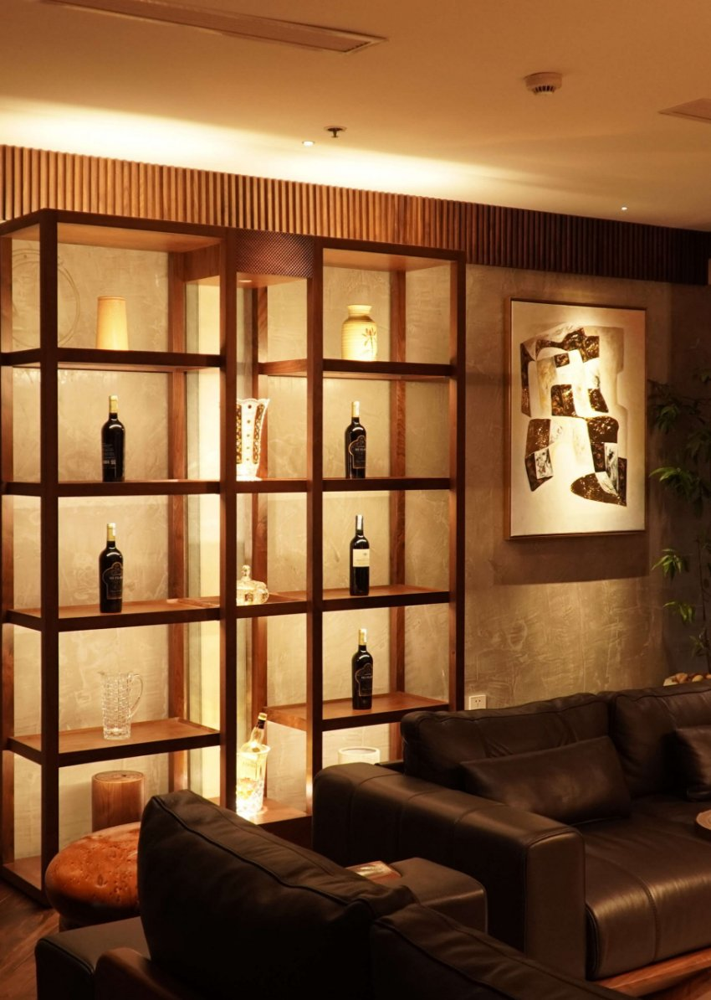
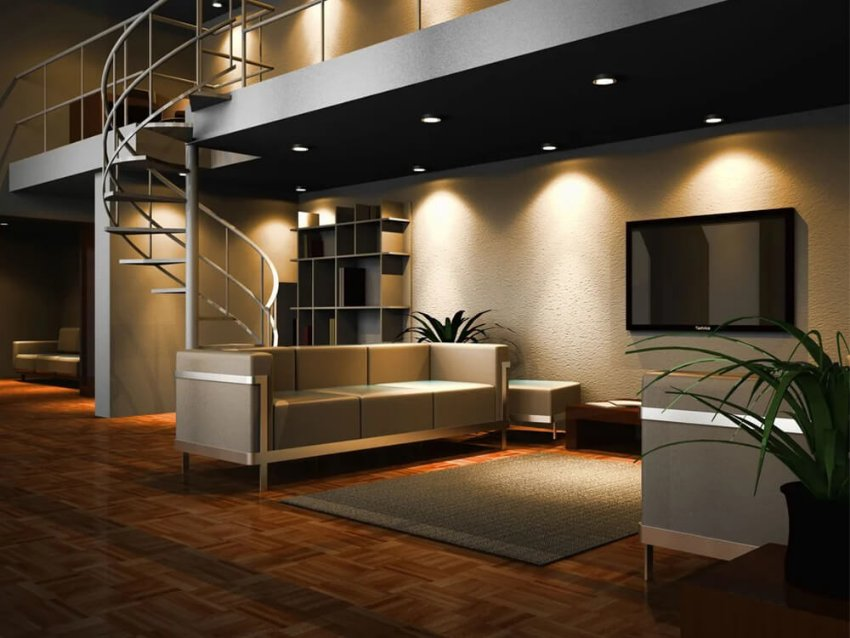

*Sau Lễ kỷ niệm 10 năm, Lumi bắt tay vào thực hiện lộ trình sản phẩm theo định hướng “lấy người dùng làm trung tâm”. Khởi động với giải pháp chiếu sáng cao cấp/bộ sưu tập Lumi Lighting- Ánh sáng đánh thức giác quan, Lumi mong muốn mang đến cho khách hàng những sản phẩm đa dạng về kiểu dáng, chất liệu và công năng chiếu sáng. Trong số đó không thể không nhắc tới Lumi Mini Spotlight 6w- 10w. Nhắc đến đèn spotlight, bên cạnh việc thích hợp cho các trường hợp chiếu sáng chuyên dụng, đèn được dùng trong nhiều không gian để chiếu sáng tạo điểm nhấn, giúp nổi bật vật thể theo ý đồ của người thiết kế ánh sáng.*
## **1. Thiết kế tinh tế, hiện đại, bền bỉ vượt thời gian**
Mỗi thiết kế đèn Spotlight đều được chăm chút tỉ mỉ đến từng chi tiết. Các vật liệu cao cấp kết hợp các công nghệ anode, mạ cao cấp giúp các thiết bị phù hợp với không gian từ sang trọng đến tối giản. Khách hàng có thể lựa chọn màu gold hoặc champagne tuỳ thuộc vào không gian nội thất nhà mình.

*Đèn Mini Spotlight 6W-10W*
### **2. Ánh sáng tạo cảm xúc, gia vị tạo điểm nhấn**
Các thiết kế đèn Mini Spotlight trong bộ sưu tập lần này đều mang đến chất lượng ánh sáng lí tưởng với chỉ số hoàn màu CRI >95 (Color Rendering Index). Đồng thời, nhiệt độ màu thay đổi linh hoạt tạo nên điểm nhấn và chiều sâu cho mỗi không gian sống, mang lại cảm xúc chân thật hơn trong mỗi khoảnh khắc.

*Đèn Mini Spotlight 6W-10W ánh sáng chạm cảm xúc*

*Đèn Mini Spotlight 6W-10W lắp đặt tạo điểm nhấn*
### **3. Công năng đa dạng, kịch bản chiếu sáng linh hoạt**
Khách hàng có đầy đủ lựa chọn cho toàn bộ nhu cầu chiếu sáng trong không gian sống với mẫu [***đèn thông minh***](https://lumi.vn/den-led-thong-minh/) của Lumi. Đèn cho phép thay đổi góc chiếu và linh hoạt điều chỉnh nhiệt độ màu, cường độ sáng bằng Smartphone. Kịch bản chiếu sáng linh hoạt cũng được tùy chỉnh theo ý gia chủ nhờ công tắc cảnh hoặc smartphone.

*Các sản phẩm Lumi Lighting kết hợp trong không gian sống*
### **4. Một mảnh ghép trong hệ sinh thái Smarthome**
Khách hàng có thể sử dụng đèn Lumi Mini Spotlight như là đèn chiếu sáng đơn lẻ hoặc một phần trong hệ thống các nhóm đèn để tạo ra những kịch bản chiếu sáng khác nhau trên Smartphone. Đặc biệt, kết hợp với các thiết bị thông minh khác trong nhà các sản phẩm đèn Spotlight của Lumi giúp bạn trải nghiệm một ngôi nhà thông minh với trọn vẹn cảm xúc sống.

*Đèn là một mảnh ghép trong hệ sinh thái Smarthome*

Trên đây là thông tin chi tiết về sản phẩm đèn thông minh Mini Spotlight 6W -10W. Tham khảo thêm các Sản phẩm trong BST Lumi Lighting dễ dàng kết hợp với các thiết bị smarthome khác:

- [***Mini Spotlight xoay góc***](https://lumi.vn/san-pham/mini-spotlight-xoay-goc.html)
- [***Đèn mini spotlight âm trần 7W 15 độ***](https://lumi.vn/san-pham/den-mini-spotlight-am-tran-7w-15-do-chinh-huong.html)
- [***Đèn LED spotlight âm trần 7W 24 độ, chỉnh hướng***](https://lumi.vn/san-pham/den-spotlight-am-tran-7w-24-do-chinh-huong.html)
