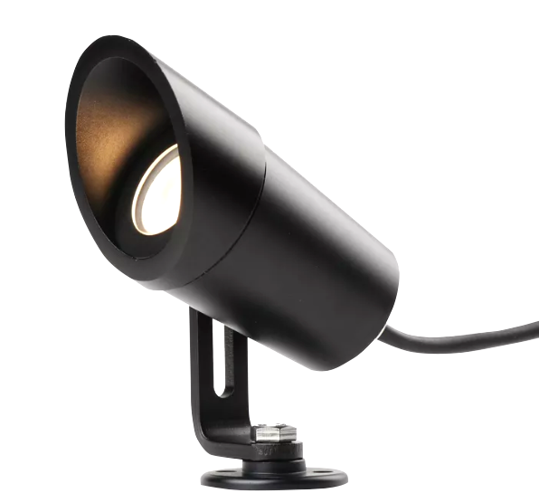
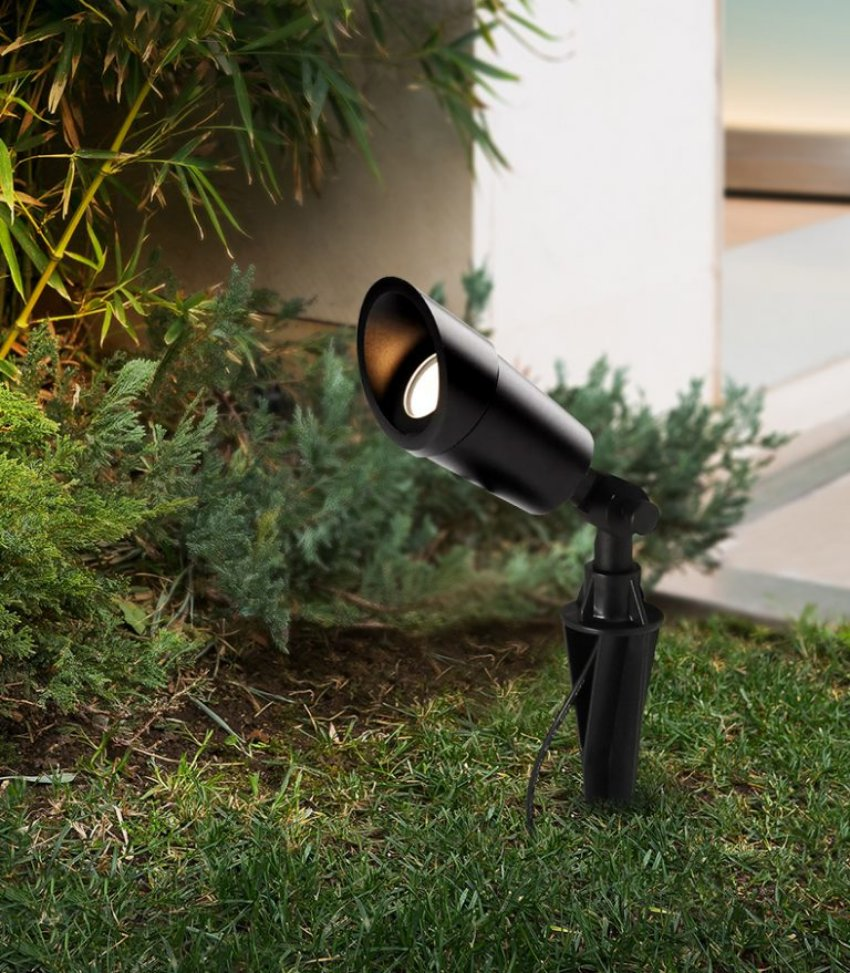

*Đèn rọi cây 5W chống nước đang dần trở thành một phần quan trọng trong thiết kế cảnh quan và chiếu sáng ngoại trời. Đèn được thiết kế với công nghệ tiên tiến, chúng không chỉ đem lại ánh sáng tốt mà còn chống chọi được với thời tiết khắc nghiệt. Trong bài viết này, chúng ta sẽ tìm hiểu chi tiết về mẫu [**đèn thông minh**](https://lumi.vn/den-led-thong-minh) tối ưu cho không gian ngoại trời này.*
## **1. Đặc điểm đèn rọi cây 5w chống nước**
- Đèn rọi cây 5w chống nước, hay còn gọi là đèn cắm cỏ sân vườn, là sản phẩm nhận được nhiều sự quan tâm của những khách hàng có mong muốn sở hữu một không gian ngoài trời với ánh sáng nghệ thuật.
- Thiết bị chuyên dùng để chiếu sáng trang trí cây cảnh, tiểu cảnh ngoài trời, tạo hiệu ứng cho các bãi cỏ. Từ đó giúp không gian ngoại thất thêm sang trọng, quang cảnh sân vườn lung linh và tạo hiệu ứng thị giác tốt.

*Đèn rọi cây 5w chống nước*

\>> Xem thêm sản phẩm: [***Đèn downlight 10W***](https://lumi.vn/san-pham/den-downlight-10w.html)

- Đèn cắm cỏ sân vườn 5w chống nước Lumi có độ bền cao, được thiết kế riêng biệt giúp chống chịu mưa gió ngoài trời, duy trì tối đa tuổi thọ của đèn.
- Bên cạnh đó, với thiết kế kiểu dáng tối giản, hiện đại, đèn rọi cây 5w chống nước phù hợp với mọi phong cách thiết kế cho không gian bên ngoài.
## **2. Ứng dụng của đèn rọi cây 5w chống nước**
- Đèn rọi cây tạo ra được nguồn ánh sáng tập trung vào khu vực trang trí cần làm nổi bật. Nhờ việc lắp đặt dễ dàng, loại đèn này được sử dụng phổ biến trong hệ thống đèn chiếu sáng trang trí sân vườn để tôn lên các tiểu cảnh, tạo điểm nhấn cho không gian.
- Trong các công trình nhà ở có không gian sân vườn riêng, đèn cắm cỏ thường được ưu tiên lựa chọn nhờ tính ứng dụng cao; dễ dàng phù hợp để chiếu sáng nhiều vị trí trong sân vườn.
- Người dùng có thể sắp xếp các đèn rọi cây trong vườn để chiếu sáng cho các cây cao, bụi cây nhỏ và cả những vật trang trí trong không gian. Từ đó, đèn rọi cây 5w chống nước giúp tăng giá trị thẩm mỹ đáng kể cho cả không gian ngoại thất.

*Sử dụng đèn cắm cỏ sân vườn với một chút cách điệu phần chân đèn*

- Ngoài khu vực sân vườn trong nhà, bạn có thể bắt gặp chúng tại công viên, đường đi bộ, khu nghỉ dưỡng,…không chỉ nâng cao giá trị thẩm mĩ, đèn còn mang lại không gian đáng sống với vẻ đẹp sân vườn, giúp đi lại thuận tiện về đêm.

*Ứng dụng của đèn cắm cỏ sân vườn cho không gian ngoại thất*

- Có thể thấy, không gian ngoài trời khi có sự hỗ trợ ánh sáng từ đèn chiếu cây sẽ tạo ra hiệu ứng thị giác tốt, gia tăng giá trị thẩm mỹ; thể hiện rõ dụng ý nghệ thuật của chủ nhân đối với từng chi tiết như cây cối hay vật trang trí ngoài trời.
## **3. Ưu điểm của đèn rọi cây 5w chống nước**
- **Tính thẩm mỹ cao:** Thiết kế nhỏ gọn, hiện đại với màu đen đặc trưng, dễ dàng phù hợp với bất kì vị trí nào trong không gian sân vườn; đi kèm chân đèn giúp dễ dàng điều chỉnh độ cao của đèn phục vụ mục đích chiếu sáng cho từng vị trí nhất định
- **Kháng nước, kháng bụi tốt:** Chỉ số kháng nước, kháng bụi IP67, giúp đèn độ bền cao, thích hợp sử dụng trong khu vực thường xuyên ẩm ướt, bụi bẩn như các không gian sân vườn, không gian ngoài trời
- **Chất lượng sáng cao, bảo vệ mắt:** Chip LED hiện đại với chỉ số hoàn màu cao CRI>90 cùng nhiệt độ màu 4000K giúp ánh sáng trở nên trung thực, sắc nét, vừa tạo hiệu ứng ánh sáng tốt không gian sân vườn, vừa đem đến cho đôi mắt của bạn một trải nghiệm êm dịu với ánh sáng khuếch tán tối ưu
- **Vật liệu cao cấp:** Đèn được làm từ hợp kim nhôm cao cấp giúp đèn tản nhiệt nhanh, không bị han rỉ và phù hợp với thời tiết khắc nghiệt của Việt Nam
- **An toàn khi sử dụng:** Ánh sáng phát ra an toàn cho người sử dụng, thân thiện môi trường vì không chứa các chất độc hại và tia hồng ngoại
- **Lắp đặt dễ dàng, nhanh chóng**

Trên đây là những thông tin chi tiết về đèn rọi cây 5w chống nước. Nếu bạn đang muốn sở hữu không gian sống với những điểm nhấn ánh sáng, độc đáo hãy liên hệ ngay tới số hotline 090.466.5965 để được hỗ trợ và tư vấn chi tiết.

**Tham khảo thêm các sản phẩm chất lượng cao tại Luimi:**

- [***Đèn downlight 10W***](https://lumi.vn/san-pham/den-downlight-10w.html)
- [***Đèn LED downlight 12W***](https://lumi.vn/san-pham/den-downlight-12w.html)
- [***Đèn LED Downlight âm trần thông minh***](https://lumi.vn/san-pham/den-led-downlight-thong-minh-am-tran.html)
