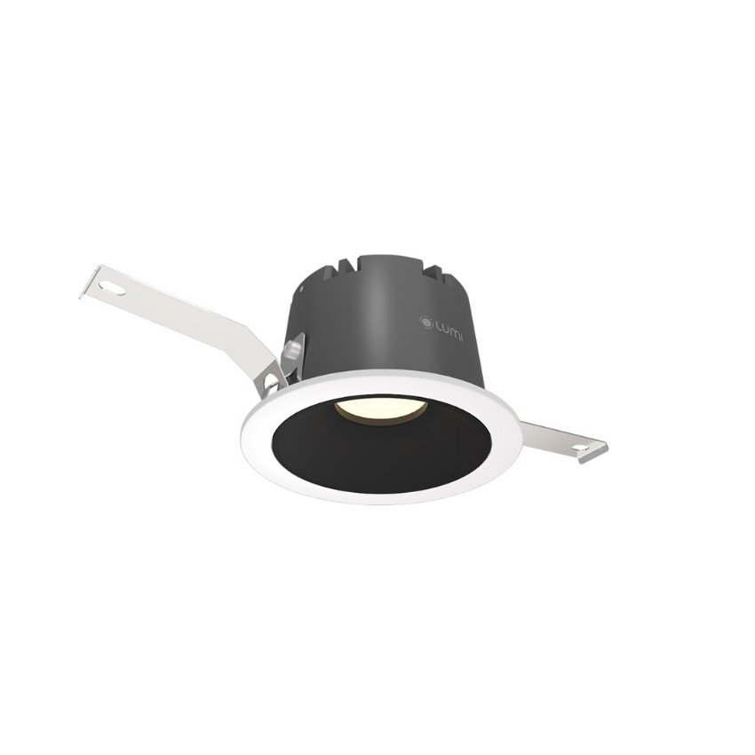

*Đèn spotlight 12W (Tunable White)  là sản phẩm có khả năng điều chỉnh nhiệt độ màu. Mẫu đèn spotlight này mang đến cho bạn một loạt các tính năng thông minh và đảm bảo an toàn tuyệt đối cho người sử dụng. Bài viết này sẽ giúp bạn hiểu rõ hơn về các đặc điểm và tính năng của đèn spotlight 12W (Tunable White).*
## **1. Đặc điểm chung của đèn spotlight 12W (Tunable White)**
### **1.1. Khả năng điều chỉnh nhiệt độ màu**
- Đèn spotlight 12W (Tunable White) là mẫu [bóng đèn thông minh](https://lumi.vn/den-led-thong-minh) được trang bị công suất 12W, với ánh sáng hiệu suất cao và an toàn cho mắt.
- Điều đặc biệt là nó có khả năng điều chỉnh nhiệt độ màu, cho phép bạn tạo ra ánh sáng ấm áp hoặc ánh sáng trắng tự nhiên tùy thuộc vào nhu cầu và không gian sử dụng.
### **1.2. Góc chiếu và kích thước**
- Đèn spotlight này có hai tùy chọn góc chiếu: 24 độ và 40 độ, giúp có thể điều chỉnh góc chiếu phù hợp để tạo ra ánh sáng phù hợp với không gian sử dụng.
- Kích thước của đèn là 90\*55mm, với lỗ khoét có đường kính 75mm, dễ dàng lắp đặt vào các vị trí khác nhau.

*Đèn spotlight 12w (Tunable White)*
### **1.3. Màu sắc và chất liệu**
Đèn spotlight 12W (Tunable White) có sẵn ba màu sắc chóa đèn để bạn lựa chọn: trắng, crom và crom đen. Bạn có thể tùy chọn màu sắc phù hợp với thiết kế và phong cách của không gian chiếu sáng. Thân đèn được làm từ hợp kim nhôm, mang lại độ bền và đẹp mắt cho sản phẩm.
### **1.4. Chip LED và các thông số kỹ thuật khác**
- Đèn spotlight 12W (Tunable White) sử dụng chip LED từ thương hiệu Bridgelux – Mỹ, đảm bảo hiệu suất chiếu sáng cao và tiết kiệm năng lượng.
- Nhiệt độ màu (CCT) của đèn có thể điều chỉnh từ 2700K đến 6500K, cho phép bạn tạo ra không gian ánh sáng phù hợp với từng không gian cụ thể.
- Chỉ số hoàn màu (CRI) của đèn là hơn 95, mang lại màu sắc tự nhiên và chân thực.
- Tuổi thọ của sản phẩm là hơn 25000 giờ, đảm bảo hoạt động ổn định trong thời gian dài.
## **2. Ứng dụng của đèn spotlight 12W**
Đèn spotlight 12W (Tunable White) được xem là một sản phẩm cao cấp với nhiều tính năng độc đáo. Chính vì vây, đèn là sự lựa chọn hoàn hảo cho nhiều không gian như:

- Biệt thư, chung cư, nhà vườn
- Toà nhà văn phòng, trung tâm thương mại
- Khu nghỉ dưỡng, khu đô thị, nhà hàng
- ….

Trên đây là những thông tin chi tiết về mẫu đèn spotlight 12W (Tunable White). Với khả năng điều chỉnh nhiệt độ màu, góc chiếu linh hoạt, và các tính năng khác như chỉ số hoàn màu cao và tuổi thọ dài, nó là một lựa chọn tuyệt vời cho việc chiếu sáng các không gian khác nhau. Để nhận thông tin tư vấn chi tiết về sản phẩm, hãy liên hệ hotline hoặc để lại thông tin trong form liên hệ, nhân viên của Lumi Lighting sẽ liên hệ và tư vấn chi tiết cho bạn.

**>> Tham khảo thêm một số sản phẩm khác cũng bộ sưu tập Lumi Lighting:**

- [***Đèn spotlight âm tủ mini 3W, chỉnh hướng***](https://lumi.vn/san-pham/den-spotlight-am-tu-mini-3w-chinh-huong.html)
- [***Đèn mini Spotlight 6W-10W***](https://lumi.vn/san-pham/mini-spotlight-6w-10w.html)
- [***Đèn mini Spotlight cao cấp xoay góc***](https://lumi.vn/san-pham/mini-spotlight-xoay-goc.html)
