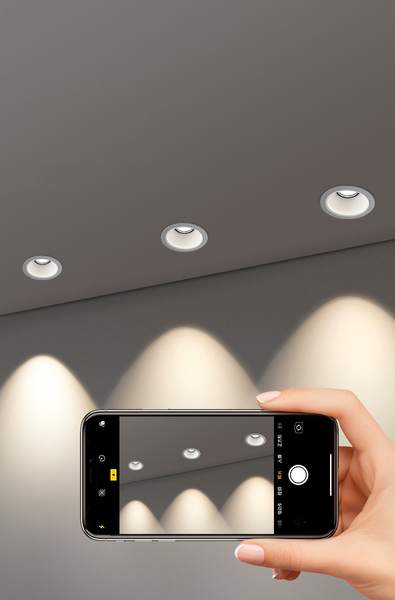
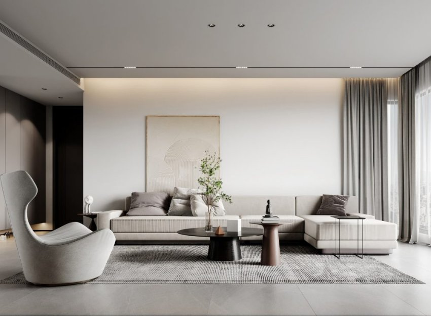
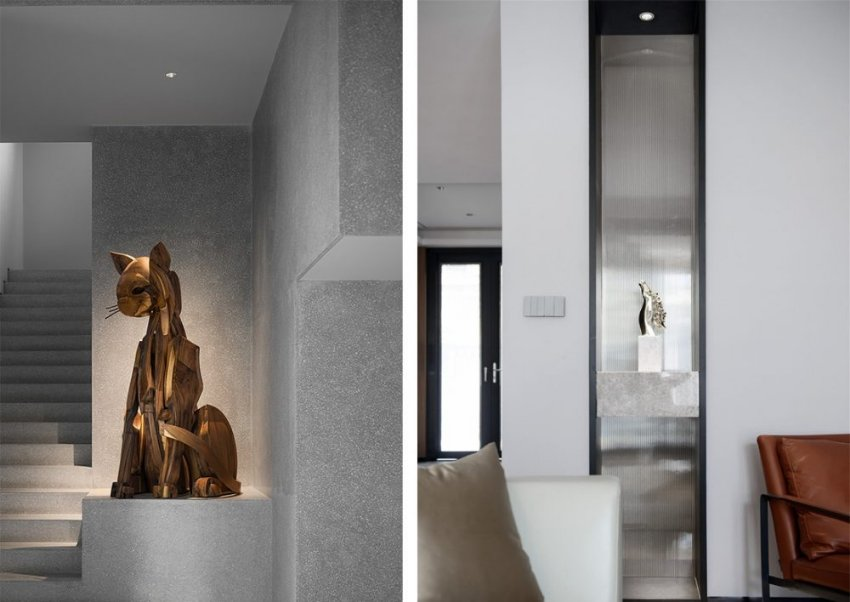

*Đèn spotlight âm trần 10W 36 độ chỉnh hướng được ứng dụng công nghệ chiếu sáng tiên tiến, mang tới nguồn sáng chân thực, tạo điểm nhấn ấn tượng cho không gian sống. Với góc chiếu rộng cùng nhiệt độ màu lớn, đèn phù hợp lắp đặt với mục đích chiếu sáng chức năng trong các không gian khác nhau. Vậy đèn spotlight âm trần 10W 36 độ có đặc điểm gì nổi bật?*

*Đèn spotlight âm trần 7W 36 độ*
## **1. Cấu tạo đèn spotlight âm trần 10W 36 độ chỉnh hướng**
Đèn spotlight âm trần 10W 36 độ có cấu tạo chính gồm 3 phần chính là thân đèn, mạch chip LED và chấn lưu điện tử.

- Thân đèn Spotlight 10W 36 độ âm trần được chế tạo từ nhôm đúc cao cấp kết hợp xử lý bề mặt kỹ lưỡng giúp chống oxi hóa và chống ăn mòn tốt. Bên cạnh đó phần đế thiết kế nhiều cánh tản nhiệt giúp tản nhiệt hiệu quả và gia tăng độ bền cho đèn.
- Mạch chip sử dụng chip Bridgelux giúp tăng hiệu suất sử dụng và tiết kiệm năng lượng vượt trội so với các bóng đèn thông thường. Đặc biệt chip LED phát ra nguồn ánh sáng ổn định trong mọi điều kiện điện áp.
- Đèn rọi âm trần 10W 36 độ sử dụng chấn lưu điện tử với hệ số công suất cao, khả năng chịu nhiệt tốt và tiêu thụ ít điện năng nên ít tỏa nhiệt ra môi trường, giúp bảo vệ môi trường rất tốt.

\>> Tham khảo thêm sản phẩm: [***Đèn spotlight 12W (Tunable White)***](https://lumi.vn/san-pham/den-spotlight-12w-tunable-white.html)
## **2. Ưu điểm đèn spotlight âm trần 10W 36 độ**
Đèn spotlight âm trần 10W 36 độ chỉnh hướng sở hữu nhiều điểm nổi bật giúp sản phẩm được ưa chuộng, sử dụng phổ biến tại nhiều khu vực khác nhau trong ngôi nhà.

- Tích hợp công nghệ hiện đại với chip LED Bridgelux có hệ số phát quang cao, giúp chiếu sáng vật thể tốt và tạo hiệu ứng thị giác độc đáo cho không gian
- Ánh sáng có độ hoàn màu lớn, CRI >97 giúp phản ánh trung thực màu sắc của các chi tiết nội thất và khơi gợi những cảm xúc, bầu không khí riêng cho mỗi khu vực
- Ánh sáng phát ra từ đèn rọi âm trần không chứa tia hồng ngoại/tia UV nên rất an toàn cho mắt và da người dùng
- Không chỉ có độ bền cao, spotlight 10W 36 độ âm trần còn có tuổi thọ cao lên tới 25.000h chiếu sáng
- Thiết kế tối giản, lược bỏ các chi tiết rườm rà giúp đèn giảm trọng lượng tối ưu và mang nét đẹp hiện đại, thanh thoát
- Góc chiếu 36° cho ánh sáng hài hòa cùng khả năng điều chỉnh hướng chiếu sáng linh hoạt cho phép người dùng làm nổi bật phối cảnh trong không gian và đáp ứng nhu cầu sinh hoạt tại các khu vực nhất định.
- Chỉ với thao tác đơn giản là tích hợp thêm driver, đèn spotlight âm trần 10W 36° sẽ được nâng cấp trở nên thông minh và kết nối dễ dàng với hệ thống smarthome. Giờ đây người dùng dễ dàng điều khiển (hoặc hẹn giờ) bật/tắt các lộ đèn theo nhu cầu sử dụng hoặc theo từng ngữ cảnh đặc biệt qua smartphone.

\>> Tham khảo thêm sản phẩm: [***Đèn spotlight âm tủ mini 3W***](https://lumi.vn/san-pham/den-spotlight-am-tu-mini-3w-chinh-huong.html)
## **3. Ứng dụng của đèn spotlight 10W 36 độ âm trần**
Đèn spotlight âm trần 10W 36 độ không chỉ được dùng để chiếu ánh sáng chức năng cho nhà ở mà còn được dùng rộng rãi cho chiếu sáng từ khách sạn tới bảo tàng và cả các cửa hàng kinh doanh.

- Chiếu sáng cho nhà ở: đèn rọi 10W 36 độ âm trần được sử dụng phổ biến để chiếu sáng chức năng tại các khu vực bếp nấu, đảo bếp, bàn ăn, tủ trang trí, tủ sách,… nhằm cung cấp nguồn ánh sáng cần thiết và làm nổi bật khu vực đó lên.

- Chiếu sáng khách sạn: tương tự chiếu sáng cho nhà ở, đèn spotlight âm trần 10W 36 độ được ứng dụng chiếu sáng chức năng tại các khu vực tivi, hành lang, tủ trang trí, phòng tắm,…

- Chiếu sáng trong bảo tàng, phòng triển lãm: Độ hoàn màu trên CRI>90 chân thực, cùng hướng chiếu điều chỉnh linh hoạt nên đèn spotlight 10W 36 độ âm trần được sử dụng phổ biến để tạo điểm nhấn cho phối cảnh không gian và thu hút khách tham quan tới khu vực đó.

Mỗi chi tiết hay không gian nội thất đều cần được chiếu sáng để thể hiện ý đồ thiết kế và ghi dấu ấn riêng trong cách tính của gia chủ. Hy vọng với những thông tin chi tiết về đèn spotlight âm trần 10W 36 độ, quý khách đã có cho mình những ý tưởng thiết kế chiếu sáng phù hợp cho tổ ấm của mình. Hãy liên hệ ngay tới số hotline 0904.665.965 để được Lumi tư vấn chi tiết và hỗ trợ nhanh nhất.

\>> Tham khảo thêm sản phẩm: [***Đèn mini Spotlight xoay góc***](https://lumi.vn/san-pham/mini-spotlight-6w-10w.html)
