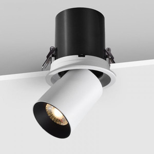
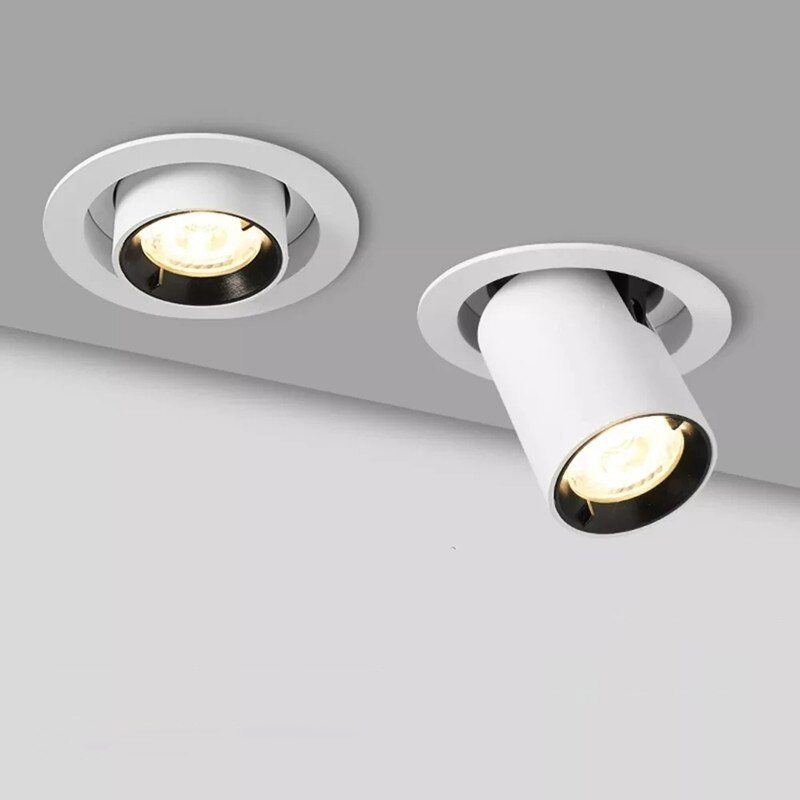
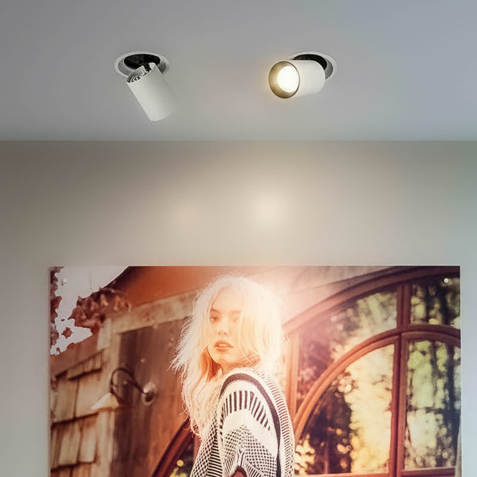

***Đèn spotlight âm trần 10W xoay góc*** với kiểu dáng thiết kế độc đáo, góc quay linh hoạt và đạt hiệu quả cao trong chiếu sáng nội thất nên được ưu ái sử dụng rộng rãi ở nhiều công trình khác nhau. Để hiểu sâu hơn về tính năng và cách ứng dụng của mẫu [***đèn thông minh Lumi***](https://lumi.vn/den-led-thong-minh) mới này, mời mọi người cùng Lumi tìm hiểu trong bài viết dưới đây.

*Đèn spotlight âm trần 10W xoay góc*
## **1. Cấu tạo đèn spotlight âm trần 10W xoay góc**
Đèn spotlight âm trần 10W xoay góc có cấu tạo gồm 4 phần:

- Đuôi đèn: Đuôi đèn thiết kế hình trụ đơn giản màu đen, phía trong rỗng chứa đầu đèn và cũng là giá cố định hỗ trợ cho phần đầu đèn có thể xoay góc chiếu sáng 360º.
- Đầu đèn: Đuôi đèn cũng thiết kế hình trụ trơn màu trắng có thể điều chỉnh âm vào tường hoặc kéo nổi ra ngoài tùy mục đích sử dụng. Ngoài ra đầu đèn còn có thể xoay góc chiếu sáng linh động, đáp ứng đa dạng nhu cầu chiếu sáng khác nhau của người sử dụng.
- Chip LED: Tương tự các sản phẩm đèn trong bộ sưu tập đèn Lumi Lighting 2022, đèn spotlight âm trần 10W cũng sử dụng chip LED Bridgelux với công suất chiếu 10W, cùng độ ổn định cao.
- Chấn lưu điện từ: Là bộ phận giúp điều chỉnh sự ổn định của dòng điện và cung cấp đủ điện áp tới đèn để nó bắt đầu hoạt động. Ngoài ra, bộ phận này khi được kết hợp cùng driver của Lumi sẽ giúp đèn trở nên thông minh và dễ dàng điều khiển bật/tắt từ xa qua smartphone hoặc ra lệnh bằng giọng nói.
## **2. Những ưu điểm vượt trội của đèn spotlight âm trần 10W xoay góc**

*Đèn spotlight âm trần 10W xoay góc có nhiều ưu điểm vượt trội*

- CRI 97: Đây là chỉ số thể hiện độ hoàn màu và phản ánh độ trung thực màu sắc của vật thể khi được ánh sáng chiếu vào. CRI lớn nhất hiện nay là 100 – ánh sáng của mặt trời vào ban ngày. Điều này có nghĩa đèn spotlight âm trần xoay góc 10W chiếu nguồn ánh sáng với mức độ hoàn màu tương đương của ánh sáng mặt trời.
- Sử dụng chip Bridgelux: Với nguồn sáng LED chất lượng cao cùng hiệu suất ổn định giúp gia tăng độ bền và tuổi thọ của đèn trong quá trình sử dụng
- Góc chiếu 24 độ: Khẩu độ chiếu khá rộng vì vậy đèn spotlight âm trần 10W xoay góc có thể được dùng để chiếu sáng điểm, rọi vật thể hoặc chiếu sáng khu vực cho mục đích chức năng.
- An toàn: Đèn không chứa các hóa chất độc hại, không sinh ra tia UV nên rất an toàn cho người sử dụng cũng như thân thiện với môi trường.
- Vật liệu cao cấp: Đuôi đèn và đầu đèn được làm từ hợp kim nhôm cao cấp giúp đèn tản nhiệt nhanh, không bị han rỉ và phù hợp với thời tiết khắc nghiệt của Việt Nam.
- Góc xoay 360º: Với góc xoay linh động vượt trội, đèn LED spotlight âm trần 10W đáp ứng nhiều mục đích sử dụng khác nhau cho các công trình nhà ở, tới công trình thương mại
- ` `Tương thích với [nhà thông minh](https://lumi.vn/): Khi chấn lưu được tích hợp driver của Lumi, đèn sẽ kết nối được với hệ thống smarthome và được điều khiển qua app thuận tiện dù ở bất kỳ đâu. Đặc biệt thông qua nhà thông minh, người sử dụng cũng có thể tạo các kịch bản chiếu sáng khác nhau, mang tới nguồn cảm xúc ấn tượng cho không gian.
## **3. Ứng dụng của đèn spotlight âm trần xoay góc 10W**
- Với đặc tính dùng để chiếu trang trí, chiếu chức năng trong không gian và sở hữu nhiều ưu điểm vượt trội nên đèn spotlight âm trần xoay góc 10W là giải pháp tối ưu cho các không gian tại cửa hàng thời gian, siêu thị, trung tâm thương mại, khách sạn,…
- Ngoài ra nó cũng được nhiều kiến trúc sư ưu tiên sử dụng cho các khu vực phòng khách, phòng bếp phòng làm việc, hành lang tại các căn hộ, nhà phố và biệt thự.

*Đèn spotlight 10W xoay góc âm trần rọi tranh*

Trên đây là các thông tin chi tiết về sản phẩm ***đèn spotlight âm trần 10W xoay góc***. Nếu bạn đang muốn tìm một dòng đèn spotlight âm trần để chiếu điểm hoặc khu vực nhỏ trong ngôi nhà mình thì spotlight âm trần xoay góc 10W sẽ là lựa chọn hoàn hảo. Ngoài ra bạn cũng đừng ngần ngại hãy liên hệ tới số hotline 0904.665.965 để được tư vấn miễn phí và lên phối cảnh chiếu sáng 3D trực quan nhất.

Tham khảo thêm các sản phẩm cùng bộ sưu tập Lumi Lighting khác:

- [***Đèn linear spotlight âm trần 10W***](https://lumi.vn/san-pham/den-linear-spotlight-am-tran-10w.html)
- [***Đèn LED linear spotlight gắn nổi 10W***](https://lumi.vn/san-pham/den-linear-spotlight-gan-noi-10w.html)
- [***Đèn spotlight trụ 10W ốp nổi***](https://lumi.vn/san-pham/den-spotlight-tru-10w-op-noi-36-do.html)
