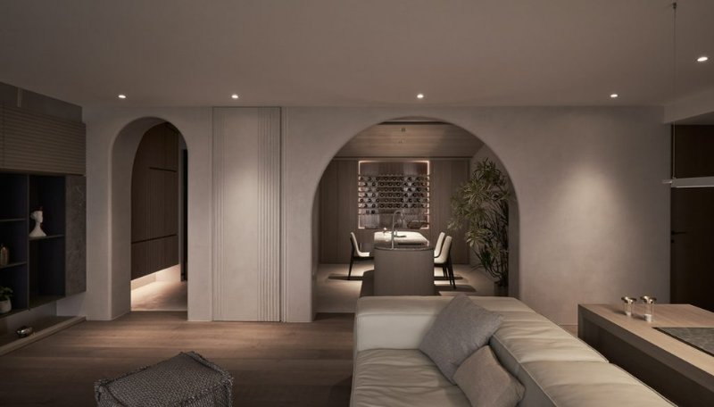
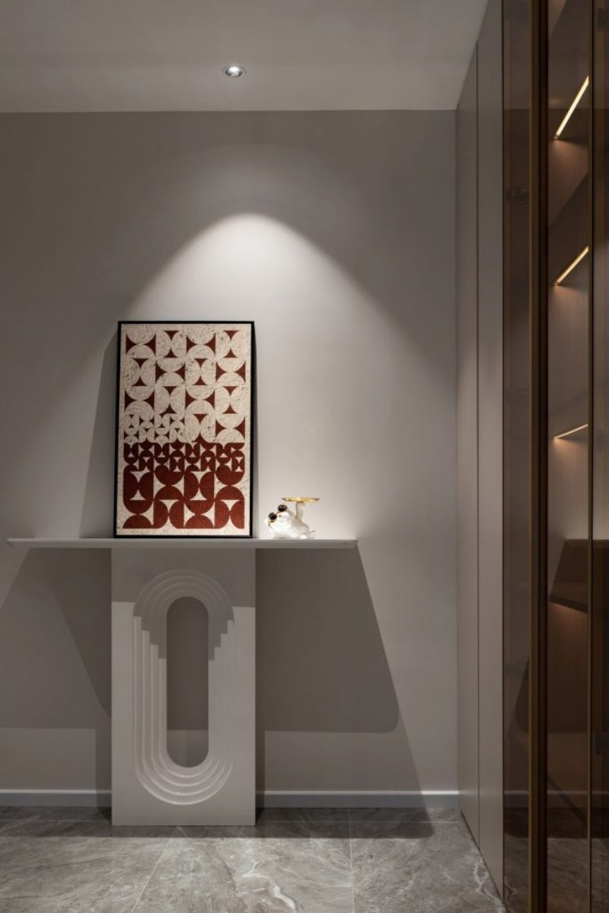
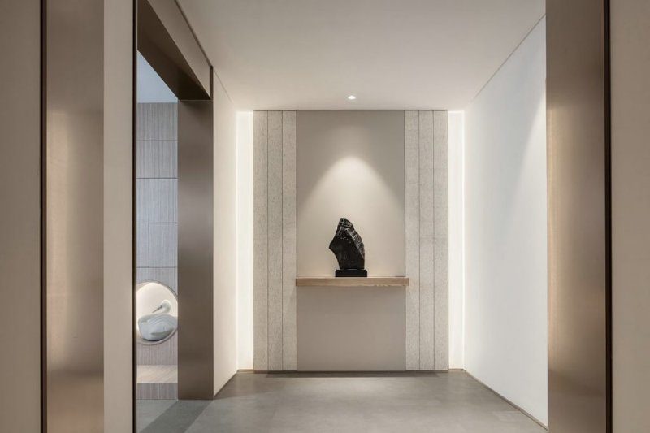

*Đèn spotlight âm trần 7W 24 độ sử dụng chip LED chất lượng cao, cho độ hoàn màu chân thật giúp tạo điểm nhấn ấn tượng cho các không gian. Bên cạnh đó, với thiết kế kiểu dáng tối giản, hiện đại, đèn âm trần spotlight  7W 24 độ phù hợp với mọi phong cách nội thất từ hiện đại tới cổ điển. Để tìm hiểu sâu hơn về mẫu [**bóng đèn thông minh**](https://lumi.vn/den-led-thong-minh) này, hãy xem ngay những thông tin dưới đây của chúng tôi.*

*Hiệu ứng ánh sáng độc đáo từ đèn spotlight 7W 24 độ âm trần*
## **1. Cấu tạo đèn spotlight âm trần 7W 24 độ chỉnh hướng**
Đèn spotlight âm trần 7W 24 độ được cấu tạo gồm 3 phần chính là thân đèn, mạch chip LED và chấn lưu (tăng phô).

- Thân đèn spotlight 7W 24 độ âm trần có khả năng chống oxi hóa, chống ăn mòn tốt nhờ được chế tạo từ chất liệu cao cấp, kết hợp xử lý bề mặt kỹ lưỡng. Ngoài ra, phần đế còn được thiết kế nhiều cánh tản nhiệt giúp tản nhiệt tốt và gia tăng tuổi thọ cho đèn.
- Mạch chip sử dụng chip LED Luminus với hiệu suất cao, độ hoàn màu hoàn hảo (CRI>97) mang tới nguồn sáng ổn định, sắc nét và tiết kiệm năng lượng vượt trội so với các bóng đèn thông thường.
- Đèn rọi âm trần 7W 24 độ sử dụng chấn lưu điện tử giúp kiểm soát dòng điện trong mạch ổn định, bảo vệ môi tường tốt nhờ khả năng chịu nhiệt tối ưu, và ít tỏa nhiệt.

*Đèn spotlight 7W 24 độ âm trần*

\>> Xem thêm sản phẩm đèn spotlight cao cấp mới: [***Đèn mini spotlight âm trần 7W 40 độ, chỉnh hướng***](https://lumi.vn/san-pham/den-mini-spotlight-am-tran-7w-40-do-chinh-huong.html)
## **2. Ưu điểm đèn spotlight 7W 24 độ âm trần**
Đèn spotlight âm trần 7W 24 độ hiện đang là dòng spotlight âm trần được sử dụng phổ biến rất phổ biến, bởi hiệu quả về ánh sáng mà nó mang lại.

- Đèn tích hợp công nghệ tiên tiến với chip LED Luminus có hiệu suất chiếu sáng cao, linh hoạt giúp tiết kiệm điện năng và chi phí hiệu quả
- Chỉ số hoàn màu CRI > 97, mang tới nguồn ánh sáng trung thực, giúp nâng đỡ các chi tiết nội thất trở nên nổi bật trong không gian
- Ánh sáng phát ra an toàn cho người sử dụng, thân thiện môi trường vì không chứa các chất độc hại và tia hồng ngoại
- Sản xuất từ vật liệu hợp kim nhôm cao cấp kết hợp công nghệ lõi hiện đại nên spotlight 7W 24 độ âm trần còn độ bền cao và tuổi thọ lên tới 25.000h chiếu sáng
- Sở hữu kiểu dáng nhỏ gọn cùng miệng đèn sơn trắng nên spotlight 7W 24 độ âm trần phù hợp với hầu hết phong cách nội thất ngày nay
- Với góc chiếu 24 độ nên đèn vừa dùng để chiếu điểm vật thể vừa dùng để chiếu chức năng khu vực. Bên cạnh đó đèn còn được thiết kế chỉnh hướng linh hoạt, cho phép người dùng thiết kế các kịch bản chiếu sáng khác nhau
- Chấn lưu điện tử của đèn LED spotlight âm trần 7W 24 độ khi được tích hợp driver của Lumi sẽ nâng cấp đèn trở nên thông minh và kết nối trực tiếp với nhà thông minh. Giờ đây người dùng có thể tinh chỉnh độ sáng phù hợp với nhu cầu hay thiết kế các kịch bản chiếu sáng tùy biến và điều khiển đèn bật/tắt qua app Lumi Life hoặc ra lệnh giọng nói.
## **3. Ứng dụng của đèn spotlight âm trần 7W 24 độ chỉnh hướng**
Tính ứng dụng của đèn spotlight 7W 24 độ trong các công trình xây dựng rất phổ biến. Đèn vừa được dùng để chiếu sáng điểm, chiếu sáng chức năng trong nhà ở, vừa được dùng để chiếu sáng trang trí tại khách sạn, bảo tàng, cửa hàng kinh doanh,…

- Ứng dụng trong nhà ở: Đèn chiếu điểm 7W 24 độ âm trần thường được lắp tại phòng khách, phòng bếp, phòng ăn, phòng ngủ, hành lang, phòng tắm để chiếu sáng các đồ vật trang trí hoặc khu vực nhỏ.

*Đèn LED âm trần 7W 24 độ chiếu tranh trong phòng ngủ*

- Ứng dụng trong khách sạn, nhà hàng: Để tăng tính thẩm mỹ cho không gian và thu hút sự chú ý của khách hàng và các decor trang trí hay họa tiết nội thất mà các khách sạn, nhà hàng cao cấp thường lắp đặt đèn spotlight âm trần 7W 24 độ ở các vị trí hành lang, tiền sảnh, khu vực chờ.

*Đèn spotlight 7w 24 âm trần độ rọi decor trang trí trong khách sạn*

- Ứng dụng trong bảo tàng, phòng triển lãm: Đèn spotlight 7W 24 độ âm trần được sử dụng khá phổ biến trong các bảo tàng, phòng triển lãm để làm nổi bật, tăng tính thẩm mỹ cho các tác phẩm nghệ thuật và khơi gợi bầu không khí cần thiết cho không gian.

Trên đây là những thông tin chi tiết về đèn spotlight âm trần 7W 24 độ. Nếu bạn đang muốn sở hữu không gian sống với những điểm nhấn ánh sáng, độc đáo hãy liên hệ ngay tới **Lumi** qua số hotline 0904.665.965 để được hỗ trợ và tư vấn chi tiết.

**>> Xem thêm một số mẫu đèn tương tự:**

- [***Đèn spotlight âm trần 7W mặt elip***](https://lumi.vn/san-pham/den-spotlight-am-tran-7w-mat-elip-chinh-huong.html)
- [***Đèn spotlight âm trần thông minh***](https://lumi.vn/san-pham/den-led-spotlight-thong-minh-am-tran.html)
