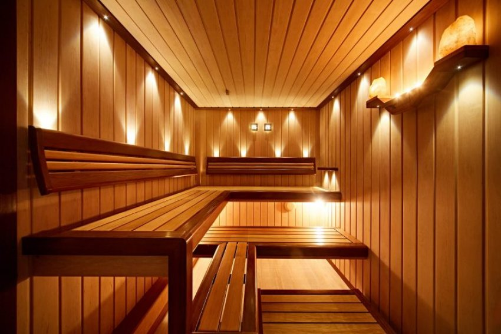
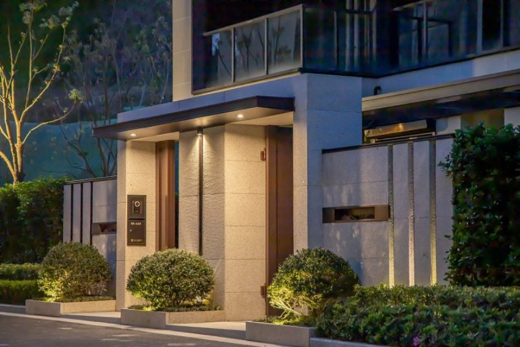
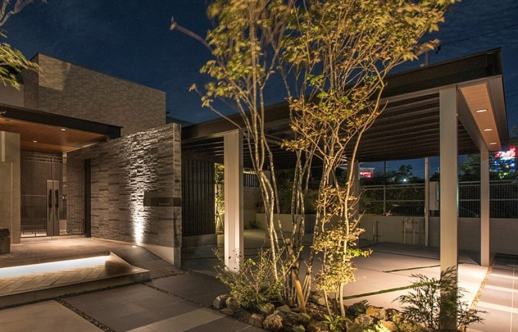

*Đèn Spotlight âm trần 9W được thiết kế đặc biệt để đối phó với mọi điều kiện thời tiết, đèn spotlight này không chỉ là nguồn ánh sáng mà còn là sự kết hợp hoàn hảo giữa tính thẩm mỹ và tính ứng dụng. Người dùng có thể tận hưởng ánh sáng mềm mại và sự an lành của môi trường tự nhiên, mà không cần lo lắng về điều kiện thời tiết thay đổi. Để tìm hiểu chi tiết về sản phẩm này, hãy theo dõi những thông tin dưới đây của chúng tôi.*
## **1. Đặc điểm đèn Spotlight âm trần 9W chống nước**
- Đèn Spotlight âm trần 9W chống nước là sản phẩm thuộc dòng spotlight trang trí, được thiết kế riêng biệt, phù hợp với cả những khu vực có độ ẩm ướt cao.
- Nhìn chung, đèn là thiết bị chiếu sáng với đặc điểm là chùm sáng hẹp chiếu sáng tập trung. Bên cạnh việc phù hợp với các trường hợp chiếu sáng chuyên dụng, đèn spotlight được sử dụng nhiều ở những nơi cần chiếu sáng điểm để chiếu sáng nổi bật, giúp nổi bật vật thể theo ý muốn của người thiết kế ánh sáng.
- Cùng với tính năng chống nước chuyên biệt, đèn Spotlight âm trần chống nước 9W của Lumi được dành riêng để tạo điểm nhấn cho những khu vực thường xuyên tiếp xúc với hơi nước như phòng tắm, ban công, phòng xông hơi,…

*Đèn Spotlight âm trần 9W chống nước*

\>>Tham khảo thêm sản phẩm mới: [***Đèn spotlight âm trần 10W xoay góc***](https://lumi.vn/san-pham/den-spotlight-am-tran-10w-xoay-goc.html)
## **2. Ứng dụng của đèn spotlight âm trần chống nước 9W**
- Với tiêu chuẩn chống ẩm, chống hơi nước, chống bụi hoàn hảo IP65, đèn spotlight âm trần chống nước có thể tăng khả năng lắp đặt chiếu sáng đa dạng các không gian, công trình kiến trúc. Song song với dòng đèn Spotlight cho các khu vực thông thường, Spotlight âm trần chống nước thường được sắp xếp riêng để chiếu sáng cho những nơi đòi hỏi độ chống ẩm chống thấm cao.
- Đối với các công trình nhà ở, spotlight âm trần chống nước thường được lựa chọn cho các khu vực như phòng tắm, hành lang, ban công. Nhờ đó, vừa đáp ứng được nhu cầu chiếu sáng đẹp, thẩm mỹ, tạo điểm nhấn, vừa phù hợp với yêu cầu chống nước chống ẩm, duy trì tuổi thọ của đèn và an toàn cho gia đình.
- Bên cạnh đó, loại đèn này cũng được ưa chuộng trong các công trình resort, khách sạn, hay các công trình có spa, thẩm mỹ, xông hơi.

*Spotlight âm trần 9W chống nước được sử dụng phổ biến nhất tại phòng xông hơi*

- Có thể thấy, không gian ban công, sân vườn khi có sự hỗ trợ ánh sáng từ đèn spotlight sẽ tạo ra hiệu ứng thị giác tốt, gia tăng giá trị thẩm mỹ, thể hiện rõ dụng ý nghệ thuật của chủ nhân đối với từng chi tiết.
- Đặc biệt, tùy theo nhu cầu của người sử dụng mà đèn Spotlight âm trần 9W chống nước có thể vượt xa tính năng bật/tắt chiếu sáng thông thường. Cụ thể, khi được tích hợp với driver của Lumi, đèn sẽ được nâng cấp thành đèn thông minh, có khả năng kết nối trực tiếp với hệ sinh thái [nhà thông minh Lumi](https://lumi.vn/).
- Nhờ vậy, người dùng có thể tự do điều chỉnh độ sáng đèn tùy theo các thời điểm và mục đích sử dụng trong ngày. Đồng thời, với các tính năng smart lighting, gia chủ còn có thể thiết kế các kịch bản chiếu sáng riêng cho từng thời điểm, từng không gian và điều khiển bật/tắt qua app Lumi Life và ra lệnh bằng giọng nói.

*Đèn spotlight chống nước được sử dụng tại công trình*

\>>Xem thêm sản phẩm:[` `***Đèn linear spotlight 10W âm trần***](https://lumi.vn/san-pham/den-linear-spotlight-am-tran-10w.html)
## **3. Ưu điểm của đèn Spotlight âm trần 9W chống nước**
- **Tính thẩm mỹ cao:** Nhỏ gọn, thiết kế đơn giản, hiện đại nhưng tinh tế và độc đáo với kích thước nhỏ gọn, sử dụng kết hợp hai màu trắng – đen cơ bản làm nên tổng thể hài hòa cho đèn, dễ dàng phù hợp với bất kì công trình nào
- **Kháng nước, kháng bụi tốt:** Chỉ số kháng nước IP65, có độ bền cao sử dụng được trong môi trường ẩm ướt, chống bụi bẩn, ánh sáng dịu nhẹ, nhờ đó đảm bảo an toàn cho người sử dụng và nâng cao tuổi thọ của đèn
- **Thiết kế** dành riêng cho các khu vực đòi hỏi độ chống ẩm, chống thấm cao
- **Bảo vệ mắt:** Ứng dụng công nghệ chiếu sáng hiện đại LED cao cấp đem đến cho đôi mắt của bạn một trải nghiệm êm dịu với ánh sáng khuếch tán tối ưu.

*Không gian ngoại thất được tạo điểm nhấn bởi spotlight âm trần chống nước*

- **Chất lượng sáng cao:** Chip LED Bridgelux hiện đại với hiệu suất chiếu sáng, chỉ số hoàn màu cao CRI: 97 cùng nhiệt độ màu 4000K giúp ánh sáng trở nên trung thực, sắc nét
- **Tích hợp để trở thành đèn thông minh:** Tùy theo nhu cầu của người sử dụng mà đèn có thể tích hợp cùng driver Lumi để nâng cấp thành đèn thông minh, đáp ứng đầy đủ các tính năng smart lighting thông thường
- **Lắp đặt dễ dàng, nhanh chóng** cùng cả hệ thống đèn chỉ trong vòng 1 ngày

Trên đây là những thông tin chi tiết về đèn **spotlight âm trần 9W chống nước**. Nếu bạn đang muốn sở hữu không gian sống với những điểm nhấn ánh sáng, độc đáo hãy liên hệ ngay tới số hotline 090.466.5965 để được hỗ trợ và tư vấn chi tiết.

\>> Xem thêm mẫu đèn linear mới: [***Đèn linear spotlight 10W gắn nổi***](https://lumi.vn/san-pham/den-linear-spotlight-gan-noi-10w.html)
